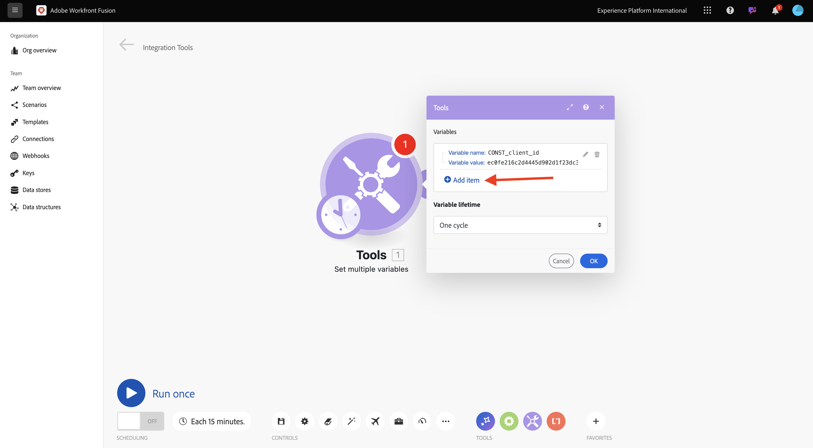
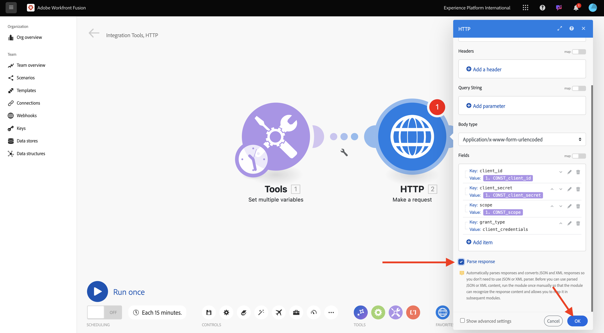
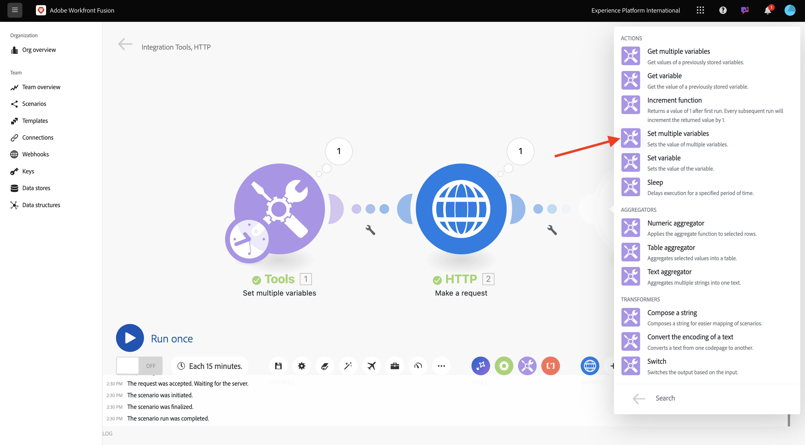
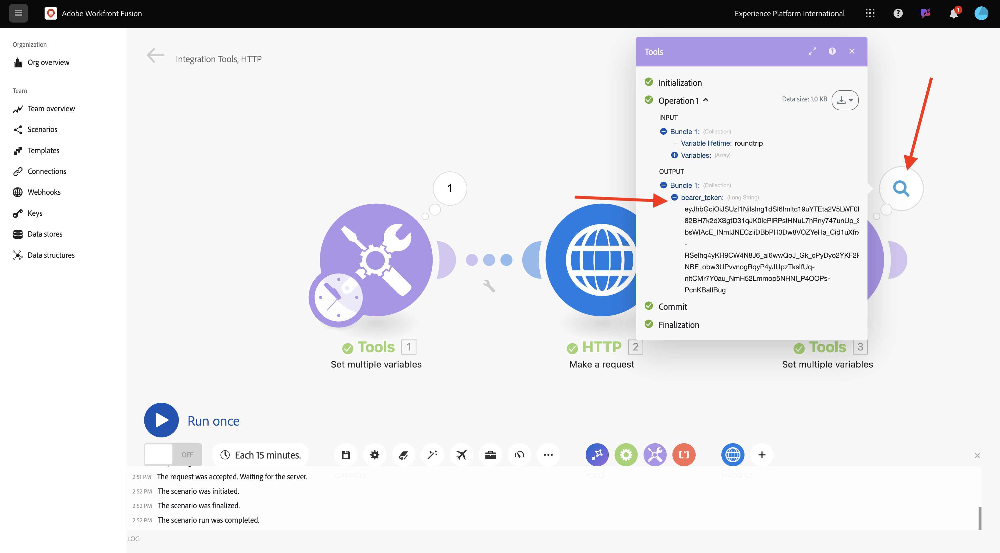
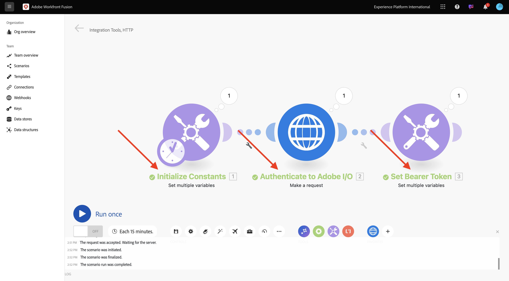

# 1.2.1 Komma igång med Workfront Fusion

I den här övningen ska du använda Workfront Fusion och Adobe I/O för att ställa frågor till API:er för Adobe Firefly Services.

## 1.2.1.1 Skapa nytt scenario

Gå till [https://experience.adobe.com/](https://experience.adobe.com/). Klicka för att öppna **Workfront Fusion**.

Du borde se det här då. Gå till **scenarier**.

Klicka på **Skapa nytt scenario**.

Då ser du ett tomt scenario. Klicka på ikonen **tools** och välj **Ange flera variabler**.

Nu måste du flytta ikonen **klocka** till den nyligen tillagda **Ange flera variabler**.

Då ser du det här.

Högerklicka sedan på frågetecknet och välj **Ta bort modul**.

Högerklicka sedan på objektet **Ange flera variabler** och välj **Inställningar**.

## 1.2.1.2 Konfigurera autentisering med Adobe I/O

Nu måste du konfigurera de variabler som behövs för att autentisera mot Adobe I/O. I föregående övning skapade du ett Adobe I/O-projekt. Variablerna i det Adobe I/O-projektet måste nu definieras i Workfront Fusion.

Följande variabler måste definieras:

| Nyckel | Värde |
|:-------------:| :---------------:| 
| `CONST_client_id` | ditt Adobe I/O-projekt klient-ID |
| `CONST_client_secret` | ditt Adobe I/O-projekt Client Secret |
| `CONST_scope` | ditt Adobe I/O-projektomfång |

Du hittar dessa variabler genom att gå till [https://developer.adobe.com/console/projects](https://developer.adobe.com/console/projects) och öppna ditt Adobe I/O-projekt, som har namnet `--aepUserLdap-- Firefly`.

Klicka på **OAuth ServerTo-Server** i ditt projekt för att se värdena för tangenterna ovan.

Med tangenterna och värdena ovan kan du konfigurera **Set multiple variables** -objektet. Klicka på **Lägg till objekt**.

Ange **variabelnamnet**: **CONST_client_id** och dess **variabelvärde**, klicka på **Lägg till**.

Klicka på **Lägg till objekt**.

Ange **variabelnamnet**: **CONST_client_secrets** och dess **variabelvärde**, klicka på **Lägg till**.

Klicka på **Lägg till objekt**.

Ange **variabelnamnet**: **CONST_scope** och dess **variabelvärde**, klicka på **Lägg till**.

Klicka på **OK**.

Håll pekaren över **Ange flera variabler** och klicka på den stora **+** -ikonen för att lägga till en annan modul.

Du borde se det här då.

Ange **http** i sökfältet. Välj **HTTP** för att öppna den.

och välj sedan **Gör en förfrågan**.

| Nyckel | Värde |
|:-------------:| :---------------:| 
| `URL` | `https://ims-na1.adobelogin.com/ims/token/v3` |
| `Method` | `POST` |
| `Body Type` | `x-www-form-urlencoded` |

Klicka på **Lägg till objekt**.

Lägg till objekt för vart och ett av värdena nedan:

| Nyckel | Värde |
|:-------------:| :---------------:| 
| `client_id` | din fördefinierade variabel för `CONST_client_id` |
| `client_secret` | din fördefinierade variabel för `CONST_client_secret` |
| `scope` | din fördefinierade variabel för `CONST_scope` |
| `grant_type` | `client_credentials` |

Konfiguration för `client_id`.

Konfiguration för `client_secret`.

Konfiguration för `scope`.

Konfiguration för `grant_type`.

Konfigurationsöversikt. Bläddra nedåt och markera kryssrutan för **Analysera svar**. Klicka på **OK**.

Du borde se det här då. Klicka på **Kör en gång**.

När scenariot har körts bör du se det här.

Klicka på ikonen **frågetecken** på objektet **Ange flera variabler** för att se vad som hände när objektet kördes.

Klicka på ikonen **frågetecken** på **HTTP - Gör en begäran** om du vill se vad som hände när objektet kördes. I **OUTPUT** ser du att **access_token** returneras av Adobe I/O.

Hovra över **HTTP - Gör en förfrågan** -objektet och klicka på ikonen **+** för att lägga till ytterligare en modul.

Sök efter `tools` i sökfältet. Välj **Verktyg**.

Välj **Ange flera variabler**.

Välj **Lägg till objekt**.

Ange **variabelnamnet** som `bearer_token`. Välj `access_token` som dynamiskt **variabelvärde**. Klicka på **Lägg till**.

Du borde ha den här då. Klicka på **OK**.

Klicka på *Kör en gång** igen.

När scenariot har körts klickar du på ikonen **frågetecken** på det sista **Ange flera variabler** -objektet. Du bör sedan se att access_token lagras i variabeln `bearer_token`.

Högerklicka sedan på det första objektet **Ange flera värden** och välj **Byt namn**.

Ange namnet **Initiera konstanter**. Klicka på **OK**.

Byt namn på det andra objektet och ange namnet till **Autentisera till Adobe I/O**. Klicka på **OK**.

Byt namn på det tredje objektet och ställ in namnet på **Ange Bearer-token**. Klicka på **OK**.

Du borde ha den här då.

Ändra sedan namnet på ditt scenario till `--aepUSerLdap-- - Adobe I/O Authentication`.

Klicka på **Spara**.

Nästa steg: [1.2.2 Använd Firefly-text till bild med Workfront Fusion](./ex2.md)

[Gå tillbaka till modul 1.2](./automation.md)

[Gå tillbaka till Alla moduler](./../../../overview.md)
