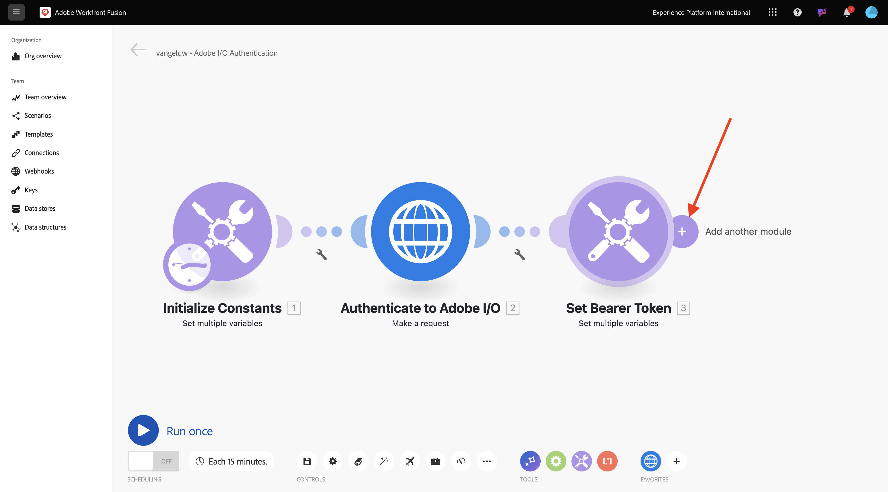
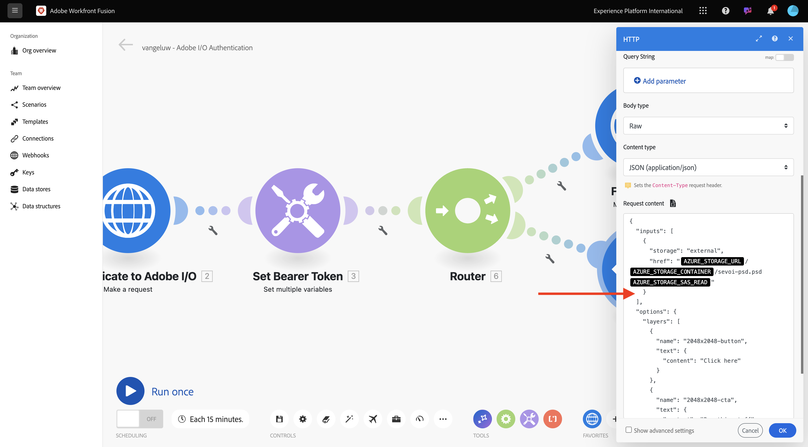

# 1.2.2 Använda Adobe-API:er i Workfront Fusion

## 1.2.2.1 Använda Firefly-text till bild-API med Workfront Fusion

Håll pekaren över den andra **Ange flera variabler**-noden och klicka på **+** för att lägga till en annan modul.



Sök efter **http** och välj sedan **HTTP**.


Välj **Gör en förfrågan**.


Välj dessa variabler:

- **URL**: `https://firefly-api.adobe.io/v3/images/generate`
- **Metod**: `POST`

Klicka på **Lägg till en rubrik**.


Du måste ange följande rubriker:

| Nyckel | Värde |
|:-------------:| :---------------:| 
| `x-api-key` | din lagrade variabel för `CONST_client_id` |
| `Authorization` | `Bearer ` + din lagrade variabel för `bearer_token` |
| `Content-Type` | `application/json` |
| `Accept` | `*/*` |

Ange information för `x-api-key`. Klicka på **Lägg till**.


Klicka på **Lägg till en rubrik**.


Ange information för `Authorization`. Klicka på **Lägg till**.


Klicka på **Lägg till en rubrik**. Ange information för `Content-Type`. Klicka på **Lägg till**.


Klicka på **Lägg till en rubrik**. Ange information för `Accept`. Klicka på **Lägg till**.


Ange **Brödtyp** till **Raw**. För **innehållstyp** väljer du **JSON (program/json)**.


Klistra in den här nyttolasten i fältet **Begär innehåll**.

```json
{
  "numVariations": 1,
  "size": {
    "width": 2048,
    "height": 2048
  },
  "prompt": "Horses in a field",
  "promptBiasingLocaleCode": "en-US"
}
```

Markera kryssrutan för **Analysera svar**. Klicka på **OK**.


Klicka på **Kör en gång**.


När ditt scenario är klart bör du se det här.


Klicka på **?** på den fjärde noden, HTTP, för att se svaret. Du bör se en bildfil i svaret.


Kopiera bild-URL:en och öppna den i ett webbläsarfönster. Då ska du se något liknande:


Högerklicka på **HTTP**-objektet och byt namn på det till **Firefly T2I**.


Klicka på **Spara** för att spara ändringarna.


## 1.2.2.2 Använda Photoshop API med Workfront Fusion

Klicka på ikonen **wrench** mellan noderna **Set Bearer Token** och **Firefly T2I**. Välj **Lägg till en router**.


Högerklicka på **Firefly T2I**-objektet och välj **Klona**.


Dra och släpp det klonade objektet nära **Router** -objektet så ansluts det automatiskt till **Router**. Du borde ha den här då.


Du har nu en identisk kopia baserad på HTTP-begäran **Firefly T2I**. Vissa av inställningarna för HTTP-begäran **Firefly T2I** liknar de som du behöver för att interagera med **Photoshop API** som är en tidsbesparande funktion. Nu behöver du bara ändra de variabler som inte är desamma, som begärande-URL:en och nyttolasten.

Ändra **URL** till `https://image.adobe.io/pie/psdService/text`.


Ersätt **Begär innehåll** med nyttolasten nedan:

```json
{
  "inputs": [
    {
      "storage": "external",
      "href": "{{AZURE_STORAGE_URL}}/{{AZURE_STORAGE_CONTAINER}}/sevoi-psd.psd{{AZURE_STORAGE_SAS_READ}}"
    }
  ],
  "options": {
    "layers": [
      {
        "name": "2048x2048-button",
        "text": {
          "content": "Click here"
        }
      },
      {
        "name": "2048x2048-cta",
        "text": {
          "content": "Buy this stuff"
        }
      }
    ]
  },
  "outputs": [
    {
      "storage": "azure",
      "href": "{{AZURE_STORAGE_URL}}/{{AZURE_STORAGE_CONTAINER}}/sevoi-psd-changed-text.psd{{AZURE_STORAGE_SAS_WRITE}}",
      "type": "vnd.adobe.photoshop",
      "overwrite": true
    }
  ]
}
```



För att **Request-innehållet** ska fungera korrekt saknas vissa variabler:

- `AZURE_STORAGE_URL`
- `AZURE_STORAGE_CONTAINER`
- `AZURE_STORAGE_SAS_READ`
- `AZURE_STORAGE_SAS_WRITE`

Gå tillbaka till din första nod, klicka på **Initiera konstanter** och välj sedan **Lägg till objekt** för var och en av dessa variabler.


| Nyckel | Exempelvärde |
|:-------------:| :---------------:| 
| `AZURE_STORAGE_URL` | `https://vangeluw.blob.core.windows.net` |
| `AZURE_STORAGE_CONTAINER` | `vangeluw` |
| `AZURE_STORAGE_SAS_READ` | `?sv=2023-01-03&st=2025-01-13T07%3A36%3A35Z&se=2026-01-14T07%3A36%3A00Z&sr=c&sp=rl&sig=4r%2FcSJLlt%2BSt9HdFdN0VzWURxRK6UqhB8TEvbWkmAag%3D` |
| `AZURE_STORAGE_SAS_WRITE` | `?sv=2023-01-03&st=2025-01-13T17%3A21%3A09Z&se=2025-01-14T17%3A21%3A09Z&sr=c&sp=racwl&sig=FD4m0YyyqUj%2B5T8YyTFJDi55RiTDC9xKtLTgW0CShps%3D` |

Du kan hitta dina variabler genom att gå tillbaka till Postman och öppna dina **miljövariabler**.


Kopiera dessa värden till Workfront Fusion och lägg till ett nytt objekt för var och en av dessa fyra variabler.

Du borde ha den här då. Klicka på **OK**.


Gå sedan tillbaka till den klonade HTTP-begäran för att uppdatera **Request-innehållet**. Du kommer att lägga märke till de här svarta variablerna i **Request content** , som är de variabler som du kopierade över från Postman. Du måste nu ändra dessa variabler till de variabler du just definierade i Workfront Fusion. Ersätt varje variabel en i taget genom att ta bort den svarta texten och ersätta den med rätt variabel.


Det finns tre ändringar att göra i avsnittet **input**.


Det finns också tre ändringar att göra i avsnittet **output**. Klicka på **OK**.


Högerklicka på den klonade noden och välj **Byt namn**. Ändra namnet till **Photoshop Change Text**.


Du borde ha den här då.


Nästa steg: [1.2.3 ...](./ex3.md)

[Gå tillbaka till modul 1.2](./automation.md)

[Gå tillbaka till Alla moduler](./../../../overview.md)
