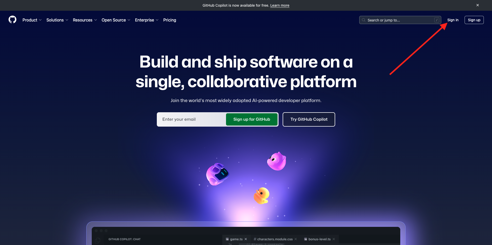
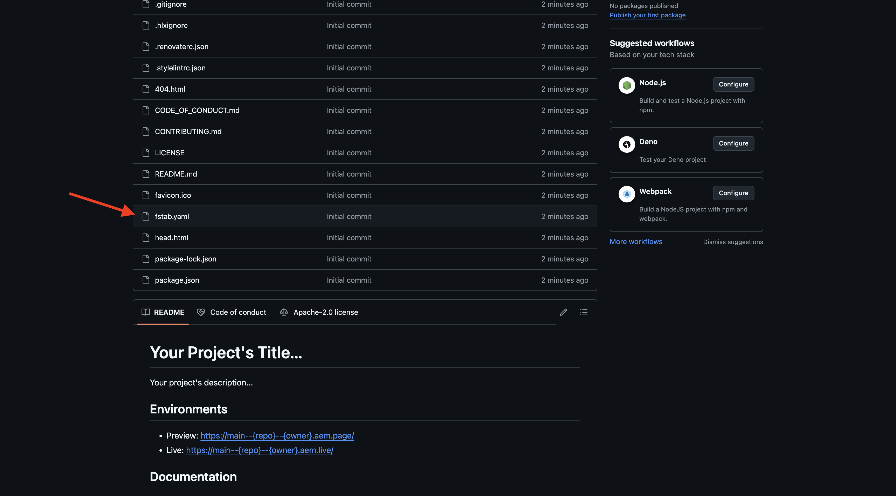

# 2.1.2 Skapa en dokumentbaserad webbplats

Medan du väntar på att ditt Cloud Manager-program ska skapas har du tillräckligt med tid för att skapa din första dokumentbaserade redigeringswebbplats. Nedanstående övning är baserad på [aem.live Developer Tutorial](https://www.aem.live/developer/tutorial){target="_blank"}. Kom igång genom att följa stegen nedan.

## 2.1.2.1 Konfigurera Google Drive

Gå till [https://drive.google.com](https://drive.google.com){target="_blank"}. Klicka på **+ Ny** och sedan på **Ny mapp**.

Namnge mappen `aemdocb-test`. Klicka på **Skapa**.

Hämta filen [aemboilerplate.zip](./../../../assets/aem/aemboilerplate.zip){target="_blank"} och extrahera den på datorn.

Du kommer att se 3 filer i den mappen. Kopiera dessa filer till din nya Google Drive-mapp.

Nu måste du konvertera dessa filer till en Google-fil. Det gör du genom att öppna varje fil och sedan gå till **Arkiv** > **Spara som Google Docs**.

Du bör göra detta för alla 3 filerna, och därefter visas 6 filer i din Google Drive-mapp.

Sedan finns den i din mapp.

För att den dokumentbaserade redigeringsdemon ska fungera måste du nu dela din Google Drive-mapp med e-postadressen **helix@adobe.com**. Klicka på mappnamnet, klicka på **Dela** och sedan på **Dela** igen.

Ange e-postadressen **helix@adobe.com** och klicka på **Skicka**.

Kopiera och skriv sedan ned URL:en för din Google Drive-mapp så som du behöver den i nästa övning. Klicka på mappnamnet, klicka på **Dela** och sedan på **Kopiera länk**.

`https://drive.google.com/drive/folders/1PNIOFeptIfszSebawT-Y_bwB4_anQWk5?usp=drive_link`

Du bör ta bort frågesträngsparametern `?usp=drive_link` så att URL:en ser ut så här:

`https://drive.google.com/drive/folders/1PNIOFeptIfszSebawT-Y_bwB4_anQWk5`

## 2.1.2.2 Konfigurera GitHub-repo

Gå till [https://github.com](https://github.com){target="_blank"}. Klicka på **Logga in**.

Ange dina inloggningsuppgifter. Klicka på **Logga in**.

När du har loggat in visas din GitHub-instrumentpanel.

Gå till [https://github.com/adobe/aem-boilerplate](https://github.com/adobe/aem-boilerplate){target="_blank"}. Då ser du det här. Klicka på **Använd den här mallen** och sedan på **Skapa en ny databas**.

Använd `aemdocb-test` som **databasnamn**. Ange synligheten till **Privat**. Klicka på **Skapa databas**.

Efter några sekunder har du skapat databasen.

Gå sedan till [https://github.com/apps/aem-code-sync](https://github.com/apps/aem-code-sync){target="_blank"}. Klicka på **Konfigurera**.

Klicka på ditt GitHub-konto.

Klicka på **Välj bara databaser** och lägg sedan till databasen som du just har skapat. Klicka sedan på **Installera**.

Du får då den här bekräftelsen.

## 2.1.2.3 Uppdatera filen fstab.yaml

Öppna filen `fstab.yaml` genom att klicka på den i GitHub-repon.

Klicka på ikonen **redigera** .

Du måste nu uppdatera värdet för fältet **url** på rad 2.

Du måste ersätta det aktuella värdet med URL:en för AEM CS-miljön i kombination med inställningarna för GitHub-repon.

Detta är det aktuella värdet för URL:en: `https://drive.google.com/drive/u/0/folders/1MGzOt7ubUh3gu7zhZIPb7R7dyRzG371j`.

Ersätt det värdet med den URL som du kopierade från din Google Drive-mapp, `https://drive.google.com/drive/folders/1PNIOFeptIfszSebawT-Y_bwB4_anQWk5`. Klicka på **Verkställ ändringar..**.

Klicka på **Verkställ ändringar**.

## 2.1.2.4 Installera AEM Sidekick-tillägg

Gå till [https://chromewebstore.google.com/detail/aem-sidekick/ccfggkjabjahcjoljmgmklhpaccedipo](https://chromewebstore.google.com/detail/aem-sidekick/ccfggkjabjahcjoljmgmklhpaccedipo){target="_blank"}. Klicka på **Lägg till i Chrome**.

Fäst tillägget **AEM Sidekick**.

## 2.1.2.5 Förhandsgranska och Publish din dokumentbaserade webbplats

Gå tillbaka till din Google Drive-mapp. Klicka på tillägget **AEM Sidekick** i åtgärdsfältet. Du ser sedan en popup-meny i AEM Sidekick-fältet i din mapp.

Markera de tre filerna i din Google Drive-mapp. Klicka på **Förhandsgranska**.

Klicka på **Förhandsgranska** igen.

Klicka för att stänga den gröna dialogrutan.

Markera de tre filerna i din Google Drive-mapp igen. Klicka nu på **Publish**.

Klicka på **Publish**.

Klicka för att stänga den gröna dialogrutan igen. Välj nu filen **index**, klicka på **Kopiera URL:er** och klicka sedan på **Kopiera Live URL:er**.

URL:en som kopierades ser ut så här: `https://main--aemdocb-test--woutervangeluwe.aem.live/`.

I ovanstående URL:

- **main** refererar till grenen i GitHub-repo
- **aemdocb-test** refererar till GitHub-databasens namn
- **wouterVangelu** refererar till GitHub-användarkontonamnet
- **.live** refererar till den aktiva miljön i din AEM
- Du kan ersätta **.live** med **.page** om du vill öppna förhandsvisningsmiljön för AEM.

Öppna ett nytt webbläsarfönster och navigera till webbadressen.

## 2.1.2.6 Ändra och publicera ändringen

Gå tillbaka till Google Drive och öppna filtret **index** i Google.

Ersätt texten **Testar** med valfri text. Klicka på **Förhandsgranska**.

Förhandsversionen av webbplatsen öppnas sedan. Granska ändringen och klicka på **Publish**.

Du kommer då att se liveversionen av din webbplats.

Ovannämnda övning var ett bra sätt att komma igång och få en dokumentbaserad redigering själv. Du kan nu fortsätta med nästa övning där du skapar en egen demowebbplats med CitiSignal som ett demovarumärke.

Nästa steg: [2.1.3 Konfigurera AEM CS-miljö](./ex3.md){target="_blank"}

[Gå tillbaka till modul 2.1](./aemcs.md){target="_blank"}

[Gå tillbaka till alla moduler](./../../../overview.md){target="_blank"}
