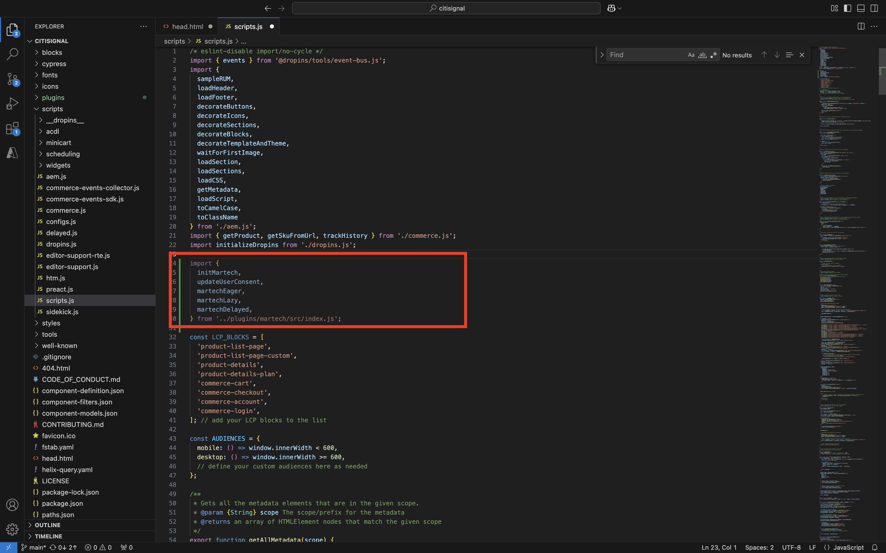

# 2.1.6 AEM Edge Delivery Services MarTech plugin

Med pluginmodulen AEM MarTech kan du snabbt skapa en komplett MarTech-hög för ditt AEM.

>[!NOTE]
>
>Den här pluginen är för närvarande tillgänglig för kunder i samarbete med AEM Engineering via projekt för saminnovation. Mer information finns på [https://github.com/adobe-rnd/aem-martech](https://github.com/adobe-rnd/aem-martech).

Navigera till mappen som du använder för din **citisign** GitHub-databas. Högerklicka på mappnamnet och välj sedan **Ny terminal i mappen**.


Då ser du det här. Klistra in följande kommando och tryck på **enter**.

```
git subtree add --squash --prefix plugins/martech https://github.com/adobe/aem-experimentation.git main
```

Du borde se det här då.


Navigera till mappen som du använder för din **citisign** GitHub-databas och öppna mappen **plugins**. Du bör nu se en mapp med namnet **martech**.


Öppna filen **head.html** i Visual Studio-koden. Kopiera koden nedan och klistra in den i filen **head.html**.

```javascript
<link rel="preload" as="script" crossorigin="anonymous" href="/plugins/martech/src/index.js"/>
<link rel="preload" as="script" crossorigin="anonymous" href="/plugins/martech/src/alloy.min.js"/>
<link rel="preconnect" href="https://edge.adobedc.net"/>
<!-- change to adobedc.demdex.net if you enable third party cookies -->
```

Spara ändringarna.


I Visual Studio Code går du till mappen **scripts** och öppnar filen **scripts.js**. Kopiera koden nedan och klistra in den i filen **scripts.js**, under de befintliga importskripten.

```javascript
import {
  initMartech,
  updateUserConsent,
  martechEager,
  martechLazy,
  martechDelayed,
} from '../plugins/martech/src/index.js';
```

Spara ändringarna.



```javascript
const isConsentGiven = true;
  const martechLoadedPromise = initMartech(
    // The WebSDK config
    // Documentation: https://experienceleague.adobe.com/en/docs/experience-platform/web-sdk/commands/configure/overview#configure-js
    {
      datastreamId: "045c5ee9-468f-47d5-ae9b-a29788f5948f",
      orgId: "907075E95BF479EC0A495C73@AdobeOrg",
      onBeforeEventSend: (payload) => {
        // set custom Target params 
        // see doc at https://experienceleague.adobe.com/en/docs/platform-learn/migrate-target-to-websdk/send-parameters#parameter-mapping-summary
        payload.data.__adobe.target ||= {};

        // set custom Analytics params
        // see doc at https://experienceleague.adobe.com/en/docs/analytics/implementation/aep-edge/data-var-mapping
        payload.data.__adobe.analytics ||= {};
      },

      // set custom datastream overrides
      // see doc at:
      // - https://experienceleague.adobe.com/en/docs/experience-platform/web-sdk/commands/datastream-overrides
      // - https://experienceleague.adobe.com/en/docs/experience-platform/datastreams/overrides
      edgeConfigOverrides: {
        // Override the datastream id
        // datastreamId: '...'

        // Override AEP event datasets
        // com_adobe_experience_platform: {
        //   datasets: {
        //     event: {
        //       datasetId: '...'
        //     }
        //   }
        // },

        // Override the Analytics report suites
        // com_adobe_analytics: {
        //   reportSuites: ['...']
        // },

        // Override the Target property token
        // com_adobe_target: {
        //   propertyToken: '...'
        // }
      },
    },
    // The library config
    {
      launchUrls: ["https://assets.adobedtm.com/b754ed1bed61/b9f7c7c484de/launch-28b548849fb9.min.js"],
      personalization: !!getMetadata('target') && isConsentGiven,
    },
  );
```


```javascript
if (main) {
    decorateMain(main);
    await Promise.all([
      martechLoadedPromise.then(martechEager),
      waitForLCP(LCP_BLOCKS),
    ]);
  }
```


```javascript
await martechLazy();
```


```javascript
window.setTimeout(() => {
    martechDelayed();
    return import('./delayed.js');
  }, 3000);
```


Du kan nu visa ändringarna av din webbplats genom att gå till `main--citisignal--XXX.aem.page/us/en` och/eller `main--citisignal--XXX.aem.live/us/en` efter att du ersatt XXX med ditt GitHub-användarkonto, som i det här exemplet är `woutervangeluwe`.

I det här exemplet blir den fullständiga URL:en följande:
`https://main--citisignal--woutervangeluwe.aem.page/us/en` och/eller `https://main--citisignal--woutervangeluwe.aem.live/us/en`.

Nästa steg: [Sammanfattning och fördelar](./summary.md){target="_blank"}

[Gå tillbaka till modul 2.1](./aemcs.md){target="_blank"}

[Gå tillbaka till alla moduler](./../../../overview.md){target="_blank"}
