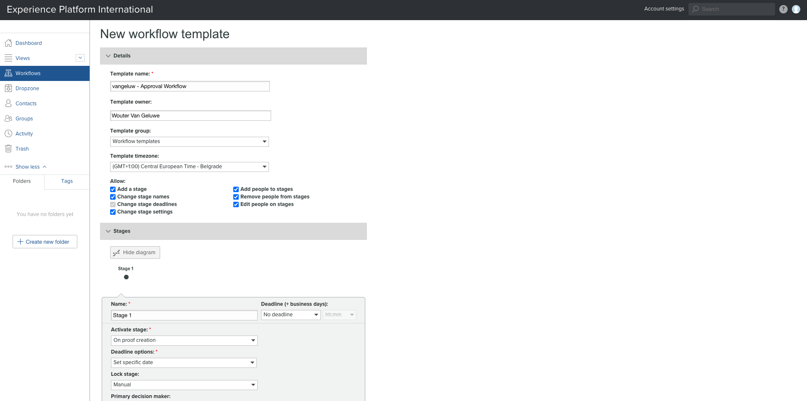
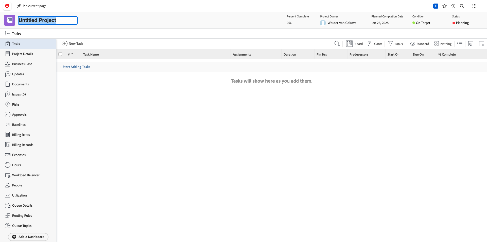
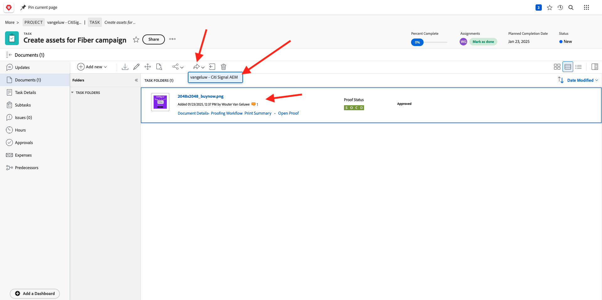

# 2.2.2 Korrektur med Workfront

## 2.2.2.1 Skapa ett nytt godkännandeflöde

Gå till [https://experienceplatform.my.workfront.com/](https://experienceplatform.my.workfront.com/){target="_blank"}.

Klicka på ikonen **hamburger** med nio punkter och välj **Korrektur**.

Gå till **Arbetsflöden**, klicka på **+ Ny** och välj sedan **Ny mall**.

Ange **mallnamnet** till `--aepUserLdap-- - Approval Workflow` och ställ in **mallägaren** till dig själv.

Bläddra nedåt och under **Steg** > **Steg 1** lägger du till **Wouter Van Geluwe** med **rollen** för **Granskare och godkännare**.

Klicka på **Skapa**.

Ditt grundläggande arbetsflöde för godkännande är nu klart att användas.

## 2.2.2.2 Skapa ett nytt projekt

Klicka på **Nytt** på fliken **Mina projekt** på startsidan för Workfront. Välj **Tomt projekt**.

Du borde se det här då. Ändra namnet till `--aepUserLdap-- - CitiSignal Fiber Launch`.

Ditt projekt har skapats.

## 2.2.2.3 Skapa en ny uppgift

Ange det här namnet för din aktivitet: **Skapa resurser för Fibre-kampanj**. Klicka på **Skapa uppgift**.

Du borde se det här då.

## 2.2.2.4 Lägg till ett nytt dokument i din uppgift genom hela godkännandeflödet

Klicka på **+ Lägg till ny** och välj sedan **Dokument**.

Hämta [den här filen](./images/2048x2048.png) till skrivbordet.

{width="50px" align="left"}

Markera filen **2048x2048.png** och klicka på **Öppna**.

Du borde ha den här då. Klicka på **Skapa korrektur** och välj sedan **Avancerat korrektur**.

I fönstret **nytt korrektur** väljer du den arbetsflödesmall som du skapade tidigare och som ska ha namnet `--aepuserLdap-- - Approval Workflow`. Klicka på **Skapa bevis**.

Du kommer sedan att vara tillbaka i din uppgift. Klicka på knappen **Tilldela till** och välj **Tilldela till mig**.

Klicka på **Spara**.

Klicka på **Arbeta med den**.

Klicka på **Öppna korrektur**

Nu kan du granska korrekturet. Välj **Lägg till kommentar** om du vill lägga till en kommentar som kräver att dokumentet ändras.

Ange din kommentar och klicka på **Publicera**. Klicka på **Stäng**.

Därefter måste du ändra din roll från **Granskare** till **Granskare och godkännare**. Om du vill göra det går du tillbaka till din uppgift och klickar på **Korrektur**.

Ändra din roll från **Granskare** till **Granskare och godkännare**.

Gå tillbaka till Uppgiften och öppna korrekturet igen. Nu visas en ny knapp, **Fatta beslut**. Klicka på den.

Välj **Ändringar krävs** och klicka på **Fatta beslut**.

Du borde vara tillbaka här. Nu måste du ladda upp en andra bild som tar hänsyn till de kommentarer som lämnats.

Hämta [den här filen](./images/2048x2048_buynow.png) till skrivbordet.

{width="50px" align="left"}

Välj den gamla bildfilen som inte godkänts i aktivitetsvyn. Klicka sedan på **+ Lägg till ny**, markera **Version** och välj sedan **Dokument**.

Markera filen **2048x2048_buynow.png** och klicka på **Öppna**.

Du borde ha den här då. Klicka på **Skapa korrektur** och välj sedan **Avancerat korrektur** igen.

Då ser du det här. **Arbetsflödesmallen** är nu förvald eftersom Workfront antar att det tidigare arbetsflödet för godkännande fortfarande är giltigt. Klicka på **Skapa bevis**.

Välj **Öppna korrektur**.

Nu kan du se två versioner av filen bredvid varandra.

Klicka på **Fatta beslut**, välj **Godkänd** och klicka på **Fatta beslut** igen.

Stäng korrekturförhandsgranskningen.

Du kommer sedan tillbaka i aktivitetsvyn med en godkänd resurs. Materialet måste nu delas med AEM Assets.

Klicka på ikonen **Dela-pil** och välj den AEM Assets-integrering som ska ha namnet `--aepUserLdap-- - Citi Signal AEM`.

Dubbelklicka på mappen som du skapade tidigare, som bör ha namnet `--aepUserLdap-- - Workfront Assets`.

Klicka på **Välj mapp**.

Efter 1-2 minuter publiceras dokumentet nu i AEM Assets. En AEM visas bredvid dokumentnamnet.

Klicka på **Öppna sammanfattning**.

Gå till **Metadata** och se följande:

Gå till **Översikt** och klicka på **+ Lägg till** för att lägga till en beskrivning.

Ange din beskrivning. Dina korrektur- och dokumentinställningar är nu klara.

## 2.2.2.5 Visa filen i AEM Assets

Gå till din mapp i AEM Assets med namnet `--aepUserLdap-- - Workfront Assets`.

Klicka på de tre punkterna under bilden och välj sedan **Detaljer**.

Du kommer då att se metadataformuläret som du skapade tidigare, med värden som fyllts i automatiskt genom integrationen mellan Workfront och AEM Assets.

[Gå tillbaka till modul 2.2](./workfront.md){target="_blank"}

[Gå tillbaka till alla moduler](./../../../overview.md){target="_blank"}
