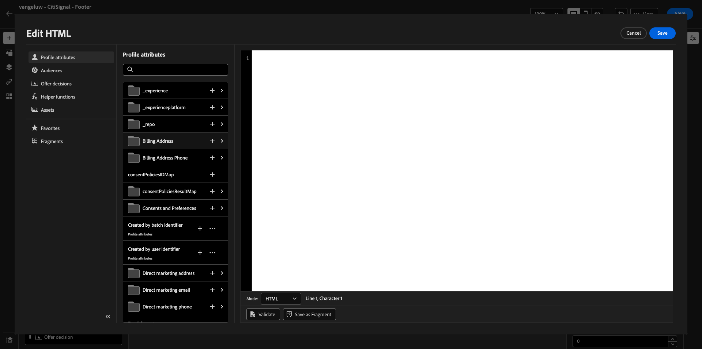
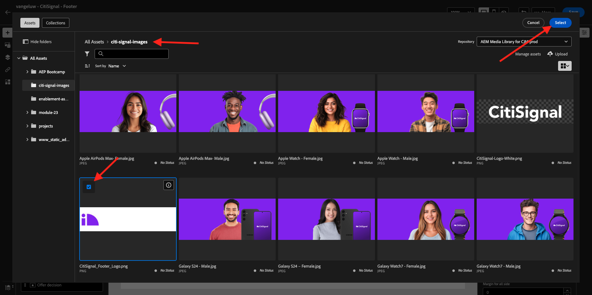
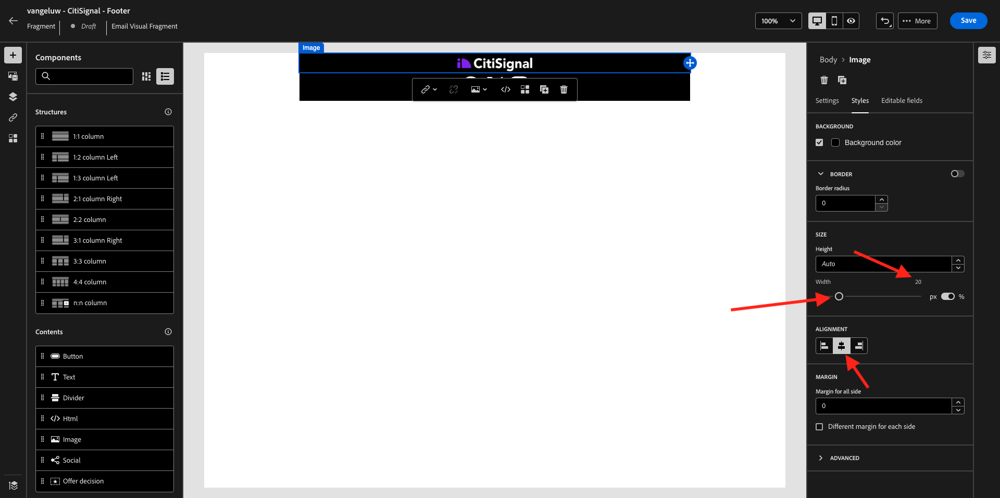

# 3.1.2 Skapa fragment som ska användas i ditt meddelande

I den här övningen ska du konfigurera 2 fragment, 1 för ett återanvändbart sidhuvud och 1 för en återanvändbar sidfot.

Logga in på Adobe Journey Optimizer på [Adobe Experience Cloud](https://experience.adobe.com). Klicka på **Journey Optimizer**.


Du omdirigeras till vyn **Hem** i Journey Optimizer. Kontrollera först att du använder rätt sandlåda. Sandlådan som ska användas kallas `--aepSandboxName--`.


## 3.1.2.1 Skapa rubrikfragment

Klicka på **Fragment** på den vänstra menyn. Ett fragment är en återanvändbar komponent i Journey Optimizer, som undviker dubbletter och underlättar framtida ändringar som påverkar alla meddelanden, till exempel ändringar i ett sidhuvud eller en sidfot i ett e-postmeddelande.

Klicka på **Skapa fragment**.


Ange namnet `--aepUserLdap-- - CitiSignal - Header` och välj **Typ: Visual Fragment**. Klicka på **Skapa**.


Då ser du det här. På den vänstra menyn hittar du de strukturkomponenter som du kan använda för att definiera e-postmeddelandets struktur (rader och kolumner).

Dra och släpp en **1:1-kolumn** från menyn på arbetsytan. Detta blir platshållare för logotypbilden.


Sedan kan du använda Innehållskomponenter för att lägga till innehåll i dessa block. Dra och släpp en **bild**-komponent i den första cellen på den första raden. Klicka på **Bläddra**.


Då visas ett popup-fönster som visar AEM Assets Media Library. Gå till mappen **citi-signal-images**, klicka för att markera bilden **CitiSignal-Logo-White.png** och klicka på **Välj**.

>[!NOTE]
>
>Om du inte ser Citi Signal-bilderna i ditt AEM Assets-bibliotek hittar du dem [här](./../../../../assets/ajo/CitiSignal-images.zip). Hämta dem till skrivbordet, skapa mappen **citi-signal-images** och överför alla bilder i mappen.


Då ser du det här. Bilden är vit och visas inte än. Nu bör du definiera en bakgrundsfärg så att bilden visas korrekt. Klicka på **Stilar** och sedan på rutan **Bakgrundsfärg** .


Ändra färgkoden **Hex** till **#8821F4** på popup-menyn och ändra sedan fokus genom att klicka i fältet **100%** . Sedan ser du den nya färgen som används på bilden.


Bilden är också lite för stor just nu. Vi ändrar bredden genom att skjuta **Breddväxlaren** till **40%**.


Ditt rubrikfragment är nu klart. Klicka på **Spara** och sedan på pilen för att gå tillbaka till föregående skärm.


Ditt fragment måste publiceras innan det kan användas. Klicka på **Publicera**.


Efter några minuter ser du att ditt fragments status har ändrats till **Live**.
Sedan bör du skapa ett nytt fragment för sidfoten i dina e-postmeddelanden. Klicka på **Skapa fragment**.


## 3.1.2.2 Skapa sidfotsavsnittet

Klicka på **Skapa fragment**.


Ange namnet `--aepUserLdap-- - CitiSignal - Footer` och välj **Typ: Visual Fragment**. Klicka på **Skapa**.


Då ser du det här. På den vänstra menyn hittar du de strukturkomponenter som du kan använda för att definiera e-postmeddelandets struktur (rader och kolumner).

Dra och släpp en **1:1-kolumn** från menyn på arbetsytan. Det här blir platshållare för sidfotsinnehållet.


Sedan kan du använda Innehållskomponenter för att lägga till innehåll i dessa block. Dra och släpp en **HTML**-komponent i den första cellen på den första raden. Klicka på komponenten för att markera den och klicka sedan på ikonen **&lt;/>** för att redigera HTML-källkoden.


Då ser du det här.



Kopiera nedanstående HTML-kodfragment och klistra in det i fönstret **Redigera HTML** i Journey Optimizer.

```html
<!--[if mso]><table cellpadding="0" cellspacing="0" border="0" width="100%"><tr><td style="text-align: center;" ><![endif]-->
<table style="width: auto; display: inline-block;">
  <tbody>
    <tr class="component-social-container">
      <td style="padding: 5px">
        <a style="text-decoration: none;" href="https://www.facebook.com" data-component-social-icon-id="facebook">
        
        </a>
      </td>
      <td style="padding: 5px">
        <a style="text-decoration: none;" href="https://x.com" data-component-social-icon-id="twitter">
        
        </a>
      </td>
      <td style="padding: 5px">
        <a style="text-decoration: none;" href="https://www.instagram.com" data-component-social-icon-id="instagram">
         
        </a>
      </td>
    </tr>
  </tbody>
</table>
<!--[if mso]></td></tr></table><![endif]-->
```

Du får den här då. På raderna 7, 12 och 17 måste du nu infoga en bildfil med hjälp av resurserna i ditt AEM Assets-bibliotek.


Se till att markören är placerad på rad 7 och klicka sedan på **Assets** i den vänstra menyn. Klicka på **Öppna resursväljaren** för att välja bilden.


Öppna mappen **citi-signal-images** och klicka för att välja bilden **Icon_Facebook.png**. Klicka på **Markera**.


Se till att markören är placerad på rad 12 och klicka sedan på **Öppna resursväljaren** för att markera bilden.


Öppna mappen **citi-signal-images** och klicka för att välja bilden **Icon_X.png**. Klicka på **Markera**.


Se till att markören är placerad på rad 17 och klicka sedan på **Öppna resursväljaren** för att markera bilden.


Öppna mappen **citi-signal-images** och klicka för att välja bilden **Icon_Instagram.png**. Klicka på **Markera**.


Då ser du det här. Klicka på **Spara**.


Du kommer då tillbaka i redigeraren. Dina ikoner är inte synliga än eftersom bakgrunden och bildfilerna är helt vita. Om du vill ändra bakgrundsfärgen går du till **Stilar** och klickar i kryssrutan **Bakgrundsfärg** .


Ändra färgkoden **Hex** till **#00000**.


Ändra justeringen till centrerad.


Låt oss lägga till några andra delar till sidfoten. Dra och släpp en **bild**-komponent ovanför den HTML-komponent du just skapade. Klicka på **Bläddra**.


Klicka för att markera bildfilen **`CitiSignal_Footer_Logo.png`** och klicka på **Välj**.



Gå till **Stilar** och klicka i kryssrutan **Bakgrundsfärg** så ändrar vi den till svart igen. Ändra färgkoden **Hex** till **#00000**.


Ändra bredden till **20%** och kontrollera att justeringen är inställd på centrering.



Dra och släpp en **Text** -komponent under den HTML-komponent som du skapade. Klicka på **Bläddra**.


Kopiera och klistra in texten nedan genom att ersätta platshållartexten.

```
1234 N. South Street, Anywhere, US 12345

Unsubscribe

©2024 CitiSignal, Inc and its affiliates. All rights reserved.
```

Ange att **textjusteringen** ska centreras.


Ändra **teckenfärgen** till vit, **#FFFFFF**.


Ändra **bakgrundsfärgen** till svart, **#00000**.


Markera texten **Avsluta prenumeration** i sidfoten och klicka på ikonen **Länk** i menyraden. Ange **Type** till **External Opt-out/Unsubscription** och ange URL:en till **https://aepdemo.net/unsubscribe.html** (det får inte finnas en tom URL för länken för att avbryta prenumerationen).


Du får den här då. Sidfoten är nu klar. Klicka på **Spara** och sedan på pilen för att gå tillbaka till föregående sida.


Klicka på **Publicera** för att publicera sidfoten så att den kan användas i ett e-postmeddelande.


Efter några minuter ser du att sidfotens status har ändrats till **Live**.


Du har nu avslutat den här övningen.

## Nästa steg

Gå till [3.1.3 Skapa din resa och ditt e-postmeddelande](./ex3.md){target="_blank"}

Gå tillbaka till [Adobe Journey Optimizer: Orchestration](./journey-orchestration-create-account.md){target="_blank"}

Gå tillbaka till [Alla moduler](./../../../../overview.md){target="_blank"}
