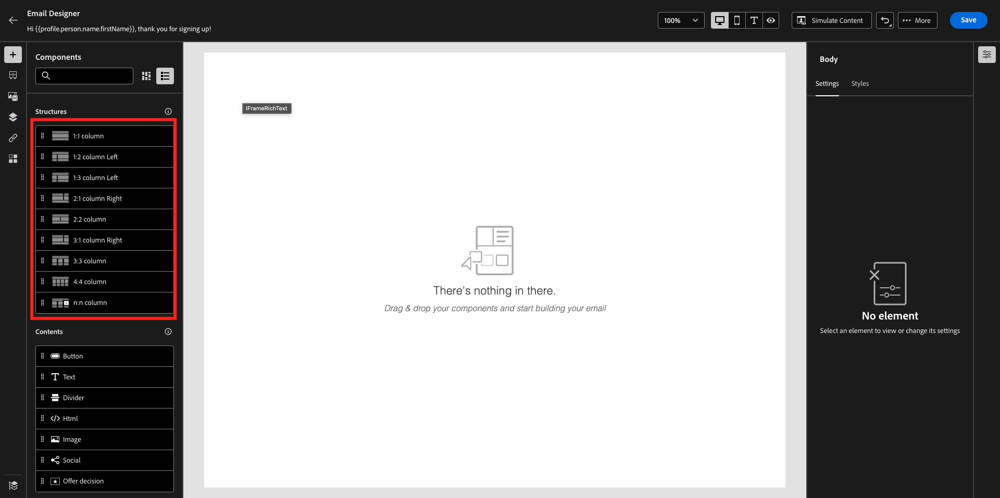
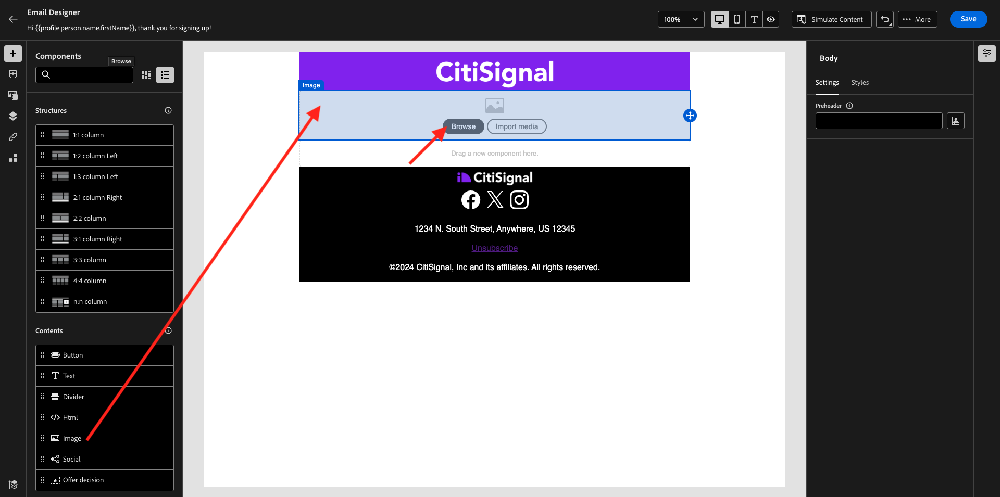
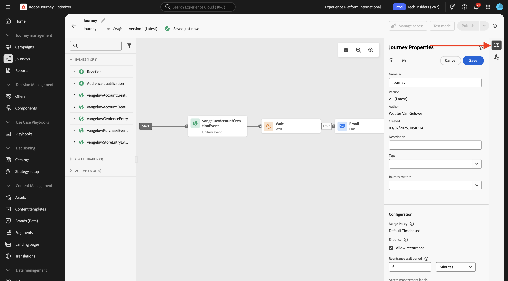

# 3.1.3 Skapa din resa och ditt e-postmeddelande

I den här övningen ska du konfigurera resan och det meddelande som ska utlösas när någon skapar ett konto på demowebbplatsen.

Logga in på Adobe Journey Optimizer på [Adobe Experience Cloud](https://experience.adobe.com). Klicka på **Journey Optimizer**.


Du omdirigeras till vyn **Hem** i Journey Optimizer. Kontrollera först att du använder rätt sandlåda. Sandlådan som ska användas kallas `--aepSandboxName--`.


## 3.1.3.1 Skapa din resa

Klicka på **Resor** på den vänstra menyn. Klicka sedan på **Skapa resa** för att skapa en ny resa.


Då ser du en tom skärm för resan.


I föregående övning skapade du en ny **Event**. Du namngav den så här `--aepUserLdap--AccountCreationEvent`. Detta var resultatet av händelseskapandet:


Du måste nu ta det här evenemanget som början på den här resan. Du kan göra detta genom att gå till vänster på skärmen och söka efter händelsen i listan med händelser.


Markera händelsen, dra och släpp den på arbetsytan för resan. Din resa ser nu ut så här:


Som det andra steget i resan måste du lägga till ett kort **Vänta**-steg. Gå till vänster på skärmen till avsnittet **Orchestration** om du vill hitta det här. Du kommer att använda profilattribut och måste se till att de är ifyllda i kundprofilen i realtid.


Din resa ser nu ut så här. Till höger på skärmen måste du konfigurera väntetiden. Ställ in den på 1 minut. Detta ger mycket tid för profilattributen att vara tillgängliga när händelsen har utlösts. Klicka på **Spara** för att spara ändringarna.


Som det tredje steget på resan måste du lägga till en **e-poståtgärd**. Gå till vänster på skärmen till **Åtgärder**, välj åtgärden **E-post** och dra och släpp den på den andra noden på resan. Nu ser du det här.


Ange **kategorin** till **Marknadsföring** och välj en e-postkonfiguration som gör att du kan skicka e-post. I det här fallet är e-postkonfigurationen som ska väljas **E-post-TI**.


## 3.1.3.2 Skapa ditt meddelande

Klicka på **Redigera innehåll** om du vill skapa ditt meddelande.


Nu ser du det här.


Klicka på ikonen **Öppna dialogrutan för anpassning**.


Skriv texten `Hi `. Därefter måste du hämta en personaliseringstoken för fältet **Förnamn** som lagras under `profile.person.name.firstName`. Navigera till fältet **Person > Fullständigt namn > Förnamn** på den vänstra menyn och klicka på ikonen **+** . Sedan visas personaliseringstoken i textfältet.


Lägg sedan till texten **, tack för att du registrerar dig!**. Klicka på **Spara**.


Nu kan du börja konfigurera brödtexten i ditt e-postmeddelande. Klicka på **Redigera e-postbrödtext**.


Innan du börjar skapa innehållet i själva meddelandet är det en bra idé att tänka på innehållet i meddelandet. En del av innehållet i meddelandet är unikt för själva meddelandet, men andra delar är standardkomponenter som troligen är desamma för alla e-postmeddelanden som du skickar till kunderna.

I föregående övning skapade du dessa standardkomponenter som fragment i Journey Optimizer, som du nu kan referera till i det här meddelandet och alla andra framtida meddelanden som du kommer att skapa.

På nästa skärm får du tre olika metoder för att ange e-postens innehåll:

- **Designa från grunden**: Börja med en tom arbetsyta och använd WYSIWYG-redigeraren för att dra och släppa struktur och innehållskomponenter för att visuellt bygga upp e-postens innehåll.
- **Koda din egen**: Skapa en egen e-postmall genom att koda den med HTML
- **Importera HTML**: Importera en befintlig HTML-mall som du kan redigera.

Klicka på **Skapa från grunden**.


På den vänstra menyn hittar du de strukturkomponenter som du kan använda för att definiera e-postmeddelandets struktur (rader och kolumner).



Du hittar också **Fragment** i den vänstra menyn, där du kan se fragmenten som du skapade tidigare.


Innan du kan lägga till sidhuvud och sidfot på arbetsytan måste du lägga till två strukturer i e-postmeddelandet. Klicka på ikonen **+** i den vänstra menyn och dra 2 **- kolumn** -komponenter till arbetsytan.


Gå tillbaka till **Fragment** på den vänstra menyn. Dra och släpp sidhuvudsfragmentet i den första komponenten och sidfotsfragmentet i den andra komponenten. Då ser du det här.


Klicka på ikonen **+** på den vänstra menyn och dra och släpp ytterligare två **1:1 kolumn** -komponenter på arbetsytan, mellan sidhuvudet och sidfoten.


Dra och släpp en **bild**-komponent i den första **1:1-kolumnen** . Klicka på **Bläddra**.



I mappen **citi-signal-images**. Markera bilden **`welcome_email_image.png`** och klicka på **Markera**.


Då får du den här:


Gå sedan till **Innehåll** och dra och släpp en **Text** -komponent i strukturkomponenten på den fjärde raden.


Välj standardtexten **Skriv texten här.** som du skulle göra med en textredigerare. Skriv **Välkommen till familjen,** i stället. Klicka på ikonen **Lägg till anpassning** i verktygsfältet.


Därefter måste du hämta en **förnamn**-personaliseringstoken som lagras under `profile.person.name.firstName`. Leta reda på elementet **Person** på menyn, gå ned till elementet **Fullständigt namn** och klicka sedan på ikonen **+** för att lägga till fältet Förnamn i uttrycksredigeraren.

Klicka på **Spara**.


Nu kommer du att märka hur personaliseringsfältet har lagts till i texten.


I samma textfält trycker du på **Retur** två gånger för att lägga till två rader och kopiera och klistra in följande text:

```
Welcome aboard! We're thrilled to have you join the CitiSignal family. 
As a valued member of our community, you're now poised to experience top-notch telecommunications services that cater to your every need.

At CitiSignal, we understand that staying connected is more than just a convenience - it's a necessity. Whether you're browsing the web, streaming your favourite content, or keeping in touch with loved ones, we're here to ensure you have the best tools and resources at your fingertips.
```


Ange att **textjusteringen** ska centreras och justera sedan utseendet och känslan i meddelandet efter dina egna behov. Klicka på **Spara** när du är klar.


Den sista kontrollen som utförs för att se till att e-postmeddelandet är klart är att förhandsgranska det. Klicka på knappen **Simulera innehåll** .


Innan du kan simulera e-postmeddelandet måste du lägga till en testprofil. Klicka på **Hantera testprofiler**.


Markera namnutrymmet **email** genom att klicka på ikonen bredvid fältet **Ange ID-namnområde**.

Markera namnutrymmet **E-post** i listan med identitetsnamnutrymmen. I fältet **Identitetsvärde** anger du e-postadressen för en tidigare profil som du använde i en tidigare övning och som redan är lagrad i Adobe Experience Platform. Klicka på **Lägg till profil**. Gå tillbaka till föregående skärm.


Du kommer då att se ditt e-postmeddelande, som nu simuleras för den här kundprofilen. Du kan nu validera personaliseringen i ämnesraden och brödtexten och skicka ett e-postkorrektur om du vill.

Klicka på **Stäng** för att stänga förhandsgranskningen.


Klicka på **Spara** för att spara meddelandet och gå tillbaka till meddelandeinstrumentpanelen genom att klicka på **pilen** bredvid texten på ämnesraden i det övre vänstra hörnet.


Klicka på **pilen** för att gå tillbaka till din resa.


## 3.1.3.3 Publicera din resa

Klicka på **Spara**.


Du måste fortfarande ge din resa ett namn. Du kan göra det genom att klicka på ikonen **Egenskaper** längst upp till höger på skärmen.



Du kan sedan ange resans namn här. Använd `--aepUserLdap-- - Registration Journey`. Klicka på **Spara**.


Nu kan du publicera din resa genom att klicka på **Publicera**.


Klicka på **Publicera** igen.


Efter ett par minuter ändras kundens status till **Live** och du ser en realtidskonsol över kundresan.


Du har nu avslutat den här övningen.

## Nästa steg

Gå till [3.1.4 Uppdatera din datainsamlingsegenskap och testa din resa](./ex4.md){target="_blank"}

Gå tillbaka till [Adobe Journey Optimizer: Orchestration](./journey-orchestration-create-account.md){target="_blank"}

Gå tillbaka till [Alla moduler](./../../../../overview.md){target="_blank"}
