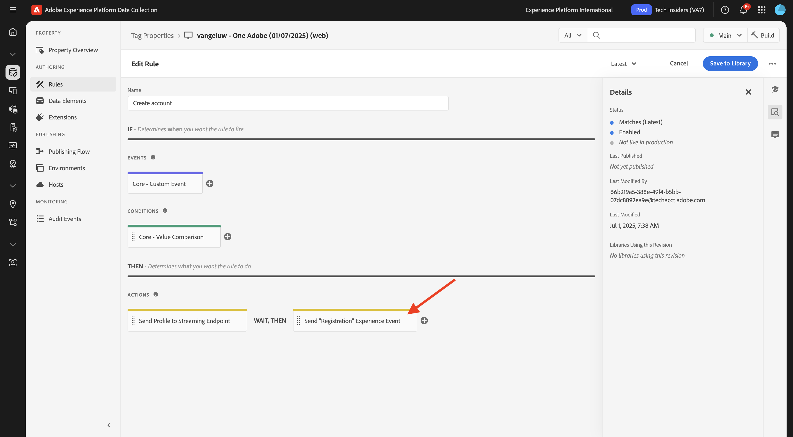
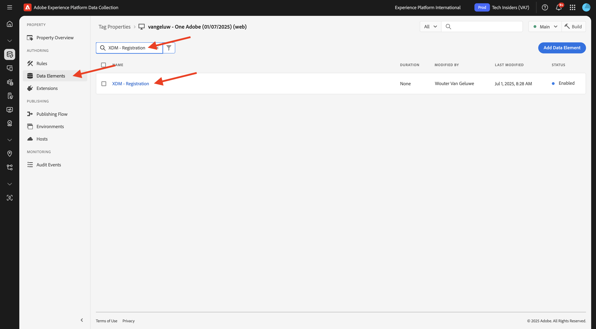

# 3.1.3 Uppdatera din datainsamlingsegenskap och testa din resa

## 3.1.3.1 Uppdatera egenskapen för datainsamling

Gå till [Adobe Experience Platform Data Collection](https://experience.adobe.com/launch/) och välj **Taggar**.

I **Komma igång** skapade Demo System två klientegenskaper åt dig: en för webbplatsen och en för mobilappen. Sök efter dem genom att söka efter `--aepUserLdap--` i rutan **[!UICONTROL Search]**. Klicka för att öppna egenskapen **Webb**.

Då ser du det här.

Gå till **Regler** på den vänstra menyn och sök efter regeln **Skapa konto**. Klicka på regeln **Skapa konto** för att öppna den.

Då ser du detaljerna om den här regeln. Klicka för att öppna åtgärden **Skicka händelse för registrering**.

Du kommer då att se att när den här åtgärden utlöses används ett specifikt dataelement för att definiera XDM-datastrukturen. Du måste uppdatera det dataelementet, och du måste definiera **händelse-ID** för händelsen som du konfigurerade i [övning 3.1.1](./ex1.md).

Du måste nu uppdatera dataelementet **XDM - registreringshändelse**. Gå till **Dataelement** om du vill göra det. Sök efter **XDM - registrering** och klicka för att öppna det dataelementet.

Då ser du det här:

Navigera till fältet `_experience.campaign.orchestration.eventID`. Ta bort det aktuella värdet och klistra in ditt eventID där.

Händelse-ID:t finns i Adobe Journey Optimizer under **Konfigurationer > Händelser** och du hittar händelse-ID:t i exempelnyttolasten för din jämna, som ser ut så här: `"eventID": "5ae9b8d3f68eb555502b0c07d03ef71780600c4bd0373a4065c692ae0bfbd34d"`.

När du har klistrat in ditt eventID bör skärmen se ut så här. Klicka sedan på **Spara** eller **Spara i bibliotek**.

Slutligen måste du publicera ändringarna. Gå till **Publiceringsflöde** på den vänstra menyn och klicka för att öppna ditt **huvudbibliotek**.

Klicka på **Lägg till alla ändrade resurser** och sedan på **Spara och skapa i utveckling**.

Biblioteket uppdateras sedan och efter 1-2 minuter kan du testa konfigurationen.

## 3.1.3.2 Testa din resa

Gå till [https://dsn.adobe.com](https://dsn.adobe.com). När du har loggat in med din Adobe ID ser du det här. Klicka på de tre punkterna **..** i webbplatsprojektet och klicka sedan på **Kör** för att öppna det.

Du kommer då att se din demowebbplats öppnas. Markera URL-adressen och kopiera den till Urklipp.

Öppna ett nytt inkognito-webbläsarfönster.

Klistra in webbadressen till demowebbplatsen, som du kopierade i föregående steg. Du ombeds sedan logga in med din Adobe ID.

Välj kontotyp och slutför inloggningsprocessen.

Därefter visas webbplatsen i ett inkognitivt webbläsarfönster. För varje övning måste du använda ett nytt, inkognitivt webbläsarfönster för att läsa in webbadressen till demowebbplatsen.

Klicka på ikonen för Adobe logotyp i det övre vänstra hörnet av skärmen för att öppna profilvisningsprogrammet.

Ta en titt på panelen Profilvisningsprogram och kundprofilen i realtid med **Experience Cloud-id** som primär identifierare för den okända kunden. Klicka på **Logga in**.

Klicka på **SKAPA ETT KONTO**.

Fyll i dina uppgifter och klicka på **Registrera**. Sedan dirigeras du om till föregående sida.

Öppna profilvisarpanelen och gå till kundprofilen i realtid. På panelen Profilvisningsprogram ska du se alla dina personuppgifter visas, som dina nya e-post- och telefonidentifierare.

1 minut efter att du har skapat ditt konto får du ett e-postmeddelande från Adobe Journey Optimizer om att du har skapat kontot.

Du kommer också att se hur resan fortskrider i Journey Optimizer.

## Nästa steg

Gå till [Sammanfattning och förmåner](./summary.md){target="_blank"}

Gå tillbaka till [Adobe Journey Optimizer: Orchestration](./journey-orchestration-create-account.md){target="_blank"}

Gå tillbaka till [Alla moduler](./../../../../overview.md){target="_blank"}
