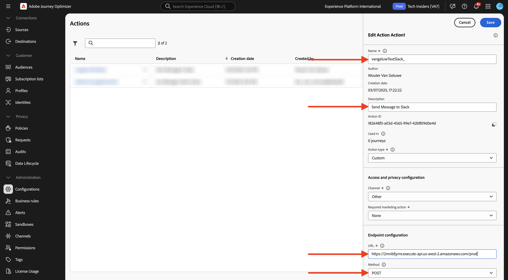

# 3.2.3 Definiera en anpassad åtgärd

I den här övningen skapar du en anpassad åtgärd för att skicka ett meddelande till en Slack-kanal.

Logga in på Adobe Journey Optimizer på [Adobe Experience Cloud](https://experience.adobe.com). Klicka på **Journey Optimizer**.


Du omdirigeras till vyn **Hem** i Journey Optimizer. Kontrollera först att du använder rätt sandlåda. Sandlådan som ska användas kallas `--aepSandboxName--`. Du kommer sedan att vara i vyn **Hem** i din sandlåda `--aepSandboxName--`.


Du kommer nu att använda en befintlig Slack-kanal och skicka meddelanden till den Slack-kanalen. Slack har ett lättanvänt API, och du använder Adobe Journey Optimizer för att utlösa deras API.


Bläddra nedåt på den vänstra menyn och klicka på **Konfigurationer**. Klicka sedan på knappen **Hantera** under **Åtgärder**.


Sedan visas listan **Åtgärder**. Klicka på **Skapa åtgärd**.


En tom åtgärdspopup visas.


Använd `--aepUserLdap--TextSlack` som namn för åtgärden.

Ange Beskrivning till: `Send Message to Slack`.

Använd följande för **URL-konfigurationen**:

- URL: `https://2mnbfjyrre.execute-api.us-west-2.amazonaws.com/prod`
- Metod: **POST**

>[!NOTE]
>
>Ovanstående URL hänvisar till en AWS Lambda-funktion som sedan vidarebefordrar din begäran till Slack-kanalen enligt ovan. Detta görs för att skydda åtkomsten till en Slack-kanal som ägs av Adobe. Om du har en egen Slack-kanal måste du skapa en Slack-app via [https://api.slack.com/](https://api.slack.com/), sedan måste du skapa en inkommande webkrok i den Slack-appen och sedan ersätta ovanstående URL med din inkommande webkroks-URL.



**Autentisering** ska anges till **Ingen autentisering**.


Under **Nyttolaster** måste du definiera vilka fält som ska skickas till Slack. Logiskt sett vill ni att Adobe Journey Optimizer och Adobe Experience Platform ska vara hjärnan i personaliseringen, så texten som ska skickas till Slack ska definieras av Adobe Journey Optimizer och sedan skickas till Slack för utförande.

Klicka på ikonen **Redigera nyttolast** för **Begäran**.


Då visas ett tomt popup-fönster.


Kopiera texten nedan och klistra in den i det tomma popup-fönstret.

```json
{
 "text": {
  "toBeMapped": true,
  "dataType": "string",
  "label": "textToSlack"
 }
}
```

Då ser du det här. Klicka på **Spara**.


Bläddra uppåt och klicka på **Spara** en gång till för att spara funktionsmakrot.


Din anpassade åtgärd ingår nu i listan **Åtgärder**.


Du har definierat händelser, en extern datakälla och åtgärder. Sedan kombinerar du allt det på en enda resa.

## Nästa steg

Gå till [3.2.4 Skapa din resa och dina meddelanden](./ex4.md){target="_blank"}

Gå tillbaka till [Adobe Journey Optimizer: Externa datakällor och anpassade åtgärder](journey-orchestration-external-weather-api-sms.md){target="_blank"}

Gå tillbaka till [Alla moduler](./../../../../overview.md){target="_blank"}
