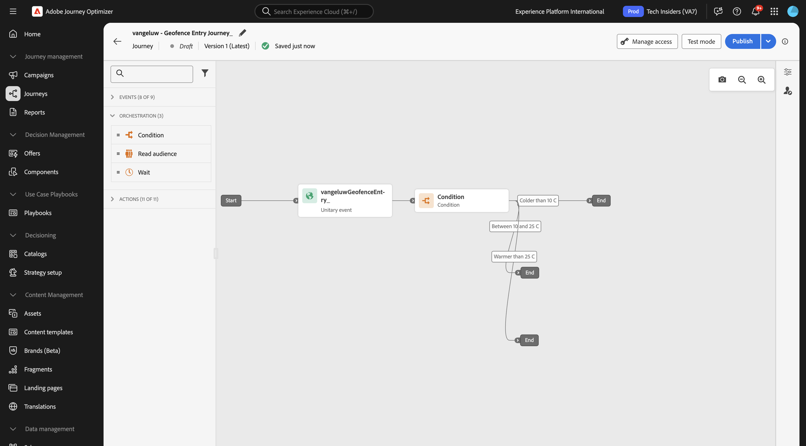
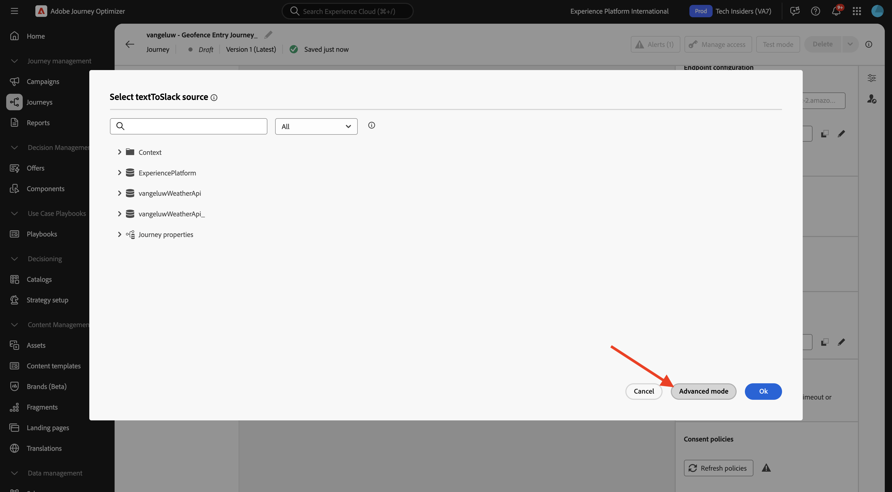

# 3.2.4 Skapa din resa och dina meddelanden

I den här övningen skapar du en resa och flera textmeddelanden genom att använda Adobe Journey Optimizer.

I det här fallet är målet att skicka olika meddelanden baserat på väderförhållandena för var kunden befinner sig. Tre scenarier har definierats:

- Färre än 10° Celsius
- Mellan 10° och 25° Celsius
- Varmare än 25° Celsius

För dessa tre villkor måste du definiera tre meddelanden i Adobe Journey Optimizer.

## 3.2.4.1 Skapa din resa

Logga in på Adobe Journey Optimizer på [Adobe Experience Cloud](https://experience.adobe.com). Klicka på **Journey Optimizer**.


Du omdirigeras till vyn **Hem** i Journey Optimizer. Kontrollera först att du använder rätt sandlåda. Sandlådan som ska användas kallas `--aepSandboxName--`. Du kommer sedan att vara i vyn **Hem** i din sandlåda `--aepSandboxName--`.


Gå till **Resor** på den vänstra menyn och klicka på **Skapa resa** för att börja skapa din resa.


Du bör i förväg namnge din resa.

Använd `--aepUserLdap-- - Geofence Entry Journey` som namn för resan. Inga andra värden måste anges för tillfället. Klicka på **Spara**.


Titta på **Händelser** till vänster på skärmen. Du bör se den händelse du skapade tidigare i den listan. Markera den och dra den sedan och släpp den på arbetsytan. Din resa ser då ut så här. Klicka på **Spara**.


Klicka sedan på **Orchestration**. Nu ser du de tillgängliga **Orchestration**-funktionerna. Välj **Villkor** och dra och släpp det på arbetsytan på resan.


Du måste nu konfigurera tre sökvägar för det här villkoret:

- Den är kallare än 10° Celsius
- Den är mellan 10° och 25° Celsius
- Det är varmare än 25° Celsius

Vi definierar det första villkoret.

### Villkor 1: Färger än 10° Celsius

Klicka på **Villkor**.  Klicka på **Sökväg1** och redigera namnet på sökvägen till **Färg än 10 C**. Klicka på ikonen **Redigera** för uttrycket för Path1.


Du ser då en tom skärm i **Enkel redigerare**. Din fråga kommer att vara lite mer avancerad, så du behöver **avancerat läge**. Klicka på **Avancerat läge**.


Du kommer då att se **Avancerad redigerare** som tillåter kodinmatning.


Markera nedanstående kod och klistra in den i **Avancerad redigerare**.

`#{--aepUserLdap--WeatherApi.--aepUserLdap--WeatherByCity.main.temp} <= 10`

Då ser du det här.


För att kunna ta reda på temperaturen som en del av detta villkor måste du ange i vilken stad kunden befinner sig.
**Ort** måste länkas till den dynamiska parametern `q`, precis som tidigare i Open Weather API-dokumentationen.

Klicka på fältet **dynamiskt val: q** som anges i skärmbilden.


Sedan måste du hitta fältet som innehåller kundens aktuella ort i någon av de tillgängliga datakällorna. I det här fallet måste du hitta det under **Kontext**.


Du kan hitta fältet genom att gå till `--aepUserLdap--GeofenceEntry.placeContext.geo.city`.

Genom att klicka på det fältet eller klicka på **+** läggs det till som dynamiskt värde för parametern `q`. Det här fältet fylls i med till exempel den geopositioneringstjänst som du har implementerat i din mobilapp. I det här fallet simulerar du detta med datainsamlingsegenskapen för demowebbplatsen. Klicka på **OK**.


### Villkor 2: 10-25° Celsius

När du har lagt till det första villkoret visas den här skärmen. Klicka på **Lägg till en bana**.


Dubbelklicka på **Sökväg1** och redigera sökvägen till **Mellan 10 och 25 C**. Klicka på ikonen **Redigera** för uttrycket med den här sökvägen.


Du ser då en tom skärm i **Enkel redigerare**. Din fråga kommer att vara lite mer avancerad, så du behöver **avancerat läge**. Klicka på **Avancerat läge**.


Du kommer då att se **Avancerad redigerare** som tillåter kodinmatning.


Markera nedanstående kod och klistra in den i **Avancerad redigerare**.

`#{--aepUserLdap--WeatherApi.--aepUserLdap--WeatherByCity.main.temp} > 10 and #{--aepUserLdap--WeatherApi.--aepUserLdap--WeatherByCity.main.temp} <= 25`

Då ser du det här.


För att kunna hämta temperaturen som en del av detta villkor måste du ange i vilken stad kunden befinner sig.
**City** måste länkas till den dynamiska parametern **q**, precis som i dokumentationen för Open Weather API.

Klicka på fältet **dynamiskt val: q** som anges i skärmbilden.


Sedan måste du hitta fältet som innehåller kundens aktuella ort i någon av de tillgängliga datakällorna.


Du kan hitta fältet genom att gå till `--aepUserLdap--GeofenceEntry.placeContext.geo.city`. Genom att klicka på det fältet läggs det till som dynamiskt värde för parametern **q**. Det här fältet fylls i med till exempel den geopositioneringstjänst som du har implementerat i din mobilapp. I det här fallet simulerar du detta med datainsamlingsegenskapen för demowebbplatsen. Klicka på **OK**.


Sedan lägger du till det tredje villkoret.

### Villkor 3: Varmare än 25° Celsius

När du har lagt till det andra villkoret visas den här skärmen. Klicka på **Lägg till en bana**.


Dubbelklicka på Path1 om du vill ändra namnet till **Varmare än 25 C**.
Klicka sedan på ikonen **Redigera** för uttrycket som den här sökvägen gäller.


Du ser då en tom skärm i **Enkel redigerare**. Din fråga kommer att vara lite mer avancerad, så du behöver **avancerat läge**. Klicka på **Avancerat läge**.


Du kommer då att se **Avancerad redigerare** som tillåter kodinmatning.


Markera nedanstående kod och klistra in den i **Avancerad redigerare**.

`#{--aepUserLdap--WeatherApi.--aepUserLdap--WeatherByCity.main.temp} > 25`

Då ser du det här.


För att kunna hämta temperaturen som en del av detta villkor måste du ange i vilken stad kunden befinner sig.
**City** måste länkas till den dynamiska parametern **q**, precis som i dokumentationen för Open Weather API.

Klicka på fältet **dynamiskt val: q** som anges i skärmbilden.


Sedan måste du hitta fältet som innehåller kundens aktuella ort i någon av de tillgängliga datakällorna.


Du kan hitta fältet genom att gå till ```--aepUserLdap--GeofenceEntry.placeContext.geo.city```. Genom att klicka på det fältet läggs det till som dynamiskt värde för parametern **q**. Det här fältet fylls i med till exempel den geopositioneringstjänst som du har implementerat i din mobilapp. I det här fallet simulerar du detta med datainsamlingsegenskapen för demowebbplatsen. Klicka på **OK**.


Du har nu tre konfigurerade sökvägar. Klicka på **Spara**.


Eftersom det här är en resa för inlärningsändamål kommer ni nu att konfigurera några åtgärder för att visa upp de olika alternativ som marknadsförare nu behöver för att leverera meddelanden.

## 3.2.4.2 Skicka meddelanden för sökväg: Färre än 10° Celsius

För varje temperatursammanhang försöker du skicka ett textmeddelande till kunden. För den här övningen ska du skicka ett meddelande till en Slack-kanal i stället för ett mobiltelefonnummer.

Vi fokuserar på sökvägen **Färggrann än 10 C**.



Gå tillbaka till **Åtgärder** på den vänstra menyn, markera åtgärden `--aepUserLdap--TextSlack` och dra och släpp den sedan efter åtgärden **Meddelande** .


Gå till **åtgärdsparametrar** och klicka på ikonen **Redigera** för parametern `textToSlack`.


Klicka på **Avancerat läge** i popup-fönstret.



Markera nedanstående kod, kopiera den och klistra in den i **redigeraren för avancerat läge**. Klicka på **OK**.

`"Brrrr..." + #{ExperiencePlatform.ProfileFieldGroup.profile.person.name.firstName} + ",  it's cold and freezing outside. Get comfortable at home with a 20% discount on a Disney+ subscription!"`


Du kommer att se den slutförda åtgärden. Klicka på **Spara**.


Den här vägen på resan är nu färdig.

## 3.2.4.3 Skicka meddelanden för sökväg: mellan 10° och 25° Celsius

För varje temperatursammanhang försöker ni skicka ett meddelande till kunden. För den här övningen ska du skicka ett meddelande till en Slack-kanal i stället för ett mobiltelefonnummer.

Vi fokuserar på **Mellan 10 och 25 C**-sökvägar.


Gå tillbaka till **Åtgärder** på den vänstra menyn, markera åtgärden `--aepUserLdap--TextSlack` och dra och släpp den sedan efter åtgärden **Meddelande** .


Gå till **åtgärdsparametrar** och klicka på ikonen **Redigera** för parametern `textToSlack`.


Klicka på **Avancerat läge** i popup-fönstret.


Markera nedanstående kod, kopiera den och klistra in den i **redigeraren för avancerat läge**. Klicka på **OK**.

`"What nice weather for the time of year, " + #{ExperiencePlatform.ProfileFieldGroup.profile.person.name.firstName} + " 20% discount on Apple AirPods so you can go for a walk and listen to your favorite podcast!"`


Du kommer att se den slutförda åtgärden. Klicka på **OK**.


Den här vägen på resan är nu färdig.

## 3.2.4.4 Skicka meddelanden för sökväg: Varmare än 25° Celsius

För varje temperatursammanhang försöker ni skicka ett meddelande till kunden. För den här övningen ska du skicka ett meddelande till en Slack-kanal i stället för ett mobiltelefonnummer.

Vi fokuserar på **Varmare än 25 C**-sökvägar.


Gå tillbaka till **Åtgärder** på den vänstra menyn, markera åtgärden `--aepUserLdap--TextSlack` och dra och släpp den sedan efter åtgärden **Meddelanden**.


Gå till **åtgärdsparametrar** och klicka på ikonen **Redigera** för parametern `textToSlack`.


Klicka på **Avancerat läge** i popup-fönstret.


Markera nedanstående kod, kopiera den och klistra in den i **redigeraren för avancerat läge**. Klicka på **OK**.

`"So warm, " + #{ExperiencePlatform.ProfileFieldGroup.profile.person.name.firstName} + "! 20% discount on adding 10GB of extra data so you can get online at the beach!"`


Du kommer att se den slutförda åtgärden. Klicka på **Spara**.


Den här vägen på resan är nu färdig.

## 3.2.4.5 Publicera din resa

Din resa är nu helt konfigurerad. Klicka på **Publicera**.


Klicka på **Publicera** igen.


Din resa är nu publicerad.


## Nästa steg

Gå till [3.2.5 Utlös din resa](./ex5.md){target="_blank"}

Gå tillbaka till [Adobe Journey Optimizer: Externa datakällor och anpassade åtgärder](journey-orchestration-external-weather-api-sms.md){target="_blank"}

Gå tillbaka till [Alla moduler](./../../../../overview.md){target="_blank"}
