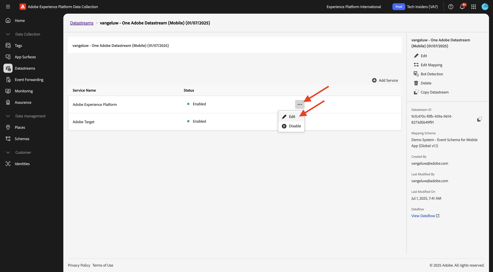
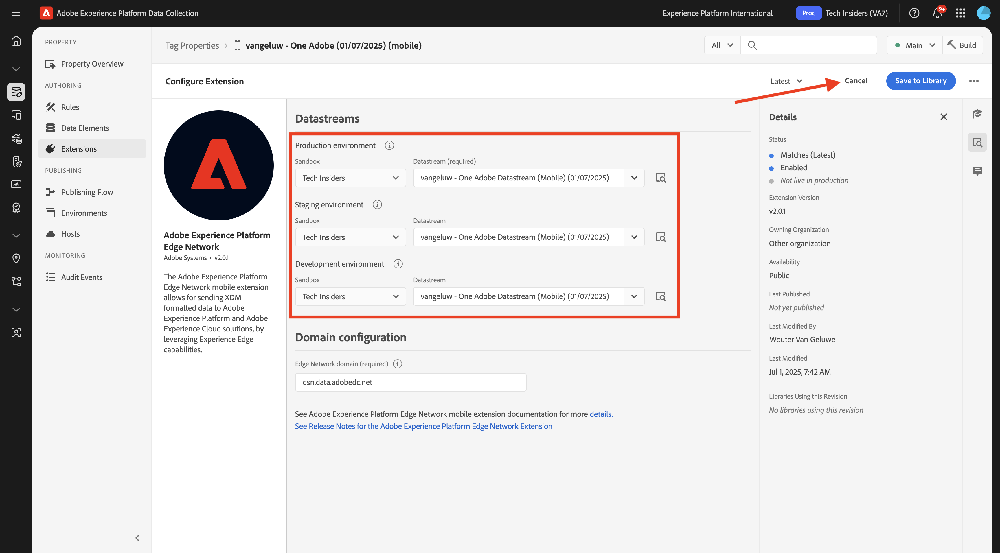
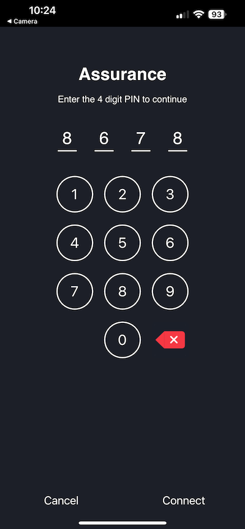

# 3.3.1 Komma igång med push-meddelanden

Om du vill använda push-meddelanden med Adobe Journey Optimizer finns det ett antal inställningar att kontrollera och känna till.

Här följer alla inställningar som ska verifieras:

- Datauppsättningar och scheman i Adobe Experience Platform
- Datastream för mobiler
- Datainsamlingsegenskap för mobil
- Appyta för push-certifikat
- Testa push-konfigurationen med AEP Assurance

Vi granskar dem en i taget.

Logga in på Adobe Journey Optimizer på [Adobe Experience Cloud](https://experience.adobe.com). Klicka på **Journey Optimizer**.

Du omdirigeras till vyn **Hem** i Journey Optimizer. Kontrollera först att du använder rätt sandlåda. Sandlådan som ska användas kallas `--aepSandboxName--`. Du kommer sedan att vara i vyn **Hem** i din sandlåda `--aepSandboxName--`.

## 3.4.4.1 push-datauppsättning

Adobe Journey Optimizer använder datauppsättningar för att lagra saker som push-tokens från mobila enheter eller interaktioner med push-meddelanden (till exempel meddelande som skickas, meddelande som öppnas) i en datauppsättning i Adobe Journey Optimizer.

Du kan hitta de här datauppsättningarna genom att gå till **[!UICONTROL Datasets]** på menyn till vänster på skärmen. Om du vill visa systemdatauppsättningar klickar du på filterikonen.

Aktivera alternativet **Visa systemdatauppsättningar** och sök efter **AJO**. Du kommer då att se de datauppsättningar som används för push-meddelanden.

## 3.4.4.2 Datastream för mobilen

Gå till [https://experience.adobe.com/#/data-collection/](https://experience.adobe.com/#/data-collection/).

Gå till **[!UICONTROL Datastream]** på den vänstra menyn och sök efter det dataflöde som du skapade i [Komma igång](./../../../../modules/getting-started/gettingstarted/ex2.md), som har namnet `--aepUserLdap-- - Demo System Datastream (Mobile)`. Klicka för att öppna den.

Klicka på **Redigera** på tjänsten **Adobe Experience Platform**.

Du kommer då att se de datastream-inställningar som har definierats och i vilka datamängdshändelser och profilattribut lagras.

Du bör även aktivera följande alternativ om de inte är aktiverade än:

- **Offer Decisioning**
- **Personalization Destinations**
- **Adobe Journey Optimizer**

Klicka på **Spara**.

## 3.4.4.3 Granska din datainsamlingsegenskap för Mobile

Gå till [https://experience.adobe.com/#/data-collection/](https://experience.adobe.com/#/data-collection/). Som en del av [Komma igång](./../../../../modules/getting-started/gettingstarted/ex1.md) skapades två datainsamlingsegenskaper.
Du har redan använt dessa egenskaper för datainsamlingsklienten som en del av tidigare moduler.

Klicka för att öppna datainsamlingsegenskapen för mobilen.

Gå till **Tillägg** i din datainsamlingsegenskap. Du kommer då att se de olika tillägg som behövs för mobilappen. Klicka för att öppna tillägget **Adobe Experience Platform Edge Network**.

Du kommer då att se att ditt datastream för mobilen är länkat här. Klicka sedan på **Avbryt** för att gå tillbaka till översikten över dina tillägg.

Du kommer då tillbaka hit. Tillägget för **AEP Assurance** visas. AEP Assurance hjälper er att inspektera, bevisa, simulera och validera hur ni samlar in data eller levererar upplevelser i er mobilapp. Du kan läsa mer om AEP Assurance och Project Griffon här [https://aep-sdks.gitbook.io/docs/beta/project-griffon](https://aep-sdks.gitbook.io/docs/beta/project-griffon).

Klicka sedan på **Konfigurera** för att öppna tillägget **Adobe Journey Optimizer**.

Du kommer då att se att det är här som datauppsättningen för spårning av push-händelser är länkad.

Du behöver inte göra några ändringar i din datainsamlingsegenskap.

## 3.4.4.4 Granska konfigurationen av appytan

Gå till [https://experience.adobe.com/#/data-collection/](https://experience.adobe.com/#/data-collection/). Gå till **App Surfaces** på den vänstra menyn och öppna appytan för **DX Demo App APNS**.

Sedan visas den konfigurerade appytan för iOS och Android.

## 3.4.4.5 Testa konfigurationen av push-meddelanden med AEP Assurance.

När appen har installerats hittar du den på enhetens hemskärm. Klicka på ikonen för att öppna programmet.

När du använder appen första gången ombeds du logga in med din Adobe ID. Slutför inloggningsprocessen.

När du har loggat in visas ett meddelande som ber dig att skicka meddelanden. Vi skickar meddelanden som en del av självstudiekursen, så klicka på **Tillåt**.

Då ser du appens hemsida. Gå till **Inställningar**.

I inställningarna ser du att ett **offentligt projekt** har lästs in i appen. Klicka på **Eget projekt**.

Du kan nu läsa in ett anpassat projekt. Klicka på QR-koden för att enkelt läsa in ditt projekt.

När du gått igenom avsnittet **Komma igång** fick du det här resultatet. Klicka för att öppna det **Mobile Retail-projekt** som skapades för dig.

Om du av misstag har stängt webbläsarfönstret, eller för framtida demonstrations- eller aktiveringssessioner, kan du även komma åt webbplatsprojektet genom att gå till [https://dsn.adobe.com/projects](https://dsn.adobe.com/projects). När du har loggat in med din Adobe ID ser du det här. Klicka på ditt mobilappsprojekt för att öppna det.

Klicka sedan på **Kör**.

Då visas den här popup-rutan som innehåller en QR-kod. Skanna QR-koden inifrån mobilappen.

Sedan visas ditt projekt-ID i appen. Sedan kan du klicka på **Spara**.

Gå tillbaka till **Hem** i appen. Ditt program är nu klart att användas.

Nu måste du skanna en QR-kod för att ansluta den mobila enheten till AEP Assurance-sessionen.

Om du vill starta en AEP Assurance-session går du till [https://experience.adobe.com/#/data-collection/](https://experience.adobe.com/#/data-collection/). Klicka på **Assurance** i den vänstra menyn. Klicka sedan på **Skapa session**.

Klicka på **Start**.

Fyll i värdena:

- Sessionsnamn: använd `--aepUserLdap-- - push debugging` och ersätt ldap med din ldap
- Bas-URL: använd `dxdemo://default`

Klicka på **Nästa**.

Sedan visas en QR-kod på skärmen som du bör skanna med din iOS-enhet.

Öppna kameramappen på din mobila enhet och skanna QR-koden som visas av AEP Assurance.

Då visas en popup-skärm där du ombeds ange PIN-koden. Kopiera PIN-koden från AEP Assurance-skärmen och klicka på **Anslut**.

Då ser du det här.

I Assurance ser du nu att en enhet är med i Assurance-sessionen. Klicka på **Klar**.

Gå till **Push Debug**.

>[!NOTE]
>
>Om du inte kan hitta **Push Debug** på den vänstra menyn klickar du på **Configure** längst ned till vänster på skärmen och lägger till **Push Debug** på menyn.

Du kommer att se något liknande.

Förklaring:

- I den första kolumnen, **Klient**, visas tillgängliga identifierare på din iOS-enhet. Du ser ett ECID och en push-token.
- I den andra kolumnen visas **App Store Credentials &amp; Configuration** som konfigurerades som en del av övningen **3.4.5.4Skapa appkonfiguration i Launch**
- I den andra kolumnen visas **profilinformation**, med ytterligare information om vilken plattform Push-token finns i (APNS eller APNSSandbox). Om du klickar på knappen **Inspektera profil** dirigeras du till Adobe Experience Platform och du ser hela kundprofilen i realtid.

Om du vill testa push-konfigurationsinställningarna går du till knappen **Skicka testpush-inställningar** . Klicka på **Skicka push-meddelande om testning**

Du måste kontrollera att appen **DX Demo** inte är öppen när du klickar på knappen **Skicka push-meddelande** . Om appen är öppen kan push-meddelandet tas emot i bakgrunden och inte visas.

Du kommer då att se ett sådant här push-meddelande på din mobila enhet.

Om du har fått ett push-meddelande betyder det att konfigurationen är korrekt och fungerar bra och att du nu kan skapa en verklig resa som resulterar i att du skickar ett push-meddelande från Journey Optimizer.

## Nästa steg

Gå till [3.3.2 Konfigurera en resa med push-meddelanden](./ex2.md){target="_blank"}

Gå tillbaka till [Adobe Journey Optimizer: Push och In-app Messages](ajopushinapp.md){target="_blank"}

Gå tillbaka till [Alla moduler](./../../../../overview.md){target="_blank"}
