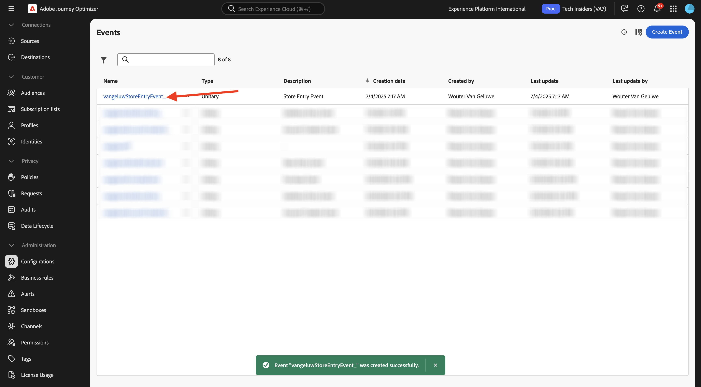
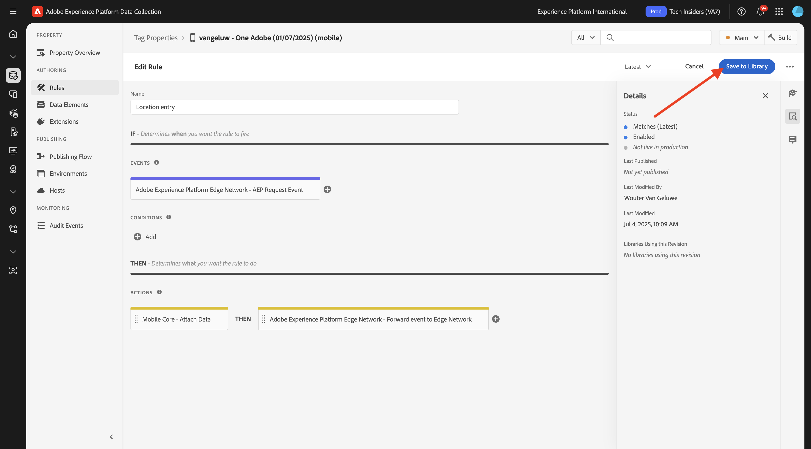

# 3.3.2 Konfigurera en resa med push-meddelanden

Logga in på Adobe Journey Optimizer på [Adobe Experience Cloud](https://experience.adobe.com). Klicka på **Journey Optimizer**.

Du omdirigeras till vyn **Hem** i Journey Optimizer. Kontrollera först att du använder rätt sandlåda. Sandlådan som ska användas kallas `--aepSandboxName--`. Du kommer sedan att vara i vyn **Hem** i din sandlåda `--aepSandboxName--`.

## 3.3.2.1 Skapa en ny händelse

Gå till **Konfigurationer** på den vänstra menyn och klicka på **Hantera** under **Händelser**.

På skärmen **Händelser** ser du en liknande vy. Klicka på **Skapa händelse**.

Därefter visas en tom händelsekonfiguration.
Först och främst ger du evenemanget ett namn som detta: `--aepUserLdap--StoreEntryEvent` och anger beskrivningen till `Store Entry Event`.
Nästa steg är markeringen **Händelsetyp**. Välj **Enhet**.
Nästa steg är **Typ av händelse-ID**. Välj **Systemgenererad**.

Nästa steg är schemavalet. Ett schema förbereddes för den här övningen. Använd schemat `Demo System - Event Schema for Mobile App (Global v1.1) v.1`.

När du har valt schemat visas ett antal fält som markeras i avsnittet **Nyttolast**. Kontrollera att fältet **Namespace** har värdet **ECID**. Din händelse är nu helt konfigurerad.

Klicka på **Spara**.

Din händelse är nu konfigurerad och sparad. Klicka på aktiviteten igen för att öppna skärmen **Redigera händelse** igen.

Håll muspekaren över fältet **Nyttolast** och klicka på ikonen **Visa nyttolast** .

Nu visas ett exempel på den förväntade nyttolasten.

Händelsen har ett unikt ID för Orchestration-händelse som du kan hitta genom att rulla nedåt i nyttolasten tills du ser `_experience.campaign.orchestration.eventID`.

Händelse-ID är det som måste skickas till Adobe Experience Platform för att utlösa den resa som du ska bygga i nästa steg. Skriv ned detta eventID, som du behöver det i nästa steg.
`"eventID": "aa895251f76831e6440f169f1bb9d2a4388f0696d8e2782cfab192a275817dfa"`

Klicka på **OK**.

Klicka på **Avbryt**.

## 3.3.2.2 Skapa en resa

Gå till **Resor** på den vänstra menyn och klicka på **Skapa resa**.

Då ser du det här. Ge din resa ett namn: `--aepUserLdap-- - Store Entry journey`. Klicka på **Spara**.

Först måste du lägga till din händelse som startpunkt för din resa. Sök efter din händelse `--aepUserLdap--StoreEntryEvent` och dra och släpp den på arbetsytan. Klicka på **Spara**.

Under **Åtgärder** söker du efter åtgärden **Push**. Dra och släpp åtgärden **Tryck** på arbetsytan.

Ange **kategorin** till **Marknadsföring** och välj en push-yta som gör att du kan skicka push-meddelanden. I det här fallet är e-postytan som ska väljas **Push-iOS-Android**.

>[!NOTE]
>
>Det måste finnas en kanal i Journey Optimizer som använder **appytan** som granskats tidigare.

Nästa steg är att skapa ett meddelande. Det gör du genom att klicka på **Redigera innehåll**.

Då ser du det här. Klicka på ikonen **personalisering** för fältet **Titel**.

Då ser du det här. Du kan nu välja valfritt profilattribut direkt i kundprofilen i realtid.

Sök efter fältet **Förnamn** och klicka sedan på ikonen **+** bredvid fältet **Förnamn**. Du kommer då att se personaliseringstoken för förnamn som läggs till: **{{profile.person.name.firstName}}**.

Lägg sedan till texten **, välkommen till vår butik!** bakom **{{profile.person.name.firstName}}**.

Klicka på **Spara**.

Du har den här nu. Klicka på ikonen **personalisering** för fältet **Brödtext**.

Ange den här texten **Klicka här för att få 10 % rabatt när du köper idag!** och klicka på **Spara**.

Du får den här då. Klicka på pilen i det övre vänstra hörnet för att gå tillbaka till din resa.

Klicka på **Spara** för att stänga din push-åtgärd.

Klicka på **Publicera**.

Klicka på **Publicera** igen.

Din resa är nu publicerad.

## 3.3.2.3 Uppdatera din datainsamlingsegenskap för mobilen

I **Getting Started** skapade Demo System sedan taggegenskaper åt dig: en för webbplatsen och en för mobilappen. Sök efter dem genom att söka efter `--aepUserLdap--` i rutan **Sök**. Klicka för att öppna egenskapen **Mobile**.

Du borde se det här då.

Gå till **Regler** på den vänstra menyn och klicka för att öppna regeln **Platspost**.

Du borde se det här då. Klicka på åtgärden **Mobile Core - Attach Data**.

Du borde se det här då.

Klistra in eventID för din händelse `--aepUserLdap--StoreEntryEvent` i fönstret **JSON Payload**. Klicka på **Behåll ändringar**.

Klicka på **Spara** eller **Spara i bibliotek**.

Gå till **Publiceringsflöde** och klicka för att öppna biblioteket **Huvudsida**.

Klicka på **Lägg till alla ändrade resurser** och sedan på **Spara och skapa i utveckling**.

## 3.3.2.4 Testa din resa och skicka ett push-meddelande

Öppna **DSN Mobile**-programmet.

Gå till sidan **Store Locator**.

Klicka på **Simulera POI-post**.

Efter några sekunder visas ett push-meddelande.

## Nästa steg

Gå till [3.3.3 Konfigurera en kampanj med meddelanden i appen](./ex3.md){target="_blank"}

Gå tillbaka till [Adobe Journey Optimizer: Push och In-app Messages](ajopushinapp.md){target="_blank"}

Gå tillbaka till [Alla moduler](./../../../../overview.md){target="_blank"}