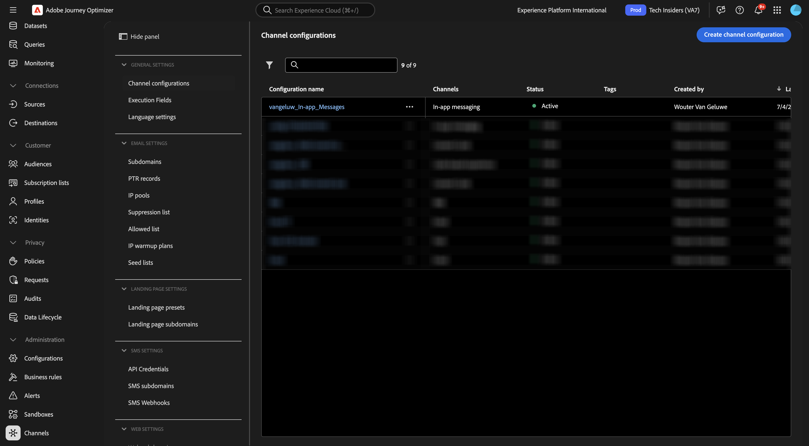

# 3.3.3 Konfigurera en kampanj med meddelanden i appen

Logga in på Adobe Journey Optimizer på [Adobe Experience Cloud](https://experience.adobe.com). Klicka på **Journey Optimizer**.

Du omdirigeras till vyn **Hem** i Journey Optimizer. Kontrollera först att du använder rätt sandlåda. Sandlådan som ska användas kallas `--aepSandboxName--`. Du kommer sedan att vara i vyn **Hem** i din sandlåda `--aepSandboxName--`.

## Kanalkonfiguration för meddelanden i appen 3.3.3.1

Gå till **Kanaler** på den vänstra menyn och välj sedan **Kanalkonfigurationer**. Klicka på **Skapa kanalkonfiguration**.

Ange namnet: `--aepUserLdap--_In-app_Messages`, markera kanalen **Meddelanden i appen** och aktivera sedan plattformarna **Webb**, **iOS** och **Android**.

Bläddra ned, du borde se det här.

Kontrollera att **En sida** är aktiverad.

För **Webben** anger du URL-adressen till webbplatsen som skapades tidigare som en del av modulen **Komma igång** som ser ut så här: `https://dsn.adobe.com/web/--aepUserLdap---XXXX`. Glöm inte att ändra **XXXX** till webbplatsens unika kod.

Ange **för** iOS **och** Android`com.adobe.dsn.dxdemo`.

Bläddra uppåt och klicka på **Skicka**.

Kanalkonfigurationen är nu klar att användas.

## 3.3.3.2 Konfigurera en schemalagd kampanj för meddelanden i appen

Gå till **Kampanjer** på den vänstra menyn och klicka sedan på **Skapa kampanj**.

Välj **Schemalagd - Markering** och klicka sedan på **Skapa**.

Ange namnet `--aepUserLdap-- - CitiSignal Fiber Max` och klicka sedan på **Åtgärder**.

Klicka på **+ Lägg till åtgärd** och välj sedan **Meddelande i programmet**.

Välj den konfiguration av meddelandekanal i appen som du skapade i föregående steg, med namnet: `--aepUserLdap--_In-app_Messages`. Klicka på **Redigera innehåll**.

Du borde se det här då. Klicka på **Modal**.

Klicka på **Ändra layout**.

Klicka på ikonen **Media URL** om du vill välja en resurs från AEM Assets.

Gå till mappen **citisign-images** och välj bildfilen **neon-rabbit.jpg**. Klicka på **Markera**.

Använd **för texten** Header`CitiSignal Fiber Max`.
Använd **för texten** Brödtext`Conquer lag with Fiber Max`.

Ställ in texten **Knapp 1** på: `Go to Plans`.
Ange **target** till `com.adobe.dsn.dxdemo://plans`.

Klicka på **Granska för att aktivera**.

Klicka på **Aktivera**.

Statusen för din kampanj är nu inställd på **Aktivera**. Det kan ta några minuter innan kampanjen är aktiv.

När statusen har ändrats till **Live** kan du testa din kampanj.

## 3.3.3.3 Testa din kampanj för meddelanden i appen på mobilen

Öppna appen på din mobila enhet. Det nya meddelandet i appen visas när du har startat appen. Klicka på knappen **Gå till planer**.

Du dirigeras sedan till sidan **Planer**.

## Nästa steg

Gå till [Sammanfattning och förmåner](./summary.md){target="_blank"}

Gå tillbaka till [Adobe Journey Optimizer: Push och In-app Messages](ajopushinapp.md){target="_blank"}

Gå tillbaka till [Alla moduler](./../../../../overview.md){target="_blank"}
