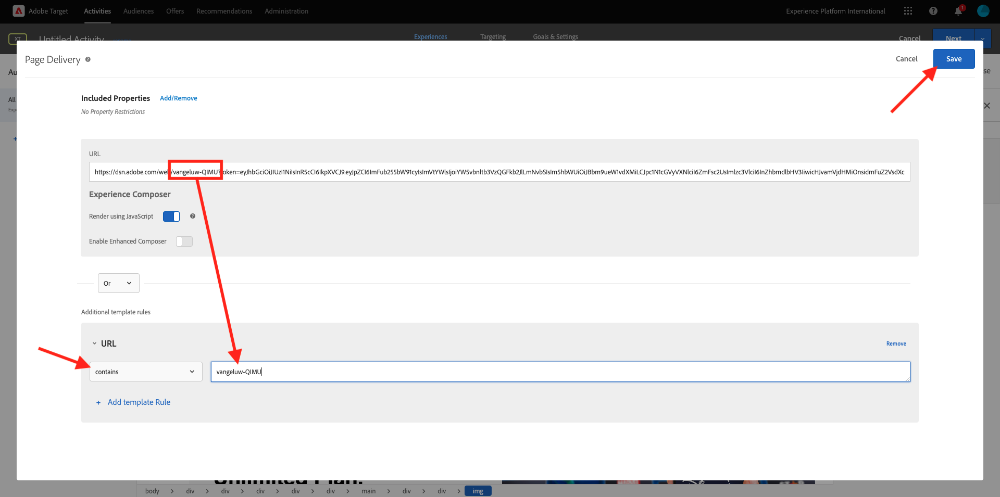

# 3.3.4 Kombinera Adobe Target och Offer Decisioning

## 3.3.4.1 Samla in länken till ditt demoprojekt

För att kunna läsa in demonstrationswebbplatsprojektet i Adobe Target måste du först samla in en speciell länk som gör att Adobe Target kan läsa in ditt projekt för demowebbplatser.

Gå till [https://dsn.adobe.com/projects](https://builder.adobedemo.com/projects) om du vill göra det. När du har loggat in med din Adobe ID ser du det här. Klicka på webbplatsprojektet för att öppna det.

Du kommer att se det här. Gå till **Dela**. Klicka på **Skapa länk** och kopiera sedan länken till Urklipp.

Gå till [https://bitly.com](https://bitly.com), klistra in länken som du kopierade och klicka på **Skapa länken**.

Du får nu en förkortad länk som ser ut så här: `https://adobe.ly/3PpGcFk`. Du kommer att behöva den länken i nästa övning.

## 3.3.4.2 Samla in

Gå till Adobe Experience Cloud hemsida på [https://experiencecloud.adobe.com/](https://experiencecloud.adobe.com/). Klicka på **Mål**.

På startsidan för **Adobe Target** visas alla befintliga aktiviteter. Klicka på **Skapa aktivitet** och sedan på **Upplevelsemål**.

Välj **Visuell** och klistra in den förkortade länken i fältet **Ange aktivitets-URL**. Klicka på **Skapa**.

Du kommer då att se hur ditt demonstrationswebbplatsprojekt läses in i Visuel Experience Composer.

>[!NOTE]
>
>Om webbplatsen inte läses in korrekt installerar och aktiverar du det här Chrome-tillägget: **Adobe Target VEC Helper** från Chrome Web Store och försöker sedan igen.

Klicka på det område som innehåller Disney+-erbjudandet. Se till att du väljer den fullständiga **behållaren**. Klicka på **Infoga före** och välj sedan **Erbjudandebeslut**.

Du kommer då att se den här popup-rutan. Markera sandlådan `--aepSandboxName--` och välj sedan placeringen **Webb - bild**.

Välj sedan ditt beslut `--aepUserLdap-- - CitiSignal Decision`. Klicka på **Spara**.

Då ser du det här. Klicka på **Granskningsregel**.

Kontrollera att den extra mallregeln **URL** **innehåller** **ditt-project-name**. Klicka på **Spara**.

Då ser du det här. Klicka på **Nästa**.

Ange ett namn för erbjudandet. Använd det här namnet: `--aepUserLdap-- - XT with Offers (VEC)`. Klicka på **Nästa**.

Då ser du det här. Definiera **målmåttet** enligt vad som anges. Klicka på **Spara och stäng**.

Erbjudandet har skapats och publiceras. När erbjudandet har publicerats kan du aktivera det.

## Nästa steg

Gå till [3.3.5 Använd ditt beslut i ett e-postmeddelande och SMS](./ex5.md){target="_blank"}

Gå tillbaka till [Offer Decisioning](offer-decisioning.md){target="_blank"}

Gå tillbaka till [Alla moduler](./../../../../overview.md){target="_blank"}
