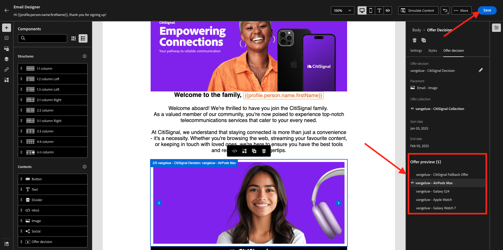

# 3.3.5 Använd ditt beslut i ett e-postmeddelande

I den här övningen använder du ditt beslut för att anpassa leveransen av ett e-postmeddelande och SMS.

Gå till **Resor**. Hitta den resa du skapade i övning 3.1.3, som heter `--aepUserLdap-- - Registration Journey`. Klicka på resan för att öppna den.

Då ser du det här. Klicka på **.. Mer** och klicka sedan på **Skapa en ny version**.

Klicka på **Skapa en ny version**.

Klicka på åtgärden **E-post** och sedan på **Redigera innehåll**.

Då visas meddelandepanelen. Klicka på **Redigera e-postbrödtext**.

Då ser du det här. Dra en ny **1:1-kolumnstrukturkomponent** till arbetsytan.

Gå till **Innehåll** på menyn. Välj komponenten **Erbjudandebeslut** och dra och släpp den här komponenten i e-postmeddelandets platshållare för innehållserbjudanden enligt vad som anges. Klicka sedan på **Lägg till**.

Välj den typ av placering som du vill ta med i e-postmeddelandet. Välj **E-post - bild** i listrutan **Placeringar** och välj sedan ditt beslut `--aepUserLdap-- - CitiSignal Decision`. Klicka på **Lägg till**.

Nu kan ni bläddra igenom alla personaliserade erbjudanden och reserverbjudandet, som alla visualiseras inuti e-postdesignern. Klicka på **Spara**.

Klicka på pilen för att gå tillbaka till föregående skärm.

Klicka på pilen i det övre vänstra hörnet för att gå tillbaka till din resa.

Klicka på **Spara** för att stänga din **e-post**-åtgärd.

Klicka på **Publicera** för att publicera den uppdaterade resan.

Bekräfta genom att klicka på **Publicera** igen.

Meddelandet har publicerats.

När du skapar ett nytt konto på demowebbplatsen får du nu det här e-postmeddelandet:

Du har gjort klart den här övningen.

## Nästa steg

Gå till [3.3.6 Testa ditt beslut med API:t](./ex6.md){target="_blank"}

Gå tillbaka till [Offer Decisioning](offer-decisioning.md){target="_blank"}

Gå tillbaka till [Alla moduler](./../../../../overview.md){target="_blank"}
