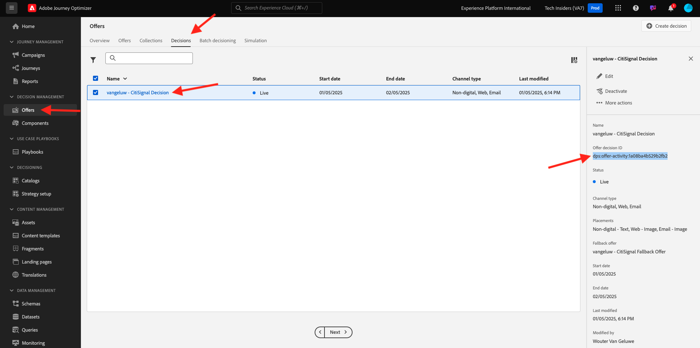

# 3.3.6 Testa ditt beslut med API:t

## 3.3.6.1 Arbeta med Offer Decisioning API med Postman

>[!IMPORTANT]
>
>Om du är Adobe-anställd följer du instruktionerna här för att använda [PostBuster](./../../../../modules/getting-started/gettingstarted/ex8.md).

Ladda ned [den här Postman Collection för Offer Decisioning](./../../../../assets/postman/postman_offer-decisioning.zip) till skrivbordet och zippa upp den. Då får du den här:

Nu har du den här filen på skrivbordet:

- `_AJO- Decisioning Service.postman_collection.json`

In [Exercise 2.1.3 - Postman authentication to Adobe I/O](./../../../../modules/delivery-activation/rtcdp-b2c/rtcdpb2c-1/ex3.md) you installed Postman. Du måste använda Postman igen för den här övningen.

Öppna Postman och importera filen `_AJO- Decisioning Service.postman_collection.json`. Den här samlingen är sedan tillgänglig i Postman.

Nu har du allt du behöver i Postman för att börja interagera med Adobe Experience Platform via API:erna.

Innan du kan använda nedanstående API:er måste du autentisera igen med samlingen **Adobe IO - OAuth** som du konfigurerade i Exercise 2.1.3.

### 3.3.6.2 Erbjudanden för kundprofil

Klicka för att öppna förfrågan **POST - få erbjudanden för kundprofil**. Det första som ska uppdateras är variabeln **Header** för **x-sandbox-name**. Du bör ange det till `--aepSandboxName--`.

Det finns ett antal fält som måste uppdateras för den här begäran. Gå till **Body**.

- **xdm:placementId**
- **xdm:activityId**
- **xdm:id**
- **xdm:itemCount** (ändra det till ett valfritt värde)

Fältet **xdm:activityId** måste fyllas i. Du kan hämta det i användargränssnittet för Adobe Experience Platform enligt nedan.

Fältet **[!UICONTROL xdm:placementId]** måste fyllas i. Du kan hämta det i användargränssnittet för Adobe Experience Platform enligt nedan. I exemplet nedan kan du se placementId för placeringen **[!UICONTROL Web - Image]**.

För fältet **xdm:id** anger du e-postadressen till kundprofilen som du vill begära ett erbjudande för. Klicka på **[!UICONTROL Send]** när alla värden har angetts.

Slutligen kommer ni att se resultatet av vilken typ av personaliserat erbjudande och vilka resurser som behöver visas för den här kunden. I det här exemplet begärdes två objekt och som du ser har två anpassade erbjudanden returnerats. 1 erbjudande för Apple Watch och ett annat erbjudande för Galaxy Watch 7.

Du har nu avslutat den här övningen.

## Nästa steg

Gå till [Sammanfattning och förmåner](./summary.md){target="_blank"}

Gå tillbaka till [Offer Decisioning](offer-decisioning.md){target="_blank"}

Gå tillbaka till [Alla moduler](./../../../../overview.md){target="_blank"}
