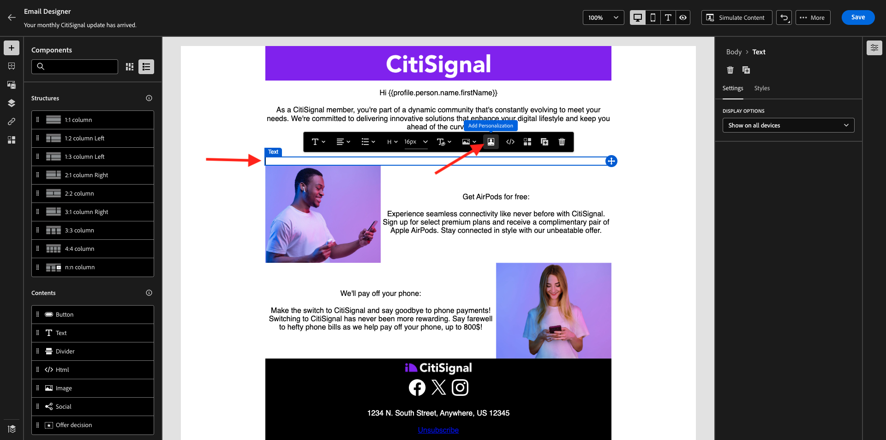

# 3.4.3 Använda segmentbaserad personalisering i ett e-postmeddelande

Logga in på Adobe Experience Cloud på [Adobe Experience Cloud](https://experience.adobe.com). Klicka på **Adobe Journey Optimizer**.

Du omdirigeras till vyn **Hem** i Journey Optimizer. Innan du fortsätter måste du välja en **sandlåda**. Sandlådan som ska markeras har namnet ``--aepTenantId--``.

## 3.4.3.1 Segmentbaserad personalisering

I den här övningen kommer du att förbättra nyhetsbrevets e-postmeddelande som du skapade i föregående övning med en personlig text baserad på segmentmedlemskap.

Gå till **Kampanjer**. Hitta den nyhetsbrevsresa du har skapat i föregående övning. Sök efter `--aepUserLdap-- - CitiSignal Newsletter`. Högerklicka på de 3 punkterna **..** och klicka på **Duplicera**.

Då ser du det här. Använd det här för **titeln**: `--aepUserLdap-- - CitiSignal Newsletter (SBP)`. Klicka på **Duplicera**.

Klicka på den duplicerade kampanjen för att öppna den.

Klicka på **Redigera** om du vill ändra innehållet.

Klicka på **Redigera e-postbrödtext**.

Då ser du det här.

Öppna **Innehållskomponenter** och dra en **1:1-kolumn** ovanför erbjudandet för AirPods.

Dra och släpp en **Text** -komponent i den 1:1-kolumnen.

Markera hela standardtexten och ta bort den. Klicka sedan på knappen **Lägg till anpassning** i verktygsfältet.

Då ser du det här. Klicka på **Publiker** på den vänstra menyn.

Markera segmentet `--aepUserLdap-- - Interest in Plans` och klicka på ikonen **+** för att lägga till det på arbetsytan.

Sedan lämnar du den första raden som den är och ersätter rad 2 och 3 med den här koden:

&grave;&grave;
    PS: It may be a good idea to check if your plan still meets your needs! Click here to be contacted by one of our experts!

    PS: Thanks for taking the time to read our newsletter. Here is a 10% promo code to use on the website: NEWSLETTER10

&grave;&grave;

Du får den här då. Klicka på **Spara**.

Ändra textjusteringen till **Centrera**.

Du kan nu spara det här meddelandet genom att klicka på knappen **Spara** i det övre högra hörnet. Klicka sedan på **pilen** bredvid texten på ämnesraden i det övre vänstra hörnet.

Klicka på **Granska för att aktivera**.

Klicka på **Aktivera**.

Ditt nyhetsbrev med segmentbaserad personalisering publiceras nu. E-postmeddelandet med nyhetsbrevet skickas baserat på ditt schema och din resa avbryts så snart som det senaste e-postmeddelandet har skickats.

Om du är berättigad till det segment som användes visas detta i e-postmeddelandet som du får:

Du har gjort klart den här övningen.

## Nästa steg

Gå till installationsprogrammet för [3.4.4 och använd push-meddelanden för iOS](./ex4.md){target="_blank"}

Gå tillbaka till [Adobe Journey Optimizer](journeyoptimizer.md){target="_blank"}

Gå tillbaka till [Alla moduler](./../../../../overview.md){target="_blank"}
