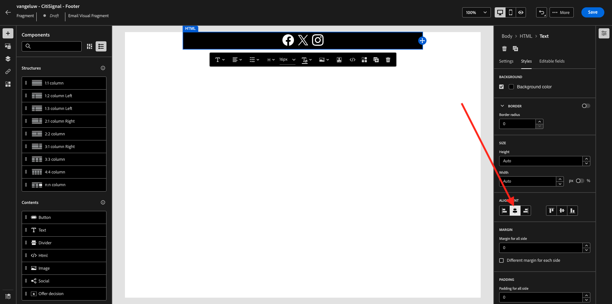
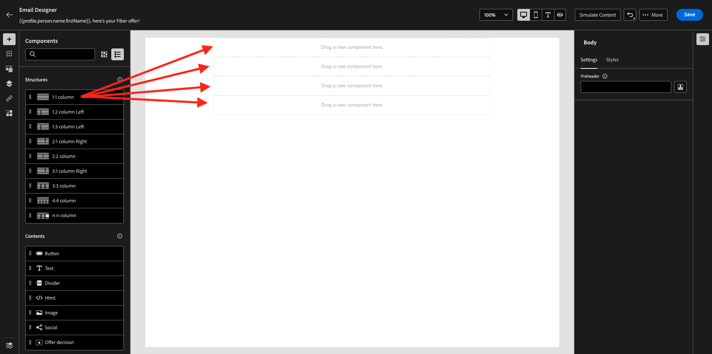
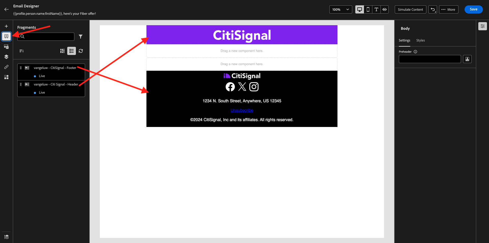
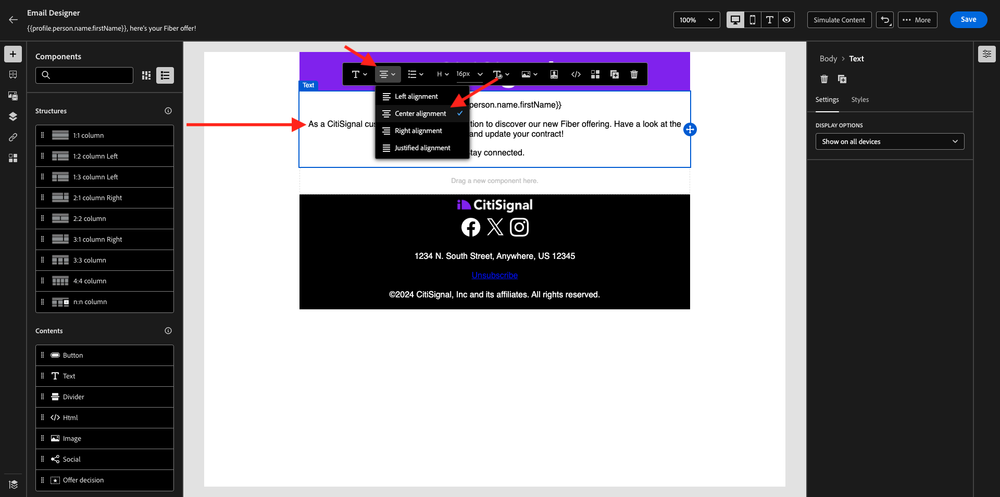

# 3.5.2 Skapa en kampanj

Gå till [https://experience.adobe.com/](https://experience.adobe.com/). Klicka på **Journey Optimizer**.


Du omdirigeras till vyn **Hem** i Journey Optimizer. Kontrollera först att du använder rätt sandlåda. Sandlådan som ska användas kallas `--aepSandboxName--`.


>[!NOTE]
>
>Om du redan har skapat dina Header- och Footer-fragment som en del av övningen [övning 3.1.2.1](./../ajob2c-1/ex2.md) och [övning 3.1.2.2](./../ajob2c-1/ex2.md) kan du hoppa fram till 3.5.2.3 Skapa fiberkampanj. Skapa inte sidhuvuds- och sidfotsavsnitten igen.

## 3.5.2.1 Skapa rubrikfragment

Klicka på **Fragment** på den vänstra menyn. Ett fragment är en återanvändbar komponent i Journey Optimizer, som undviker dubbletter och underlättar framtida ändringar som påverkar alla meddelanden, till exempel ändringar i ett sidhuvud eller en sidfot i ett e-postmeddelande.

Klicka på **Skapa fragment**.


Ange namnet `--aepUserLdap-- - CitiSignal - Header` och välj **Typ: Visual Fragment**. Klicka på **Skapa**.


Då ser du det här. På den vänstra menyn hittar du de strukturkomponenter som du kan använda för att definiera e-postmeddelandets struktur (rader och kolumner).

Dra och släpp en **1:1-kolumn** från menyn på arbetsytan. Detta blir platshållare för logotypbilden.


Sedan kan du använda Innehållskomponenter för att lägga till innehåll i dessa block. Dra och släpp en **bild**-komponent i den första cellen på den första raden. Klicka på **Bläddra**.


Då visas ett popup-fönster som visar AEM Assets Media Library. Gå till mappen **citi-signal-images**, klicka för att markera bilden **CitiSignal-Logo-White.png** och klicka på **Välj**.

>[!NOTE]
>
>Om du inte ser Citi Signal-bilderna i ditt AEM Assets-bibliotek hittar du dem [här](./../../../../assets/ajo/CitiSignal-images.zip). Hämta dem till skrivbordet, skapa mappen **citi-signal-images** och överför alla bilder i mappen.


Då ser du det här. Bilden är vit och visas inte än. Nu bör du definiera en bakgrundsfärg så att bilden visas korrekt. Klicka på **Stilar** och sedan på rutan **Bakgrundsfärg** .


Ändra färgkoden **Hex** till **#8821F4** på popup-menyn och ändra sedan fokus genom att klicka i fältet **100%** . Sedan ser du den nya färgen som används på bilden.


Bilden är också lite för stor just nu. Vi ändrar bredden genom att skjuta **Breddväxlaren** till **40%**.


Ditt rubrikfragment är nu klart. Klicka på **Spara** och sedan på pilen för att gå tillbaka till föregående skärm.


Ditt fragment måste publiceras innan det kan användas. Klicka på **Publicera**.


Efter några minuter ser du att ditt fragments status har ändrats till **Live**.
Sedan bör du skapa ett nytt fragment för sidfoten i dina e-postmeddelanden. Klicka på **Skapa fragment**.


## 3.5.2.2 Skapa sidfotsavsnittet

Klicka på **Skapa fragment**.


Ange namnet `--aepUserLdap-- - CitiSignal - Footer` och välj **Typ: Visual Fragment**. Klicka på **Skapa**.


Då ser du det här. På den vänstra menyn hittar du de strukturkomponenter som du kan använda för att definiera e-postmeddelandets struktur (rader och kolumner).

Dra och släpp en **1:1-kolumn** från menyn på arbetsytan. Det här blir platshållare för sidfotsinnehållet.


Sedan kan du använda Innehållskomponenter för att lägga till innehåll i dessa block. Dra och släpp en **HTML**-komponent i den första cellen på den första raden. Klicka på komponenten för att markera den och klicka sedan på ikonen **&lt;/>** för att redigera HTML-källkoden.


Då ser du det här.


Kopiera nedanstående HTML-kodfragment och klistra in det i fönstret **Redigera HTML** i Journey Optimizer.

```html
<!--[if mso]><table cellpadding="0" cellspacing="0" border="0" width="100%"><tr><td style="text-align: center;" ><![endif]-->
<table style="width: auto; display: inline-block;">
  <tbody>
    <tr class="component-social-container">
      <td style="padding: 5px">
        <a style="text-decoration: none;" href="https://www.facebook.com" data-component-social-icon-id="facebook">
        
        </a>
      </td>
      <td style="padding: 5px">
        <a style="text-decoration: none;" href="https://x.com" data-component-social-icon-id="twitter">
        
        </a>
      </td>
      <td style="padding: 5px">
        <a style="text-decoration: none;" href="https://www.instagram.com" data-component-social-icon-id="instagram">
         
        </a>
      </td>
    </tr>
  </tbody>
</table>
<!--[if mso]></td></tr></table><![endif]-->
```

Du får den här då. På raderna 7, 12 och 17 måste du nu infoga en bildfil med hjälp av resurserna i ditt AEM Assets-bibliotek.


Se till att markören är placerad på rad 7 och klicka sedan på **Assets** i den vänstra menyn. Klicka på **Öppna resursväljaren** för att välja bilden.


Öppna mappen **citi-signal-images** och klicka för att välja bilden **Icon_Facebook.png**. Klicka på **Markera**.


Se till att markören är placerad på rad 12 och klicka sedan på **Öppna resursväljaren** för att markera bilden.


Öppna mappen **citi-signal-images** och klicka för att välja bilden **Icon_X.png**. Klicka på **Markera**.


Se till att markören är placerad på rad 17 och klicka sedan på **Öppna resursväljaren** för att markera bilden.


Öppna mappen **citi-signal-images** och klicka för att välja bilden **Icon_Instagram.png**. Klicka på **Markera**.


Då ser du det här. Klicka på **Spara**.


Du kommer då tillbaka i redigeraren. Dina ikoner är inte synliga än eftersom bakgrunden och bildfilerna är helt vita. Om du vill ändra bakgrundsfärgen går du till **Stilar** och klickar i kryssrutan **Bakgrundsfärg** .


Ändra färgkoden **Hex** till **#00000**.


Ändra justeringen till centrerad.



Låt oss lägga till några andra delar till sidfoten. Dra och släpp en **bild**-komponent ovanför den HTML-komponent du just skapade. Klicka på **Bläddra**.


Klicka för att markera bildfilen **`CitiSignal_Footer_Logo.png`** och klicka på **Välj**.


Gå till **Stilar** och klicka i kryssrutan **Bakgrundsfärg** så ändrar vi den till svart igen. Ändra färgkoden **Hex** till **#00000**.


Ändra bredden till **20%** och kontrollera att justeringen är inställd på centrering.


Dra och släpp en **Text** -komponent under den HTML-komponent som du skapade. Klicka på **Bläddra**.


Kopiera och klistra in texten nedan genom att ersätta platshållartexten.

```
1234 N. South Street, Anywhere, US 12345

Unsubscribe

©2024 CitiSignal, Inc and its affiliates. All rights reserved.
```

Ange att **textjusteringen** ska centreras.


Ändra **teckenfärgen** till vit, **#FFFFFF**.


Ändra **bakgrundsfärgen** till svart, **#00000**.


Markera texten **Avsluta prenumeration** i sidfoten och klicka på ikonen **Länk** i menyraden. Ange **Type** till **External Opt-out/Unsubscription** och ange URL:en till **https://aepdemo.net/unsubscribe.html** (det får inte finnas en tom URL för länken för att avbryta prenumerationen).


Du får den här då. Sidfoten är nu klar. Klicka på **Spara** och sedan på pilen för att gå tillbaka till föregående sida.


Klicka på **Publicera** för att publicera sidfoten så att den kan användas i ett e-postmeddelande.


Efter några minuter ser du att sidfotens status har ändrats till **Live**.


## 3.5.2.3 Skapa fiberkampanj

Nu ska ni skapa en kampanj. Till skillnad från den händelsebaserade resan från föregående övning, som bygger på inkommande upplevelsehändelser, målgruppsposter eller utträde för att utlösa en resa för en viss kund, riktar kampanjer sig mot en hel målgrupp en gång med unikt innehåll som nyhetsbrev, engångskampanjer eller allmän information eller regelbundet med liknande innehåll som skickas regelbundet, till exempel födelsedagskampanjer och påminnelser.

Gå till **Kampanjer** på menyn och klicka på **Skapa kampanj**.


Välj **Schemalagd - marknadsföring** och klicka på **Skapa**.


Konfigurera följande när kampanjen skapas:

- **Namn**: `--aepUserLdap-- - CitiSignal Fiber`.
- **Beskrivning**: Fiberkampanj
- **Identitetstyp**: ändra till e-post


Bläddra ned till **Åtgärd**. Välj **E-post** för **åtgärden**.


Välj sedan en befintlig **e-postkonfiguration**. Du redigerar innehållet om några minuter.


Bläddra upp till **målgrupp**. Klicka på **Välj målgrupp**.


För **målgruppen** väljer du målgruppen som du skapade i [&#x200B; 1.3.3 Skapa en federerad komposition &#x200B;](./../../datacollection/dc1.3/ex3.md) som har namnet `--aepUserLdap-- - CitiSignal Eligible for Fiber`. Klicka på **Spara**.


Bläddra ned till **Schema**. Välj **På ett visst datum och en viss tid** för **Schemalägg** och ange en valtid.


Nu kan du börja skapa själva e-postmeddelandet. Bläddra uppåt och klicka på **Redigera innehåll**.


Då ser du det här. Använd följande för **Subject line**:

```
{{profile.person.name.firstName}}, here's your Fiber offer!
```

Klicka sedan på **Redigera e-postbrödtext**.


Välj **Design från grunden**.


Då ser du det här. På den vänstra menyn hittar du de strukturkomponenter som du kan använda för att definiera e-postmeddelandets struktur (rader och kolumner).

Dra och släpp fyra gånger en **1:1-kolumn** på arbetsytan, vilket bör ge dig den här strukturen:



Gå till **Fragment** på den vänstra menyn. Dra sidhuvudet du skapade tidigare till den första komponenten på arbetsytan. Dra sidfoten som du skapade tidigare till den sista komponenten på arbetsytan.



Klicka på ikonen **+** i den vänstra menyn. Gå till **Innehåll** för att börja lägga till innehåll på arbetsytan.


Dra och släpp en **Text**-komponent på den andra raden.


Markera standardtexten i komponenten **Skriv texten här.** och ersätt den med texten nedan. Ändra justeringen till **Centrera**.

```javascript
Hi {{profile.person.name.firstName}}

As a CitiSignal customer, you're in pole position to discover our new Fiber offering. Have a look at the below offer and update your contract!

Stay connected.
```



Dra och släpp en **bild**-komponent på den tredje raden. Klicka på **Bläddra**.


Välj den AEM Assets-databas som du skapade som en del av tidigare moduler. Den databasen ska ha namnet `--aepUserLdap-- - Citi Signal dev`. Klicka för att öppna mappen `--aepUserLdap-- - Workfront Assets`.


Klicka för att markera bilden **2048x2048_buynow.png** och klicka sedan på **Välj**.


Ditt enkla nyhetsbrev är nu klart. Klicka på **Spara**.


Gå tillbaka till kontrollpanelen för kampanjer genom att klicka på **pilen** bredvid texten för ämnesraden i det övre vänstra hörnet.


Klicka på **Granska för att aktivera**.


Du kan då få det här felet. Om så är fallet kan du behöva vänta i upp till 24 timmar tills målgruppen har utvärderats och sedan försöka aktivera kampanjen igen. Du kan också behöva uppdatera schemat för din kampanj så att den körs vid ett senare tillfälle.


Klicka på **Aktivera**.


När kampanjen har aktiverats schemaläggs den att köras.


Du har gjort klart den här övningen.

## Nästa steg

Gå till [3.5.3 Lägg till språk i e-postmeddelandet](./ex3.md)

Gå tillbaka till [Adobe Journey Optimizer: Översättningstjänster](./ajotranslationsvcs.md){target="_blank"}

Gå tillbaka till [Alla moduler](./../../../../overview.md){target="_blank"}
