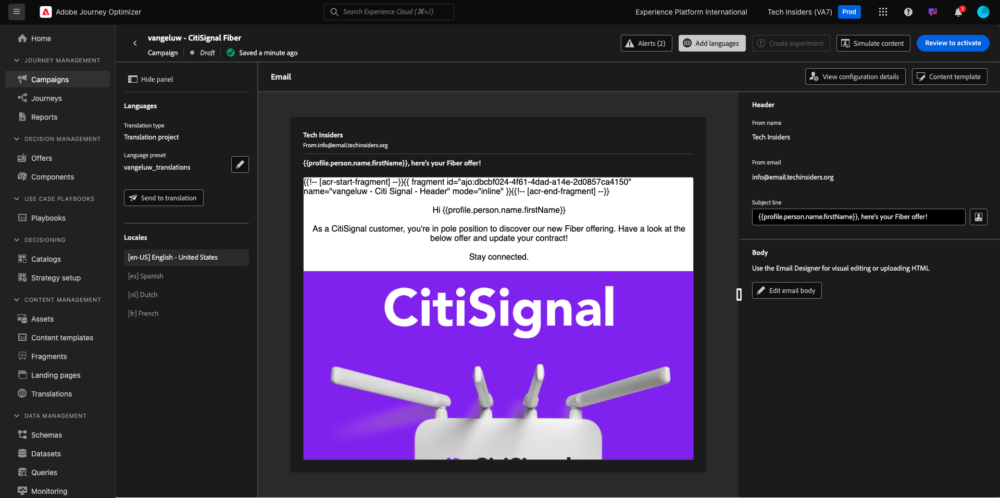
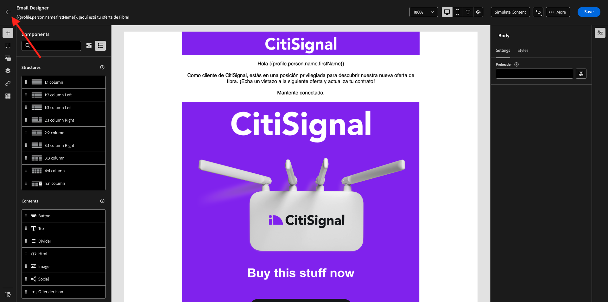
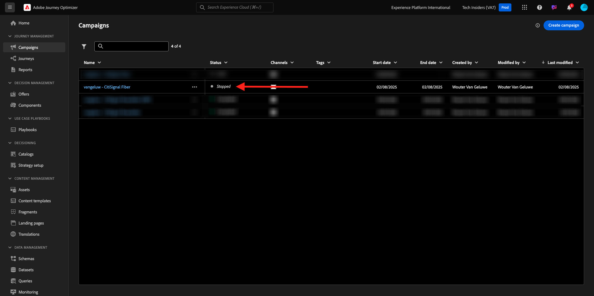

# 3.5.3 Lägg till språk i e-postmeddelandet

Gå till [https://experience.adobe.com/](https://experience.adobe.com/). Klicka på **Journey Optimizer**.

Du omdirigeras till vyn **Hem** i Journey Optimizer. Kontrollera först att du använder rätt sandlåda. Sandlådan som ska användas kallas `--aepSandboxName--`.

Gå till **Kampanjer** och klicka för att öppna kampanjen som du just skapade.

Klicka på **Ändra kampanj**.

Klicka på **Ändra**.

Bläddra ned till åtgärden **E-post** och klicka på **Redigera innehåll**.

Klicka på **Lägg till språk**.

Välj dina **språkinställningar** som har namnet `--aepUserLdap--_translations`. Klicka på **Markera**.

Du borde se det här då. Klicka på **Skicka till översättning**.

Du borde då se ett liknande meddelande. Arbetsflödet **Skicka till översättning** har nu startats och tar några minuter att slutföra.
Du kommer att se att statusen ändras till **Översättning pågår**.

Efter några minuter ändras översättningsarbetsflödets status till **Översättningen slutförd**.

Klicka på översättningen **`[es] Spanish`**. Du kommer då att se den uppdaterade texten i e-postförhandsgranskningen och även på **ämnesraden**.
Om det behövs kan du fortfarande granska och uppdatera översättningen direkt i fältet **Ämnesrad**.

Klicka på **Redigera e-postbrödtext** om du vill granska översättningen inuti e-postmeddelandet.

Du kan ändra texten manuellt om översättningen skulle behöva granskas.

Gå tillbaka till kampanjöversikten genom att klicka på **pilen** bredvid texten på ämnesraden i det övre vänstra hörnet.

Du borde vara tillbaka här. Kampanjen behöver inte aktiveras igen.

Gå tillbaka till kampanjen genom att klicka på **pilen** i det övre vänstra hörnet.

Kontrollera att din kampanj är i läget **Stoppad**.

Du har nu avslutat den här övningen.

## Nästa steg

Gå till [Sammanfattning och förmåner](./summary.md)

Gå tillbaka till [Adobe Journey Optimizer: Översättningstjänster](./ajotranslationsvcs.md){target="_blank"}

Gå tillbaka till [Alla moduler](./../../../../overview.md){target="_blank"}
