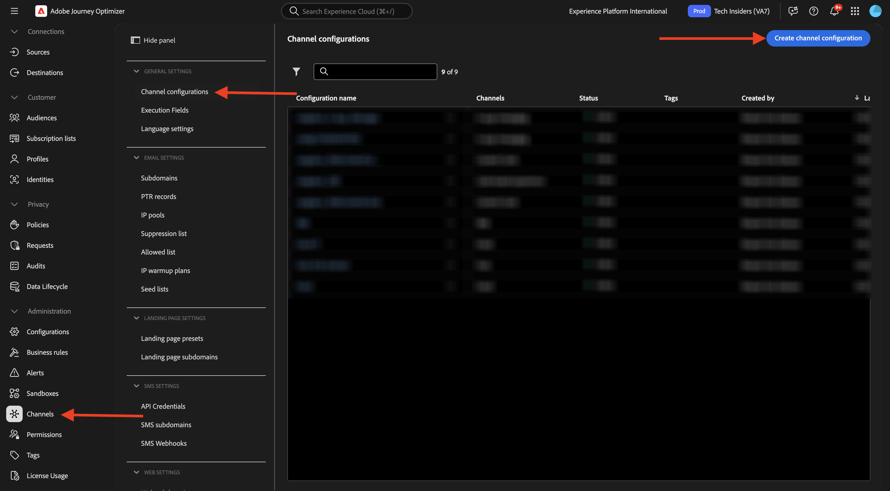
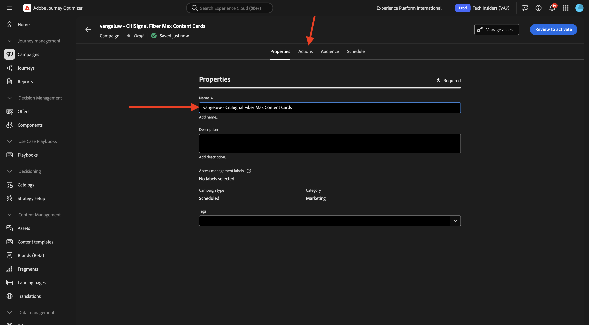
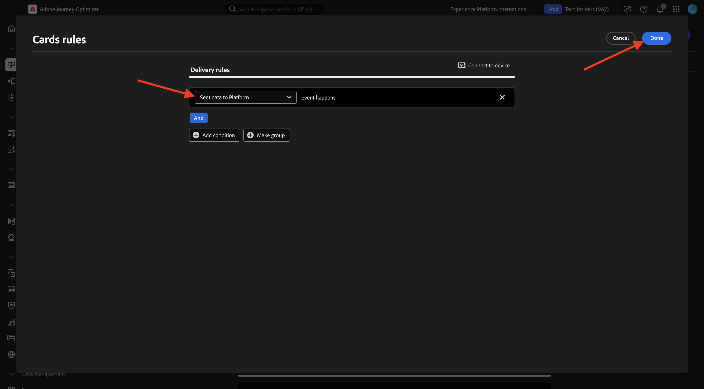
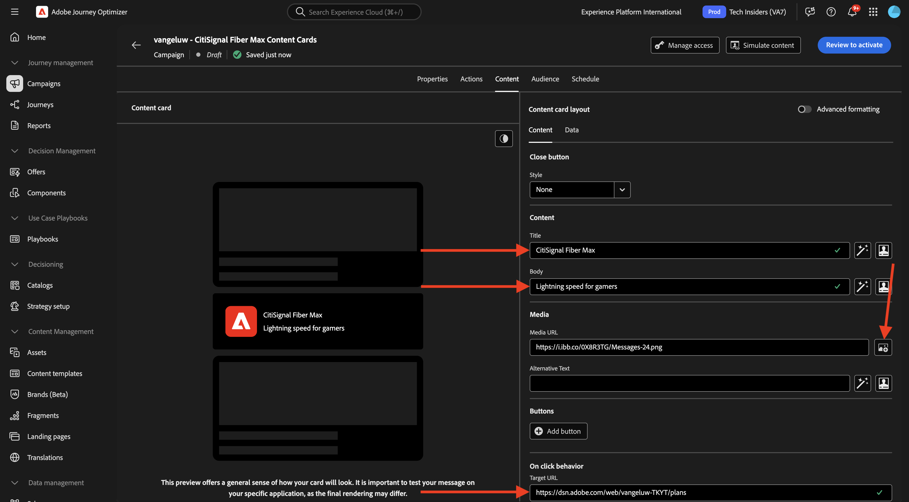
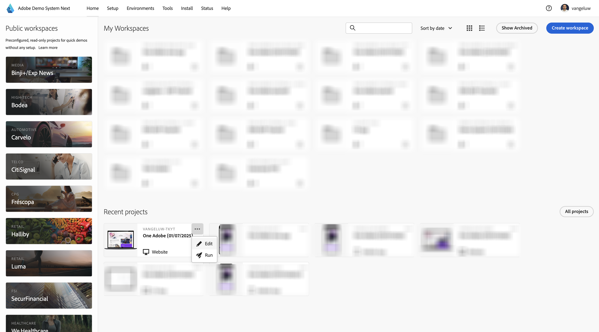

# 3.6.1 Innehållskort

Logga in på Adobe Journey Optimizer på [Adobe Experience Cloud](https://experience.adobe.com). Klicka på **Journey Optimizer**.


Du omdirigeras till vyn **Hem** i Journey Optimizer. Kontrollera först att du använder rätt sandlåda. Sandlådan som ska användas kallas `--aepSandboxName--`. Du kommer sedan att vara i vyn **Hem** i din sandlåda `--aepSandboxName--`.


## Kanalkonfiguration för 3.6.1.1 innehållskort

Gå till **Kanaler** på den vänstra menyn och välj sedan **Kanalkonfigurationer**. Klicka på **Skapa kanalkonfiguration**.



Ange namnet: `--aepUserLdap--_Content_Cards_Web`, markera kanalen **Innehållskort** och aktivera sedan plattformen **Webb**.


Bläddra nedåt och kontrollera att alternativet **En sida** är aktiverat.

Ange URL:en för webbplatsen som skapades tidigare som en del av modulen **Komma igång** som ser ut så här: `https://dsn.adobe.com/web/--aepUserLdap---XXXX`. Glöm inte att ändra **XXXX** till webbplatsens unika kod.

>[!IMPORTANT]
>
>Ovanstående referens till URL:en `https://dsn.adobe.com/web/--aepUserLdap---XXXX` för din CitiSignal-demowebbplats måste ändras till din faktiska URL. Du kan hitta URL-adressen genom att gå till ditt webbplatsprojekt på [https://dsn.adobe.com/](https://dsn.adobe.com/).

Ange **platsen på sidan** som `CitiSignalContentCardContainer` i fältet.


Bläddra uppåt och klicka på **Skicka**.


Kanalkonfigurationen är nu klar att användas.


## 3.6.1.2 Konfigurera en schemalagd kampanj för innehållskort

Gå till **Kampanjer** på den vänstra menyn och klicka sedan på **Skapa kampanj**.


Välj **Schemalagd - Markering** och klicka sedan på **Skapa**.


Ange namnet `--aepUserLdap-- - CitiSignal Fiber Max Content Cards` och klicka sedan på **Åtgärder**.



Klicka på **+ Lägg till åtgärd** och välj sedan **Innehållskort**.


Välj kanalkonfigurationen för innehållskort som du skapade i föregående steg, med namnet: `--aepUserLdap--_Content_Cards_Web`.

Klicka sedan på **Redigera regler**.


Klicka på **X** för att ta bort den aktuella regeln.


Klicka på **+ Lägg till villkor**.


Välj villkoret **Skickade data till plattformen**. Klicka på **Klar**



Du borde se det här då. Klicka på **Redigera innehåll**.


Du borde se det här då.


Konfigurera följande inställningar:

- **Titel**: `CitiSignal Fiber Max`
- **Brödtext**: `Lightning speed for gamers`
- **Mål-URL**: `https://dsn.adobe.com/web/--aepUserLdap---XXXX/plans`

>[!IMPORTANT]
>
>Ovanstående referens till URL:en `https://dsn.adobe.com/web/--aepUserLdap---XXXX/plans` för din CitiSignal-demowebbplats måste ändras till din faktiska URL. Du kan hitta URL-adressen genom att gå till ditt webbplatsprojekt på [https://dsn.adobe.com/](https://dsn.adobe.com/).

Klicka på ikonen om du vill ändra URL:en genom att välja en resurs från AEM Assets.



Gå till mappen **citisign-imaes** och markera filen **`neon_rabbit_banner.jpg`**. Klicka på **Markera**.


Du borde ha den här då. Klicka på **+ Lägg till**.


Konfigurera följande inställningar för knappen:

- **Knapptitel**: `Upgrade now!`
- **Interaktionshändelse**: `click`
- **Mål**: `https://dsn.adobe.com/web/--aepUserLdap---XXXX/plans`

>[!IMPORTANT]
>
>Ovanstående referens till URL:en `https://dsn.adobe.com/web/--aepUserLdap---XXXX/plans` för din CitiSignal-demowebbplats måste ändras till din faktiska URL. Du kan hitta URL-adressen genom att gå till ditt webbplatsprojekt på [https://dsn.adobe.com/](https://dsn.adobe.com/).

Klicka på **Granska för att aktivera**.


Klicka på **Aktivera**.


Din kampanj kommer sedan att aktiveras, vilket kan ta några minuter.


Efter några minuter kommer er kampanj att vara aktiv.


## 3.6.1.3 Uppdatera din DSN-webbplats

För att kunna visa innehållskortet på webbplatsen måste du ändra designen för startsidan på din demowebbplats för CitiSignal.

Gå till [https://dsn.adobe.com/](https://dsn.adobe.com/). Klicka på **3 punkter** på webbplatsen och klicka på **Redigera**.



Klicka för att välja sidan **Hem**. Klicka på **Redigera innehåll**.


Håll pekaren över hjältebilden och klicka på knappen **+**.


Gå till **Allmänt**, välj **Banderoll** och klicka sedan på **Lägg till**.


Klicka för att markera den nya banderollen. Gå till **Format** och ange `CitiSignalContentCardContainer` i fältet **Anpassade CSS-klasser**.


Gå till **Justering**. Ställ in fältet **Justering** till `left` och ställ in fältet **Lodrät justering** till `middle`.

Klicka på ikonen **X** för att stänga dialogrutan.


Ändringarna av webbplatsens design har nu gjorts.

Om du öppnar webbplatsen i ett nytt webbläsarfönster nu bör den se ut så här. det grå området är den nya banderollen, men det har inget innehåll än.


För att säkerställa att innehållet läses in dynamiskt i den nya banderollen krävs en ändring i taggegenskapen för datainsamling.

## 3.6.1.4 Uppdatera taggegenskapen för datainsamling

Gå till [https://experience.adobe.com/#/data-collection/](https://experience.adobe.com/#/data-collection/), till **Taggar**. Som en del av [Komma igång](./../../../../modules/getting-started/gettingstarted/ex1.md)-modulen skapades taggegenskaper för datainsamling.

Du har redan använt dessa taggegenskaper för datainsamling som en del av tidigare moduler.

Klicka för att öppna datainsamlingsegenskapen för webben.


Gå till **Regler** på den vänstra menyn och klicka för att öppna regeln **Sidvy**.


Klicka på åtgärden **Skicka &quot;Sidvy&quot; - händelse**.


Som en del av regeln **Sidvy** måste du begära personaliseringsanvisningar från Edge för en viss yta. Ytan är banderollen som du konfigurerade i föregående steg. Det gör du genom att rulla ned till **Personalization** och ange `web://dsn.adobe.com/web/--aepUserLdap---XXXX#CitiSignalContentCardContainer` under **Ytor**.

>[!IMPORTANT]
>
>Ovanstående referens till URL:en `web://dsn.adobe.com/web/--aepUserLdap---XXXX#CitiSignalContentCardContainer` för din CitiSignal-demowebbplats måste ändras till din faktiska URL. Du kan hitta URL-adressen genom att gå till ditt webbplatsprojekt på [https://dsn.adobe.com/](https://dsn.adobe.com/).

Klicka på **Behåll ändringar**.


Klicka på **Spara** eller **Spara i bibliotek**.


Gå till **Regler** på den vänstra menyn och klicka på **Lägg till regel**.


Ange namnet: `Display AJO Content Cards`. Klicka på **+ Lägg till** för att lägga till en ny händelse.


Markera **tillägget**: **Adobe Experience Platform Web SDK** och välj **Händelsetyp**: **Prenumerera regeluppsättningsobjekt**.

Välj **Innehållskort** under **Scheman**.

Under **Ytor** anger du `web://dsn.adobe.com/web/--aepUserLdap---XXXX#CitiSignalContentCardContainer`

>[!IMPORTANT]
>
>Ovanstående referens till URL:en `web://dsn.adobe.com/web/--aepUserLdap---XXXX#CitiSignalContentCardContainer` för din CitiSignal-demowebbplats måste ändras till din faktiska URL. Du kan hitta URL-adressen genom att gå till ditt webbplatsprojekt på [https://dsn.adobe.com/](https://dsn.adobe.com/).

Klicka på **Behåll ändringar**.


Du borde se det här då. Klicka på **+ Lägg till** för att lägga till en ny åtgärd.


Markera **tillägget**: **Core** och välj **åtgärdstypen**: **Anpassad kod**.

Aktivera kryssrutan för **Språk**: **JavaScript** och klicka sedan på **Öppna redigerare**.


Då visas ett tomt redigeringsfönster.


Klistra in koden nedan i redigeraren och klicka på **Spara**.

```javascript
if (!Array.isArray(event.propositions)) {
  console.log("No personalization content");
  return;
}

console.log(">>> Content Card response from Edge: ", event.propositions);

event.propositions.forEach(function (payload) {
  payload.items.forEach(function (item) {
    if (!item.data || !item.data.content || item.data.content === "undefined") {
      return;
    }
    console.log(">>> Content Card response from Edge: ", item);
    const { content } = item.data;
    const { title, body, image, buttons } = content;
    const titleValue = title.content;
    const description = body.content;
    const imageUrl = image.url;
    const buttonLabel = buttons[0]?.text.content;
    const buttonLink = buttons[0]?.actionUrl;
    const html = `<div  class="Banner Banner--alignment-left Banner--verticalAlignment-left hero-banner ContentCardContainer"  oxygen-component-id="cmp-0"  oxygen-component="Banner"  role="presentation"  style="color: rgb(255, 255, 255); height: 60%;">  <div class="Image" role="presentation">      </div>  <div class="Banner__content">    <div class="Title Title--alignment-left Title--textAlignment-left">      <div class="Title__content" role="presentation">        <strong class="Title__pretitle">${titleValue}</strong>        <h2>${description}</h2>      </div>    </div>    <div class="Button Button--alignment-left Button--variant-cta">              <button          class="Dniwja_spectrum-Button Dniwja_spectrum-BaseButton Dniwja_i18nFontFamily Dniwja_spectrum-FocusRing Dniwja_spectrum-FocusRing-ring"          type="button"          data-variant="accent"          data-style="fill"          onclick="window.open('${buttonLink}')"       style="color:#FFFFFF;padding: 12px 28px;font-size: 24px;font-family: adobe-clean;font-weight: bolder;" >          <span            id="react-aria5848951631-49"            class="Dniwja_spectrum-Button-label"            >${buttonLabel}</span          >        </button>            </div>  </div></div>`;
    if (document.querySelector(".CitiSignalContentCardContainer")) {
      const contentCardContainer = document.querySelector(
        ".CitiSignalContentCardContainer"
      );
      contentCardContainer.innerHTML = html;
      contentCardContainer.style.height = "60%";
    }
  });
});
```


Klicka på **Behåll ändringar**.


Klicka på **Spara** eller **Spara i bibliotek**.


Gå till **Publiceringsflöde** på den vänstra menyn och klicka för att öppna biblioteket **Huvudsida**.


Klicka på **Lägg till alla ändrade resurser** och sedan på **Spara och skapa i utveckling**.


## 3.6.1.5 Testa ditt innehållskort på din webbplats

Gå till [https://dsn.adobe.com](https://dsn.adobe.com). När du har loggat in med din Adobe ID ser du det här. Klicka på de tre punkterna **..** i webbplatsprojektet och klicka sedan på **Kör** för att öppna det.


Du kommer då att se din demowebbplats öppnas. Markera URL-adressen och kopiera den till Urklipp.


Öppna ett nytt inkognito-webbläsarfönster.


Klistra in webbadressen till demowebbplatsen, som du kopierade i föregående steg. Du ombeds sedan logga in med din Adobe ID.


Välj kontotyp och slutför inloggningsprocessen.


Nu bör du läsa in CitiSignal-webbplatsen och det innehållskort du konfigurerade ska nu visas i stället för det tomma gråa området som du hade där tidigare.


## Nästa steg

Gå till [3.6.2 Landing Pages](./ex2.md)

Gå tillbaka till [Adobe Journey Optimizer: Innehållshantering](./ajocontent.md){target="_blank"}

Gå tillbaka till [Alla moduler](./../../../../overview.md){target="_blank"}
