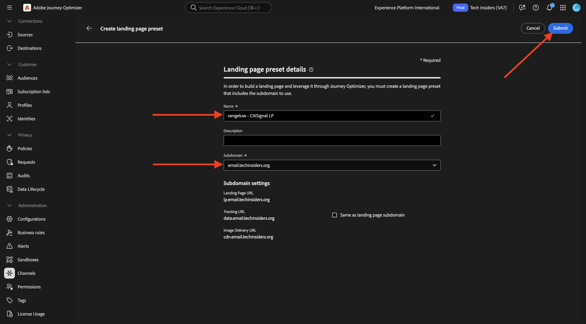

# 3.6.2 Landing Pages

Logga in på Adobe Journey Optimizer på [Adobe Experience Cloud](https://experience.adobe.com). Klicka på **Journey Optimizer**.

Du omdirigeras till vyn **Hem** i Journey Optimizer. Kontrollera först att du använder rätt sandlåda. Sandlådan som ska användas kallas `--aepSandboxName--`. Du kommer sedan att vara i vyn **Hem** i din sandlåda `--aepSandboxName--`.

## 3.6.2.1 prenumerationslistor

Landningssidor i Adobe Journey Optimizer fungerar tillsammans med **prenumerationslistor**. För att kunna konfigurera landningssidor måste du först konfigurera **prenumerationslistor**.

CitiSignal vill fråga sina kunder om deras intresse för följande domäner:

- Smart Home
- Arbeta hemifrån
- Onlinespel

När en kund har anmält sitt intresse för någon av dessa domäner, bör kunden läggas till i en viss lista så att den kan målinriktas med specifikt innehåll efteråt som en del av kommande kampanjer.

Du kommer nu att skapa 3 prenumerationslistor.

Gå till **Prenumerationslistor** på den vänstra menyn. Klicka på **Skapa prenumerationslista**.

Använd **för** Titel`--aepUserLdap--_SL_Interest_in_Smart_Home`.
Använd **för** Beskrivning`Interest in Smart Home`.

Klicka på **Skicka**.

Klicka på **Skapa prenumerationslista** om du vill skapa en annan lista.

Använd **för** Titel`--aepUserLdap--_SL_Interest_WFH`.
Använd **för** Beskrivning`Interest in Work From Home`.

Klicka på **Skicka**.

Klicka på **Skapa prenumerationslista** om du vill skapa en annan lista.

Använd **för** Titel`--aepUserLdap--_SL_Interest_Online_Gaming`.
Använd **för** Beskrivning`Interest in Online Gaming`.

Klicka på **Skicka**.

Du har nu skapat de tre listor du behöver.

## 3.6.2.2 förinställning för landningssida

För att kunna använda landningssidor i Adobe Journey Optimizer måste en förinställning skapas.

Gå till **Administration** > **Kanaler** på den vänstra menyn och välj sedan **Förinställningar för startsida**.

Klicka på **Skapa förinställning för landningssida**.

För fältet **Namn** använder du: `--aepUserLdap-- - CitiSignal LP` och väljer den underdomän som är tillgänglig i din instans.

>[!NOTE]
>
>Om du inte ser någon underdomän i din instans kontaktar du AJO-administratören för att få en.

Klicka på **Skicka**.

Din förinställning för landningssidan har nu skapats.

## Startsida för 3.6.2.3

Nu kan du skapa en landningssida. Gå till **Innehållshantering** > **Landing Pages** på den vänstra menyn.

Klicka på **Skapa landningssida**.

Använd **för fältet** Titel`vangeluw - CitiSignal Interests`. Välj sedan den **förinställning för landningssida** som du konfigurerade i föregående steg.

Klicka på **Skapa**.

Du borde se det här då.

Ändra fältet **Sidnamn** till `--aepUserLdap-- - CitiSignal Interests`.

Ange det här anpassade namnet under **Åtkomstinställningar**: `--aepUserLdap---citisignal-interests`.

Klicka på **Öppna Designer**.

Välj **Design från grunden**.

Du borde se det här då.

Lägg till en strukturkomponent **1:1 kolumn** på arbetsytan.

Lägg till innehållskomponenten **Form** på arbetsytan.

Uppdatera fältet **Etikett** för **Kryssruta 1** till `Keep me updated about CitiSignal's offering for Smart Home`.

Kontrollera att kryssrutan **Inaktivera om du har markerat** är aktiverad och att **prenumerationslista** är markerad.

Klicka sedan på **Välj prenumerationslista**.

Markera sedan listan `--aepUserLdap--_SL_Interest_in_Smart_Home` och klicka på **Välj**.

Klicka på **+ Lägg till fält** och välj sedan **Kryssruta**.

Du borde se det här då.

Uppdatera fältet **Etikett** för **Kryssruta 2** till `Keep me updated about CitiSignal's offering for Work From Home`.

Kontrollera att kryssrutan **Inaktivera om du har markerat** är aktiverad och att **prenumerationslista** är markerad.

Klicka sedan på **Välj prenumerationslista**.

Markera sedan listan `--aepUserLdap--_SL_Interest_WFH` och klicka på **Välj**.

Klicka på **+ Lägg till fält** och välj sedan **Kryssruta**.

Du borde se det här då.

Uppdatera fältet **Etikett** för **Kryssruta 3** till `Keep me updated about CitiSignal's offering for Online Gaming`.

Kontrollera att kryssrutan **Inaktivera om du har markerat** är aktiverad och att **prenumerationslista** är markerad.

Klicka sedan på **Välj prenumerationslista**.

Markera sedan listan `--aepUserLdap--_SL_Interest_Online_Gaming` och klicka på **Välj**.

Du borde se det här då.

Gå till formulärfältet **CALL TO ACTION**.

Uppdatera följande fält:

- **Text** - Knappetikett: `Save`.
- **Bekräftelseåtgärd**: välj **Bekräftelsetext**.
- **Bekräftelsetext**: använd: `Thanks for updating your preferences!`
- **Felåtgärd**: välj **Feltext**.
- **I feltexten**: använd: `There was an error updating your preferences.`

Klicka på **Spara** och sedan på pilen i det övre vänstra hörnet för att gå tillbaka till föregående skärm.

Klicka på **Publicera**.

Klicka på **Publicera** igen.

Din landningssida är nu publicerad och kan användas i ett e-postmeddelande.

## 3.6.2.4 Inkludera landningssida i e-post

I övning 3.1 skapade du en resa som kallas `--aepUserLdap-- - Registration Journey`.

Du bör nu uppdatera e-postmeddelandet under den resan så att det innehåller länken till landningssidan.

Gå till **Resor** på den vänstra menyn och klicka för att öppna resan `--aepUserLdap-- - Registration Journey`.

Klicka på **Mer..** och välj sedan **Skapa en ny version**.

Klicka på **Skapa en ny version**.

Klicka för att välja åtgärden **E-post** och välj sedan **Redigera innehåll**.

Klicka på **Redigera e-postbrödtext**.

Då borde du se något sådant här. Lägg till en ny strukturkomponent, **1:1, kolumn**, på arbetsytan.

Lägg till den nya innehållskomponenten **Text** i den strukturkomponent som skapades nyligen.

Klistra in följande text i innehållskomponenten **Text**.

`Would you like to hear from us about Smart Home news? Do you work from home and would you like to hear our tips? Or are you an avid online gamer and do you want to receive our game reviews? Click here to update your preferences and interests!`

Formatera texten så att den ser ut så här och markera sedan ordet `here`. Klicka på ikonen **link** .

Ange länkens **typ** till **landningssida** och ställ in fältet **Mål** till **Tom**.

Klicka på ikonen **redigera** för att markera den landningssida som ska länkas.

Välj landningssidan `--aepUserLdap-- - CitiSignal Interests`. Klicka på **Markera**.

Du borde se det här då. Klicka på **Spara**.

Klicka på pilen i det övre vänstra hörnet för att gå tillbaka till föregående skärm.

Klicka på pilen i det övre vänstra hörnet för att gå tillbaka till föregående skärm igen.

Klicka på **Spara**.

Klicka på **Publicera**.

Klicka på **Publicera** igen.

Ändringarna har publicerats och du kan testa din resa.

## 3.6.2.5 Testa din resa och landningssida

Gå till [https://dsn.adobe.com](https://dsn.adobe.com). När du har loggat in med din Adobe ID ser du det här. Klicka på de tre punkterna **..** i webbplatsprojektet och klicka sedan på **Kör** för att öppna det.

Du kommer då att se din demowebbplats öppnas. Markera URL-adressen och kopiera den till Urklipp.

Öppna ett nytt inkognito-webbläsarfönster.

Klistra in webbadressen till demowebbplatsen, som du kopierade i föregående steg. Du ombeds sedan logga in med din Adobe ID.

Välj kontotyp och slutför inloggningsprocessen.

Därefter visas webbplatsen i ett inkognitivt webbläsarfönster. För varje övning måste du använda ett nytt, inkognitivt webbläsarfönster för att läsa in webbadressen till demowebbplatsen. Gå till **Logga in**

Klicka på **SKAPA ETT KONTO**. Fyll i dina uppgifter och klicka på **Registrera**.

Du kommer nu att omdirigeras till hemsidan. Öppna profilvisarpanelen och gå till kundprofilen i realtid. På panelen Profilvisningsprogram ska du se alla dina personuppgifter visas, som dina nya e-post- och telefonidentifierare.

1 minut efter att du har skapat ditt konto får du ett e-postmeddelande från Adobe Journey Optimizer om att du har skapat kontot.

Klicka på länken i e-postmeddelandet för att uppdatera dina inställningar.

Du bör då se formuläret som du skapade. Aktivera några kryssrutor och klicka på **Spara**.

Därefter visas ett bekräftelsemeddelande.

## Rapportering av prenumerationslista för 3.6.2.6

Om du vill visa tillgängliga rapporter om prenumerationslistor går du till **Prenumerationslistor** på den vänstra menyn och klickar för att öppna en PDF-fil av de prenumerationslistor du konfigurerade tidigare.

Klicka på **Rapport**.

Du bör då se översikten över listan med det antal personer som har prenumererat eller avbrutit prenumerationen.

## Nästa steg

Gå till [3.6.3 AJO och GenStudio for Performance Marketing](./ex3.md)

Gå tillbaka till [Adobe Journey Optimizer: Innehållshantering](./ajocontent.md){target="_blank"}

Gå tillbaka till [Alla moduler](./../../../../overview.md){target="_blank"}
