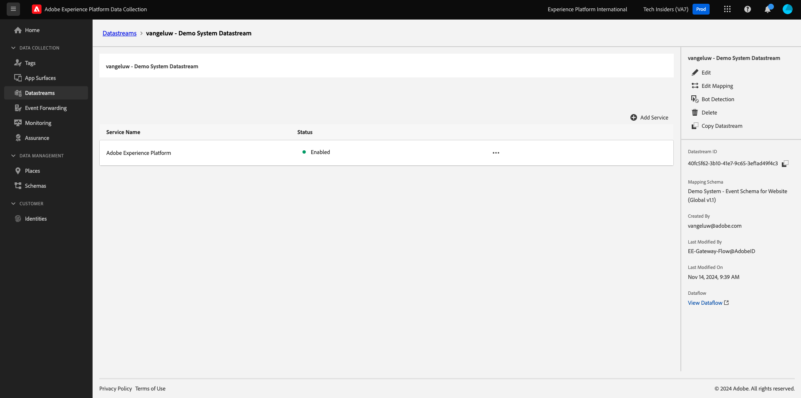

# 1.1.2 Edge Network, Datastreams och Server Side Data Collection

## Kontext

I den här övningen skapar du en **datastream**. En **datastream** anger för Adobe Edge Network-servrarna var data ska skickas när de har samlats in av Web SDK. Vill du till exempel skicka data till Adobe Experience Platform? Adobe Analytics? Adobe Audience Manager? Adobe Target?

Datastammar hanteras alltid i Experience Platform Data Collection-användargränssnittet och är viktiga för Experience Platform datainsamling med [Web SDK](https://experienceleague.adobe.com/sv/docs/experience-platform/web-sdk/home). Även om du implementerar Web SDK med en tagghanteringslösning som inte kommer från Adobe måste du ändå skapa en datastream.

Du kommer att implementera Web SDK i webbläsaren i nästa övning. Då blir det tydligare för er hur de data som samlas in ser ut. För närvarande berättar vi bara för datastream var vi ska vidarebefordra data.

## Skapa ett datastream

I [Komma igång](./../../../../modules/getting-started/gettingstarted/ex2.md) har du redan skapat en datastream, men vi har inte diskuterat bakgrunden och orsaken till varför du skapade den.

En [datastream](https://experienceleague.adobe.com/sv/docs/experience-platform/datastreams/overview) anger för Edge Network-servrarna var data ska skickas när de har samlats in av Web SDK. Mer information om var du kan skicka dina data via datastream finns i dokumentationen om [hur du lägger till tjänster i ett datastream](https://experienceleague.adobe.com/sv/docs/experience-platform/datastreams/configure#add-services).

Datastreams hanteras i användargränssnittet i Experience Platform Data Collection och är avgörande för datainsamling med Web SDK, oavsett om du implementerar Web SDK via Adobe Experience Platform Data Collection eller inte.

Vi granskar din **[!UICONTROL datastream]**:

Gå till [https://experience.adobe.com/launch/](https://experience.adobe.com/launch/).

Klicka på **[!UICONTROL Datastreams]** på den vänstra menyn.

Öppna ditt datastream med namnet `--aepUserLdap-- - Demo System Datastream`.

Då ser du detaljerna om din datastream.

Klicka på **..** bredvid **Adobe Experience Platform** och klicka på **Redigera**.

Då ser du det här. För tillfället har du bara aktiverat Adobe Experience Platform. Konfigurationen ser ut ungefär som i konfigurationen nedan. (Beroende på din miljö och Adobe Experience Platform-instans kan namnet på sandlådan vara ett annat)

Du bör tolka nedanstående fält så här:

För denna datastream...

- Alla data som samlas in lagras i sandlådan `--aepSandboxName--` i Adobe Experience Platform
- Alla Experience Event-data samlas som standard in i datauppsättningen **Demo System - Event Dataset för webbplatsen (Global v1.1)**
- Alla profildata samlas som standard in i datauppsättningen **Demo System - Profildatauppsättning för webbplats (Global v1.1)** (Inhämtning av profildata internt med Web SDK stöds för närvarande inte av Web SDK)
- Om du vill använda **Offer Decisioning**-programtjänsten för det här dataflödet måste du markera rutan för Offer Decisioning. (Detta ingår i [Modul 3.3](./../../../../modules/delivery-activation/ajo-b2c/ajob2c-3/offer-decisioning.md))
- **Edge-segmentering** är aktiverat som standard, vilket innebär att kvalificerade målgrupper utvärderas i kanten vid inkommande trafik
- Om du vill använda [personaliseringsmål](https://experienceleague.adobe.com/sv/docs/experience-platform/destinations/catalog/personalization/overview) markerar du kryssrutan för **Personalization-mål**.
- Om du vill använda **Adobe Journey Optimizer** s funktioner i det här datastream-objektet måste du markera kryssrutan för **Adobe Journey Optimizer**.

För närvarande behövs ingen annan konfiguration för din datastream.

## Nästa steg

Gå till [1.1.3 Introduktion till Adobe Experience Platform Data Collection](./ex3.md){target="_blank"}

Gå tillbaka till [Konfigurera Adobe Experience Platform Data Collection och taggtillägget Web SDK](./data-ingestion-launch-web-sdk.md){target="_blank"}

Gå tillbaka till [Alla moduler](./../../../../overview.md){target="_blank"}
