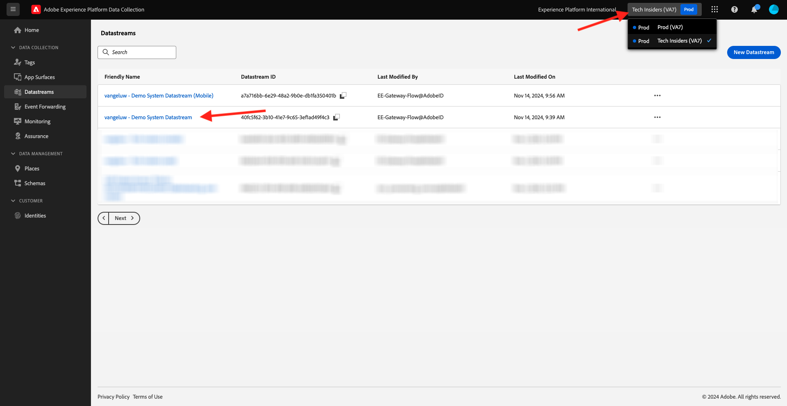
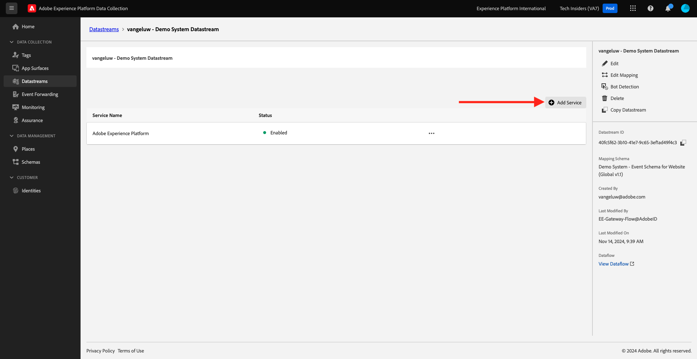

# 1.1.5 Implementera Adobe Analytics och Adobe Audience Manager

## Kontext

Du vet nu att XDM-data strömmar in på plattformen. Du kommer att utforska mer om vad XDM är i [Modul 1.2](./../dc1.2/data-ingestion.md) samt hur du skapar ett eget schema för att spåra anpassade variabler. Nu ska ni titta närmare på vad som händer när ni ställer in datastream för att vidarebefordra data till Analytics och Audience Manager.

## Mappa variabler i Analytics

Adobe Experience Platform [!DNL Web SDK] mappar vissa värden automatiskt, vilket gör en ny implementering av Analytics via Web SDK så snabbt som möjligt. De automatiskt mappade variablerna visas [här](https://experienceleague.adobe.com/docs/experience-platform/edge/data-collection/adobe-analytics/automatically-mapped-vars.html?lang=sv-SE#data-collection).

För XDM-data som inte automatiskt mappas till Adobe Analytics kan du använda [kontextdata](https://experienceleague.adobe.com/docs/analytics/implementation/vars/page-vars/contextdata.html?lang=sv) för att matcha ditt [schema](https://experienceleague.adobe.com/docs/experience-platform/xdm/schema/composition.html?lang=sv-SE). Sedan kan den mappas till Analytics med [bearbetningsregler](https://experienceleague.adobe.com/docs/analytics/admin/admin-tools/processing-rules/processing-rules-configuration/t-processing-rules.html?lang=sv-SE) för att fylla i Analytics-variabler. Kontextdata och bearbetningsregler kommer att vara välbekanta koncept som tidigare har fungerat med Analytics, men oroa dig inte för detaljerna just nu om de är nya koncept.

Du kan också använda en standarduppsättning med åtgärder och produktlistor för att skicka eller hämta data med AEP Web SDK. Mer information finns i [Produkter](https://experienceleague.adobe.com/docs/experience-platform/edge/data-collection/collect-commerce-data.html?lang=sv-SE#data-collection).

### Kontextdata

XDM-data förenklas med punktnotation och blir tillgängliga som `contextData` om de ska användas av Analytics. I följande lista över värdepar visas ett exempel på `context data`:

```javascript
{
    "bh": "900",
    "bw": "1680",
    "c": "24",
    "c.a.d.key.[0]": "value1",
    "c.a.d.key.[1]": "value2",
    "c.a.d.object.key1": "value1",
    "c.a.d.object.key2.[0]": "value2",
    "c.a.x.environment.browserdetails.javascriptenabled": "true",
    "c.a.x.environment.type": "browser",
    "cust_hit_time_gmt": "1579781427",
    "g": "http://example.com/home",
    "gn": "home",
    "j": "1.8.5",
    "k": "Y",
    "s": "1680x1050",
    "tnta": "218287:1:0|0,218287:1:0|2,218287:1:0|1,218287:1:0|32767,218287:1:01,218287:1:0|0,218287:1:0|1,218287:1:0|0,218287:1:0|1",
    "user_agent": "Mozilla/5.0 AppleWebKit/537.36 Safari/537.36",
    "v": "Y"
}
```

### Bearbetar regler

Alla data som samlas in av edge-nätverket kan nås via [bearbetningsregler](https://experienceleague.adobe.com/docs/analytics/admin/admin-tools/processing-rules/processing-rules-configuration/t-processing-rules.html?lang=sv-SE). I Analytics kan ni använda bearbetningsregler för att införliva kontextdata i Analytics-variabler.

## Audience Manager på Experience Platform Edge Network

Vidarebefordran på serversidan är inte ett nytt koncept för Audience Manager, och samma process som tidigare tillämpas. Du kan också synkronisera identiteter.

## Granska ditt datastream för att skicka data till Adobe Analytics

Följ de här stegen om du vill skicka data som samlats in av Web SDK till Adobe Analytics och Adobe Audience Manager.

Gå till [https://experience.adobe.com/launch/](https://experience.adobe.com/launch/) och gå till **Datastreams**.

I skärmens övre högra hörn väljer du namnet på sandlådan, som ska vara `--aepSandboxName--`. Öppna den specifika datastream som heter `--aepUserLdap-- - Demo System Datastream`.



Då ser du det här. Klicka på **Lägg till tjänst** om du vill aktivera Adobe Analytics.



Då ser du det här. Markera tjänsten **Adobe Analytics**, därefter måste du lägga till rapportsviten i Adobe Analytics för att skicka data till. I den här självstudiekursen ligger detta utanför omfånget. Klicka på **Avbryt**.


## Granska ditt datastream för att skicka data till Adobe Audience Manager

Då ser du det här. Klicka på **Lägg till tjänst** om du vill aktivera Adobe Audience Manager.


Då ser du det här. Välj tjänsten **Adobe Audience Manager** efter vilken du kan aktivera eller inaktivera Adobe Audience Manager cookie-mål och/eller URL-mål. I den här självstudiekursen ligger konfigurationen utanför omfånget. Klicka på **Avbryt**.


## Nästa steg

Gå till [1.1.6 Implementera Adobe Target](./ex6.md){target="_blank"}

Gå tillbaka till [Konfigurera Adobe Experience Platform Data Collection och taggtillägget Web SDK](./data-ingestion-launch-web-sdk.md){target="_blank"}

Gå tillbaka till [Alla moduler](./../../../../overview.md){target="_blank"}
