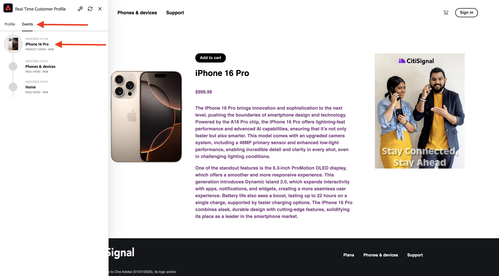

# 1.2.1 Från okänd till känd på webbplatsen

## Kontext

Resan från okänd till känd är en av de viktigaste ämnena bland varumärken nuförtiden, liksom kundresan från förvärv till lojalitet.

Adobe Experience Platform spelar en mycket viktig roll på den här resan. Plattformen är hjärnan för kommunikation, det upplevelsesystem som finns.

Plattformen är en miljö där ordet **customer** är bredare än bara de **kända**-kunderna. Detta är en mycket viktig sak att nämna när man talar till varumärken: en okänd besökare på webbplatsen är också en kund ur plattformens perspektiv, och som sådan skickas också allt beteende som en okänd besökare till Platform. Tack vare den metoden kan ett varumärke, när kunden så småningom blir en känd kund, även visualisera det som hände före den tidpunkten. Detta bidrar till att optimera attribuering och upplevelser.

## Vad ska du göra?

Du kommer nu att importera data till Adobe Experience Platform och dessa data kommer att länkas till identifierare som ECID och e-postadresser. Målet med detta är att förstå företagssammanhanget för vad du ska göra ur ett konfigurationsperspektiv. I nästa övning kommer du att börja konfigurera allt du behöver för att göra all datainmatning möjlig i din egen sandlådemiljö.

### Kundreseflöde

Gå till [https://dsn.adobe.com](https://dsn.adobe.com). När du har loggat in med din Adobe ID ser du det här. Klicka på de tre punkterna **..** i webbplatsprojektet och klicka sedan på **Kör** för att öppna det.

Du kommer då att se din demowebbplats öppnas. Markera URL-adressen och kopiera den till Urklipp.

Öppna ett nytt inkognito-webbläsarfönster.

Klistra in webbadressen till demowebbplatsen, som du kopierade i föregående steg. Du ombeds sedan logga in med din Adobe ID.

Välj kontotyp och slutför inloggningsprocessen.

Därefter visas webbplatsen i ett inkognitivt webbläsarfönster. För varje demonstration måste du använda ett nytt, inkognitivt webbläsarfönster för att läsa in webbadressen till demowebbplatsen.

Klicka på ikonen för Adobe logotyp i det övre vänstra hörnet av skärmen för att öppna profilvisningsprogrammet.

Ta en titt på panelen Profilvisningsprogram och kundprofilen i realtid med **Experience Cloud-id** som primär identifierare för den okända kunden.

Ni kan också se alla upplevelsehändelser som samlats in baserat på kundens beteende. Listan är för närvarande tom, men den ändras snart.

Gå till produktkategorin **Telefoner och enheter**. Klicka sedan på produkten **iPhone 15 Pro**.

Då visas informationssidan för produkten. En Experience Event av typen **Product View** har nu skickats till Adobe Experience Platform med den Web SDK-implementering som du granskade i den tidigare modulen.

Öppna panelen Profilvisningsprogram och titta på dina **Experience Events**.

>[!NOTE]
>
>Uppdatera sidan om du inte ser att händelsen visas omedelbart.

Gå tillbaka till kategorisidan **Telefoner och enheter** och klicka på en annan produkt. En annan Experience Event har skickats till Adobe Experience Platform.

Öppna panelen Profilvisningsprogram. Nu visas 2 Experience Events av typen **Product View**. Beteendet är anonymt, men med rätt samtycke kan vi spåra varje klick och lagra det i Adobe Experience Platform. När den anonyma kunden blir känd kan vi automatiskt sammanfoga alla anonyma beteenden med kunskapsprofilen.

Klicka på **Logga in** för att gå till sidan Register/Inloggning.

Klicka på **Skapa ett konto**.

Fyll i dina uppgifter och klicka på **Registrera**. Sedan dirigeras du om till föregående sida.

Öppna profilvisarpanelen och gå till kundprofilen i realtid. På panelen Profilvisningsprogram ska du se alla dina personuppgifter visas, som dina nya e-post- och telefonidentifierare.

Gå till Experience Events på panelen Profilvisningsprogram. Du kan se de två produkterna som du har visat tidigare på panelen Profilvisningsprogram. Båda dessa händelser är nu också anslutna till din&quot;kända&quot; profil.

Du har nu importerat data till Adobe Experience Platform och du har länkat dessa data till identifierare som ECID och e-postadresser. Målet med detta är att förstå affärssammanhanget för det ni ska göra. I nästa övning kommer du att börja konfigurera allt du behöver för att göra all den dataimporten möjlig.

## Nästa steg

Gå till [1.2.2 Konfigurera scheman och ange identifierare](./ex2.md){target="_blank"}

Gå tillbaka till [datainmatning](./data-ingestion.md){target="_blank"}

Gå tillbaka till [Alla moduler](./../../../../overview.md){target="_blank"}
