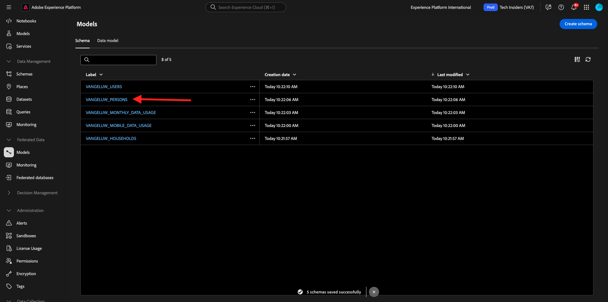
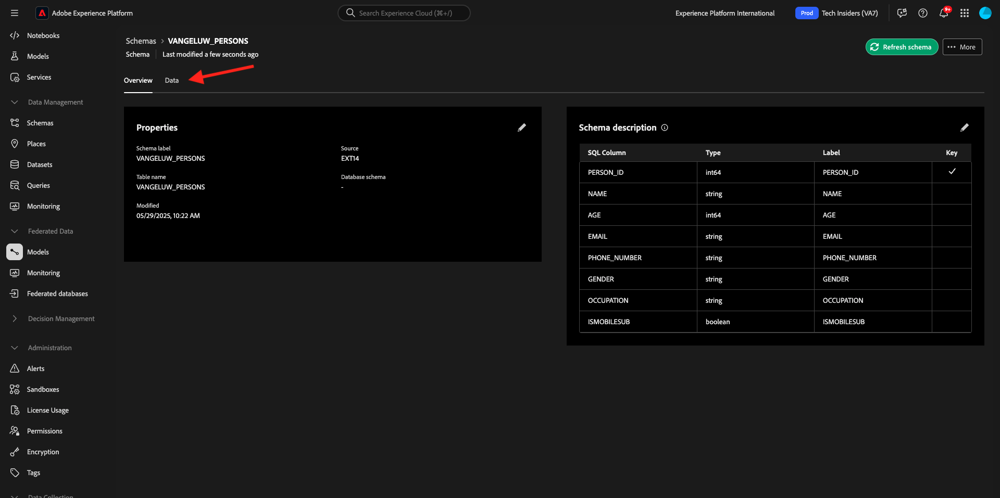
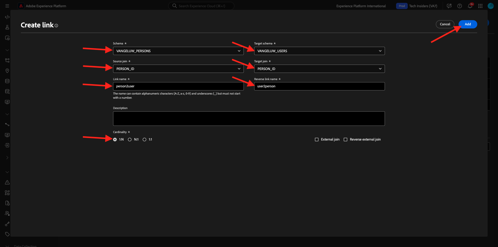
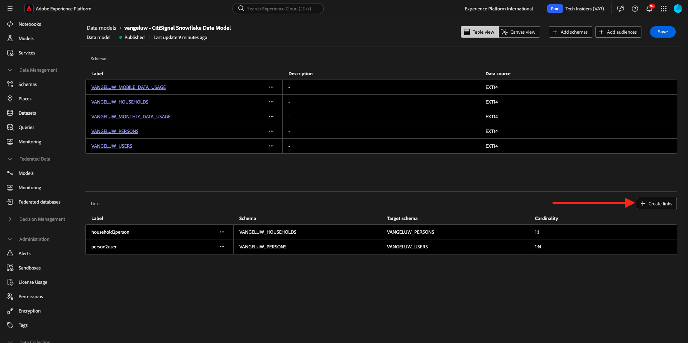

# 1.3.2 Skapa scheman, datamodell och länkar

Nu kan du konfigurera din federerade databas i Adobe Experience Platform.

Logga in på Adobe Experience Platform via följande URL: [https://experience.adobe.com/platform](https://experience.adobe.com/platform).

När du har loggat in loggar du in på Adobe Experience Platform hemsida.

Innan du fortsätter måste du välja en **sandlåda**. Sandlådan som ska markeras har namnet `--aepSandboxName--`. När du har valt rätt sandlåda ser du skärmändringen och nu befinner du dig i din dedikerade sandlåda.

## 1.3.2.1 Konfigurera en Federated databas i AEP

Klicka på **Federated databaser** på den vänstra menyn. Klicka sedan på **Lägg till federerad databas**.

Använd **Label** som `--aepUserLdap-- - CitiSignal Snowflake` och välj **Snowflake** som typ.

Under Mer information måste du fylla i dina inloggningsuppgifter, som ser ut så här:

**Server**:

Gå till **Admin > Konton** i Snowflake. Klicka på den 3 **..** bredvid ditt konto och klicka på **Hantera URL:er**.

Då ser du det här. Kopiera den **aktuella URL:en** och klistra in den i fältet **Server** i AEP.

**Användare**: användarnamnet som du skapade tidigare i övningen 1.3.1.1
**Lösenord**: det lösenord du skapade tidigare i övning 1.3.1.1
**Database**: use **CITISIGNAL**

Till slut borde du ha den här. Klicka på **Testa anslutning**. Om testet lyckas klickar du på **Distribuera funktioner**, som skapar funktioner på Snowflake-sidan som är nödvändiga för arbetsflödesmotorn.

När anslutningen har testats och funktioner har distribuerats lagras konfigurationen.

När du sedan går tillbaka till menyn **Federerade databaser** visas anslutningen där.

## 1.3.2.2 Skapa scheman i AEP

Klicka på **Modeller** på den vänstra menyn och gå sedan till **Scheman**. Klicka på **Skapa schema**.

Välj din federerade databas och klicka på **Nästa**.

Då ser du det här. Markera de fem tabeller du har skapat i Snowflake tidigare:

- `--aepUserLdap--_HOUSEHOLDS`
- `--aepUserLdap--_MOBILE_DATA_USAGE`
- `--aepUserLdap--_MONTHLY_DATA_USAGE`
- `--aepUserLdap--_PERSONS`
- `--aepUserLdap--_USERS`

Klicka på **Nästa**.

AEP läser sedan in informationen för varje tabell och visar den i användargränssnittet.

För varje tabell kan du:

- ändra schemats etikett
- lägg till en beskrivning
- byta namn på alla fält och ange deras synlighet
- välj primärnyckel för schemat

För denna övning behövs inga ändringar.

Klicka på **Klar**.

Då ser du det här. Du kan klicka på ett schema och granska informationen. Klicka till exempel på **`--aepUserLdap--_PERSONS`**.

Du kommer då att se detta med möjlighet att redigera konfigurationen. Klicka på **Data** om du vill visa ett exempel på data som finns i Snowflake-databasen.

Sedan visas ett exempel på data. Dessa data läses in direkt från Snowflake och lagras inte i AEP.

## 1.3.2.3 Skapa en modell i AEP

Gå till **Modeller** på den vänstra menyn och gå sedan till **Datamodell**. Klicka på **Skapa datamodell**.

Använd `--aepUserLdap-- - CitiSignal Snowflake Data Model` för etiketten. Klicka på **Skapa**.

Klicka på **Lägg till scheman**.

Markera dina scheman och klicka på **Lägg till**.

Då ser du det här. Klicka på **Spara**.

### PERSONER - ANVÄNDARE

Nu kan du börja definiera länkar mellan scheman. Om du vill börja definiera en länk måste du klicka på **Skapa länkar**.

Först måste du definiera länken mellan tabellen `--aepUserLdap--_USERS` och `--aepUserLdap--_PERSONS`.

Klicka på **Lägg till**.

### HUSHÅLL - PERSONER

Du kommer då tillbaka hit. Klicka på **Skapa länkar** om du vill skapa en annan länk.

Därefter måste du definiera länken mellan tabellen `--aepUserLdap--_HOUSEHOLDS` och `--aepUserLdap--_PERSONS`.

Klicka på **Lägg till**.

### ANVÄNDARE - MONTHLY_DATA_USAGE

Du kommer då tillbaka hit. Klicka på **Skapa länkar** om du vill skapa en annan länk.

Därefter måste du definiera länken mellan tabellen `--aepUserLdap--_USERS` och `--aepUserLdap--_MONTHLY_DATA_USAGE`.

Klicka på **Lägg till**.

### ANVÄNDARE - HUSHÅLL

Du kommer då tillbaka hit. Klicka på **Skapa länkar** om du vill skapa en annan länk.

Därefter måste du definiera länken mellan tabellen `--aepUserLdap--_USERS` och `--aepUserLdap--_HOUSEHOLDS`.

Klicka på **Lägg till**.

### ANVÄNDARE - MOBILE_DATA_USAGE

Du kommer då tillbaka hit. Klicka på **Skapa länkar** om du vill skapa en annan länk.

Därefter måste du definiera länken mellan tabellen `--aepUserLdap--_USERS` och `--aepUserLdap--_MOBILE_DATA_USAGE`.

Klicka på **Lägg till**.

Du borde se det här då. Klicka på **Spara**.

Konfigurationen av din Federated Database i Adobe Experience Platform är nu klar. Nu kan ni börja använda era federerade data i en federerad målgruppskomposition.

## Nästa steg

Gå till [1.3.3 Skapa en federerad komposition](./ex3.md){target="_blank"}

Gå tillbaka till [Sammansatt målgrupp](./fac.md){target="_blank"}

Gå tillbaka till [Alla moduler](./../../../../overview.md){target="_blank"}
