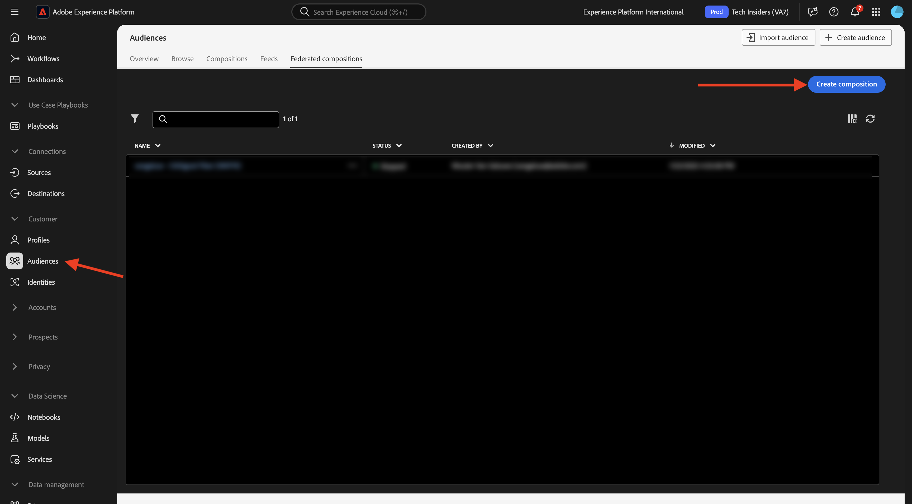

# 1.3.3 Skapa en federerad komposition

Nu kan ni konfigurera er sammanslagna målgruppskomposition i AEP.

Logga in på Adobe Experience Platform via följande URL: [https://experience.adobe.com/platform](https://experience.adobe.com/platform).

När du har loggat in loggar du in på Adobe Experience Platform hemsida.

Innan du fortsätter måste du välja en **sandlåda**. Sandlådan som ska markeras har namnet `--aepSandboxName--`. När du har valt rätt sandlåda ser du skärmändringen och nu befinner du dig i din dedikerade sandlåda.

## 1.3.3.1 Skapa din publik

Gå till **Publiker** på den vänstra menyn och gå sedan till **Federerade kompositioner**. Klicka på **Skapa komposition**.

Använd följande för etiketten: `--aepUserLdap-- - CitiSignal Fiber`. Markera datamodellen som du skapade i föregående övning, som har namnet `--aepUserLdap-- - CitiSignal Snowflake Data Model`. Klicka på **Skapa**.

Då ser du det här.

Klicka på ikonen **+** och klicka på **Skapa målgrupp**.

Då ser du det här. Välj **Skapa målgrupp**. Klicka på ikonen **sök** för att välja ett schema.

Välj schemat **`--aepUserLdap--_HOUSEHOLDS`**. Klicka på **Bekräfta**.

Klicka sedan på **Fortsätt**.

Nu kan du börja skapa frågan som ska skickas till Snowflake. Klicka på ikonen **+** och sedan på **Anpassat villkor**.

Markera attributet **ISELIGIBLEFORFIBER** och klicka på **Bekräfta**.

Då ser du det här. Ange fältet **Värde** som **Sant**. Klicka på **Beräkna** om du vill skicka frågan till Snowflake och få en uppskattning av de profiler som nu är kvalificerade.

Klicka sedan på ikonen **+** igen och klicka på **Anpassat villkor** igen för att lägga till ett annat villkor.

Det andra villkoret som ska läggas till är: `Is the user an existing CitiSignal Mobile subscriber?`. Du kan besvara den frågan genom att använda relationen mellan hushållet och den primära kunden i hushållet, som definieras i en annan tabell, **`--aepUserLdap--_PERSONS`**. Du kan detaljgranska på attributmenyn med länken **house2person** .

Markera attributet **ISMOBILESUB** och klicka på **Bekräfta**.

Ställ in fältet **Värde** till **Sant** Klicka på **Beräkna** igen för att uppdatera antalet profiler som ska användas. Klicka på **Bekräfta**.

Klicka på ikonen **+** och sedan på **Spara publik**.

Ställ in **publiketiketten** på `--aepUserLdap-- - CitiSignal Eligible for Fiber`.

Klicka på **+ Lägg till målgruppsmappning**.

Välj **HOUSEHOLD_ID** och klicka på **Bekräfta**.

Klicka på **+ Lägg till målgruppsmappning**.

Detaljgranska genom att klicka på **Måldimension**.

Granska genom att klicka på länken **house2person**.

Markera fältet **NAME**. Klicka på **Bekräfta**.

Klicka på **+ Lägg till målgruppsmappning**.

Detaljgranska genom att klicka på **Måldimension**.

Granska genom att klicka på länken **house2person**.

Markera fältet **EMAIL**. Klicka på **Bekräfta**.

Då ser du det här. Du måste nu ange fältet **Primär identitet** och ställa in det på **Household2person_EMAIL**. Ange **Identity Namespace** till **Email**.

Klicka på **Spara**.

Din komposition är nu färdig. Klicka på **Start** för att köra den.

Frågan kommer nu att laddas ned till Snowflake, som kommer att fråga källdata där. Resultatet överförs tillbaka till AEP, men källdata finns kvar i Snowflake.

Publiken är nu befolkad och målgruppen kan målgruppsanpassas inifrån AEP ekosystem.

## Nästa steg

Gå till [Sammanfattning och förmåner](./summary.md){target="_blank"}

Gå tillbaka till [Sammansatt målgrupp](./fac.md){target="_blank"}

Gå tillbaka till [Alla moduler](./../../../../overview.md){target="_blank"}
