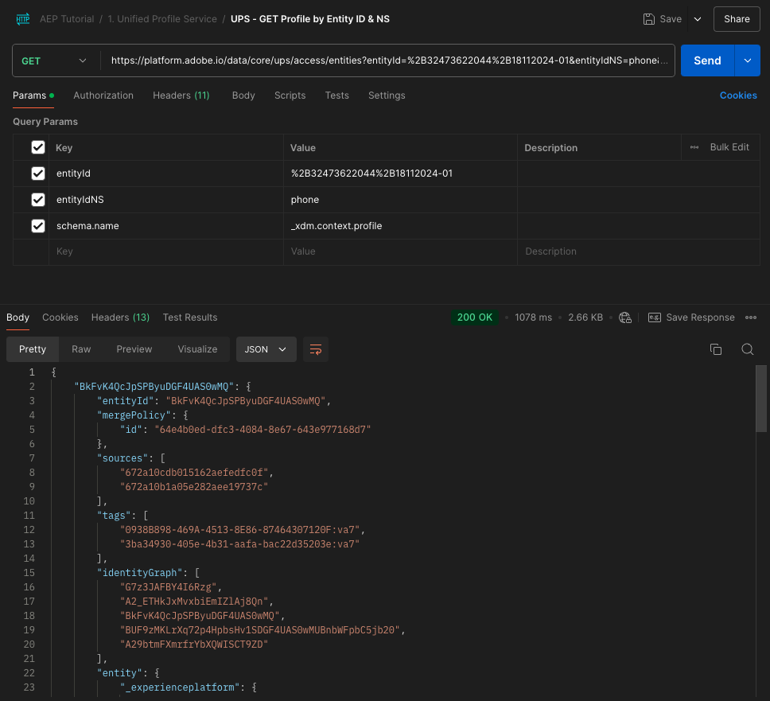
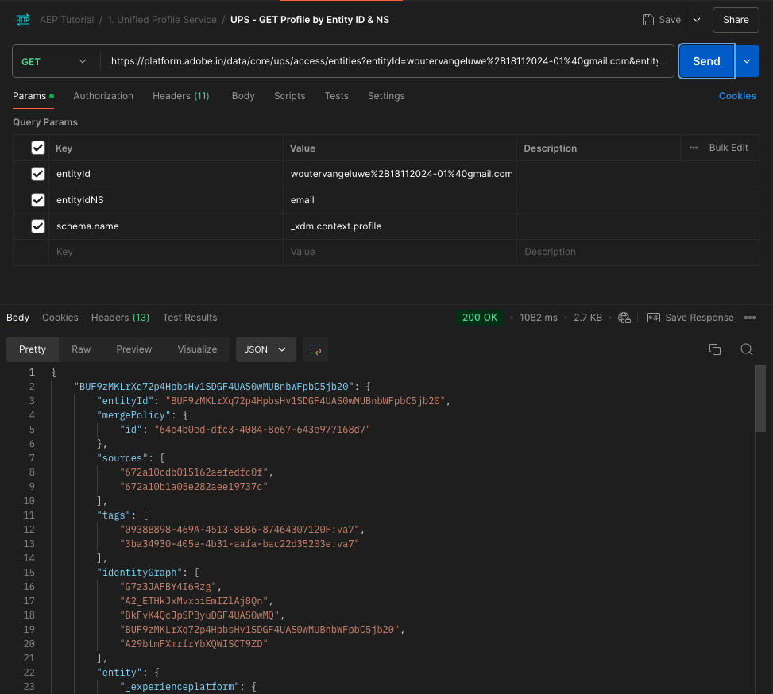

# 2.1.3 Visualisera din egen kundprofil i realtid - API

I den här övningen använder du Postman och Adobe I/O för att fråga Adobe Experience Platform API:er för att visa din egen kundprofil i realtid.

## Kontext

I kundprofilen i realtid visas alla profildata tillsammans med händelsedata samt befintliga målgruppsmedlemskap. De data som visas kan komma var som helst, från Adobe-program och externa lösningar. Detta är den mest kraftfulla vyn i Adobe Experience Platform, det upplevelsesystem som finns.

Kundprofilen i realtid kan användas av alla Adobe-program, men även av externa lösningar som Call Centers eller appar för kundanpassning i butiken. Detta gör du genom att koppla dessa externa lösningar till Adobe Experience Platform API:er.

## Dina identifierare

På panelen Profilvisningsprogram på webbplatsen kan du hitta flera identiteter. Alla identiteter är länkade till ett namnutrymme.


På X-ray-panelen ser vi fyra olika kombinationer av ID:n och namnutrymmen:

| Identitet | Namnutrymme |
|:-------------:| :---------------:|
| Experience Cloud ID (ECID) | 79943948563923140522865572770524243489 |
| Experience Cloud ID (ECID) | 70559351147248820114888181867542007989 |
| E-post-ID | woutervangeluwe+18112024-01@gmail.com |
| Mobilnummer-ID | +32473622044+18112024-01 |

Kom ihåg dessa identifierare för nästa steg.

## Konfigurera Adobe I/O Project

I den här övningen kommer du att använda Adobe I/O intensivt för att ställa frågor mot plattformens API:er. Följ stegen nedan för att konfigurera Adobe I/O.

Gå till [https://developer.adobe.com/console/home](https://developer.adobe.com/console/home)


Se till att du väljer rätt Adobe Experience Platform-instans i skärmens övre högra hörn. Din instans är `--aepImsOrgName--`. Klicka på **Skapa nytt projekt**.


Välj **+ Lägg till i projekt** och välj **API**.


Då ser du det här:


Välj **Experience Platform API** och klicka på **Nästa**.


Du kommer att se det här. Ange ett namn för dina autentiseringsuppgifter: `--aepUserLdap-- - OAuth credential`. Klicka på **Nästa**.


Därefter måste du välja en produktprofil som definierar vilka behörigheter som är tillgängliga för den här integreringen.

Välj önskade produktprofiler.

>[!NOTE]
>
> Produktprofilnamnen varierar i din Adobe Experience Platform-instans eftersom de är instansspecifika. Du måste välja minst en produktprofil med rätt åtkomsträttigheter, som har konfigurerats i Adobe Admin Console och gränssnittet för AEP-behörigheter.

Klicka på **Spara konfigurerat API**.


Nu är Adobe I/O-integreringen klar.


Klicka på knappen **Hämta för Postman** och klicka sedan på **OAuth Server-to-Server** för att hämta en Postman-miljö (vänta tills miljön har hämtats, detta kan ta några sekunder).


IO-projektet har för närvarande ett generiskt namn. Du måste ge integreringen ett eget namn. Klicka på **Projekt X** (eller liknande namn) som anges


Klicka på **Redigera projekt**.


Ange ett namn och en beskrivning för din integrering: `--aepUserLdap-- AEP Tutorial`.

Klicka på **Spara**.


Integreringen med Adobe I/O är nu klar.


>[!NOTE]
>
>Det finns ytterligare ett steg som säkerställer att det här Adobe I/O-projektet har åtkomst till Adobe Experience Platform behörighetsinställningar. API-autentiseringsuppgifterna för ditt projekt måste läggas till i Behörighetsgränssnittet för Adobe Experience Platform, som systemadministratörsbehörighet krävs för. Stegen beskrivs nedan, men du kan behöva kontakta din systemadministratör för att få detta bearbetat åt dig ifall du inte har de behörigheter som krävs.

## AEP-behörigheter för API-autentiseringsuppgifter

>[!IMPORTANT]
>
>Om du inte har behörighet för systemadministratörsåtkomst kan du inte utföra det här steget själv och du har inte behörighet att komma åt användargränssnittet för **Behörigheter**. Kontakta då systemadministratören eller lägg upp din fråga i organisationens supportkanal.

Gå till [Adobe Experience Platform](https://experience.adobe.com/platform). När du har loggat in loggar du in på Adobe Experience Platform hemsida.

Gå till **Behörigheter**, till **Roller** och klicka på den relevanta produktprofilen.

>[!NOTE]
>
> Produktprofilnamnen varierar i din Adobe Experience Platform-instans eftersom de är instansspecifika. Du måste välja minst en produktprofil med rätt åtkomsträttigheter, som har konfigurerats i Adobe Admin Console och gränssnittet för AEP-behörigheter.


Klicka på **API-autentiseringsuppgifter**.


Klicka på **+ Lägg till API-autentiseringsuppgifter**.


Markera det nya Adobe I/O-projektet och klicka på **Spara**.


## Autentisering till Adobe I/O

>[!IMPORTANT]
>
>Om du är Adobe-anställd följer du instruktionerna här för att använda [PostBuster](./../../../../modules/getting-started/gettingstarted/ex8.md).

Gå till [https://www.postman.com/downloads/](https://www.postman.com/downloads/).

Hämta och installera den aktuella versionen av Postman för ditt operativsystem.


Starta programmet när du har installerat Postman.

I Postman finns det två koncept: Miljö och Samlingar.

- Miljön innehåller alla dina miljövariabler som är mer eller mindre konsekventa. I miljön hittar du saker som IMSOrg i vår plattformsmiljö, tillsammans med säkerhetsreferenser som din privata nyckel och andra. Miljöfilen är den som du hämtade under Adobe I/O-konfigurationen i den tidigare övningen. Den har följande namn: **`oauth_server_to_server.postman_environment.json`**.

- Samlingen innehåller ett antal API-begäranden som du kan använda. Vi kommer att använda 2 samlingar
   - 1 Collection for Authentication to Adobe I/O
   - 1 Samling för övningar i denna modul
   - 1 samling för övningarna i Real-Time CDP-modulen, för målredigering

Hämta filen [postman.zip](./../../../../assets/postman/postman_profile.zip) till ditt lokala skrivbord.

I den här **postman.zip**-filen hittar du följande filer:

- `Adobe IO - OAuth.postman_collection.json`
- `AEP Tutorial.postman_collection.json`
- `Destination_Authoring_API.json`

Zippa upp filen **postman.zip** och lagra dessa tre filer i en mapp på skrivbordet tillsammans med den hämtade Postman-miljön från Adobe I/O. Du måste ha dessa fyra filer i den mappen:


Gå tillbaka till Postman. Klicka på **Importera**.


Klicka på **filer**.


Navigera till den mapp på skrivbordet där du extraherade de 4 hämtade filerna. Markera de här fyra filerna samtidigt och klicka på **Öppna**.


När du har klickat på **Öppna** visas en översikt i Postman över miljön och de samlingar du håller på att importera. Klicka på **Importera**.


Nu har du allt du behöver i Postman för att börja interagera med Adobe Experience Platform via API:erna.

Det första du behöver göra är att se till att du är rätt autentiserad. Du måste begära en åtkomsttoken för att kunna autentiseras.

Kontrollera att du har valt rätt miljö innan du kör någon begäran. Du kan kontrollera den valda miljön genom att verifiera listrutan Miljö i det övre högra hörnet.

Den valda miljön bör ha ett namn som liknar det här, `--aepUserLdap-- OAuth Credential`.


Din Postman-miljö och dina samlingar är nu konfigurerade och fungerar. Nu kan du autentisera från Postman till Adobe I/O.

I samlingen **Adobe IO - OAuth** markerar du begäran med namnet **POST - Get Access Token**. Klicka på **Skicka**.


Efter några sekunder bör du se ett svar i avsnittet **Brödtext** i Postman:


Om konfigurationen lyckades bör du se ett liknande svar som innehåller följande information:

| Nyckel | Värde |
|:-------------:| :---------------:| 
| token_type | **bärare** |
| access_token | **eyJhbGciOiJSU...jrNZ6mdaQ** |
| förfaller_in | **86399** |

Adobe I/O har gett dig en **innehavartoken**, med ett specifikt värde (den mycket långa åtkomsttoken) och ett giltighetsfönster.

Den token vi har fått gäller nu i 24 timmar. Det innebär att om du efter 24 timmar vill använda Postman för att autentisera till Adobe I/O måste du generera en ny token genom att köra denna begäran igen.

## Kundprofil-API i realtid, schema: profil

Nu kan du skicka din första förfrågan till plattformens API:er för kundprofiler i realtid.

Leta reda på samlingen **AEP Tutorial** i Postman.


I **1. Enhetlig profiltjänst**, klicka på den första begäran med namnet **UPS - GET-profil av enhets-ID &amp; NS**.


Det finns tre obligatoriska variabler för denna begäran:

| Nyckel | Värde | Definition |
|:-------------:| :---------------:| :---------------:| 
| entityId | **id** | det specifika kund-ID |
| entityIdNS | **namnområde** | det specifika namnutrymmet som gäller för ID:t |
| schema.name | **_xdm.context.profile** | det specifika schema som du vill få information om |

Om du vill be Adobe Experience Platform API:er att ge dig all profilinformation för ditt eget ECID måste du konfigurera begäran enligt följande:

| Nyckel | Värde |
|:-------------:| :---------------:| 
| entityId | **dittECID** |
| entityIdNS | **ecid** |
| schema.name | **_xdm.context.profile** |


Du bör även verifiera fälten **Header** - i din begäran. Gå till **Sidhuvuden**. Då ser du det här:


>[!NOTE]
>
>Du måste ange namnet på den Adobe Experience Platform-sandlåda som du använder. Ditt x-sandbox-namn ska vara `--aepSandboxName--`.

| Nyckel | Värde |
| ----------- | ----------- |
| x-sandbox-name | `--aepSandboxName--` |


När du har kontrollerat namnet på sandlådan klickar du på **Skicka** för att skicka din begäran till plattformen.

Du borde få ett omedelbart svar från Platform, som visar dig något sådant:


Detta är det fullständiga svaret från Platform:

```javascript
{
    "A2_ETHkJxMvxbiEmIZlAj8Qn": {
        "entityId": "A2_ETHkJxMvxbiEmIZlAj8Qn",
        "mergePolicy": {
            "id": "64e4b0ed-dfc3-4084-8e67-643e977168d7"
        },
        "sources": [
            "672a10cdb015162aefedfc0f",
            "672a10b1a05e282aee19737c"
        ],
        "tags": [
            "0938B898-469A-4513-8E86-87464307120F:va7",
            "3ba34930-405e-4b31-aafa-bac22d35203e:va7"
        ],
        "identityGraph": [
            "G7z3JAFBY4I6Rzg",
            "A2_ETHkJxMvxbiEmIZlAj8Qn",
            "BkFvK4QcJpSPByuDGF4UAS0wMQ",
            "BUF9zMKLrXq72p4HpbsHv1SDGF4UAS0wMUBnbWFpbC5jb20",
            "A29btmFXmrfrYbXQWISCT9ZD"
        ],
        "entity": {
            "_experienceplatform": {
                "identification": {
                    "core": {
                        "ecid": "79943948563923140522865572770524243489",
                        "phoneNumber": "+32473622044+18112024-01",
                        "email": "woutervangeluwe+18112024-01@gmail.com"
                    }
                }
            },
            "userAccount": {
                "ID": "3688250"
            },
            "pushNotificationDetails": [
                {
                    "denylisted": false,
                    "token": "2E0945F186CE5ED8CBFD1EB519A8CF38BA2B28A67FB381D45AA15EE37D289214",
                    "identity": {
                        "namespace": {
                            "code": "ECID"
                        },
                        "id": "70559351147248820114888181867542007989"
                    },
                    "platform": "apns",
                    "appID": "com.adobe.demosystem.dxdemo"
                }
            ],
            "personalEmail": {
                "address": "woutervangeluwe+18112024-01@gmail.com"
            },
            "_repo": {
                "createDate": "2024-11-18T10:39:12.296Z"
            },
            "extSourceSystemAudit": {
                "lastUpdatedDate": "2024-11-19T07:46:52.001Z"
            },
            "testProfile": true,
            "mobilePhone": {
                "number": "+32473622044"
            },
            "consents": {
                "metadata": {
                    "time": "2024-11-19T07:46:52.001Z"
                },
                "idSpecific": {
                    "ECID": {
                        "70559351147248820114888181867542007989": {
                            "collect": {
                                "val": "y"
                            }
                        }
                    }
                }
            },
            "person": {
                "name": {
                    "lastName": "Van Geluwe",
                    "firstName": "Wouter"
                }
            },
            "userActivityRegions": {
                "IRL1": {
                    "captureTimestamp": "2024-11-19T07:46:51.239Z"
                }
            },
            "identityMap": {
                "ecid": [
                    {
                        "id": "70559351147248820114888181867542007989"
                    },
                    {
                        "id": "79943948563923140522865572770524243489"
                    }
                ],
                "email": [
                    {
                        "id": "woutervangeluwe+18112024-01@gmail.com"
                    }
                ],
                "phone": [
                    {
                        "id": "+32473622044+18112024-01"
                    }
                ],
                "userid": [
                    {
                        "id": "3688250"
                    }
                ]
            }
        },
        "lastModifiedAt": "2024-11-19T07:47:23Z"
    }
}
```

Detta är för närvarande alla tillgängliga profildata i Platform för detta ECID.

Du behöver inte använda ECID för att begära profildata från plattformens kundprofil i realtid. Du kan använda valfritt ID i valfritt namnområde för att begära dessa data.

Vi går tillbaka till Postman och låtsas att vi är callcenter och skickar en begäran till Platform som anger namnområdet för **Phone** och ditt mobilnummer.

Om du vill be plattformens API:er att ge dig all profilinformation för en viss telefon måste du konfigurera begäran enligt följande:

| Nyckel | Värde |
|:-------------:| :---------------:| 
| entityId | **ditt telefonnummer** |
| entityIdNS | **telefon** (ersätt ecid med telefon) |
| schema.name | **_xdm.context.profile** |

Om ditt telefonnummer innehåller specialsymboler som **+** måste du välja ditt fullständiga telefonnummer, högerklicka och klicka på **EncodeURIComponent**.


Då får du den här:


Du bör även verifiera fälten **Header** - i din begäran. Gå till **Sidhuvuden**. Då ser du det här:


>[!NOTE]
>
>Du måste ange namnet på den Adobe Experience Platform-sandlåda som du använder. Ditt x-sandbox-namn ska vara `--aepSandboxName--`.

| Nyckel | Värde |
| ----------- | ----------- |
| x-sandbox-name | `--aepSandboxName--` |


Klicka på **Skicka** och verifiera svaret. Du kommer att se att det är samma som tidigare när du använde ECID som identitet.



Låt oss göra samma sak med din e-postadress genom att ange namnutrymmet för **email** och din e-postadress.

Om du vill be plattformens API:er att ge dig all profilinformation för en viss e-postadress måste du konfigurera begäran enligt följande:

| Nyckel | Värde |
|:-------------:| :---------------:| 
| entityId | **Du** |
| entityIdNS | **e-post** (ersätt telefon med e-post) |
| schema.name | **_xdm.context.profile** |

Om din e-postadress innehåller specialsymboler som **+** måste du välja din fullständiga e-postadress, högerklicka och klicka på **EncodeURIComponent**.


Då får du den här:


Du bör även verifiera fälten **Header** - i din begäran. Gå till **Sidhuvuden**. Då ser du det här:

>[!NOTE]
>
>Du måste ange namnet på den Adobe Experience Platform-sandlåda som du använder. Ditt x-sandbox-namn ska vara `--aepSandboxName--`.


| Nyckel | Värde |
| ----------- | ----------- |
| x-sandbox-name | `--aepSandboxName--` |

Klicka på **Skicka** och verifiera svaret. Du kommer att se att det är samma som tidigare med ECID och telefonnummer.



Detta är en mycket viktig typ av flexibilitet som erbjuds varumärken. Det innebär att alla miljöer kan skicka en begäran till plattformen med sina egna ID:n och namnutrymmen, utan att behöva förstå hur komplexa flera namnutrymmen och ID:n är.

Exempel:

- Samtalscentret kan begära data från plattformen med namnutrymmet **phone**
- Loyalty System kan begära data från Platform med namnutrymmet **email**
- onlineprogram kan använda namnutrymmet **ecid**

Samtalscentret vet inte nödvändigtvis vilken typ av identifierare som används i bonussystemet och lojalitetssystemet vet inte nödvändigtvis vilken typ av identifierare som används av onlineprogram. Varje enskilt system kan använda den information de har och förstår för att få den information de behöver, när de behöver den.

## Kundprofil-API i realtid, schema: profil och ExperienceEvent

Efter att ha frågat om plattformens API:er för profildata kan vi nu göra samma sak med ExperienceEvent-data.

Leta reda på samlingen **AEP Tutorial** i Postman.


I **1. Enhetlig profiltjänst**, välj den andra begäran med namnet **UPS - GET Profile &amp; EE av entitets-ID &amp; NS**.


Det finns fyra obligatoriska variabler för denna begäran:

| Nyckel | Värde | Definition |
|:-------------:| :---------------:|  :---------------:| 
| schema.name | **_xdm.context.experienceEvent** | det specifika schema som du vill få information om. I det här fallet söker vi efter data som har mappats mot ExperienceEvent-schemat. |
| relatedSchema.name | **_xdm.context.profile** | Vi söker efter data som mappas mot ExperienceEvent-schemat, men vi måste ange en identitet som vi vill ta emot data för. Schemat som har åtkomst till identiteten är profilschemat, så relatedSchema här är profilschemat. |
| relatedEntityId | **id** | den specifika kunden I D |
| relatedEntityIdNS | **namnområde** | det specifika namnutrymmet som gäller för ID:t |

Om du vill be plattformens API:er att ge dig all profilinformation för ditt eget e-id måste du konfigurera begäran enligt följande:

| Nyckel | Värde |
|:-------------:| :---------------:| 
| schema.name | **_xdm.context.experienceEvent** |
| relatedSchema.name | **_xdm.context.profile** |
| relatedEntityId | **dittECID** |
| relatedEntityIdNS | **ecid** |


Du bör även verifiera fälten **Header** - i din begäran. Gå till **Sidhuvuden**. Då ser du det här:


>[!NOTE]
>
>Du måste ange namnet på den Adobe Experience Platform-sandlåda som du använder. Ditt x-sandbox-namn ska vara `--aepSandboxName--`.

| Nyckel | Värde |
| ----------- | ----------- |
| x-sandbox-name | `--aepSandboxName--` |

Klicka på **Skicka** för att skicka din begäran till plattformen.

Du borde få ett omedelbart svar från Platform, som visar dig något sådant:


Nedan visas det fullständiga svaret från Platform. I det här exemplet finns det åtta ExperienceEvents kopplade till kundens ECID. Titta närmare på de olika variablerna nedan för att se vilka de är, eftersom det du ser nedan är den direkta följden av din konfiguration i Launch i tidigare övningar.

När X-ray-panelen visar ExperienceEvent-information använder den dessutom Nedan-nyttolasten för att analysera och hämta information som produktnamn (sök efter productName i nyttolasten nedan) och produktbild-URL (sök efter productImageUrl i nyttolasten nedan).

```javascript
{
    "_page": {
        "orderby": "timestamp",
        "start": "b1325606-9b96-4e51-b7dd-73aacf527c72-0",
        "count": 14,
        "next": ""
    },
    "children": [
        {
            "relatedEntityId": "A2_ETHkJxMvxbiEmIZlAj8Qn",
            "entityId": "b1325606-9b96-4e51-b7dd-73aacf527c72-0",
            "sourceId": "672a10b1074ceb2af0aa7034",
            "timestamp": 1731923802848,
            "entity": {
                "environment": {
                    "ipV4": "141.134.241.99",
                    "type": "browser",
                    "browserDetails": {
                        "userAgentClientHints": {
                            "mobile": false,
                            "platform": "macOS",
                            "brands": [
                                {
                                    "brand": "Chromium",
                                    "version": "130"
                                },
                                {
                                    "brand": "Google Chrome",
                                    "version": "130"
                                },
                                {
                                    "brand": "Not?A_Brand",
                                    "version": "99"
                                }
                            ]
                        },
                        "userAgent": "Mozilla/5.0 (Macintosh; Intel Mac OS X 10_15_7) AppleWebKit/537.36 (KHTML, like Gecko) Chrome/130.0.0.0 Safari/537.36",
                        "viewportHeight": 992,
                        "viewportWidth": 1920
                    }
                },
                "web": {
                    "webPageDetails": {
                        "name": "Home",
                        "viewName": "Home",
                        "pageViews": {
                            "value": 1
                        },
                        "URL": "https://dsn.adobe.com/web/vangeluw-QIMU"
                    },
                    "webReferrer": {
                        "URL": "https://auth.services.adobe.com/"
                    }
                },
                "_experienceplatform": {
                    "interactionDetails": {
                        "core": {
                            "channel": "web"
                        }
                    },
                    "demoEnvironment": {
                        "brandName": "vangeluw-QIMU"
                    },
                    "identification": {
                        "core": {
                            "ecid": "79943948563923140522865572770524243489"
                        }
                    }
                },
                "implementationDetails": {
                    "name": "https://ns.adobe.com/experience/alloy/reactor",
                    "version": "2.24.0+2.27.0",
                    "environment": "browser"
                },
                "identityMap": {
                    "ECID": [
                        {
                            "id": "79943948563923140522865572770524243489",
                            "authenticatedState": "ambiguous",
                            "primary": true
                        }
                    ]
                },
                "eventType": "web.webpagedetails.pageViews",
                "_id": "b1325606-9b96-4e51-b7dd-73aacf527c72-0",
                "placeContext": {
                    "localTime": "2024-11-18T10:56:42.848+01:00",
                    "localTimezoneOffset": -60
                },
                "device": {
                    "screenOrientation": "landscape",
                    "screenWidth": 1920,
                    "screenHeight": 1080
                },
                "timestamp": "2024-11-18T09:56:42.848Z"
            },
            "lastModifiedAt": "2024-11-18T09:56:45Z"
        },
    "_links": {
        "next": {
            "href": ""
        }
    }
}
```

Detta är för närvarande alla tillgängliga ExperienceEvent-data i Platform för detta ECID.

Du behöver inte använda ECID för att begära ExperienceEvent-data från Adobe Experience Platform realtidsprofil, du kan använda valfritt ID i valfritt namnområde för att begära dessa data.

## Nästa steg

Gå till [2.1.4 Skapa en målgrupp - användargränssnitt](./ex4.md){target="_blank"}

Gå tillbaka till [Kundprofil i realtid](./real-time-customer-profile.md){target="_blank"}

Gå tillbaka till [Alla moduler](./../../../../overview.md){target="_blank"}
