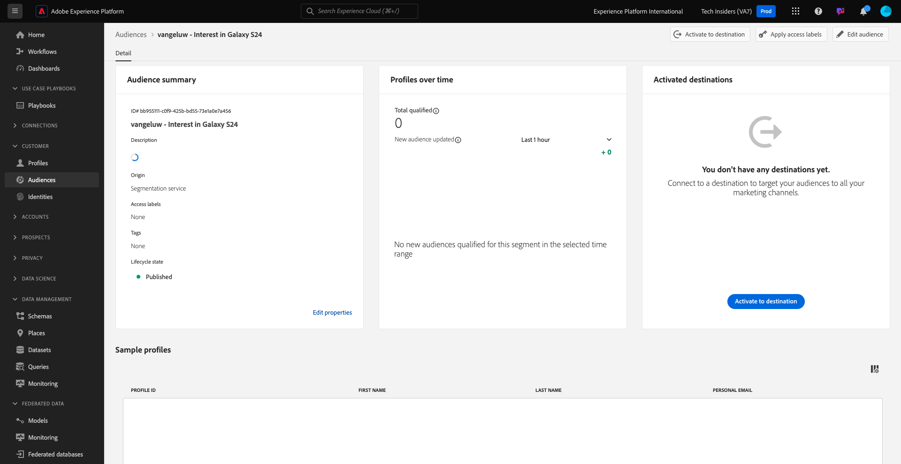

# 2.3.1 Skapa en målgrupp

I den här övningen skapar du en publik genom att använda Adobe Experience Platform målgruppsbyggare.

## Kontext

Att svara på kundens intresse måste vara i realtid. Ett sätt att svara på kundbeteenden i realtid är att använda en målgrupp, förutsatt att målgruppen kvalificerar sig i realtid. I den här övningen måste ni bygga ut en målgrupp, med hänsyn tagen till den verkliga aktiviteten på den webbplats som vi har använt.

## Identifiera det beteende du vill reagera på

Gå till [https://dsn.adobe.com](https://dsn.adobe.com). När du har loggat in med din Adobe ID ser du det här. Klicka på de tre punkterna **..** i webbplatsprojektet och klicka sedan på **Kör** för att öppna det.

Du kommer då att se din demowebbplats öppnas. Markera URL-adressen och kopiera den till Urklipp.

Öppna ett nytt inkognito-webbläsarfönster.

Klistra in webbadressen till demowebbplatsen, som du kopierade i föregående steg. Du ombeds sedan logga in med din Adobe ID.

Välj kontotyp och slutför inloggningsprocessen.

Därefter visas webbplatsen i ett inkognitivt webbläsarfönster. För varje övning måste du använda ett nytt, inkognitivt webbläsarfönster för att läsa in webbadressen till demowebbplatsen.

I det här exemplet vill du svara en viss kund som tittar på en viss produkt.
Gå till **Telefoner och enheter** på startsidan för **Citi Signal** och klicka på produkten **Galaxy S24**.

Så när någon besöker produktsidan för **Galaxy S24** vill du kunna vidta åtgärder. Det första som måste göras är att definiera en målgrupp.

## Skapa målgruppen

Gå till [Adobe Experience Platform](https://experience.adobe.com/platform). När du har loggat in loggar du in på Adobe Experience Platform hemsida.

Innan du fortsätter måste du välja en **sandlåda**. Sandlådan som ska markeras har namnet ``--aepSandboxName--``. När du har valt rätt [!UICONTROL sandbox] visas skärmändringen och nu är du i din dedikerade [!UICONTROL sandbox].

Gå till **Publiker** på menyn till vänster och gå sedan till **Bläddra** där du kan se en översikt över alla befintliga målgrupper. Klicka på knappen **Skapa publik** för att börja skapa en ny publik.

Välj **Skapa regel** och klicka på **Skapa**.

Som nämnts ovan måste du skapa en målgrupp av alla kunder som har tittat på produkten **Galaxy S24**.

Om du vill bygga ut den här målgruppen måste du lägga till en händelse. Du kan hitta alla händelser genom att klicka på ikonen **Händelser** i menyfältet **Publiker** .

Därefter visas noden **XDM ExperienceEvent** på den översta nivån.

Om du vill hitta kunder som har besökt produkten **Galaxy S24** klickar du på **XDM ExperienceEvent**.

Bläddra nedåt till **Produktlisteobjekt** och klicka på den.

Välj **Namn** och dra och släpp objektet **Namn** från den vänstra menyn **Produktlisteobjekt** på målgruppsarbetsytan i avsnittet **Händelser**.

Jämförelseparametern ska vara **lika med** och ange `Galaxy S24` i indatafältet.

**Händelsereglerna** bör nu se ut så här. Varje gång du lägger till ett element i målgruppsverktyget kan du klicka på knappen **Uppdatera uppskattning** för att få en ny uppskattning av målgruppspopulationen.

Ge målgruppen ett namn och ange **Utvärderingsmetod** till **Edge**.

Använd följande som namnkonvention:

- `--aepUserLdap-- - Interest in Galaxy S24`

Klicka sedan på knappen **Publicera** för att spara din publik.

Du kommer nu tillbaka till målgruppsöversikten.

## Nästa steg

Gå till [2.3.2 Granska hur du konfigurerar DV360-målet med hjälp av destinationer](./ex2.md){target="_blank"}

Gå tillbaka till [CDP i realtid - Bygg en målgrupp och vidta åtgärder](./real-time-cdp-build-a-segment-take-action.md){target="_blank"}

Gå tillbaka till [Alla moduler](./../../../../overview.md){target="_blank"}
