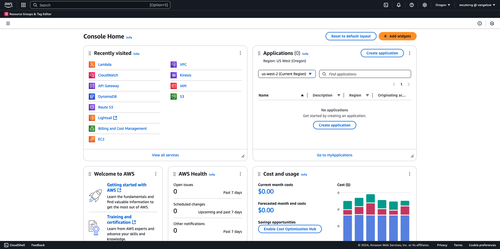
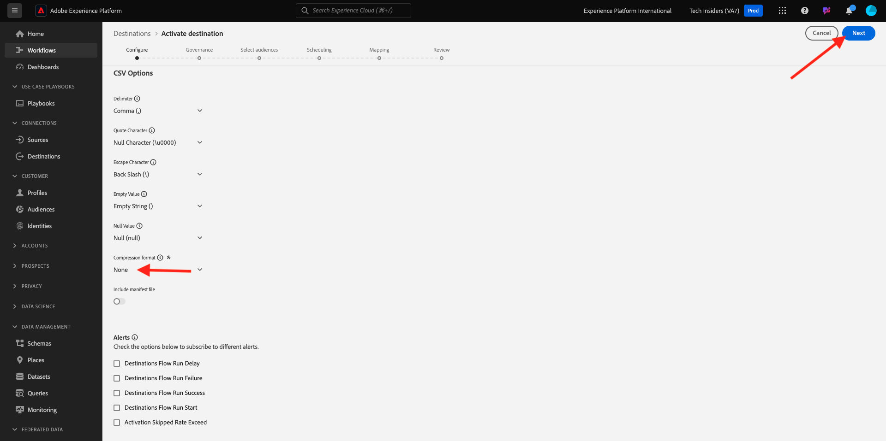

# 2.3.4 Take Action: send your audience to an S3 destination

Adobe Experience Platform kan även dela målgrupper med e-postmarknadsföringsdestinationer som Salesforce Marketing Cloud, Oracle Eloqua, Oracle Responsys och Adobe Campaign.

Du kan använda FTP eller SFTP som en del av de dedikerade destinationerna för var och en av dessa destinationer för e-postmarknadsföring, eller så kan du använda AWS S3 för att utbyta kundlistor mellan Adobe Experience Platform och dessa destinationer för e-postmarknadsföring.

I den här modulen konfigurerar du ett sådant mål genom att använda en AWS S3-bucket.

## Skapa en S3-bucket

Gå till [https://console.aws.amazon.com](https://console.aws.amazon.com) och logga in.

>[!NOTE]
>
>Om du inte har något AWS-konto än skapar du ett nytt AWS-konto med din personliga e-postadress.

När du har loggat in omdirigeras du till **AWS Management Console**.

Sök efter **s3** i sökfältet. Klicka på det första sökresultatet: **S3 - Skalbar lagring i molnet**.

Därefter visas startsidan för **Amazon S3**. Klicka på **Skapa pyts**.

Använd namnet `aepmodulertcdp--aepUserLdap--` på skärmen **Skapa pyts**

Låt alla andra standardinställningar vara som de är. Bläddra nedåt och klicka på **Skapa hink**.

Då ser du att din bucket skapas och kommer att omdirigeras till Amazon S3-hemsida.

## Ange behörigheter för att komma åt S3-bucket

Nästa steg är att konfigurera åtkomst till din S3-bucket.

Gå till [https://console.aws.amazon.com/iam/home](https://console.aws.amazon.com/iam/home) om du vill göra det.

Åtkomsten till AWS-resurser styrs av Amazon Identity and Access Management (IAM).

Du kommer nu att se den här sidan.

Klicka på **Användare** på den vänstra menyn. Sedan visas skärmen **Användare**. Klicka på **Skapa användare**.

Konfigurera sedan användaren:

- Användarnamn: använd `s3_--aepUserLdap--_rtcdp`

Klicka på **Nästa**.

Då visas den här behörighetsskärmen. Klicka på **Koppla profiler direkt**.

Ange söktermen **s3** om du vill visa alla relaterade S3-principer. Välj principen **AmazonS3FullAccess**. Bläddra nedåt och klicka på **Nästa**.

Granska konfigurationen. Klicka på **Skapa användare**.

Då ser du det här. Klicka på **Visa användare**.

Klicka på **Säkerhetsuppgifter** och sedan på **Skapa åtkomstnyckel**.

Välj **Program som körs utanför AWS**. Bläddra nedåt och klicka på **Nästa**.

Klicka på **Skapa åtkomstnyckel**

Då ser du det här. Klicka på **Visa** för att visa din hemliga åtkomstnyckel:

Din **hemliga åtkomstnyckel** visas nu.

>[!IMPORTANT]
>
>Lagra dina inloggningsuppgifter i en textfil på datorn.
>
> - Åtkomstnyckel-ID: ...
> - Hemlig åtkomstnyckel: ...
>
> När du klickar på **Klar** visas aldrig dina autentiseringsuppgifter igen!

Klicka på **Klar**.

Du har nu skapat en AWS S3-bucket och du har skapat en användare med behörighet att komma åt den här bucket.

## Konfigurera mål i Adobe Experience Platform

Gå till [Adobe Experience Platform](https://experience.adobe.com/platform). När du har loggat in loggar du in på Adobe Experience Platform hemsida.

Innan du fortsätter måste du välja en **sandlåda**. Sandlådan som ska markeras har namnet ``--aepSandboxName--``. När du har valt rätt [!UICONTROL sandbox] visas skärmändringen och nu är du i din dedikerade [!UICONTROL sandbox].

Gå till **Destinationer** på den vänstra menyn och gå sedan till **Katalog**. Därefter visas **målkatalogen**.

Klicka på **molnlagring** och sedan på knappen **Konfigurera** (eller på **Aktivera målgrupper**, beroende på din miljö) på **Amazon S3** -kortet.

Välj **Åtkomstnyckel** som kontotyp. Använd de S3-autentiseringsuppgifter som du fick i föregående steg:

| Åtkomstnyckel-ID | Nyckel för hemlig åtkomst |
|:-----------------------:| :-----------------------:|
| AKIA... | 7Icm... |

Klicka på **Anslut till mål**.

En visuell bekräftelse visas på att det här målet nu är anslutet.

Du måste ange information om S3-bucket så att Adobe Experience Platform kan ansluta till S3-bucket.

Använd följande som namngivningskonvention:

| Åtkomstnyckel-ID | Nyckel för hemlig åtkomst |
|:-----------------------:| :-----------------------:|
| Namn | `AWS - S3 - --aepUserLdap--` |
| Beskrivning | `AWS - S3 - --aepUserLdap--` |
| Buckennamn | `aepmodulertcdp--aepUserLdap--` |
| Mappsökväg | /now |

Välj **Publiker**.

För **filtyp** väljer du **CSV** och låter standardinställningarna vara oförändrade.

Rulla ned. För **komprimeringsformatet** väljer du **Inget**. Klicka på **Nästa**.

Du kan nu även bifoga en datastyrningspolicy till ditt nya mål. Klicka på **Nästa**.

I listan över målgrupper söker du efter den målgrupp du skapade i den föregående övningen, `--aepUserLdap-- - Interest in Galaxy S24`, och markerar den. Klicka på **Nästa**.

Då ser du det här. Om du vill kan du redigera schemat och filnamnet genom att klicka på ikonen **penna** . Klicka på **Nästa**.

Nu kan du välja profilattribut för exporten till AWS S3. Klicka på **Lägg till nytt fält** och kontrollera att fältet `--aepTenantId--.identification.core.ecid` har lagts till och markerats som **Dedupliceringsnyckel**.

Du kan också lägga till så många andra profilattribut som behövs.

När du har lagt till alla fält klickar du på **Nästa**.

Granska konfigurationen. Klicka på **Slutför** för att slutföra konfigurationen.

Du kommer sedan tillbaka till skärmen Målaktivering och du kommer att se målgruppen som lagts till på den här målplatsen.

Om du vill lägga till fler målgruppsexporter kan du klicka på **Aktivera målgrupper** för att starta om processen och lägga till fler målgrupper.

## Nästa steg

Gå till [2.3.5 Take Action: send your audience to Adobe Target](./ex5.md){target="_blank"}

Gå tillbaka till [CDP i realtid - Bygg en målgrupp och vidta åtgärder](./real-time-cdp-build-a-segment-take-action.md){target="_blank"}

Gå tillbaka till [Alla moduler](./../../../../overview.md){target="_blank"}
