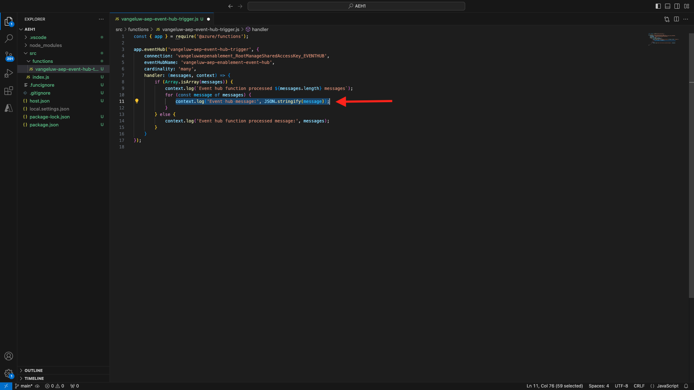

# 2.4.6 Skapa ditt Microsoft Azure-projekt

## Bekanta dig med Azure Event Hub-funktioner

Med Azure-funktioner kan du köra små kodbitar (kallas **funktioner**) utan att behöva oroa dig för programinfrastrukturen. Med Azure-funktioner ger molninfrastrukturen alla aktuella servrar du behöver för att ditt program ska kunna köras i stor skala.
En funktion är **utlöst** av en viss typ av händelse. De utlösare som stöds är bland annat att svara på dataändringar, svara på meddelanden (till exempel händelsehubbar), köra ett schema eller som ett resultat av en HTTP-begäran.
Azure-funktioner är en serverlös beräkningstjänst som gör att du kan köra händelseutlösad kod utan att explicit behöva etablera eller hantera infrastruktur.
Azure Event Hubs kan integreras med Azure-funktioner för en serverlös arkitektur.
## Öppna Visual Studio-kod och logga in på Azure

Visual Studio Code gör det enkelt att ...
- definiera och binda Azure-funktioner till Event Hubs- testa lokalt- distribuera till Azure- körning av fjärrloggfunktion
### Öppna Visual Studio-kod

### Logga in på Azure

När du loggar in med ditt Azure-konto som du använde för att registrera dig i den tidigare övningen kan du hitta och binda alla Event Hub-resurser med Visual Studio Code.
Öppna Visual Studio-kod och klicka på ikonen **Azure** .
Välj sedan **Logga in på Azure**:

Du omdirigeras till webbläsaren för att logga in. Kom ihåg att välja det Azure-konto som du använde för att registrera.
När du ser följande skärm i webbläsaren loggas du in med Visual Code Studio:

Återgå till Visual Code Studio (du ser namnet på din Azure-prenumeration, till exempel **Azure-prenumeration 1**):

## Skapa ett Azure-projekt

Klicka på **Skapa funktionsprojekt..**:

Välj eller skapa en lokal mapp som du vill spara projektet i och klicka på **Välj**:

Du kommer nu att ange guiden Skapa projekt. Klicka på **JavaScript** som språk för ditt projekt:

Välj sedan **Modell v4**.

Välj **Azure Event Hub-utlösaren** som projektets första funktionsmall:

Ange ett namn för funktionen, använd följande format `--aepUserLdap---aep-event-hub-trigger` och tryck på Retur:

Välj **Skapa ny inställning för lokal app**:

Klicka för att markera det namnutrymme för händelsehubben som du skapade tidigare, med namnet `--aepUserLdap---aep-enablement`.

Klicka sedan på händelsehubben som du skapade tidigare, med namnet `--aepUserLdap---aep-enablement-event-hub`.

Klicka för att välja **RootManageSharedAccessKey** som händelsehubbsprincip:

Välj **Lägg till på arbetsyta** om du vill öppna ditt projekt:

Du kan då få ett sådant här meddelande. I så fall klickar du på **Ja, jag litar på författarna**.

När du har skapat projektet öppnar du filen `--aepUserLdap---aep-event-hub-trigger.js` i redigeraren:

Nyttolasten som skickas av Adobe Experience Platform till din händelsehubb ser ut så här:
```json
{
  "identityMap": {
    "ecid": [
      {
        "id": "36281682065771928820739672071812090802"
      }
    ]
  },
  "segmentMembership": {
    "ups": {
      "94db5aed-b90e-478d-9637-9b0fad5bba11": {
        "createdAt": 1732129904025,
        "lastQualificationTime": "2024-11-21T07:33:52Z",
        "mappingCreatedAt": 1732130611000,
        "mappingUpdatedAt": 1732130611000,
        "name": "vangeluw - Interest in Plans",
        "status": "realized",
        "updatedAt": 1732129904025
      }
    }
  }
}
```

Uppdatera koden i Visual Studio-kodens `--aepUserLdap---aep-event-hub-trigger.js` med koden nedan. Den här koden körs varje gång CDP i realtid skickar målgruppskvalifikationer till din Event Hub-destination. I det här exemplet handlar koden bara om att visa inkommande nyttolast, men du kan föreställa dig vilken typ av extrafunktion som helst för att bearbeta målgruppskvalifikationer i realtid och använda dem längre ned i ert system för datarörelser.
Rad 11 i filen `--aepUserLdap---aep-event-hub-trigger.js` visar för närvarande följande:
```javascript
context.log('Event hub message:', message);
```

Ändra rad 11 i `--aepUserLdap---aep-event-hub-trigger.js` så att den ser ut så här:
```javascript
context.log('Event hub message:', JSON.stringify(message));
```

Den totala nyttolasten bör då vara så här:
```javascript
const { app } = require('@azure/functions');

app.eventHub('--aepUserLdap---aep-event-hub-trigger', {
    connection: '--aepUserLdap--aepenablement_RootManageSharedAccessKey_EVENTHUB',
    eventHubName: '--aepUserLdap---aep-enablement-event-hub',
    cardinality: 'many',
    handler: (messages, context) => {
        if (Array.isArray(messages)) {
            context.log(`Event hub function processed ${messages.length} messages`);
            for (const message of messages) {
                context.log('Event hub message:', message);
            }
        } else {
            context.log('Event hub function processed message:', messages);
        }
    }
});
```


Resultatet bör se ut så här:

## Kör Azure Project

Nu är det dags att köra projektet. I det här skedet distribuerar vi inte projektet till Azure. Vi kör den lokalt i felsökningsläge. Välj ikonen Kör och klicka på den gröna pilen.

Första gången du kör ditt projekt i felsökningsläge måste du koppla ett Azure-lagringskonto. Klicka sedan på **Välj lagringskonto**.

och välj sedan lagringskontot som du skapade tidigare, med namnet `--aepUserLdap--aepstorage`.

Ditt projekt är nu igång och visas med en lista över händelser i händelsehubben. I nästa övning kommer du att visa hur ni beter er er på CitiSignal Demo-webbplatsen som kommer att kvalificera er för målgrupper. Därför får du en målgruppsklassificeringsnyttolast i terminalen för händelsehubbens utlösarfunktion.

## Stoppa Azure Project

Gå till **CALL STACK** i VSC, klicka på pilen i det projekt som körs och klicka sedan på **Stopp** för att stoppa projektet.

## Nästa steg

Gå till [2.4.7 från början till slut ](./ex7.md){target="_blank"}
Gå tillbaka till [Real-Time CDP: Audience Activation till Microsoft Azure Event Hub](./segment-activation-microsoft-azure-eventhub.md){target="_blank"}
Gå tillbaka till [Alla moduler](./../../../../overview.md){target="_blank"}
