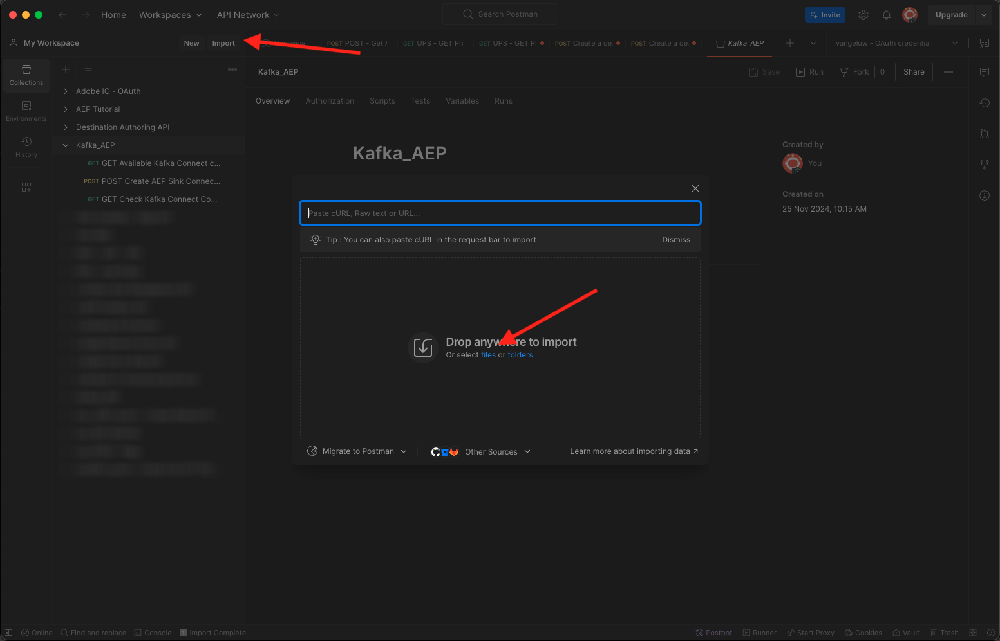
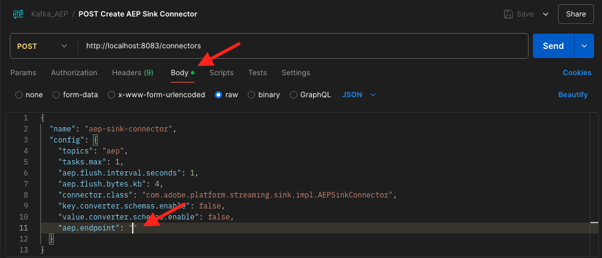

# 2.6.4 Installera och konfigurera Kafka Connect och Adobe Experience Platform Sink Connector

## Hämta Adobe Experience Platform Sink Connector

Gå till [https://github.com/adobe/experience-platform-streaming-connect/releases](https://github.com/adobe/experience-platform-streaming-connect/releases) och hämta den senaste officiella versionen av Adobe Experience Platform Sink Connector.


Hämta filen **streaming-connect-sink-0.0.27-java-11.jar**.


Placera den hämtade filen, **streaming-connect-sink-0.0.27-java-11.jar**, på skrivbordet.


## Konfigurera Kafka Connect

Gå till mappen **Kafka_AEP** på skrivbordet och navigera till mappen `kafka_2.13-3.9.0/config`.
I den mappen öppnar du filen **connect-distributed.properties** med en textredigerare.


Gå till rad 34 och 35 i textredigeraren och se till att fälten `key.converter.schemas.enable` och `value.converter.schemas.enable` är `false`

```json
key.converter.schemas.enable=false
value.converter.schemas.enable=false
```

Spara ändringarna i den här filen.


Gå sedan tillbaka till mappen `kafka_2.13-3.1.0` och skapa en ny mapp manuellt och ge den namnet `connectors`.


Högerklicka på den nya mappen och klicka på **Ny terminal i mappen**.


Då ser du det här. Ange kommandot `pwd` om du vill hämta den fullständiga sökvägen för den mappen. Markera den fullständiga sökvägen och kopiera den till Urklipp.


Gå tillbaka till textredigeraren, till filen **connect-distributed.properties** och rulla ned till den sista raden (rad 89 i skärmbilden). Du bör avkommentera raden (ta bort `#`) som börjar med `# plugin.path=` och du bör klistra in den fullständiga sökvägen till mappen `connectors`. Resultatet bör se ut ungefär så här:

`plugin.path=/Users/woutervangeluwe/Desktop/Kafka_AEP/kafka_2.13-3.9.0/connectors`

Spara ändringarna i filen **connect-distributed.properties** och stäng textredigeraren.


Kopiera sedan den senaste officiella versionen av Adobe Experience Platform Sink Connector som du hämtade till mappen `connectors`. Filen som du laddade ned tidigare har namnet **streaming-connect-sink-0.0.27-java-11.jar**. Du kan bara flytta den till mappen `connectors`.


Öppna sedan ett nytt terminalfönster på samma nivå som mappen **kafka_2.13-3.9.0** . Högerklicka på mappen och klicka på **Ny terminal i mappen**.

Klistra in det här kommandot i terminalfönstret: `bin/connect-distributed.sh config/connect-distributed.properties` och klicka på **Enter**. Det här kommandot startar Kafka Connect och läser in biblioteket för Adobe Experience Platform Sink Connector.


Efter några sekunder ser du något liknande:


## Skapa en Adobe Experience Platform Sink Connector med Postman

Nu kan du interagera med Kafka Connect med Postman. Om du vill göra det hämtar du [den här Postman Collection](./../../../../assets/postman/postman_kafka.zip) och dekomprimerar den till din lokala dator på skrivbordet. Du får då en fil som heter `Kafka_AEP.postman_collection.json`.


Du måste importera filen till Postman. Om du vill göra det öppnar du Postman, klickar på **Importera**, drar och släpper filen `Kafka_AEP.postman_collection.json` i popup-fönstret och klickar på **Importera**.



Den här samlingen finns sedan på den vänstra menyn i Postman. Klicka på den första begäran, **GET tillgängliga Kafka Connect-anslutningar** för att öppna den.


Då ser du det här. Klicka på den blå **Skicka**-knappen, varefter du ska se ett tomt svar `[]`. Det tomma svaret beror på att inga Kafka Connect-anslutningar är definierade.


Om du vill skapa en koppling klickar du för att öppna den andra begäran i Kafka-samlingen, **POST Create AEP Sink Connector**, och går till **Body**. Då ser du det här. På rad 11, där det står **&quot;aep.endpoint&quot;: &quot;&quot;**, måste du klistra in den URL för HTTP API-direktuppspelningsslutpunkt som du fick i slutet av en av de föregående övningarna. Slutpunkts-URL:en för HTTP-API-direktuppspelning ser ut så här: `https://dcs.adobedc.net/collection/63751d0f299eeb7aa48a2f22acb284ed64de575f8640986d8e5a935741be9067`.



När du har klistrat in den bör texten i din begäran se ut så här. Klicka på den blå **Skicka**-knappen för att skapa din koppling. Du får ett omedelbart svar när du skapar kontakten.


Klicka på den första begäran, **GET tillgängliga Kafka Connect-anslutningar**, så öppnas den igen och klicka på den blå **Skicka**-knappen igen. Nu ser du att det finns en Kafka Connect-anslutning.


Öppna sedan den tredje begäran i Kafka-samlingen, **GET Check Kafka Connect Connector Status**. Klicka på den blå knappen **Skicka** så får du sedan ett svar som det nedan som anger att anslutningen körs.


## Skapa en upplevelsehändelse

Öppna ett nytt **Terminal**-fönster genom att högerklicka på mappen **kafka_2.13-3.9.0** och klicka på **Ny terminal i mappen**.


Ange följande kommando:

`bin/kafka-console-producer.sh --broker-list 127.0.0.1:9092 --topic aep`

Då ser du det här. Varje ny rad som följs av att du trycker på Enter-knappen leder till att ett nytt meddelande skickas till ämnet **aep**.


Du kan nu skicka ett meddelande som kommer att förbrukas av Adobe Experience Platform Sink Connector och som kommer att hämtas till Adobe Experience Platform i realtid.

Ta med exempelupplevelsehändelsenyttolasten nedan och kopiera den till en textredigerare.

```json
{
  "header": {
    "datasetId": "61fe23fd242870194a6d779c",
    "imsOrgId": "--aepImsOrgID--",
    "source": {
      "name": "Launch"
    },
    "schemaRef": {
      "id": "https://ns.adobe.com/experienceplatform/schemas/b0190276c6e1e1e99cf56c99f4c07a6e517bf02091dcec90",
      "contentType": "application/vnd.adobe.xed-full+json;version=1"
    }
  },
  "body": {
    "xdmMeta": {
      "schemaRef": {
        "id": "https://ns.adobe.com/experienceplatform/schemas/b0190276c6e1e1e99cf56c99f4c07a6e517bf02091dcec90",
        "contentType": "application/vnd.adobe.xed-full+json;version=1"
      }
    },
    "xdmEntity": {
      "eventType": "callCenterInteractionKafka",
      "_id": "",
      "timestamp": "2024-11-25T09:54:12.232Z",
      "_experienceplatform": {
        "identification": {
          "core": {
            "phoneNumber": ""
          }
        },
        "interactionDetails": {
          "core": {
            "callCenterAgent": {
              "callID": "Support Contact - 3767767",
              "callTopic": "contract",
              "callFeeling": "negative"
            }
          }
        }
      }
    }
  }
}
```

Då ser du det här. Du måste uppdatera två fält manuellt:

- **_id**: ange det som ett slumpmässigt ID, till exempel `--aepUserLdap--1234`
- **tidsstämpel**: uppdatera tidsstämpeln till aktuellt datum och aktuell tid
- **phoneNumber**: ange telefonnumret för kontot som skapades tidigare på demowebbplatsen. Du hittar den på panelen Profilvisningsprogram under **Identiteter**.

Du måste även kontrollera och kanske uppdatera dessa fält:

- **datasetId**: du måste kopiera datauppsättnings-ID:t för datauppsättningens demosystem - händelsedatauppsättning för callcenter (Global v1.1)


- **imsOrgID**: ditt IMS-organisations-ID är `--aepImsOrgId--`

>[!NOTE]
>
>Fältet **_id** måste vara unikt för varje datainmatning. Om du skapar flera händelser måste du uppdatera fältet **_id** varje gång till ett nytt, unikt värde.

Du borde då ha något sådant:


Sedan kopierar du hela upplevelsehändelsen till Urklipp. Den tomma delen av JSON-nyttolasten måste tas bort och vi använder ett onlineverktyg för att göra det. Gå till [http://jsonviewer.stack.hu/](http://jsonviewer.stack.hu/) för att göra det.

Klistra in upplevelsehändelsen i redigeraren och klicka på **Ta bort tomt utrymme**.


Markera sedan all utdatatext och kopiera den till Urklipp.


Gå tillbaka till terminalfönstret.


Klistra in den nya nyttolasten utan blanksteg i terminalfönstret och klicka på **Enter**.


Gå sedan tillbaka till demowebbplatsen och uppdatera sidan. Du bör nu se en upplevelsehändelse i din profil, under **Experience Events**, precis som i den nedan:


>[!NOTE]
>
>Om du vill att interaktionen mellan callcenter ska visas på panelen Profilvisningsprogram måste du lägga till nedanstående etikett och filtrera ditt projekt på [https://dsn.adobe.com](https://dsn.adobe.com), genom att gå till **profilvisningsprogrammet** på fliken och lägga till en ny rad under **Händelser** med följande variabler:
>- **Etikett för händelsetyp**: Interaktioner för callcenter
>- **Händelsetypfilter**: callCenterInteractionKafka
>- **Titel**: `--aepTenantId--.interactionDetails.core.callCenterAgent.callID`


Du har gjort klart den här övningen.

## Nästa steg

Gå till [Sammanfattning och förmåner](./summary.md){target="_blank"}

Gå tillbaka till [Direktuppspelningsdata från Apache Kafka till Adobe Experience Platform](./aep-apache-kafka.md){target="_blank"}

Gå tillbaka till [Alla moduler](./../../../../overview.md){target="_blank"}
