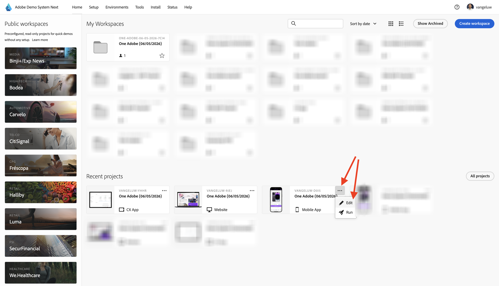

# Använda mobilappen

## Hämta appen

Gå till [https://dsn.adobe.com/install](https://dsn.adobe.com/install){target="_blank"} på datorn och gå till **Beta Version**. Logga in med din Adobe ID så ser du det här.

Använd appen **Camera** på smarttelefonen för att installera mobilappen för operativsystemet på din enhet. För den här aktiveringen måste du installera versionen **0.6.1** (eller senare) som använder Adobe Experience Platform Mobile SDK.

>[!NOTE]
>
>När du har installerat appen för första gången på en iOS-enhet kan du få ett felmeddelande när du försöker öppna appen som säger: **Untrusted Enterprise Developer**. För att kunna åtgärda detta måste du gå till **Inställningar > Allmänt > VPN och enhetshantering > Adobe Systems Inc.** och klicka på **Lita på Adobe Systems Inc.**.

När du har läst in QR-koden väljer du **Installera**.

När appen har installerats hittar du den på enhetens hemskärm. Klicka på ikonen för att öppna programmet.

När du har loggat in visas ett meddelande som ber dig att skicka meddelanden. Vi skickar meddelanden som en del av självstudiekursen, så klicka på **Tillåt**.

Då ser du appens hemsida. Gå till **Inställningar**.

I inställningarna ser du att ett **offentligt projekt** har lästs in i appen. Klicka på **Eget projekt**.

Du kan nu läsa in ett anpassat projekt. Klicka på QR-koden för att enkelt läsa in ditt projekt.

Efter föregående övning fick du det här resultatet. Klicka för att öppna det **Mobile Edge Telco-projekt** som skapades åt dig.

Om du av misstag har stängt webbläsarfönstret, eller för framtida demonstrations- eller aktiveringssessioner, kan du även komma åt webbplatsprojektet genom att gå till [https://dsn.adobe.com](https://dsn.adobe.com){target="_blank"}. När du har loggat in med din Adobe ID ser du det här. Klicka på de tre punkterna **..** i ditt mobilappsprojekt och klicka sedan på **Redigera**.

På sidan **Integrationer** måste du välja den datainsamlingsegenskap som skapades i föregående övning. Det gör du genom att klicka på **Välj miljö**.

Klicka på **Välj** på den datainsamlingsegenskap som skapades i föregående steg med namnet `--aepUserLdap - One Adobe (DD/MM/YYYY) (mobile)`. Klicka sedan på **Spara**.

Då ser du det här. Klicka sedan på **Kör**.

Då visas den här popup-rutan som innehåller en QR-kod. Skanna QR-koden inifrån mobilappen.

Du kommer då att se att ditt projekt-ID läses in i appen och sedan kan du klicka på **Växla**.

Du bör då se att demovarumärket **CitiSignal** läses in. Ditt program är nu klart att användas.

## Nästa steg

Gå till [Konfigurera ditt Adobe I/O-projekt](./ex6.md){target="_blank"}

Gå tillbaka till [Komma igång](./getting-started.md){target="_blank"}

Gå tillbaka till [Alla moduler](./../../../overview.md){target="_blank"}