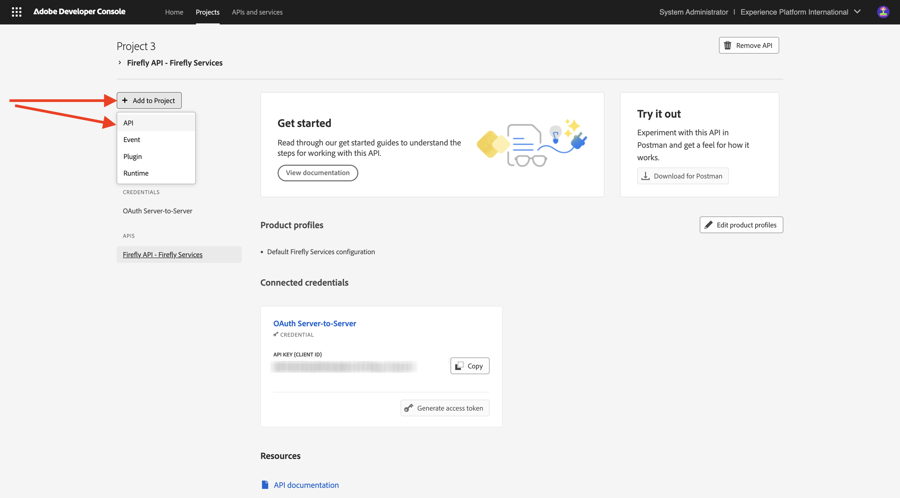

# Konfigurera ditt Adobe I/O-projekt

## Skapa ett Adobe I/O-projekt

I den här övningen används Adobe I/O för att fråga olika Adobe-slutpunkter. Följ de här stegen för att konfigurera Adobe I/O.

Gå till [https://developer.adobe.com/console/home](https://developer.adobe.com/console/home){target="_blank"}.

{zoomable="yes"}

Se till att du väljer rätt instans i skärmens övre högra hörn. Din instans är `--aepImsOrgName--`.
Välj sedan **Skapa nytt projekt**.

{zoomable="yes"}

### Firefly Services API

Du borde se det här då. Välj **+ Lägg till i projekt** och välj **API**.

{zoomable="yes"}

Skärmen bör se ut så här.

{zoomable="yes"}

Välj **Creative Cloud** och välj **Firefly - Firefly Services**. Välj sedan **Nästa**.

{zoomable="yes"}

Ange ett namn för dina autentiseringsuppgifter: `--aepUserLdap-- - One Adobe OAuth credential`och välj **Nästa**.

{zoomable="yes"}

Välj standardprofilen **Standardkonfiguration för Firefly Services** och välj **Spara konfigurerat API**.

{zoomable="yes"}

Du borde se det här då.

{zoomable="yes"}

### PHOTOSHOP SERVICES API

Välj **+ Lägg till i projekt** och välj sedan **API**.

{zoomable="yes"}

Välj **Creative Cloud** och välj **Photoshop - Firefly Services**. Välj **Nästa**.

{zoomable="yes"}

Välj **Nästa**.

{zoomable="yes"}

Därefter måste du välja en produktprofil som definierar vilka behörigheter som är tillgängliga för den här integreringen.

Välj **Standardkonfiguration för Firefly Services** och **Standardkonfiguration för Creative Cloud Automation Services**.

Välj **Spara konfigurerat API**.

{zoomable="yes"}

Du borde se det här då.

{zoomable="yes"}

### ADOBE EXPERIENCE PLATFORM API

Välj **+ Lägg till i projekt** och välj sedan **API**.

{zoomable="yes"}

Välj **Adobe Experience Platfrom** och välj **Experience Platform API**. Välj **Nästa**.

{zoomable="yes"}

Välj **Nästa**.

{zoomable="yes"}

Därefter måste du välja en produktprofil som definierar vilka behörigheter som är tillgängliga för den här integreringen.

Välj **Adobe Experience Platform - Alla användare - PROD**.

Välj **Spara konfigurerat API**.

{zoomable="yes"}

Du borde se det här då.

{zoomable="yes"}

### Projektnamn

Klicka på projektnamnet.

{zoomable="yes"}

Välj **Redigera projekt**.

{zoomable="yes"}

Ange ett eget namn för integreringen: `--aepUserLdap-- One Adobe tutorial`och välj **Spara**.

{zoomable="yes"}

Installationen av ditt Adobe I/O-projekt är nu klar.

{zoomable="yes"}

## Nästa steg

Gå till [Alternativ 1: Postman-konfiguration](./ex7.md){target="_blank"}

Gå till [Alternativ 2: PostBuster-konfiguration](./ex8.md){target="_blank"}

Gå tillbaka till [Komma igång](./getting-started.md){target="_blank"}

Gå tillbaka till [Alla moduler](./../../../overview.md){target="_blank"}