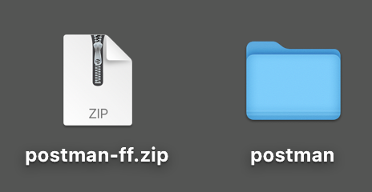
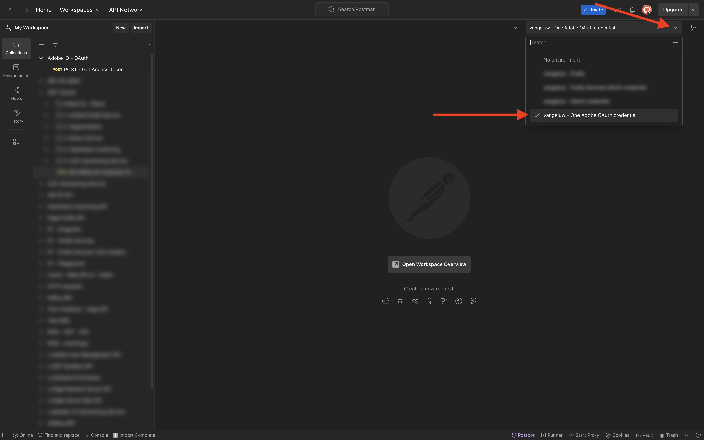

# Alternativ 1: använd Postman

>[!IMPORTANT]
>
>Om du är Adobe-anställd följer du instruktionerna för att [installera PostBuster](./ex8.md)!

## Nedladdning av Postman-miljö

Gå till [https://developer.adobe.com/console/home](https://developer.adobe.com/console/home){target="_blank"} och öppna projektet.

{zoomable="yes"}

Klicka på API:t **Firefly - Firefly Services** . Klicka sedan på **Hämta för Postman** och välj **OAuth Server-to-Server** för att hämta en Postman-miljö.

{zoomable="yes"}

## Postman-autentisering till Adobe I/O

Hämta och installera den aktuella versionen av Postman för ditt operativsystem på [Postman Downloads](https://www.postman.com/downloads/){target="_blank"}.

{zoomable="yes"}

Starta programmet.

I Postman finns det två koncept: Miljö och Samlingar.

Miljöfilen innehåller alla dina miljövariabler som är mer eller mindre konsekventa. I miljön hittar du saker som IMSOrg i din Adobe-miljö, tillsammans med säkerhetsreferenser som ditt klient-ID och andra. Du hämtade miljöfilen under Adobe I/O-installationen tidigare och den har namnet **`oauth_server_to_server.postman_environment.json`**.

Samlingen innehåller ett antal API-begäranden som du kan använda. Vi kommer att använda 2 samlingar

- 1 Collection for Authentication to Adobe I/O
- 1 Samling för övningar i denna modul

Hämta [postman-ff.zip](./../../../assets/postman/postman-ff.zip) till ditt lokala skrivbord.

{zoomable="yes"}

I filen **postman-ff.zip** finns följande filer:

- `Adobe IO - OAuth.postman_collection.json`
- `FF - Firefly Services Tech Insiders.postman_collection.json`

Zippa upp **postman-ff.zip** och lagra följande två filer i en mapp på skrivbordet:

- `Adobe IO - OAuth.postman_collection.json`
- `FF - Firefly Services Tech Insiders.postman_collection.json`
- `oauth_server_to_server.postman_environment.json`

{zoomable="yes"}

I Postman väljer du **Importera**.

{zoomable="yes"}

Välj **Filer**.

{zoomable="yes"}

Välj de tre filerna i mappen och välj sedan **Öppna** och **Importera**.

{zoomable="yes"}

{zoomable="yes"}

Nu har du allt du behöver i Postman för att börja interagera med Firefly Services via API:erna.

## Begär en åtkomsttoken

För att vara säker på att du är autentiserad måste du begära en åtkomsttoken.

Kontrollera att du har valt rätt miljö innan du kör en begäran genom att verifiera miljölistrutan i det övre högra hörnet. Den valda miljön bör ha ett namn som liknar det här, `--aepUserLdap-- One Adobe OAuth Credential`.

{zoomable="yes"}

Den valda miljön bör ha ett namn som liknar det här, `--aepUserLdap-- One Adobe OAuth Credential`.

{zoomable="yes"}

Nu när din Postman-miljö och dina samlingar är konfigurerade och fungerar kan du autentisera från Postman till Adobe I/O.

I samlingen **Adobe IO - OAuth** markerar du begäran **POST - Get Access Token** och väljer **Skicka**.

Obs! Under **Frågeparametrar** refereras två variabler, `API_KEY` och `CLIENT_SECRET`. Dessa variabler hämtas från den valda miljön, `--aepUserLdap-- One Adobe OAuth Credential`.

{zoomable="yes"}

Om det lyckas visas ett svar som innehåller en innehavartoken, en åtkomsttoken och ett giltighetsfönster i avsnittet **Brödtext** i Postman.

{zoomable="yes"}

Du bör se ett liknande svar som innehåller följande information:

| Nyckel | Värde |
|:-------------:| :---------------:| 
| token_type | **bärare** |
| access_token | **eyJhbGciOiJSUz...** |
| förfaller_in | **86399** |

Adobe I/O **Bearer-token** har ett specifikt värde (den mycket långa access_token) och ett giltighetsfönster och är nu giltigt i 24 timmar. Det innebär att om du efter 24 timmar vill använda Postman för att interagera med Adobe API:er måste du generera en ny token genom att köra denna begäran igen.

Din Postman-miljö är nu klar och fungerar.

## Nästa steg

Gå till [Program som ska installeras](./ex9.md){target="_blank"}

Gå tillbaka till [Komma igång](./getting-started.md){target="_blank"}

Gå tillbaka till [Alla moduler](./../../../overview.md){target="_blank"}
