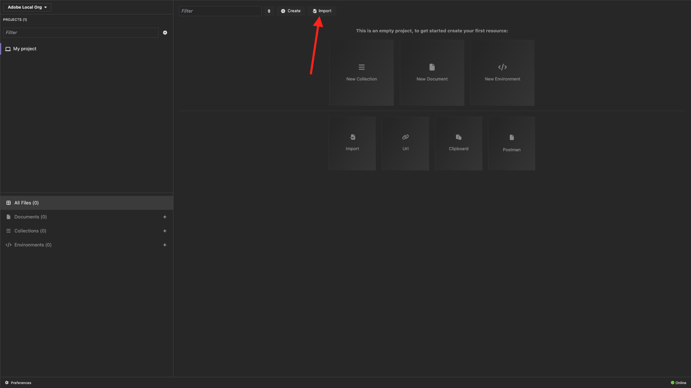
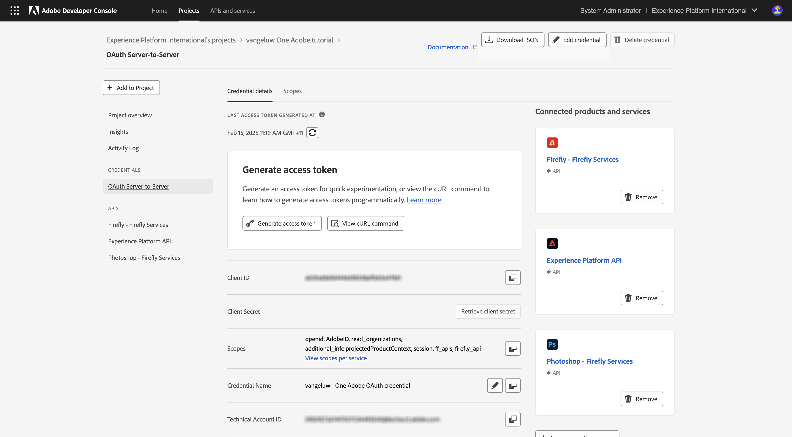

# Alternativ 2: PostBuster-konfiguration

>[!IMPORTANT]
>
>Om du inte är Adobe-anställd följer du instruktionerna för att [installera Postman](./ex7.md). Instruktionerna nedan är endast avsedda för Adobe-anställda. Om du redan har konfigurerat Postman hoppar du över den här övningen och går till [Program för att installera](./ex9.md).

## Installera PostBuster

Gå till [https://adobe.service-now.com/esc?id=adb_esc_kb_article&amp;sysparm_article=KB0020542](https://adobe.service-now.com/esc?id=adb_esc_kb_article&amp;sysparm_article=KB0020542).

Klicka för att hämta den senaste versionen av **PostBuster**.


Hämta rätt version för ditt operativsystem.


När nedladdningen är klar och har installerats öppnar du PostBuster. Du borde se det här då. Klicka på **Importera**.



Hämta [postbuster.json.zip](./../../../assets/postman/postbuster.json.zip) och extrahera den på skrivbordet.


Klicka på **Välj en fil**.


Markera filen **postbuster.json**. Klicka på **Öppna**.


Du borde se det här då. Klicka på **Skanna**.


Klicka på **Importera**.


Du borde se det här då. Klicka för att öppna den importerade samlingen.


Nu ser du din samling. Du måste fortfarande konfigurera en miljö för vissa miljövariabler.


Klicka på **Grundmiljö** och sedan på ikonen **redigera** .


Du borde se det här då.


Kopiera miljöplatshållaren nedan och klistra in den i **basmiljön**.

```json
{
	"CLIENT_SECRET": "",
	"API_KEY": "",
	"ACCESS_TOKEN": "",
	"SCOPES": [
		"openid",
		"AdobeID",
		"read_organizations", 
		"additional_info.projectedProductContext", 
		"session",
		"ff_apis",
		"firefly_api"
	],
	"TECHNICAL_ACCOUNT_ID": "",
	"IMS": "ims-na1.adobelogin.com",
	"IMS_ORG": "",
	"access_token": "",
	"IMS_TOKEN": "",
	"AZURE_STORAGE_URL": "",
	"AZURE_STORAGE_CONTAINER": "",
	"AZURE_STORAGE_SAS_READ": "",
	"AZURE_STORAGE_SAS_WRITE": ""
}
```

Du borde ha den här då.


## Ange dina Adobe I/O-variabler

Gå till [https://developer.adobe.com/console/home](https://developer.adobe.com/console/home){target="_blank"} och öppna projektet.

{zoomable="yes"}

Gå till **OAuth Server-to-Server**.

{zoomable="yes"}

Du måste nu kopiera följande värden från ditt Adobe I/O-projekt och klistra in dem i din PostBuster-basmiljö.

- Klient-ID
- Klienthemlighet (klicka på **Hämta klienthemlighet**)
- Tekniskt konto-ID
- Organisations-ID (bläddra nedåt för att hitta ditt organisations-ID)

{zoomable="yes"}

Kopiera variablerna ovan en i taget och klistra in dem i din **basmiljö** i PostBuster.

| Variabelnamn i Adobe I/O | Variabelnamn i PostBuster-basmiljö |
|:-------------:| :---------------:| 
| Klient-ID | `API_KEY` |
| Klienthemlighet | `CLIENT_SECRET` |
| Tekniskt konto-ID | `TECHNICAL_ACCOUNT_ID` |
| Organisations-ID | `IMS_ORG` |

När du har kopierat variablerna på en av dem bör PostBuster-basmiljön se ut så här:

{zoomable="yes"}

I samlingen **Adobe IO - OAuth** markerar du begäran **POST - Get Access Token** och väljer **Skicka**.

Du bör se ett liknande svar som innehåller följande information:

| Nyckel | Värde |
|:-------------:| :---------------:| 
| token_type | **bärare** |
| access_token | **eyJhbGciOiJS...** |
| förfaller_in | **86399** |

Adobe I/O **Bearer-token** har ett specifikt värde (den mycket långa access_token) och ett giltighetsfönster och är nu giltigt i 24 timmar. Det innebär att om du efter 24 timmar vill använda Postman för att interagera med Adobe API:er måste du generera en ny token genom att köra denna begäran igen.

{zoomable="yes"}

PostBuster-miljön är nu konfigurerad och fungerar. Du har nu slutfört modulen Komma igång.

## Nästa steg

Gå till [Program som ska installeras](./ex9.md){target="_blank"}

Gå tillbaka till [Komma igång](./getting-started.md){target="_blank"}

Gå tillbaka till [Alla moduler](./../../../overview.md){target="_blank"}