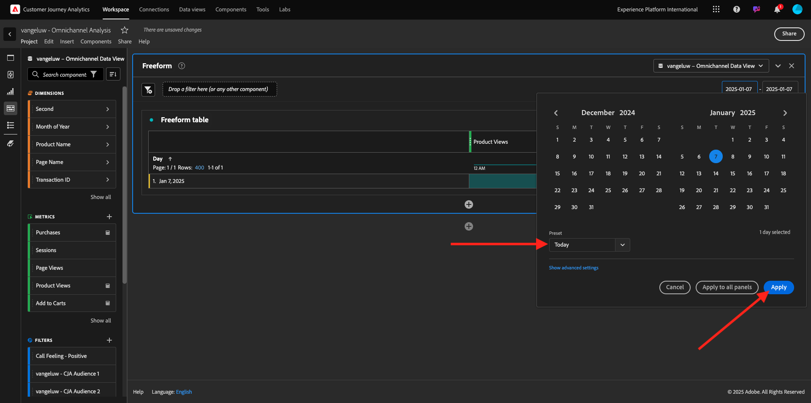
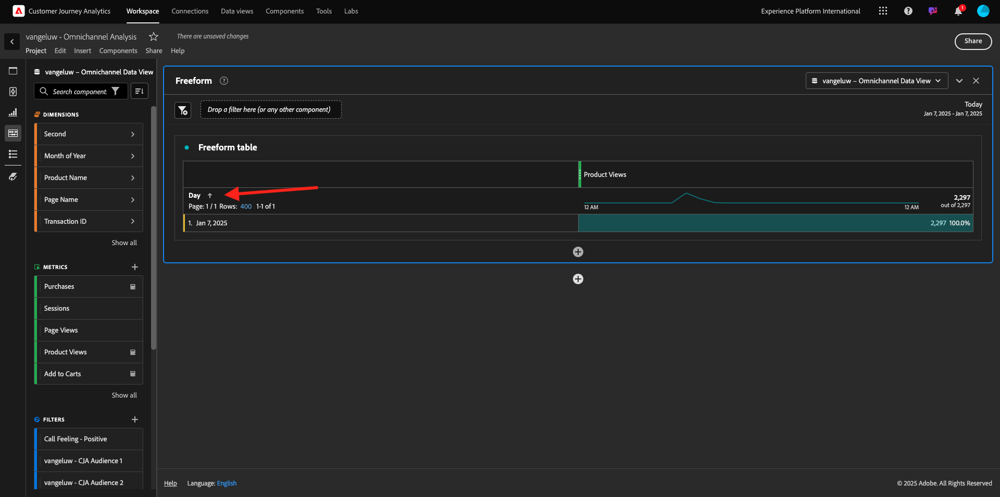
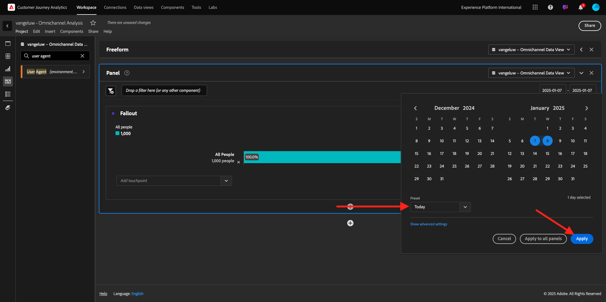
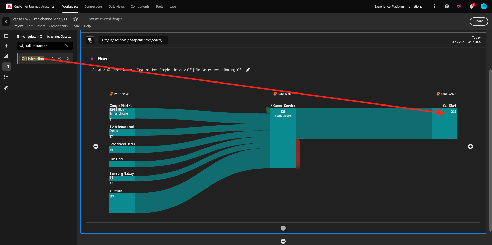
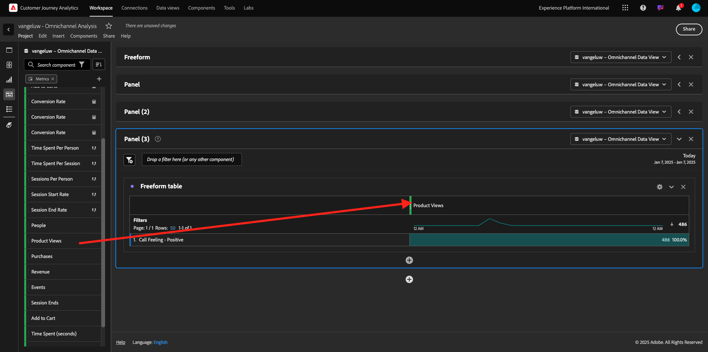

# 1.1.5 Visualisering med Customer Journey Analytics

## Mål

- Förstå Analysis Workspace användargränssnitt
- Lär dig något som gör Analysis Workspace så annorlunda.
- Lär dig hur du analyserar i CJA med Analysis Workspace

## Kontext

I den här övningen kommer du att använda Analysis Workspace i CJA för att analysera produktvisningar, produkttrattar, urn osv.

Vi tar upp några av frågorna i modul 7 - Frågetjänst så att du kan se hur enkelt det är att köra samma frågor och mer, men utan att använda SQL och bara förlita dig på Analysis Workspace dra-och-släpp-filosofi.

Låt oss använda det projekt du skapade i [1.1.4 Dataförberedelse i Analysis Workspace](./ex4.md), så gå till [https://analytics.adobe.com](https://analytics.adobe.com).

Klicka för att öppna projektet `--aepUserLdap-- - Omnichannel Analysis`.

När ditt projekt är öppet och datavyn `--aepUserLdap-- - Omnichannel Analysis` är markerad är du redo att börja skapa dina första visualiseringar.

## Hur många produktvisningar har vi dagligen?

Först och främst måste du välja rätt datum för att analysera data. Gå till kalenderlistrutan till höger på arbetsytan. Klicka på den och välj ett datumintervall.

På den vänstra menyn (komponentområdet) hittar du det beräknade måttet **Produktvyer**. Markera den och dra och släpp den på arbetsytan högst upp till höger i frihandstabellen.

Dimensionen **Day** läggs automatiskt till för att skapa din första tabell. Nu kan du se hur din fråga besvaras direkt.

Högerklicka sedan på mätsammanfattningen. Klicka på **Visa**.

Klicka på **Rad**.

Du ser dina produkter per timme.

Du kan ändra tidsomfånget till dag genom att klicka på **Inställningar** i visualiseringen.

Klicka på punkten bredvid **Rad** för att **hantera data-Source**.

Klicka sedan på **Lås markering** och välj **Markerade objekt** för att låsa den här visualiseringen så att en tidslinje med produktvyer alltid visas.

## De fem vanligaste produkterna som visas

Vilka är de fem främsta produkterna?

Kom ihåg att spara projekt ibland.

| OS | Kort klipp |
| ----------------- |-------------| 
| Windows | Ctrl+S |
| Mac | Kommando + S |

Vi börjar hitta de fem bästa produkterna som visas. På den vänstra menyn hittar du **produktnamnet** - Dimension.

Dra och släpp **produktnamn** för att ersätta dimensionen **Dag**:

Detta blir resultatet. Välj de fyra produktnamnen så ser du uppdateringen.

Försök sedan att dela upp en av produkterna efter Varumärke. Sök efter **brandName** och dra den till förnamnet.

Gör sedan en uppdelning med användaragenten. Sök efter **användaragenten** och dra den under varumärkesnamnet.

Då ser du det här:

Slutligen kan du lägga till fler visualiseringar. Sök efter `Donut` under visualiseringar på vänster sida. Ta `Donut`, dra och släpp det på arbetsytan under visualiseringen av **Linje**.

I tabellen väljer du sedan de första 5 **användaragentraderna** från den uppdelning vi gjorde under **Google Pixel XL 32 GB Black Smartphone** > **Citi Signal** . Håll ned knappen **CTRL** (i Windows) eller knappen **Command** (i Mac) när du markerar de tre raderna. Du kommer att se uppdateringen av mundiagrammet.

Du kan till och med anpassa designen så att den blir mer läsbar genom att göra både diagrammet **Linje** och diagrammet **Ring** lite mindre så att de får plats bredvid varandra:

Klicka på punkten bredvid **Ring** för att **hantera data-Source**.
Klicka sedan på **Lås markering** för att låsa den här visualiseringen så att en tidslinje med produktvyer alltid visas.

Läs mer om visualiseringar med Analysis Workspace här:

- [https://experienceleague.adobe.com/docs/analytics/analyze/analysis-workspace/visualizations/freeform-analysis-visualizations.html?lang=sv-SE](https://experienceleague.adobe.com/docs/analytics/analyze/analysis-workspace/visualizations/freeform-analysis-visualizations.html?lang=sv-SE)
- [https://experienceleague.adobe.com/docs/analytics/analyze/analysis-workspace/visualizations/t-sync-visualization.html?lang=sv-SE](https://experienceleague.adobe.com/docs/analytics/analyze/analysis-workspace/visualizations/t-sync-visualization.html?lang=sv-SE)

## Produktinteraktionstru, från visning till köp

Det finns många sätt att lösa denna fråga. En av dem är att använda produktinteraktionstyp och använda den på frihandsritbord. Ett annat sätt är att använda en **Utfallsvisualisering**. Låt oss använda den sista som vi vill visualisera och analysera samtidigt.

Stäng den aktuella panelen genom att klicka här:

Lägg till en ny tom panel genom att klicka på **+ Lägg till tom panel**.

Klicka på visualiseringen **Utfall**.

Välj samma datumintervall som i föregående övning.

Då ser du det här.

Hitta dimensionen **Händelsetyp** under komponenterna till vänster. Klicka på pilen för att öppna dimensionen.

Du kommer att se alla tillgängliga händelsetyper.

Markera objektet **commerce.productViews** och dra och släpp det i fältet **Lägg till kontaktpunkt** i **Utfallsvisualisering**.

Gör samma sak med **commerce.productListAdds** och **commerce.purchase** och släpp dem i fältet **Add Touchpoint** i **Fallout Visualization** . Din visualisering ser nu ut så här:

Du kan göra många saker här. Några exempel: jämför över tid, jämför varje steg per enhet eller jämför efter lojalitet. Men om du vill analysera intressanta saker som varför kunderna inte köper efter att ha lagt till ett objekt i kundvagnen kan vi använda det bästa verktyget i CJA: högerklicka.

Högerklicka på kontaktytan **commerce.productListAdds**. Klicka sedan på **Brytningsutfall vid den här kontaktytan**.

En ny friformstabell kommer att skapas för att analysera vad personerna gjorde om de inte köpte något.

Ändra **Händelsetyp** med **Sidnamn** i den nya friformstabellen för att se vilka sidor de ska gå i stället för bekräftelsesidan.

## Vad gör folk på webbplatsen innan de kommer till sidan Avbryt tjänst?

Det finns många sätt att utföra den här analysen. Låt oss använda flödesanalysen för att starta identifieringsdelen.

Stäng den aktuella panelen genom att klicka här och lägg sedan till en ny tom panel genom att klicka på **+ Lägg till tom panel**.

Klicka på visualiseringen **Flöde**.

Då ser du det här. Välj samma datumintervall som i föregående övning. Klicka på **Använd**.

Hitta dimensionen **Sidnamn** under komponenterna till vänster och klicka på pilen för att öppna dimensionen.

Alla sidor visas. Hitta sidnamnet: **Avbryt tjänst**.
Dra och släpp **Avbryt tjänst** till Flödesvisualisering i mittfältet. Klicka på **Skapa**.

Då ser du det här:

Nu ska vi analysera om de kunder som besökt sidan **Avbryt tjänst** på webbplatsen även har kallat callcenter och vilket resultat det var.

Under dimensionerna går du tillbaka och letar upp **Interaktionstyp för samtal**.
Dra och släpp **Interaktionstyp** för att ersätta den första interaktionen till höger i **Flödesvisualisering**.

Nu visas supportbiljetten för de kunder som ringde till callcentret efter att ha besökt sidan **Avbryt tjänst**.

Sök sedan efter **samtalsfunktion** under dimensionerna.  Dra och släpp det för att ersätta den första interaktionen till höger i **Flödesvisualisering**.

Då ser du det här:

Som du ser har vi gjort en flerkanalsanalys med hjälp av Flödesvisualisering. Tack vare att vi har kommit fram till att vissa kunder som funderade på att säga upp sin tjänst hade en positiv känsla efter att ha ringt callcenter. Har vi kanske ändrat oss med en befordran?

## Hur fungerar kunder med en positiv Callcenter-kontakt jämfört med nyckeltal?

Låt oss först segmentera data för att bara få användare med **positiva** anrop. I CJA kallas segment för filter. Gå till filter i komponentområdet (till vänster) och klicka på **+**.

I filterverktyget ger du filtret ett namn

| Namn | Beskrivning |
| ----------------- |-------------| 
| Samtalskunskap - positiv | Samtalskunskap - positiv |

Under komponenterna (i Filter Builder) söker du efter **Anropsfunktion** och drar och släpper den i Filterbyggardefinitionen.

Välj nu **positiv** som värde för filtret.

Ändra omfattningen till nivån **Person**. Klicka på **Spara**.

Du kommer då tillbaka hit. Om du inte är klar ännu stänger du den föregående panelen och lägger till en ny tom panel genom att klicka på **+ Lägg till tom panel**.

Välj samma datumintervall som i föregående övning. Klicka på **Använd**.

Klicka på **Frihandstabell**.

Dra och släpp det filter du just skapat.

Det är dags att lägga till lite statistik. Börja med **produktvyer**. Dra och släpp i frihandstabellen. Du kan också ta bort måttet **Händelser**.

Gör samma sak med **Personer**, **Lägg till i kundvagnen** och **Inköp**. Du får ett bord som det här.

Tack vare den första flödesanalysen kom en ny fråga i minnet. Därför bestämde vi oss för att skapa den här tabellen och kontrollera några nyckeltal mot ett segment för att svara på den frågan. Som du ser går det mycket snabbare att få insikter än att använda SQL eller andra BI-lösningar.

## Customer Journey Analytics och Analysis Workspace recap

Som ni har lärt er i labbet sammanfogar Analysis Workspace data från alla kanaler för att analysera hela kundresan. Tänk också på att du kan hämta in data till samma arbetsyta som inte är sammansatt med resan.
Det kan vara mycket användbart att föra in data som inte är kopplade till varandra i analysen för att ge resan ett sammanhang. Några exempel är exempelvis NPS-data, undersökningar, Facebook Ads-händelser eller offlineinteraktioner (ej identifierad).

## Nästa steg

Gå till [Sammanfattning och förmåner](./summary.md){target="_blank"}

Gå tillbaka till [Customer Journey Analytics](./customer-journey-analytics-build-a-dashboard.md){target="_blank"}

Gå tillbaka till [Alla moduler](./../../../../overview.md){target="_blank"}
