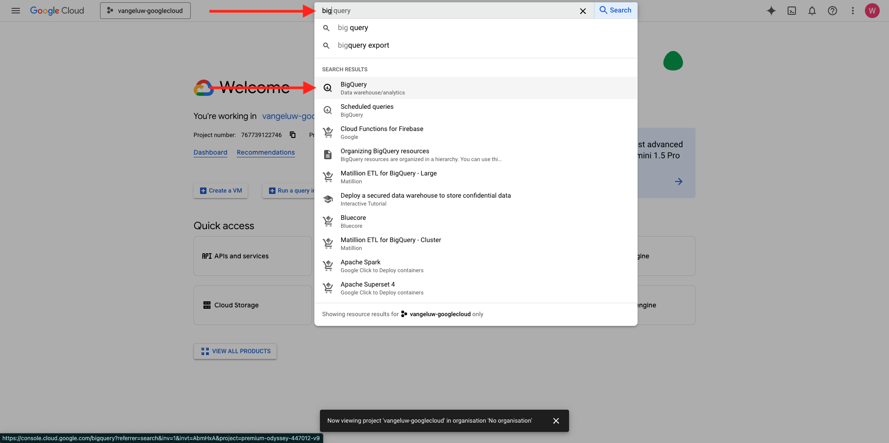
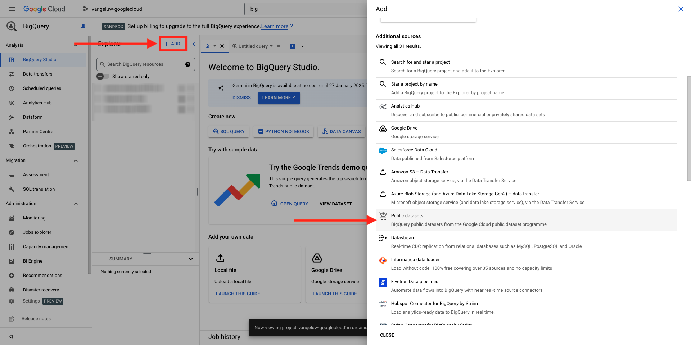

# 1.2.1 Börja använda Google Cloud Platform

>[!NOTE]
>
>För den här övningen behöver du tillgång till en Google Cloud Platform-miljö. Om du inte har tillgång till GCP än skapar du ett nytt konto med din personliga e-postadress.

## 1.2.1.1 Varför koppla Google BigQuery till Adobe Experience Platform för att hämta Google Analytics-data

Google Cloud Platform (GCP) är en serie publika molntjänster som erbjuds av Google. Google Cloud Platform innehåller en rad värdtjänster för dator-, lagrings- och programutveckling som körs på Google maskinvara.

BigQuery är en av dessa tjänster och ingår alltid i Google Analytics 360. Google Analytics-data samplas ofta när vi försöker hämta data direkt från dem (till exempel API). Det är därför Google inkluderar BigQuery för att få osamplade data, så att varumärkena kan göra avancerad analys med SQL och dra nytta av kraften i GCP.

Google Analytics data läses in dagligen till BigQuery med hjälp av en batchmekanism. Det är därför ingen mening med att använda denna GCP/BigQuery-integrering för personalisering i realtid och aktiveringsfall.

Om ett varumärke vill leverera användningsfall för personalisering i realtid baserat på Google Analytics-data, kan det samla in dessa data på webbplatsen med Google Tag Manager och sedan strömma dem till Adobe Experience Platform i realtid.

GCP/BigQuery Source Connector ska användas..

- spåra alla kundbeteenden på webbplatsen och läsa in dessa data i Adobe Experience Platform för analyser, datavetenskap och personalisering som inte kräver aktivering i realtid.
- läsa in Google Analytics historiska data i Adobe Experience Platform, återigen för analyser och datavetenskap

## 1.2.1.2 Ditt Google-konto

>[!NOTE]
>
>För den här övningen behöver du tillgång till en Google Cloud Platform-miljö. Om du inte har tillgång till GCP än skapar du ett nytt konto med din personliga e-postadress.

## 1.2.1.3 Välja eller skapa ett projekt

Gå till [https://console.cloud.google.com/](https://console.cloud.google.com/).

Klicka sedan på **Välj ett projekt** eller klicka på ett befintligt projekt.

Om du inte har något projekt än klickar du på **NYTT PROJEKT**. Om du redan har ett projekt kan du välja att välja det och fortsätta till nästa steg.

Namnge projektet enligt den här namnkonventionen. Klicka på **SKAPA**.

| Konvention |
| ----------------- |
| `--aepUserLdap---googlecloud` |

Vänta tills meddelandet längst upp till höger på skärmen talar om att skapandet är klart. Klicka sedan på **VÄLJ PROJEKT**.

Gå sedan till sökfältet överst på skärmen och skriv **BigQuery**. Markera det första resultatet.

Målet med den här modulen är att hämta Google Analytics-data till Adobe Experience Platform. För att göra det behöver ni testdata i en Google Analytics-datamängd för att börja med.

Klicka på **+ Lägg till** och sedan på **Offentliga datauppsättningar** på den högra menyn.

Då visas det här fönstret:

Ange söktermen **Google Analytics Sample** i sökfältet och klicka på det första sökresultatet.

Följande skärm visas med en beskrivning av datauppsättningen. Klicka på **VISA DATAUPPSÄTTNING**.

Du kommer sedan att omdirigeras till BigQuery där du kan se den här **bigquery-public-data**-datauppsättningen under **Utforskaren**.

I **Utforskaren** bör du nu se ett antal tabeller. Experimentera fritt. Gå till `google_analytics_sample`.

Klicka för att öppna tabellen `ga_sessions`.

Innan du fortsätter med nästa övning bör du skriva följande i en separat textfil på datorn:

| Autentiseringsuppgifter | Namngivning | Exempel |
| ----------------- |-------------| -------------|
| Projektnamn | `--aepUserLdap---googlecloud` | vangeluw-googlecloud |
| Projekt-ID | random | possible-bee-447102-h3 |

Du kan hitta ditt projektnamn och projekt-ID genom att klicka på ditt **projektnamn** i den övre menyraden:

Du kommer då att se ditt projekt-ID till höger:

Nu kan du gå vidare till nästa övning där du kan få dina händer smutsiga genom att fråga Google Analytics data.

## Nästa steg

Gå till [1.2.2 Skapa din första fråga i BigQuery](./ex2.md){target="_blank"}

Gå tillbaka till [Importera och analysera Google Analytics-data i Adobe Experience Platform med BigQuery Source Connector](./customer-journey-analytics-bigquery-gcp.md){target="_blank"}

Gå tillbaka till [Alla moduler](./../../../../overview.md){target="_blank"}
