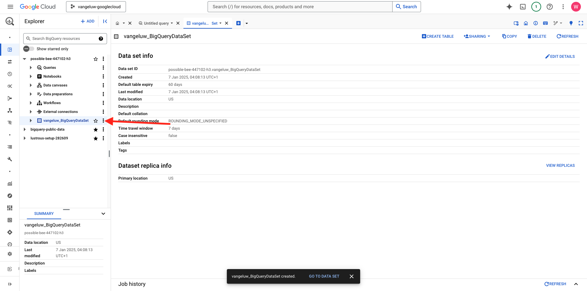
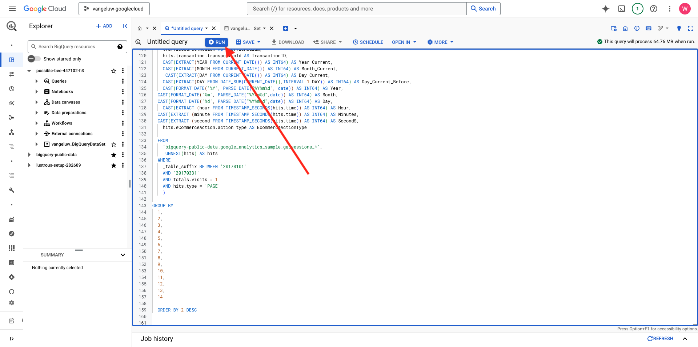

# 1.2.2 Skapa din första fråga i BigQuery

## Mål

- Utforska användargränssnittet för BigQuery
- Skapa en SQL-fråga i BigQuery
- Spara SQL-frågans resultat i en datauppsättning i BigQuery

## Kontext

När Google Analytics-data är i BigQuery kapslas alla dimensioner, mått och andra variabler. Dessutom läses data från Google Analytics in dagligen i olika tabeller. Det innebär att det är svårt och inte bra att försöka koppla ihop Google Analytics-tabeller i BigQuery med Adobe Experience Platform direkt.

Lösningen på det här problemet är att omvandla Google Analytics-data till ett läsbart format för att underlätta importen till Adobe Experience Platform.

## 1.2.2.1 Skapa en datauppsättning för att spara nya BigQuery-tabeller

Gå till [BigQuery-konsolen](https://console.cloud.google.com/bigquery).


I **Utforskaren** visas ditt projekt-ID. Klicka på ditt projekt-ID (klicka inte på datamängden **bigquery-public-data**).


Du ser att det inte finns någon datauppsättning än, så vi skapar en nu.
Klicka på den 3 **..** och sedan på **SKAPA DATAUPPSÄTTNING**.


Till höger på skärmen visas menyn **Skapa datauppsättning**.


Använd namnkonventionen nedan för **datauppsättnings-ID**. Lämna standardinställningarna för de andra fälten.

| Namngivning | Exempel |
| ----------------- | ------------- | 
| `--aepUserLdap--_BigQueryDataSet` | vangeluw_BigQueryDataSet |

Klicka på **SKAPA DATAUPPSÄTTNING**.


Sedan är du tillbaka i BigQuery-konsolen när datauppsättningen har skapats.



## 1.2.2.2 Skapa din första SQL BigQuery

Därefter skapar du din första fråga i BigQuery. Målet med den här frågan är att ta Google Analytics exempeldata och omvandla dem så att de kan importeras i Adobe Experience Platform. Gå till fliken **Namnlös fråga**.


Kopiera följande SQL-fråga och klistra in den i den frågeredigeraren. Läs frågan och förstå Google Analytics BigQuery-syntaxen.


```sql
SELECT
  CONCAT(fullVisitorId, CAST(hitTime AS String), '-', hitNumber) AS _id,
  TIMESTAMP(DATETIME(Year_Current, Month_Current, Day_Current, Hour, Minutes, Seconds)) AS timeStamp,
  fullVisitorId as GA_ID,
  -- Fake CUSTOMER ID
  CONCAT('3E-D4-',fullVisitorId, '-1W-93F' ) as customerID,
  Page,
  Landing_Page,
  Exit_Page,
  Device,
  Browser,
  MarketingChannel,
  TrafficSource,
  TrafficMedium,
  -- Enhanced Ecommerce
  TransactionID,
  CASE
      WHEN EcommerceActionType = '2' THEN 'Product_Detail_Views'
      WHEN EcommerceActionType = '3' THEN 'Adds_To_Cart'
      WHEN EcommerceActionType = '4' THEN 'Product_Removes_From_Cart'
      WHEN EcommerceActionType = '5' THEN 'Product_Checkouts'
      WHEN EcommerceActionType = '6' THEN 'Product_Refunds'
    ELSE
    NULL
  END
     AS Ecommerce_Action_Type,
  -- Entrances (metric)
  SUM(CASE
      WHEN isEntrance = TRUE THEN 1
    ELSE
    0
  END
    ) AS Entries,
    
--Pageviews (metric)
    COUNT(*) AS Pageviews,
    
 -- Exits 
    SUM(
    IF
      (isExit IS NOT NULL,
        1,
        0)) AS Exits,
        
 --Bounces
   SUM(CASE
      WHEN isExit = TRUE AND isEntrance = TRUE THEN 1
    ELSE
    0
  END
    ) AS Bounces,
        
  -- Unique Purchases (metric)
  COUNT(DISTINCT TransactionID) AS Unique_Purchases,
  -- Product Detail Views (metric)
  COUNT(CASE
      WHEN EcommerceActionType = '2' THEN fullVisitorId
    ELSE
    NULL
  END
    ) AS Product_Detail_Views,
  -- Product Adds To Cart (metric)
  COUNT(CASE
      WHEN EcommerceActionType = '3' THEN fullVisitorId
    ELSE
    NULL
  END
    ) AS Adds_To_Cart,
  -- Product Removes From Cart (metric)
  COUNT(CASE
      WHEN EcommerceActionType = '4' THEN fullVisitorId
    ELSE
    NULL
  END
    ) AS Product_Removes_From_Cart,
  -- Product Checkouts (metric)
  COUNT(CASE
      WHEN EcommerceActionType = '5' THEN fullVisitorId
    ELSE
    NULL
  END
    ) AS Product_Checkouts,
  -- Product Refunds (metric)
  COUNT(CASE
      WHEN EcommerceActionType = '7' THEN fullVisitorId
    ELSE
    NULL
  END
    ) AS Product_Refunds
  FROM (
  SELECT
    -- Landing Page (dimension)
    CASE
      WHEN hits.isEntrance = TRUE THEN hits.page.pageTitle
    ELSE NULL
  END
    AS Landing_page,
    
        -- Exit Page (dimension)
    CASE
      WHEN hits.isExit = TRUE THEN hits.page.pageTitle
    ELSE
    NULL
  END
    AS Exit_page,
    
    hits.page.pageTitle AS Page,
    hits.isEntrance,
    hits.isExit,
    hits.hitNumber as hitNumber,
    hits.time as hitTime,
    date as Fecha,
    fullVisitorId,
    visitStartTime,
    device.deviceCategory AS Device,
    device.browser AS Browser,
    channelGrouping AS MarketingChannel,
    trafficSource.source AS TrafficSource,
    trafficSource.medium AS TrafficMedium,
    hits.transaction.transactionId AS TransactionID,
    CAST(EXTRACT(YEAR FROM CURRENT_DATE()) AS INT64) AS Year_Current,
    CAST(EXTRACT(MONTH FROM CURRENT_DATE()) AS INT64) AS Month_Current,
     CAST(EXTRACT(DAY FROM CURRENT_DATE()) AS INT64) AS Day_Current,
    CAST(EXTRACT(DAY FROM DATE_SUB(CURRENT_DATE(),INTERVAL 1 DAY)) AS INT64) AS Day_Current_Before,
    CAST(FORMAT_DATE('%Y', PARSE_DATE("%Y%m%d", date)) AS INT64) AS Year,
  CAST(FORMAT_DATE('%m', PARSE_DATE("%Y%m%d",date)) AS INT64) AS Month,
  CAST(FORMAT_DATE('%d', PARSE_DATE("%Y%m%d",date)) AS INT64) AS Day,
    CAST(EXTRACT (hour FROM TIMESTAMP_SECONDS(hits.time)) AS INT64) AS Hour,
  CAST(EXTRACT (minute FROM TIMESTAMP_SECONDS(hits.time)) AS INT64) AS Minutes,
  CAST(EXTRACT (second FROM TIMESTAMP_SECONDS(hits.time)) AS INT64) AS SecondS,
    hits.eCommerceAction.action_type AS EcommerceActionType
  
  FROM
    `bigquery-public-data.google_analytics_sample.ga_sessions_*`,
     UNNEST(hits) AS hits
  WHERE
    _table_suffix BETWEEN '20170101'
    AND '20170331'
    AND totals.visits = 1
    AND hits.type = 'PAGE'
    )
    
GROUP BY
  1,
  2,
  3,
  4,
  5,
  6,
  7,
  8,
  9,
  10,
  11,
  12,
  13,
  14
    
  ORDER BY 2 DESC
```

När du är klar klickar du på **Kör** för att köra frågan:



Det kan ta några minuter att köra frågan.

När frågan har körts klart visas utdata nedan i **frågeresultatet**.


## 1.2.2.3 Spara resultatet av BigQuery SQL-frågan

Nästa steg är att spara frågans utdata genom att klicka på knappen **SPARA RESULTAT** .


Välj **BigQuery-tabell** som plats för dina utdata.


Därefter visas ett nytt popup-fönster där ditt **projektnamn** och **datauppsättningsnamn** är ifyllda i förväg. Datauppsättningsnamnet ska vara den datauppsättning som du skapade i början av den här övningen, med den här namnkonventionen:

| Namngivning | Exempel |
| ----------------- | ------------- | 
| `--aepUserLdap--_BigQueryDataSet` | `vangeluw_BigQueryDataSet` |

Nu måste du ange ett tabellnamn. Använd den här namnkonventionen:

| Namngivning | Exempel |
| ----------------- |------------- | 
| `--aepUserLdap--_GAdataTableBigQuery` | `vangeluw_GAdataTableBigQuery` |

Klicka på **SPARA**.


Det kan ta en stund innan data är klara i tabellen som du har skapat. Uppdatera webbläsaren efter några minuter. I datauppsättningen ska du sedan se tabellen `--aepUserLdap--_GAdataTableBigquery` under **Utforskaren** i ditt BigQuery-projekt.


Nu kan du fortsätta med nästa övning där du kopplar tabellen till Adobe Experience Platform.

## Nästa steg

Gå till [1.2.3 Anslut GCP och BigQuery till Adobe Experience Platform](./ex3.md){target="_blank"}

Gå tillbaka till [Importera och analysera Google Analytics-data i Adobe Experience Platform med BigQuery Source Connector](./customer-journey-analytics-bigquery-gcp.md){target="_blank"}

Gå tillbaka till [Alla moduler](./../../../../overview.md){target="_blank"}
