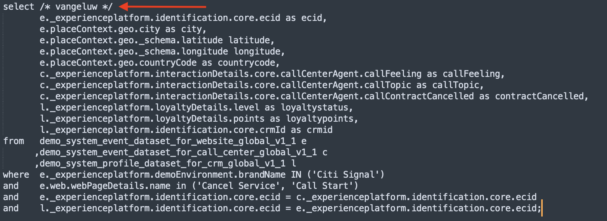

# 2.1.4 Frågor, frågor, frågor ... och kundanalys

## Syfte

- Skriv frågor för dataanalyser
- Skriv SQL-frågor som kombinerar online-, call center- och lojalitetsdata som finns i Adobe Experience Platform
- Läs om Adobe definierade funktioner

## Kontext

I den här övningen ska du skriva frågor för att analysera produktvyer, produkttrattar, urn osv.

Alla frågor som visas i det här kapitlet kommer att köras i kommandoradsgränssnittet **PSQL**. Du bör kopiera (CTRL-c) de programsatsblock som anges med **SQL** och klistra in (CTRL-v) dem i kommandoradsgränssnittet **PSQL**. Blocken **Frågeresultat** visar den inklistrade SQL-satsen och det associerade frågeresultatet.

## Skriv grundläggande frågor för dataanalys

### Tidsstämpel

Data som samlats in i Adobe Experience Platform är tidsstämplade. Med attributet **timestamp** kan du analysera data över tid.

Hur många produktvisningar har vi dagligen?

**SQL**

```sql
select date_format( timestamp , 'yyyy-MM-dd') AS Day,
       count(*) AS productViews
from   demo_system_event_dataset_for_website_global_v1_1
where  --aepTenantId--.demoEnvironment.brandName IN ('Citi Signal')
and eventType = 'commerce.productViews'
group by Day
limit 10;
```

Kopiera satsen ovan och kör den i kommandoradsgränssnittet **PSQL**.

**Frågeresultat**

```text
tech-insiders:all=> select date_format( timestamp , 'yyyy-MM-dd') AS Day,
       count(*) AS productViews
from   demo_system_event_dataset_for_website_global_v1_1
where  _experienceplatform.demoEnvironment.brandName IN ('Citi Signal')
and eventType = 'commerce.productViews'
group by Day
limit 10;
    Day     | productViews 
------------+--------------
 2024-12-04 |         2297
(1 row)
```

### De fem vanligaste produkterna

Vilka är de fem främsta produkterna?

#### SQL

```sql
select productListItems.name, count(*)
from   demo_system_event_dataset_for_website_global_v1_1
where  --aepTenantId--.demoEnvironment.brandName IN ('Citi Signal')
and    eventType = 'commerce.productViews'
group  by productListItems.name
order  by 2 desc
limit 5;
```

Kopiera satsen ovan och kör den i kommandoradsgränssnittet **PSQL**.

**Frågeresultat**

```text
tech-insiders:all=> select productListItems.name, count(*)
from   demo_system_event_dataset_for_website_global_v1_1
where  _experienceplatform.demoEnvironment.brandName IN ('Citi Signal')
and    eventType = 'commerce.productViews'
group  by productListItems.name
order  by 2 desc
limit 5;
                  name                   | count(1) 
-----------------------------------------+----------
 {Google Pixel XL 32GB Black Smartphone} |      938
 {SIM Only}                              |      482
 {Samsung Galaxy S8}                     |      456
 {Samsung Galaxy S7 32GB Black}          |      421
(4 rows)
```

### Produktinteraktionstru, från visning till köp

**SQL**

```sql
select eventType, count(*)
from   demo_system_event_dataset_for_website_global_v1_1
where  --aepTenantId--.demoEnvironment.brandName IN ('Citi Signal')
and    eventType is not null
and    eventType <> ''
group  by eventType;
```

Kopiera satsen ovan och kör den i kommandoradsgränssnittet **PSQL**.

**Frågeresultat**

```text
tech-insiders:all=> select eventType, count(*)
from   demo_system_event_dataset_for_website_global_v1_1
where  _experienceplatform.demoEnvironment.brandName IN ('Citi Signal')
and    eventType is not null
and    eventType <> ''
group  by eventType;
        eventType         | count(1) 
--------------------------+----------
 commerce.productListAdds |      494
 commerce.purchases       |      246
 commerce.productViews    |     2297
(3 rows)
```

### Identifiera besökare med risk för Churn (besökssida => Avbryt tjänst)

**SQL**

```sql
select distinct --aepTenantId--.identification.core.ecid
from   demo_system_event_dataset_for_website_global_v1_1
where  --aepTenantId--.demoEnvironment.brandName IN ('Citi Signal')
and    web.webPageDetails.name = 'Cancel Service'
group  by --aepTenantId--.identification.core.ecid
limit 10;
```

Kopiera satsen ovan och kör den i kommandoradsgränssnittet **PSQL**.

**Frågeresultat**

```text
tech-insiders:all=> select distinct _experienceplatform.identification.core.ecid
from   demo_system_event_dataset_for_website_global_v1_1
where  _experienceplatform.demoEnvironment.brandName IN ('Citi Signal')
and    web.webPageDetails.name = 'Cancel Service'
group  by _experienceplatform.identification.core.ecid
limit 10;
               ecid               
----------------------------------
 86069928882940477620713284798772
 75691756152042231410852704832434
 47381264398548915586824480724480
 51294194577949645447313762862726
 95873885060131472480685538836534
 71192995127345419624952514250737
 81469709164961922907426138040032
 53545252726821876244061095202780
 13294750130353985087337266864522
 58843891994459565443501421307174
(10 rows)
```

I nästa frågeuppsättning kommer vi att utöka frågan ovan för att få en fullständig bild av kunderna och deras beteenden som har besökt sidan&quot;Avbryt tjänst&quot;. Du får lära dig hur du använder Adobe Defined Function för att samla in information, identifiera sekvenser och tidsinställningar för händelser. Ni kommer också att sammanfoga datauppsättningar för att ytterligare berika och förbereda data för analys i Microsoft Power BI.

## Avancerade frågor

Huvuddelen av affärslogiken kräver att man samlar kontaktytorna för en kund och beställer dem i tid. Det här stödet tillhandahålls av Spark SQL i form av fönsterfunktioner. Fönsterfunktioner är en del av standard-SQL och stöds av många andra SQL-motorer.

### Adobe-definierade funktioner

Adobe har lagt till en uppsättning **Adobe-definierade funktioner** i SQL-standardsyntaxen som gör att du bättre kan förstå dina upplevelsedata. I de följande frågorna får du lära dig mer om dessa ADF-funktioner. Du hittar mer information och den fullständiga listan [ i dokumentationen](https://experienceleague.adobe.com/docs/experience-platform/query/sql/adobe-defined-functions.html?lang=sv-SE).

### Vad gör folk på webbplatsen innan de kommer till sidan&quot;Avbryt tjänst&quot; som den tredje sidan i en session?

Med den här frågan kommer du att upptäcka de två första Adobe-definierade funktionerna **SESS_TIMEOUT** och **NEXT**

> **SESS_TIMEOUT()** återger de besöksgrupperingar som hittats med Adobe Analytics. Den utför en liknande tidsbaserad gruppering, men anpassningsbara parametrar.
>
> **NEXT()** och **PREVIOUS()** hjälper dig att förstå hur kunderna navigerar på webbplatsen.

**SQL**

```sql
SELECT
  webPage,
  webPage_2,
  webPage_3,
  webPage_4,
  count(*) journeys
FROM
  (
      SELECT
        webPage,
        NEXT(webPage, 1, true)
          OVER(PARTITION BY ecid, session.num
                ORDER BY timestamp
                ROWS BETWEEN CURRENT ROW AND UNBOUNDED FOLLOWING).value
          AS webPage_2,
        NEXT(webPage, 2, true)
          OVER(PARTITION BY ecid, session.num
                ORDER BY timestamp
                ROWS BETWEEN CURRENT ROW AND UNBOUNDED FOLLOWING).value
          AS webPage_3,
        NEXT(webPage, 3, true)
           OVER(PARTITION BY ecid, session.num
                ORDER BY timestamp
                ROWS BETWEEN CURRENT ROW AND UNBOUNDED FOLLOWING).value
          AS webPage_4,
        session.depth AS SessionPageDepth
      FROM (
            select a.--aepTenantId--.identification.core.ecid as ecid,
                   a.timestamp,
                   web.webPageDetails.name as webPage,
                    SESS_TIMEOUT(timestamp, 60 * 30) 
                       OVER (PARTITION BY a.--aepTenantId--.identification.core.ecid 
                             ORDER BY timestamp 
                             ROWS BETWEEN UNBOUNDED PRECEDING AND CURRENT ROW) 
                  AS session
            from   demo_system_event_dataset_for_website_global_v1_1 a
            where  a.--aepTenantId--.identification.core.ecid in ( 
                select b.--aepTenantId--.identification.core.ecid
                from   demo_system_event_dataset_for_website_global_v1_1 b
                where  b.--aepTenantId--.demoEnvironment.brandName IN ('Citi Signal')
                and    b.web.webPageDetails.name = 'Cancel Service'
            )
        )
)
WHERE SessionPageDepth=1
and   webpage_3 = 'Cancel Service'
GROUP BY webPage, webPage_2, webPage_3, webPage_4
ORDER BY journeys DESC
LIMIT 10;
```

Kopiera satsen ovan och kör den i kommandoradsgränssnittet **PSQL**.

**Frågeresultat**

```text
                webPage                |               webPage_2               |   webPage_3    | webPage_4  | journeys 
---------------------------------------+---------------------------------------+----------------+------------+----------
 Telco Home                            | Citi Signal Sport                     | Cancel Service | Call Start |        2
 Citi Signal Sport                     | Google Pixel XL 32GB Black Smartphone | Cancel Service | Call Start |        2
 Broadband Deals                       | Samsung Galaxy S7 32GB Black          | Cancel Service |            |        2
 TV & Broadband Deals                  | Samsung Galaxy S7 32GB Black          | Cancel Service |            |        2
 SIM Only                              | Citi Signal Shop                      | Cancel Service |            |        2
 Google Pixel XL 32GB Black Smartphone | Broadband Deals                       | Cancel Service |            |        2
 SIM Only                              | Telco Home                            | Cancel Service |            |        2
 Citi Signal Shop                      | Samsung Galaxy S7 32GB Black          | Cancel Service | Call Start |        1
 Google Pixel XL 32GB Black Smartphone | Citi Signal Sport                     | Cancel Service | Call Start |        1
 Google Pixel XL 32GB Black Smartphone | Citi Signal Shop                      | Cancel Service | Call Start |        1
(10 rows)
```

### Hur lång tid har vi innan en besökare ringer callcentret efter att ha besökt sidan&quot;Avbryt tjänst&quot;?

För att svara på den här typen av frågor använder vi den Adobe-definierade funktionen **TIME_BETWEEN_NEXT_MATCH()** .

> Tiden mellan föregående och nästa matchningsfunktioner ger en ny dimension som mäter den tid som har gått sedan en viss incident.

**SQL**

```sql
select * from (
       select --aepTenantId--.identification.core.ecid as ecid,
              web.webPageDetails.name as webPage,
              TIME_BETWEEN_NEXT_MATCH(timestamp, web.webPageDetails.name='Call Start', 'seconds')
              OVER(PARTITION BY --aepTenantId--.identification.core.ecid
                  ORDER BY timestamp
                  ROWS BETWEEN CURRENT ROW AND UNBOUNDED FOLLOWING)
              AS contact_callcenter_after_seconds
       from   demo_system_event_dataset_for_website_global_v1_1
       where  --aepTenantId--.demoEnvironment.brandName IN ('Citi Signal')
       and    web.webPageDetails.name in ('Cancel Service', 'Call Start')
) r
where r.webPage = 'Cancel Service'
limit 15;
```

Kopiera satsen ovan och kör den i kommandoradsgränssnittet **PSQL**.

**Frågeresultat**

```text
               ecid               |    webPage     | contact_callcenter_after_seconds 
----------------------------------+----------------+----------------------------------
 00331886620679939148047665693117 | Cancel Service |                                 
 00626561600197295782131349716866 | Cancel Service |                                 
 00630470663554417679969244202779 | Cancel Service |                             -797
 00720875344152796154458668700428 | Cancel Service |                             -519
 00746064605049656090779523644276 | Cancel Service |                              -62
 00762093837616944422322357210965 | Cancel Service |                                 
 00767875779073091876070699689209 | Cancel Service |                                 
 00798691264980137616449378075855 | Cancel Service |                                 
 00869613691740150556826953447162 | Cancel Service |                             -129
 00943638725078228957873279219207 | Cancel Service |                             -750
 01167540466536077846425644389346 | Cancel Service |                                 
 01412448537869549016063764484810 | Cancel Service |                                 
 01419076946514450291741574452702 | Cancel Service |                             -482
 01533124771963987423015507880755 | Cancel Service |                                 
 01710651086750904478559809475925 | Cancel Service |                                 
(15 rows)
```

### Och vad blir resultatet av den kontakten?

I den här frågan kommer du att koppla samman datauppsättningar. I det här fallet ansluter du datauppsättningen `demo_system_event_dataset_for_website_global_v1_1` med datauppsättningen `demo_system_event_dataset_for_call_center_global_v1_1`. Detta görs för att förstå resultatet av kundtjänstens interaktion.

**SQL**

```sql
select distinct r.*,
       c.--aepTenantId--.interactionDetails.core.callCenterAgent.callFeeling,
       c.--aepTenantId--.interactionDetails.core.callCenterAgent.callTopic,
       c.--aepTenantId--.interactionDetails.core.callCenterAgent.callContractCancelled
from (
       select --aepTenantId--.identification.core.ecid ecid,
              web.webPageDetails.name as webPage,
              TIME_BETWEEN_NEXT_MATCH(timestamp, web.webPageDetails.name='Call Start', 'seconds')
              OVER(PARTITION BY --aepTenantId--.identification.core.ecid
                  ORDER BY timestamp
                  ROWS BETWEEN CURRENT ROW AND UNBOUNDED FOLLOWING)
              AS contact_callcenter_after_seconds
       from   demo_system_event_dataset_for_website_global_v1_1
       where  --aepTenantId--.demoEnvironment.brandName IN ('Citi Signal')
       and    web.webPageDetails.name in ('Cancel Service', 'Call Start')
) r
, demo_system_event_dataset_for_call_center_global_v1_1 c
where r.ecid = c.--aepTenantId--.identification.core.ecid
and r.webPage = 'Cancel Service'
and c.--aepTenantId--.interactionDetails.core.callCenterAgent.callContractCancelled IN (true,false)
and c.--aepTenantId--.interactionDetails.core.callCenterAgent.callTopic IN ('contract', 'invoice','complaint','wifi')
limit 15;
```

Kopiera satsen ovan och kör den i kommandoradsgränssnittet **PSQL**.

**Frågeresultat**

```text
               ecid               |    webPage     | contact_callcenter_after_seconds | callfeeling | calltopic | callcontractcancelled 
----------------------------------+----------------+----------------------------------+-------------+-----------+-----------------------
 00630470663554417679969244202779 | Cancel Service |                             -797 | negative    | contract  | f
 00720875344152796154458668700428 | Cancel Service |                             -519 | positive    | contract  | f
 00746064605049656090779523644276 | Cancel Service |                              -62 | positive    | contract  | t
 00869613691740150556826953447162 | Cancel Service |                             -129 | negative    | contract  | t
 00943638725078228957873279219207 | Cancel Service |                             -750 | positive    | contract  | f
 01419076946514450291741574452702 | Cancel Service |                             -482 | neutral     | contract  | f
 01738842540109643781526526573341 | Cancel Service |                             -562 | neutral     | contract  | f
 02052460258994877317679083617975 | Cancel Service |                             -545 | neutral     | contract  | f
 02156496759733199802585567179589 | Cancel Service |                              -83 | neutral     | contract  | t
 02666934104296797891818818456669 | Cancel Service |                             -297 | positive    | contract  | t
 03059764265715537001416957172652 | Cancel Service |                             -243 | negative    | contract  | t
 03347899869945278660479273416679 | Cancel Service |                             -229 | positive    | contract  | t
 04258863338643046907489131372300 | Cancel Service |                             -588 | positive    | contract  | f
 04733864373954008966920919247566 | Cancel Service |                             -795 | neutral     | contract  | f
 05199871096822598772351169572451 | Cancel Service |                             -236 | positive    | contract  | t
(15 rows)
```

### Vilken lojalitetsprofil har dessa kunder?

I den här frågan ansluter vi CRM-data som har registrerats i Adobe Experience Platform. Detta gör det möjligt att förbättra bortfallsanalysen med CRM-data.

**SQL**

```sql
select r.*,
       c.--aepTenantId--.interactionDetails.core.callCenterAgent.callFeeling,
       c.--aepTenantId--.interactionDetails.core.callCenterAgent.callTopic,
       l.--aepTenantId--.loyaltyDetails.level,
       l.--aepTenantId--.identification.core.crmId
from (
       select --aepTenantId--.identification.core.ecid ecid,
              web.webPageDetails.name as webPage,
              TIME_BETWEEN_NEXT_MATCH(timestamp, web.webPageDetails.name='Call Start', 'seconds')
              OVER(PARTITION BY --aepTenantId--.identification.core.ecid
                  ORDER BY timestamp
                  ROWS BETWEEN CURRENT ROW AND UNBOUNDED FOLLOWING)
              AS contact_callcenter_after_seconds
       from   demo_system_event_dataset_for_website_global_v1_1
       where  --aepTenantId--.demoEnvironment.brandName IN ('Citi Signal')
       and    web.webPageDetails.name in ('Cancel Service', 'Call Start')
) r
, demo_system_event_dataset_for_call_center_global_v1_1 c
, demo_system_profile_dataset_for_crm_global_v1_1 l
where r.ecid = c.--aepTenantId--.identification.core.ecid
and r.webPage = 'Cancel Service'
and l.--aepTenantId--.identification.core.ecid = r.ecid
and c.--aepTenantId--.interactionDetails.core.callCenterAgent.callTopic IN ('contract', 'invoice','complaint','wifi','promo')
limit 15;
```

Kopiera satsen ovan och kör den i kommandoradsgränssnittet **PSQL**.

**Frågeresultat**

```text
               ecid               |    webPage     | contact_callcenter_after_seconds | callfeeling | calltopic | level  |   crmid   
----------------------------------+----------------+----------------------------------+-------------+-----------+--------+-----------
 00630470663554417679969244202779 | Cancel Service |                             -797 | negative    | contract  | Bronze | 524483285
 00720875344152796154458668700428 | Cancel Service |                             -519 | positive    | contract  | Silver | 860696333
 00746064605049656090779523644276 | Cancel Service |                              -62 | positive    | contract  | Bronze | 072387270
 00869613691740150556826953447162 | Cancel Service |                             -129 | negative    | contract  | Bronze | 789347684
 00943638725078228957873279219207 | Cancel Service |                             -750 | positive    | contract  | Gold   | 033926162
 01419076946514450291741574452702 | Cancel Service |                             -482 | neutral     | contract  | Bronze | 105063634
 01738842540109643781526526573341 | Cancel Service |                             -562 | neutral     | contract  | Gold   | 791324509
 02052460258994877317679083617975 | Cancel Service |                             -545 | neutral     | contract  | Gold   | 443477555
 02156496759733199802585567179589 | Cancel Service |                              -83 | neutral     | contract  | Silver | 305085589
 02666934104296797891818818456669 | Cancel Service |                             -297 | positive    | contract  | Silver | 104266570
 03059764265715537001416957172652 | Cancel Service |                             -243 | negative    | contract  | Silver | 814175245
 03347899869945278660479273416679 | Cancel Service |                             -229 | positive    | contract  | Gold   | 377699708
 04258863338643046907489131372300 | Cancel Service |                             -588 | positive    | contract  | Silver | 298321657
 04733864373954008966920919247566 | Cancel Service |                             -795 | neutral     | contract  | Gold   | 655070958
 05199871096822598772351169572451 | Cancel Service |                             -236 | positive    | contract  | Gold   | 425688874
(15 rows)
```

### Från vilken region besöker de oss?

Här kan vi ta med geografisk information, som longitud, attityd, stad, landskod, som tagits av Adobe Experience Platform för att få en del geografiska insikter om hur kunderna kan försvinna.

**SQL**

```sql
       select distinct r.ecid,
              r.city,
              r.countrycode,
              r.lat as latitude,
              r.lon as longitude,
              r.contact_callcenter_after_seconds as seconds_to_contact_callcenter,
              c.--aepTenantId--.interactionDetails.core.callCenterAgent.callFeeling,
              c.--aepTenantId--.interactionDetails.core.callCenterAgent.callTopic,
              c.--aepTenantId--.interactionDetails.core.callCenterAgent.callContractCancelled,
              l.--aepTenantId--.loyaltyDetails.level,
              l.--aepTenantId--.identification.core.crmId
       from (
              select --aepTenantId--.identification.core.ecid ecid,
                     placeContext.geo._schema.latitude lat,
                     placeContext.geo._schema.longitude lon,
                     placeContext.geo.city,
                     placeContext.geo.countryCode,
                     web.webPageDetails.name as webPage,
                     TIME_BETWEEN_NEXT_MATCH(timestamp, web.webPageDetails.name='Call Start', 'seconds')
                     OVER(PARTITION BY --aepTenantId--.identification.core.ecid
                         ORDER BY timestamp
                         ROWS BETWEEN CURRENT ROW AND UNBOUNDED FOLLOWING)
                     AS contact_callcenter_after_seconds
              from   demo_system_event_dataset_for_website_global_v1_1
              where  --aepTenantId--.demoEnvironment.brandName IN ('Citi Signal')
              and    web.webPageDetails.name in ('Cancel Service', 'Call Start')
       ) r
       , demo_system_event_dataset_for_call_center_global_v1_1 c
       , demo_system_profile_dataset_for_crm_global_v1_1 l
       where r.ecid = c.--aepTenantId--.identification.core.ecid
       and r.webPage = 'Cancel Service'
       and l.--aepTenantId--.identification.core.ecid = r.ecid
       and c.--aepTenantId--.interactionDetails.core.callCenterAgent.callTopic IN ('contract', 'invoice','complaint','wifi','promo')
       limit 15;
```

Kopiera satsen ovan och kör den i kommandoradsgränssnittet **PSQL**.

**Frågeresultat**

```text
               ecid               |    city    | countrycode |  latitude  | longitude  | seconds_to_contact_callcenter | callfeeling | calltopic | callcontractcancelled | level  |   crmid   
----------------------------------+------------+-------------+------------+------------+-------------------------------+-------------+-----------+-----------------------+--------+-----------
 00630470663554417679969244202779 | Charlton   | GB          |   51.59119 |  -1.407848 |                          -797 | negative    | contract  | f                     | Bronze | 524483285
 00720875344152796154458668700428 | Ashley     | GB          | 51.4139633 | -2.2685462 |                          -519 | positive    | contract  | f                     | Silver | 860696333
 00746064605049656090779523644276 | Liverpool  | GB          | 53.4913801 |  -2.867264 |                           -62 | positive    | contract  | t                     | Bronze | 072387270
 00869613691740150556826953447162 | Langley    | GB          |  51.888151 |   -0.23924 |                          -129 | negative    | contract  | t                     | Bronze | 789347684
 00943638725078228957873279219207 | Eaton      | GB          | 53.2945961 | -0.9335791 |                          -750 | positive    | contract  | f                     | Gold   | 033926162
 01419076946514450291741574452702 | Tullich    | GB          | 57.4694803 | -3.1269422 |                          -482 | neutral     | contract  | f                     | Bronze | 105063634
 01738842540109643781526526573341 | Whitwell   | GB          | 54.3886617 |  -1.555363 |                          -562 | neutral     | contract  | f                     | Gold   | 791324509
 02052460258994877317679083617975 | Edinburgh  | GB          | 55.9309486 | -3.1859102 |                          -545 | neutral     | contract  | f                     | Gold   | 443477555
 02156496759733199802585567179589 | West End   | GB          |   53.46464 |    0.04134 |                           -83 | neutral     | contract  | t                     | Silver | 305085589
 02666934104296797891818818456669 | Newtown    | GB          | 51.3684218 | -1.3218754 |                          -297 | positive    | contract  | t                     | Silver | 104266570
 03059764265715537001416957172652 | Edinburgh  | GB          | 55.9309486 | -3.1859102 |                          -243 | negative    | contract  | t                     | Silver | 814175245
 03347899869945278660479273416679 | Liverpool  | GB          | 53.4913801 |  -2.867264 |                          -229 | positive    | contract  | t                     | Gold   | 377699708
 04258863338643046907489131372300 | Norton     | GB          | 52.2679288 | -1.1202549 |                          -588 | positive    | contract  | f                     | Silver | 298321657
 04733864373954008966920919247566 | Whitchurch | GB          | 51.4057505 | -2.5573746 |                          -795 | neutral     | contract  | f                     | Gold   | 655070958
 05199871096822598772351169572451 | Stapleford | GB          |   53.10672 |  -0.687802 |                          -236 | positive    | contract  | t                     | Gold   | 425688874
(15 rows)
```

## Interaktionsanalys för callcenter

I frågorna ovan tittade vi bara på besökarna som kontaktade callcentret om tjänsten skulle avbrytas. Vi vill gå ett steg längre och ta hänsyn till all interaktion med call center, inklusive (wifi, promo, invoice, complement och contract).

Du måste redigera en fråga, så vi öppnar först anteckningsblocket eller hakparenteserna.

I Windows klickar du på sökikonen (1) i Windows-verktygsfältet och skriver **anteckningsblocket** i sökfältet (2). Klicka sedan på (3) &quot;anteckningsblocket&quot;-resultatet:


På Mac


Kopiera följande programsats till anteckningsblock/klamrar:

```sql
select /* enter your name */
       e.--aepTenantId--.identification.core.ecid as ecid,
       e.placeContext.geo.city as city,
       e.placeContext.geo._schema.latitude latitude,
       e.placeContext.geo._schema.longitude longitude,
       e.placeContext.geo.countryCode as countrycode,
       c.--aepTenantId--.interactionDetails.core.callCenterAgent.callFeeling as callFeeling,
       c.--aepTenantId--.interactionDetails.core.callCenterAgent.callTopic as callTopic,
       c.--aepTenantId--.interactionDetails.core.callCenterAgent.callContractCancelled as contractCancelled,
       l.--aepTenantId--.loyaltyDetails.level as loyaltystatus,
       l.--aepTenantId--.loyaltyDetails.points as loyaltypoints,
       l.--aepTenantId--.identification.core.crmId as crmid
from   demo_system_event_dataset_for_website_global_v1_1 e
      ,demo_system_event_dataset_for_call_center_global_v1_1 c
      ,demo_system_profile_dataset_for_crm_global_v1_1 l
where  e.--aepTenantId--.demoEnvironment.brandName IN ('Citi Signal')
and    e.web.webPageDetails.name in ('Cancel Service', 'Call Start')
and    e.--aepTenantId--.identification.core.ecid = c.--aepTenantId--.identification.core.ecid
and    l.--aepTenantId--.identification.core.ecid = e.--aepTenantId--.identification.core.ecid;
```

Och ersätt

```text
enter your name
```

Ta inte bort `/\*` och `\*/`. Din ändrade programsats i Anteckningsblocket ska se ut så här:



Kopiera den ändrade satsen från **anteckningsblocket** till **PSQL-kommandoradsfönstret** och tryck på Retur. Följande resultat visas i kommandoradsfönstret för PSQL:

```text
tech-insiders:all=> select /* vangeluw */
       e._experienceplatform.identification.core.ecid as ecid,
       e.placeContext.geo.city as city,
       e.placeContext.geo._schema.latitude latitude,
       e.placeContext.geo._schema.longitude longitude,
       e.placeContext.geo.countryCode as countrycode,
       c._experienceplatform.interactionDetails.core.callCenterAgent.callFeeling as callFeeling,
       c._experienceplatform.interactionDetails.core.callCenterAgent.callTopic as callTopic,
       c._experienceplatform.interactionDetails.core.callCenterAgent.callContractCancelled as contractCancelled,
       l._experienceplatform.loyaltyDetails.level as loyaltystatus,
       l._experienceplatform.loyaltyDetails.points as loyaltypoints,
       l._experienceplatform.identification.core.crmId as crmid
from   demo_system_event_dataset_for_website_global_v1_1 e
      ,demo_system_event_dataset_for_call_center_global_v1_1 c
      ,demo_system_profile_dataset_for_crm_global_v1_1 l
where  e._experienceplatform.demoEnvironment.brandName IN ('Citi Signal')
and    e.web.webPageDetails.name in ('Cancel Service', 'Call Start')
and    e._experienceplatform.identification.core.ecid = c._experienceplatform.identification.core.ecid
and    l._experienceplatform.identification.core.ecid = e._experienceplatform.identification.core.ecid;
               ecid               |    city    |  latitude  | longitude  | countrycode | callFeeling | callTopic | contractCancelled | loyaltystatus | loyaltypoints |   crmid   
----------------------------------+------------+------------+------------+-------------+-------------+-----------+-------------------+---------------+---------------+-----------
 60082543727227001177187726544992 | Normanton  |  52.643749 |  -0.622129 | GB          | neutral     | contract  | f                 | Bronze        |         430.0 | 117969439
 03250145103029549687906576330844 | Charlton   |   51.59119 |  -1.407848 | GB          | none        | none      | f                 | Silver        |         585.0 | 271570836
 87322786414150971711720565798532 | Whitwell   | 54.3886617 |  -1.555363 | GB          | none        | none      | f                 | Bronze        |         872.0 | 570762160
 46736059905281823751180777497223 | Edinburgh  | 55.9309486 | -3.1859102 | GB          | none        | none      | f                 | Gold          |         482.0 | 980678773
 81958524709959359235057647680790 | Linton     | 54.0542238 | -2.0215836 | GB          | none        | none      | f                 | Bronze        |         666.0 | 341873673
 24854602977644353049269284436324 | Tullich    | 57.4694803 | -3.1269422 | GB          | negative    | contract  | f                 | Bronze        |         418.0 | 831581327
 24854602977644353049269284436324 | Tullich    | 57.4694803 | -3.1269422 | GB          | negative    | contract  | f                 | Bronze        |         418.0 | 831581327
```

I nästa steg kommer du att behålla frågan (kallas även **skapa tabell som markerad** eller **CTAS**) som en ny datauppsättning som du kommer att använda i Microsoft Power BI.

## Nästa steg

Gå till [2.1.5 Generera en datauppsättning från en fråga](./ex5.md){target="_blank"}

Gå tillbaka till [frågetjänsten](./query-service.md){target="_blank"}

Gå tillbaka till [Alla moduler](./../../../../overview.md){target="_blank"}
