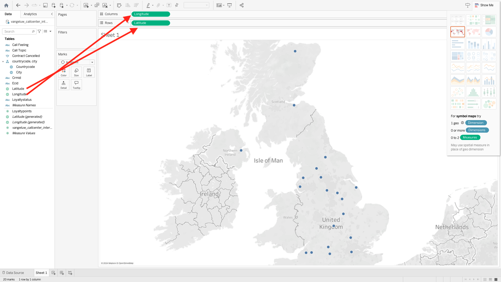

# 2.1.7 Query Service och Tableau

Öppna Tableu.

I **Anslut till en server** klickar du på **Mer** och sedan på **PostgreSQL**.

Om du inte har använt PostgeSQL med Tableau än kan du se det här. Klicka på **Hämta drivrutin**.

Följ instruktionerna för att hämta och installera PostgreSQL-drivrutinen.

När du är klar med installationen av drivrutinen avslutar du och startar om Tableau Desktop. Efter omstarten går du till **Anslut till en server** igen, klickar på **Mer** och sedan på **PostgreSQL** igen.

Då ser du det här.

Gå till Adobe Experience Platform, till **Frågor** och till **Referenser**.

Kopiera **Host** från sidan **Credentials** i Adobe Experience Platform och klistra in den i fältet **Server**, kopiera **Database** och klistra in den i fältet **Database** i Tablet, kopiera **Port** och klistra in den i fältet **Port** i Tablet u gör du samma för **Användarnamn** och **Lösenord**. Klicka sedan på **Logga in**.

I listan med tillgängliga tabeller letar du reda på tabellen som du skapade i föregående övning, som kallas `--aepUserLdap--_callcenter_interaction_analysis`. Dra den till arbetsytan.

Då ser du det här. Klicka på **Uppdatera nu**.

Du kommer då att se data från AEP bli tillgängliga i Tableau. Klicka på **Blad 1** för att börja arbeta med data.

Om du vill visualisera data på kartan måste du konvertera longitud och latitud till dimensioner. I **Mått** högerklickar du på **Latitude** och väljer **Konvertera till Dimension** på menyn. Gör på samma sätt för måttet **Longitude**.

Dra måttet **Longitude** till **Columns** och måttet **Latitude** till **Rows**. Kartan för **Belgien** visas automatiskt med få punkter som representerar städerna i datauppsättningen.

Välj **Måttnamn** och klicka på **Lägg till i blad**.

Nu finns det en karta med punkter av olika storlek. Storleken anger antalet kundtjänstinteraktioner för den specifika staden. Om du vill ändra storleken på punkterna går du till den högra panelen och öppnar **Måttvärden** (med listruteikonen). Välj **Redigera storlekar** i listrutan. Lek med olika storlekar.

Om du vill visa data per **Anropa ämne** ytterligare drar du dimensionen **Anropa ämne** till **Sidor**. Navigera genom de olika **samtalsämnena** med hjälp av **anropsämnet** till höger på skärmen:

Du har nu avslutat den här övningen.

## Nästa steg

Gå till [2.1.8 Query Service API](./ex8.md){target="_blank"}

Gå tillbaka till [frågetjänsten](./query-service.md){target="_blank"}

Gå tillbaka till [Alla moduler](./../../../../overview.md){target="_blank"}
