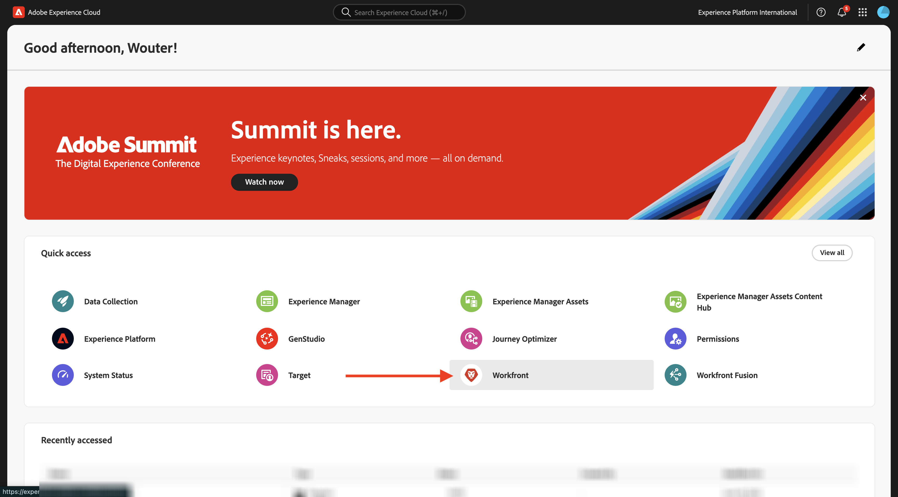
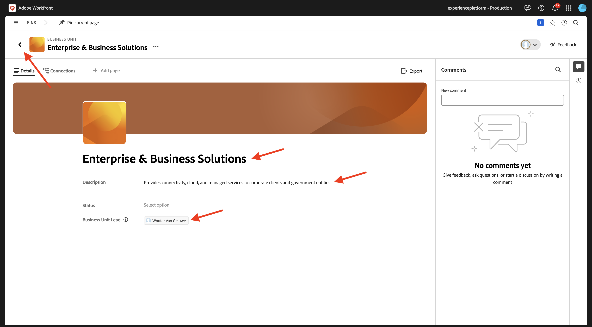
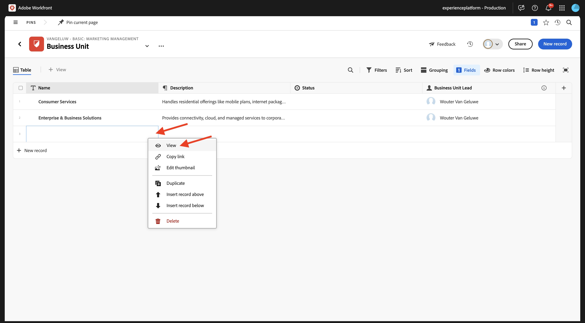
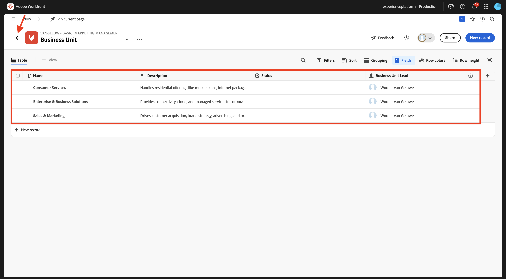

# 1.1.1 Komma igång med Workfront Planning

## Kampanjsammanfattning för 1.1.1.1 CitiSignal

Om du vill förstå sammanhanget för CitiSignal och vad de försöker uppnå hämtar och läser du CitiSignals Campaign-sammanfattning här: [CitiSignal-Fiber-Launch-Winter-2026.pdf](./../../../assets/brief/CitiSignal-Fiber-Launch-Winter-2026.pdf).

## 1.1.1.2 Workfront Planning Terminology

Följande är de viktigaste Workfront Planning-objekten och -begreppen:

| Villkor | Förklaring |
| --- | ---|
| **Workspace** | En samling posttyper som definierar den operativa livscykeln för en viss organisation. En arbetsyta är en arbetsyta i en organisationsenhet. |
| **Posttyp** | Namnet på objekttyperna i Workfront Planning. Posttyper fyller i arbetsytor. Till skillnad från Workfront Workflow, där objekttyperna är fördefinierade, kan du skapa egna objekttyper i Workfront Planning. |
| **Post** | En instans av en posttyp. |
| **Workspace-mall** | Du kan skapa en arbetsyta med fördefinierade mallar. Du kan använda de fördefinierade posttyperna och fälten som finns i en mall eller lägga till egna. |
| **Fält** | Fält är attribut som du kan lägga till i posttyper. Fält innehåller information om posttypen. |

>[!NOTE]
>
>Det finns begränsningar för hur många Workfront Planning-objekt du kan skapa. Mer information finns i Översikt över begränsningar för Adobe Workfront Planning-objekt.

Nu kan du börja skapa några av dessa objekt själv.

## 1.1.1.3 Workspace, posttyp, fält

Gå till [https://experience.adobe.com/](https://experience.adobe.com/){target="_blank"}. Klicka för att öppna **Workfront**.



I Workfront klickar du för att öppna menyn och väljer sedan **Planering**.


Du borde se det här då. Klicka på **Skapa Workspace**.


Klicka på **Använd mall** för mallen **Grundläggande marknadsföringshantering**.


En ny arbetsyta skapas. Innan du fortsätter måste du ändra namnet på arbetsytan. Klicka på de tre punkterna **..** och välj sedan **Redigera**.


Ändra namnet till `--aepUserLdap-- - Basic: Marketing Management`. Klicka på **Spara**.


Du borde ha den här då.


## 1.1.1.4 taxonomier: Posttyp och Fält

Under **Taxonomier** klickar du på **+ Lägg till posttyp** och väljer sedan **Lägg till manuellt**.


Du bör sedan se popup-fönstret **Lägg till posttyp**.


Uppdatera följande information på fliken **Utseende**:

- Ersätt posttypen **Namnlös** med `Business Unit`.
- Beskrivning: `Defines which BU is leading campaign planning.`.
- Välj en färg och form för den ikon du vill använda

Klicka på **Spara**.


Klicka för att öppna den nyligen skapade posttypen **Business Unit**.


Du kommer nu att se en tom tabellvy, eftersom din nyligen skapade posttyp ännu inte har några definierade affärsenhetsposter.


Klicka på listruteknappen i fältet **Startdatum** och välj sedan **Ta bort**.


Välj **Ta bort**.


Klicka på listruteknappen i fältet **Slutdatum** och välj sedan **Ta bort**.


Välj **Ta bort**.


Klicka sedan på ikonen **+** för att lägga till ett nytt fält. Bläddra nedåt i listan över tillgängliga fälttyper och välj **Personer**.


Ange fältets **namn** till `Business Unit Lead` och ange fältets beskrivning till `Business Unit Lead responsible for budget and resources (VP, Head).`

Klicka på **Spara**.


Klicka på de 3 punkterna **..** på den första posten och välj **Visa**.


Ange **Namn** till `Consumer Services`.

Ange **Beskrivning** till `Handles residential offerings like mobile plans, internet packages, and customer support.`.

Ange **affärsenhetens lead** till dig själv.

När du är klar klickar du på pilen för att gå tillbaka till föregående skärm.


Klicka på de 3 punkterna **..** på den andra posten och välj **Visa**.


Ange **Namn** till `Enterprise & Business Solutions`

Ange **Beskrivning** till `Provides connectivity, cloud, and managed services to corporate clients and government entities.`

Ange **affärsenhetens lead** till dig själv.

När du är klar klickar du på pilen för att gå tillbaka till föregående skärm.



Klicka på de 3 punkterna **..** på den tredje posten och välj **Visa**.



Ange **Namn** till `Sales & Marketing`

Ange **Beskrivning** till `Drives customer acquisition, brand strategy, advertising, and market segmentation.`

Ange **affärsenhetens lead** till dig själv.

När du är klar klickar du på pilen för att gå tillbaka till föregående skärm.


Du har nu skapat en ny posttyp, både du har tagit bort och skapat fält och du har skapat 3 affärsenheter. Gå tillbaka till översiktsskärmen i Workspace genom att klicka på pilen i det övre vänstra hörnet.



Du borde se det här då.


## 1.1.1.5 operativa posttyper: fält

Klicka för att öppna **kampanjer**.


Klicka på ikonen **+** för att skapa ett nytt fält. Välj **Ny anslutning** och sedan **Affärsenhet**.


Låt standardinställningarna vara på plats. Klicka på **Skapa**.


Välj **Hoppa över**.


Det nya fältet visas sedan i tabellvyn.


## 1.1.1.6 Skapa ett begärandeformulär

Klicka på de tre punkterna **..** på skärmen Campaigns-översikt och välj sedan **Skapa begärandeformulär**.


Ändra namnet till `Campaign Request Form`. Klicka på **Skapa**.


För tillfället behöver du inte göra några ändringar i formuläret. Du kommer att använda den utan ändringar. Klicka först på **Spara** och sedan på **Publicera**.


Klicka på pilen i det övre vänstra hörnet för att gå tillbaka till fönstret Begär Forms-översikt.


Klicka på pilen i det övre vänstra hörnet för att gå tillbaka till skärmen för kampanjöversikt.


## 1.1.1.7 Skicka en ny post med formuläret för begäran

Klicka på **+ Ny post** på skärmen Kampanjöversikt.


Välj **Skicka en begäran** och klicka på **Fortsätt**.


Ange **Ämne** till `--aepUserLdap-- - New Campaign Creation Request`.

Ange **kampanjnamnet** som `--aepUserLdap-- - CitiSignal Fiber Launch`.

Ange **kampanjsammanfattningen** till:

```
The CitiSignal Fiber Launch campaign introduces CitiSignal’s flagship fiber internet service—CitiSignal Fiber Max—to key residential markets. This campaign is designed to build awareness, drive sign-ups, and establish CitiSignal as the go-to provider for ultra-fast, reliable, and future-ready internet. The campaign will highlight the product’s benefits for remote professionals, online gamers, and smart home families, using persona-driven messaging across digital and physical channels.
```

Fyll i de andra fälten som du vill.

Klicka på **Skicka begäran**.


Klicka på **X** för att stänga popup-fönstret.


Du bör sedan se den nya kampanjen i översikten.


## 1.1.1.8 Skapa Portfolio &amp; anpassat formulär

I nästa steg skapar du en automatisering som hämtar information från den kampanj du skapade i Workfront Planning och som kommer att använda informationen i Workfront för att skapa ett program. Innan du kan skapa automatiseringen finns det två saker att konfigurera i Workfront först: en portfölj och ett anpassat formulär.

Om du vill skapa portföljen öppnar du menyn och klickar på **Portföljer**.


Klicka på **+ Ny Portfolio**.


Ange portföljens namn till `--aepUserLdap-- - Marketing`.


Öppna sedan menyn och klicka på **Konfigurera** för att skapa det anpassade formuläret.


Gå till **Anpassad Forms** på den vänstra menyn, till **Forms** och klicka sedan på **+ Nytt anpassat formulär**.


Välj **Program** och klicka på **Fortsätt**.


Ändra formulärets namn till `--aepUserLdap-- - Program Information`.


Gå sedan till **Fältbibliotek** och sök efter `budget`. Dra och släpp det befintliga fältet **Budget** till formuläret.

Klicka på **Använd**.


Din anpassade formulärkonfiguration har nu sparats.


## 1.1.1.8 Skapa en automatisering

Nu kan du skapa automatiseringen med hjälp av portföljen och det anpassade formuläret.

Klicka för att öppna menyn och välj sedan **Planering**.


Klicka för att öppna arbetsytan som du skapade tidigare, med namnet `--aepUserLdap-- - Basic: Marketing Management`.


Klicka för att öppna **kampanjer**.


Klicka på de tre punkterna **..** på skärmen Kampanjöversikt och välj sedan **Hantera automatisering**.


Klicka på **Ny automatisering**.


Ange namnet på automatiseringen till `Campaign to Program`.

Ange beskrivningen till `This automation will convert a Planning Campaign record to a Workfront Program.`

Klicka på **Spara**.


Ange **Åtgärd** som **Skapa program**. Klicka på **+ Lägg till anslutet fält**.


Välj **programportföljen**: `--aepUserLdap-- - Marketing`.

Välj det här **anpassade formuläret**: `--aepUserLdap-- Program information`.

Klicka på **Spara**.


Du borde se det här då. Klicka på pilen för att gå tillbaka till fönstret Campaigns overview.


Markera kryssrutan framför kampanjen som du skapade tidigare. Klicka sedan på automatiseringen **Kampanj till program**.


Efter några sekunder bör du se en bekräftelse på att automatiseringen har slutförts. Det innebär att ett program skapades i Workfront utifrån Campaign-objektet i Workfront Planning.


Om du vill kontrollera programmet i Workfront bläddrar du till höger och klickar på programmet i kolumnen **Anslutet program** .


Du bör då se det program som just har skapats med den automatisering du konfigurerade.


Nästa steg: [Sammanfattning och fördelar](./summary.md){target="_blank"}

Gå tillbaka till [Introduktion till Workfront Planning](./wfplanning.md){target="_blank"}

[Gå tillbaka till alla moduler](./../../../overview.md){target="_blank"}
