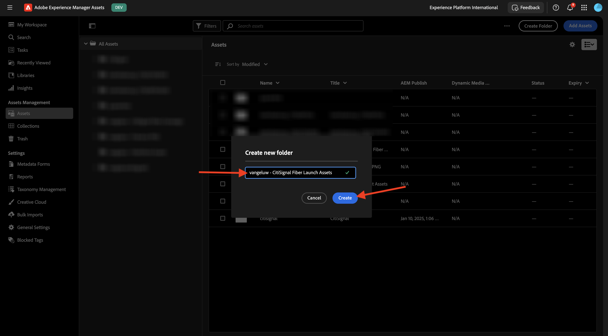
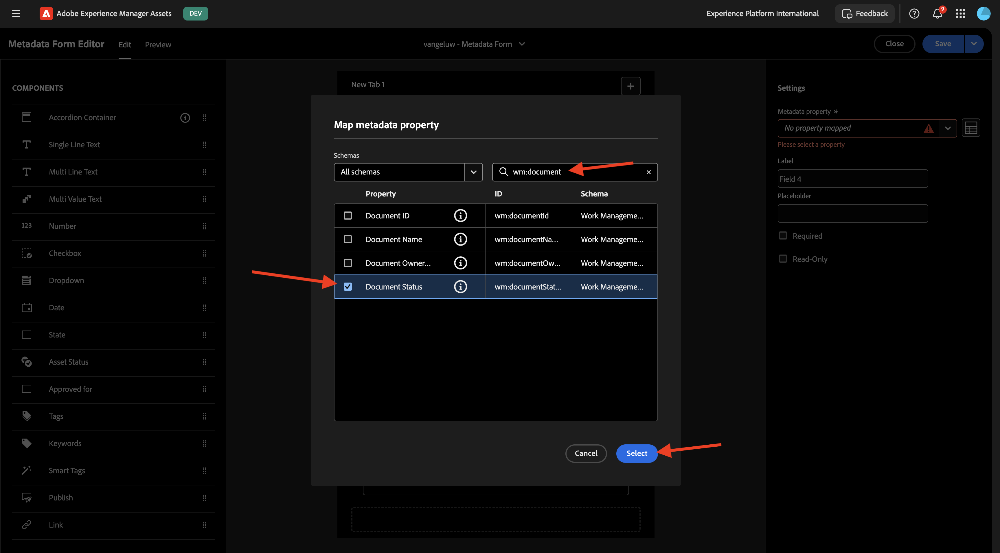
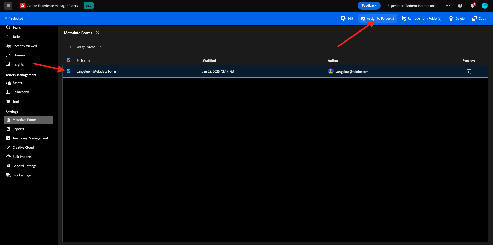

# 1.2.1 Integrering av Workfront + AEM Assets CS-metadata

>[!IMPORTANT]
>
>För att slutföra den här övningen måste du ha tillgång till en fungerande AEM Assets CS-redigeringsmiljö.
>
>Det finns två alternativ:
>
>- Om du deltar i GenStudio för CSC Technical Enablement har dina lärare skapat en AEM Assets CS Author-miljö åt dig. Kontrollera med dem vad namnet är och hur du fortsätter.
>
>- Om du följer den fullständiga sökvägen till en Adobe-självstudiekurs går du till [Adobe Experience Manager Cloud Service &amp; Edge Delivery Services](./../../../modules/asset-mgmt/module2.1/aemcs.md){target="_blank"}. Följ instruktionerna där så får du tillgång till en sådan miljö.

>[!IMPORTANT]
>
>Om du tidigare har konfigurerat ett AEM CS-program med en AEM Assets CS-miljö kan det bero på att din AEM CS-sandlåda är i viloläge. Eftersom det tar 10-15 minuter att dölja en sådan sandlåda, är det en bra idé att starta separationsprocessen nu så att du inte behöver vänta på den vid ett senare tillfälle.

## 1.2.1.1 Workfront Workflow Terminology

Följande är de viktigaste Workfront-objekten och -begreppen:

| Namn | Senaste uppdatering |
| ---------------------- | ------------ | 
| Portfolio | En samling projekt som har enhetliga egenskaper. Dessa projekt konkurrerar vanligtvis om samma resurser, budget eller tidskortplats. |
| Program | En delmängd inom en portfölj, där liknande projekt kan grupperas tillsammans för att uppnå en väldefinierad fördel. |
| Projekt | En stor mängd arbete som måste slutföras inom en viss tidsram och som måste använda en viss budget och ett visst antal resurser. För att projektet ska bli hanterbart delar du upp det i en serie uppgifter. När du slutför alla uppgifter slutförs projektet. |
| Projektmall | Du kan använda projektmallar för att hämta in de flesta repeterbara processer, information och inställningar som är kopplade till projekten i organisationen. När du har skapat mallar kan du bifoga dem till befintliga projekt eller använda dem för att skapa nya projekt. |
| Uppgift | En aktivitet som måste utföras som ett steg mot att uppnå ett slutligt mål (att slutföra projektet). Aktiviteter kan aldrig finnas oberoende. De ingår alltid i ett projekt. |
| Tilldelning | En användare, en jobbroll eller ett team som har tilldelats ett ärende eller en uppgift. Projekt, portföljer eller program kan inte ha tilldelningar. |
| Dokument/version | Alla filer som är kopplade till ett objekt i Workfront. Varje gång samma dokument överförs till samma objekt tilldelas det ett versionsnummer. Användare kan visa och ändra flera alternativ för en tidigare version av ett dokument. |
| Godkännande | En viss arbetsuppgift, till exempel en uppgift, ett dokument eller en tidrapport, kan kräva att en ansvarig eller annan användare signerar arbetsposten. Den här processen med att signera kallas för godkännande. |

Gå till [https://experience.adobe.com/](https://experience.adobe.com/){target="_blank"}. Klicka för att öppna **Workfront**.

Då ser du det här.

## 1.2.1.1 Konfigurera din AEM Assets-integrering

Klicka på ikonen **menu** och välj sedan **Konfigurera**.

Bläddra nedåt till **Dokument** på den vänstra menyn och klicka sedan på **Experience Manager Assets**. Klicka på **+ Lägg till Experience Manager-integrering**.

Använd `--aepUserLdap-- - CitiSignal AEM` för integreringens namn.

Öppna listrutan **Experience Manager-databas** och välj din AEM CS-instans, som bör ha namnet `--aepUserLdap-- - CitiSignal`.

Konfigurera följande mappning under **Metadata**:

| Workfront Field | Experience Manager Assets |
| --------------- | ------------------------------ | 
| **Dokument** > **Namn** | **wm:documentName** |
| **Projekt** > **Namn** | **wm:projectName** |
| **Projekt** > **Beskrivning** | **wm:projectDescription** |
| **Dokumentbegäran** > **Status** | **wm:wm:documentStatus** |
| **Aktivitet** > **Namn** | **wm:taskName** |
| **Aktivitet** > **Beskrivning** | **wm:taskDescription** |
| **Projekt** > **ID** | **wm:projectId** |

Aktivera växeln för **Synkronisera objektmetadata**.

Klicka på **Spara**.

Din integrering från Workfront till AEM Assets CS är nu konfigurerad.

## 1.2.1.2 Konfigurera metadataintegrering med AEM Assets

Därefter måste du konfigurera AEM Assets CS så att metadatafälten från resursen i Workfront delas med AEM Assets CS.

Gå till [https://experience.adobe.com/](https://experience.adobe.com/) om du vill göra det. Klicka på **Experience Manager Assets**.

Klicka för att välja din AEM Assets-miljö, som ska få namnet `--aepUserLdap-- - CitiSignal dev`.

Du borde se det här då. Gå till **Assets** på den vänstra menyn.

Klicka sedan på **Skapa mapp**.

Namnge mappen `--aepUserLdap-- - CitiSignal Fiber Launch Assets` och klicka på **Skapa**.

Gå sedan till **Metadata Forms** i den vänstra menyn och klicka på **Skapa**.

Använd namnet `--aepUserLdap-- - Metadata Form` och klicka på **Skapa**.

Lägg till 7 nya **enkelradiga textfält** i formuläret och markera det första fältet. Klicka sedan på ikonen **Schema** bredvid fältet **Metadata-egenskap** för det första fältet.

Du kommer då att se den här popup-rutan. Ange `wm:project` i sökfältet och markera sedan fältet **Projektnamn**. Klicka på **Markera**.

Ändra fältets etikett till `Project Name`. Klicka på **Spara**.

Gå till det andra fältet och klicka på ikonen **Schema** bredvid fältet **Metadataegenskap** .

Ange `wm:project` i sökfältet och markera sedan fältet **Projektbeskrivning**. Klicka på **Markera**.

Ändra fältets etikett till `Project Description`.

Markera sedan det tredje fältet och klicka på ikonen **Schema** bredvid fältet **Metadataegenskap** igen.

Du kommer då att se den här popup-rutan igen. Ange `wm:project` i sökfältet och markera sedan fältet **Projekt-ID**. Klicka på **Markera**.

Ändra fältets etikett till `Project ID`.

Markera sedan det fjärde fältet och klicka på ikonen **Schema** bredvid fältet **Metadataegenskap** igen.

Du kommer då att se den här popup-rutan igen. Ange `wm:document` i sökfältet och markera sedan fältet **Projekt-ID**. Klicka på **Markera**.

Ändra fältets etikett till `Document Status`.

Markera sedan det femte fältet och klicka på ikonen **Schema** bredvid fältet **Metadataegenskap** igen.

Du kommer då att se den här popup-rutan igen. Ange `wm:document` i sökfältet och markera sedan fältet **Projekt-ID**. Klicka på **Markera**.

Ändra fältets etikett till `Document Name`.

Markera sedan det sjätte fältet och klicka på ikonen **Schema** bredvid fältet **Metadataegenskap** igen.

Du kommer då att se den här popup-rutan igen. Ange `wm:task` i sökfältet och markera sedan fältet **Uppgiftsnamn**. Klicka på **Markera**.

Ändra fältets etikett till `Task Name`.

Markera sedan det sjunde fältet och klicka på ikonen **Schema** bredvid fältet **Metadataegenskap** igen.

Du kommer då att se den här popup-rutan igen. Ange `wm:task` i sökfältet och markera sedan fältet **Aktivitetsbeskrivning**. Klicka på **Markera**.

Ändra fältets etikett till `Task Description`.

Ändra **fliknamnet** i formuläret till `--aepUserLdap-- - Workfront Metadata`.

Klicka på **Spara** och **Stäng**.

**Metadataformuläret** har konfigurerats.

Därefter måste du tilldela metadataformuläret till mappen som du skapade tidigare. Markera kryssrutan för ditt metadataformulär och klicka på **Tilldela till mapp(ar)**.

Välj din mapp som ska ha namnet `--aepUserLdap-- - CitiSignal Fiber Launch Assets`. Klicka på **Tilldela**.

Metadataformuläret har nu tilldelats mappen.

Nästa steg: [1.2.2 Korrektur med Workfront](./ex2.md){target="_blank"}

Gå tillbaka till [Arbetsflödeshantering med Adobe Workfront](./workfront.md){target="_blank"}

[Gå tillbaka till alla moduler](./../../../overview.md){target="_blank"}
