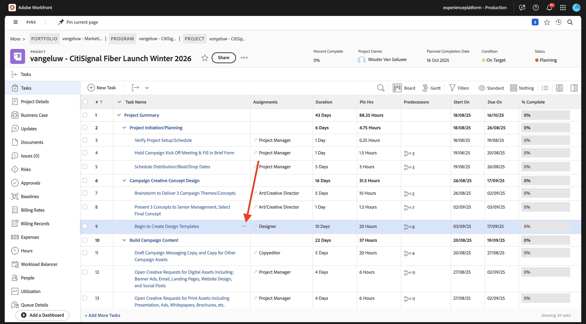
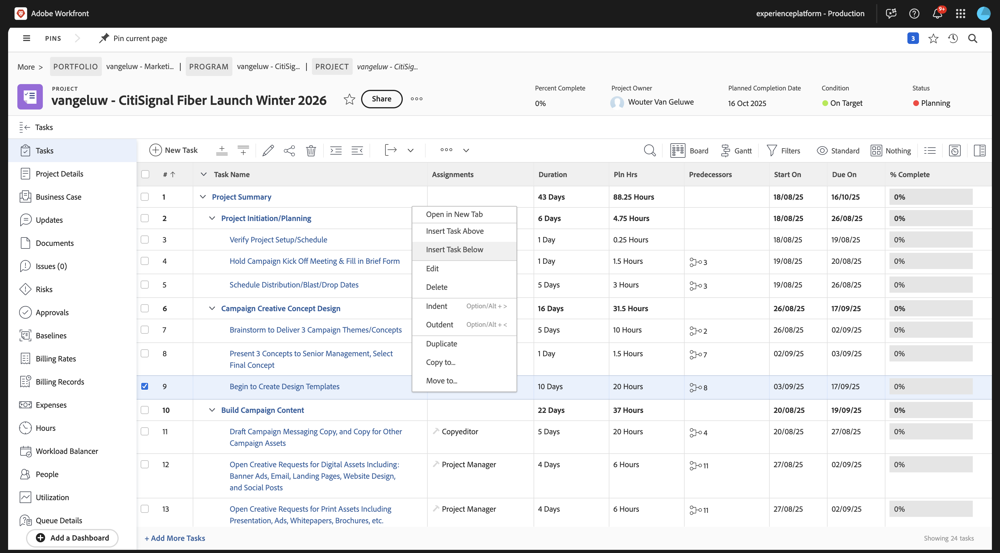
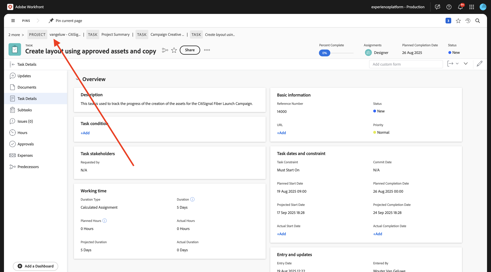
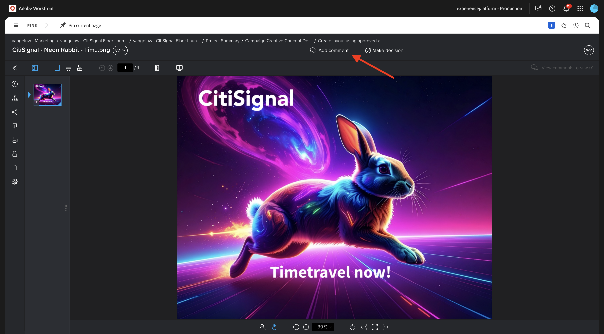
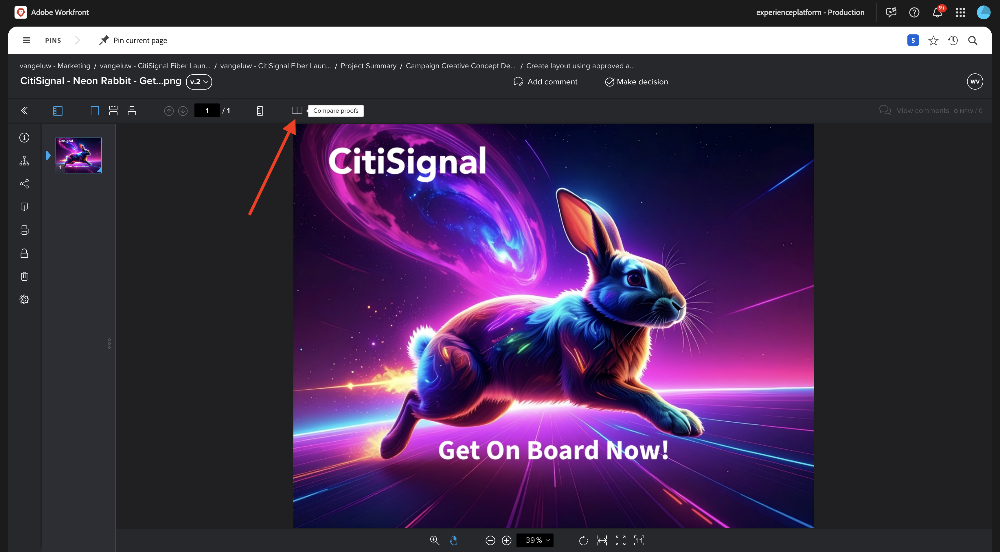
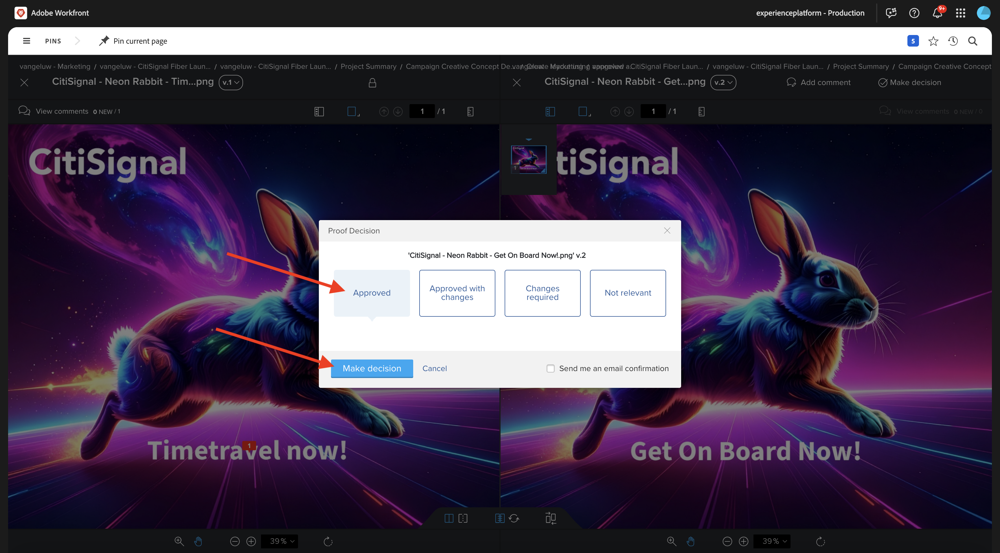

# 1.2.2 Korrektur med Workfront

>[!IMPORTANT]
>
>Om du tidigare har konfigurerat ett AEM CS-program med en AEM Assets CS-miljö kan det bero på att din AEM CS-sandlåda är i viloläge. Eftersom det tar 10-15 minuter att dölja en sådan sandlåda, är det en bra idé att starta separationsprocessen nu så att du inte behöver vänta på den vid ett senare tillfälle.

## 1.2.2.1 Skapa ett nytt godkännandeflöde

Gå tillbaka till **Adobe Workfront**. Klicka på ikonen **menu** och välj **Korrektur**.

Gå till **Arbetsflöden**, klicka på **+ Ny** och välj sedan **Ny mall**.

Ange **mallnamnet** till `--aepUserLdap-- - Approval Workflow` och ställ in **mallägaren** till dig själv.

Bläddra nedåt och ändra rollen **Korrekturskapare** till **Granskare och godkännare** under **Steg** > **Steg 1**. Du kan även lägga till andra, så som till exempel lägga till dig själv genom att markera användaren och ange **rollen** för **Granskare och godkännare**.

Klicka på **Skapa**.

Ditt grundläggande arbetsflöde för godkännande är nu klart att användas.

## 1.2.2.2 Aktivera Workfront Blueprint

I nästa steg skapar du ett nytt projekt med hjälp av en mall. Adobe Workfront tillhandahåller ett antal ritningar som bara behöver aktiveras.

För CitiSignals användningsfall är den **integrerade kampanjkörningen** den du behöver använda.

Om du vill installera den översikten öppnar du menyn och väljer **utkast**.

Välj filtret **Marknadsföring** och bläddra sedan nedåt för att hitta den **integrerade kampanjkörningen**. Klicka på **Installera**.

Klicka på **Fortsätt**.

Klicka på **Installera som..**.

Du borde se det här då. Installationen kan ta några minuter.

Efter några minuter installeras ritningen.

## 1.2.2.3 Skapa ett nytt projekt

Öppna **menyn** och gå till **Program**.

Klicka på det program du skapade tidigare, med namnet `--aepUserLdap-- CitiSignal Fiber Launch`.

>[!NOTE]
>
>Du skapade ett program som en del av övningen på [Workfront Planning](./../module1.1/ex1.md) med den automatisering du skapade och körde. Om du inte har gjort det än kan du hitta instruktionerna där.

Gå till **Projekt** i ditt program. Klicka på **+ Nytt projekt** och välj sedan **Nytt projekt från mall**.

Välj mallen **Integrerad kampanjkörning** och klicka på **Använd mall**.

Du borde se det här då. Ändra namnet till `--aepUserLdap-- - CitiSignal Fiber Launch Winter 2026` och klicka på **Skapa projekt**.

Ditt projekt har skapats. Gå till **Projektinformation**.

Gå till **Projektinformation**. Klicka för att markera den aktuella texten under **Beskrivning**.

Ange beskrivningen till `The CitiSignal Fiber Launch project is used to plan the upcoming launch of CitiSignal Fiber.`

Klicka på **Spara ändringar**.

Ditt projekt är nu klart att användas.

Aktiviteter och beroenden i projektet har skapats baserat på den mall du valde och du har angetts som. projektägare. Projektets status har angetts till **Planering**. Du kan ändra projektets status genom att välja ett annat värde i listan.

## 1.2.2.4 Skapa en ny aktivitet

Hovra över aktiviteten **Börja skapa designmallar** och klicka på de tre punkterna **..**.

Välj alternativet **Infoga aktivitet nedan**.

Ange det här namnet för din uppgift: `Create layout using approved assets and copy`.

Ställ in fältet **Uppdrag** till rollen **Designer**.
Ange fältet **Varaktighet** till **5 dagar**.
Ställ in fältets föregångare till **9**.
Ange ett datum för fälten **Börja den** och **Förfaller den**.

Klicka någon annanstans på skärmen för att spara den nya uppgiften.

Du borde se det här då. Klicka på uppgiften för att öppna den.

Gå till **aktivitetsinformation** och ställ in fältet **Beskrivning** på: `This task is used to track the progress of the creation of the assets for the CitiSignal Fiber Launch Campaign.`

Klicka på **Spara ändringar**.

Du borde se det här då. Klicka på fältet **Projekt** för att gå tillbaka till ditt projekt.

Gå till **Utjämning av arbetsbelastning** i vyn **Projekt**.

Klicka på **Gruppera tilldelningar**.

Markera **rolltilldelningen** för **Designer** och klicka sedan i fältet **Användare för att tilldela**. Detta visar alla användare som har en **Designer**-roll i din Workfront-instans. I det här fallet väljer du den fiktiva användaren **Melissa Jenkins**.

Klicka på **Tilldela**. Användaren du valde tilldelas nu till aktiviteterna i projektet som är länkade till rollen **Designer**.

Uppgifterna har nu tilldelats. Klicka på **Åtgärder** för att gå tillbaka till översiktssidan för **Åtgärder**.

Klicka på den uppgift du skapade, med namnet
**Skapa layout med godkända resurser och kopiera**.

Du kommer nu att börja arbeta med den här uppgiften som en del av den här övningen. Du ser att Melissa Jenkins är tilldelad den här uppgiften just nu. Om du vill ändra det för dig själv klickar du på fältet **Tilldelningar** och väljer **Tilldela mig**.

Klicka på **Spara**.

Klicka på **Arbeta med den**.

Du borde se det här då.

Som en del av detta måste du skapa en ny bild och sedan överföra den som ett dokument i Workfront. Nu kan du själv skapa resursen med Adobe Express.

## 1.2.2.5 Lägg till ett nytt dokument i din uppgift och starta godkännandeflödet

För den här övningen måste du hämta och använda den här resursen: [tidslinjen.png](./images/timetravelnow.png)

Gå tillbaka till skärmen **Uppgiftsinformation**. Gå till **Dokument**. Klicka på **+ Lägg till ny** och välj sedan din AEM Assets CS-databas, som ska ha namnet `--aepUserLdap-- - CitiSignal`.

Dubbelklicka för att öppna mappen `--aepUserLdap-- CitiSignal Fiber Campaign`.

Markera filen som du skapade i föregående steg, som heter **CitiSignal - Neonkanin - Timeravel Now!.png**. Klicka på **Markera**.

{width="50px" align="left"}

Du borde ha den här då. Håll muspekaren över det överförda dokumentet. Klicka på **Skapa korrektur** och välj sedan **Avancerat korrektur**.

Välj **Automatiserad** i fönstret **Nytt korrektur** och välj sedan den arbetsflödesmall som du skapade tidigare, som ska ha namnet `--aepUserLdap-- - Approval Workflow`. Klicka på **Skapa bevis**.

Klicka på **Öppna korrektur**

Nu kan du granska korrekturet. Välj **Lägg till kommentar** om du vill lägga till en kommentar som kräver att dokumentet ändras.

Ange din kommentar och klicka på **Publicera**. Klicka sedan på **Fatta ett beslut**.

Välj **Ändringar krävs** och klicka på **Fatta beslut**.

Gå tillbaka till din **aktivitet** och **dokumentet**. Texten **Ändringar som krävs** visas också där.

Nu måste du göra designändringar, som du gör i Adobe Express.

## 1.2.2.6 Lägg till en ny version av dokumentet i din uppgift

För den här övningen måste du hämta och använda resursen: [getonboard.png](./images/getonboard.png)

I uppgiftsvyn i Adobe Workfront väljer du den gamla bildfilen som inte godkänts. Klicka sedan på **+ Lägg till ny**, markera **Version** och välj sedan din AEM Assets CS-databas, som ska ha namnet `--aepUserLdap-- - CitiSignal`.

Navigera till mappen `--aepUserLdap-- CitiSignal Fiber Campaign` och markera filen `CitiSignal - Neon Rabit - Get On Board Now!.png`. Klicka på **Markera**.

Du borde ha den här då. Klicka på **Skapa korrektur** och välj sedan **Avancerat korrektur** igen.

Då ser du det här. **Arbetsflödesmallen** är nu förvald eftersom Workfront antar att det tidigare arbetsflödet för godkännande fortfarande är giltigt. Klicka på **Skapa bevis**.

Välj **Öppna korrektur**.

Nu kan du se två versioner av filen bredvid varandra. Klicka på knappen **Jämför korrektur**.

Du bör sedan se båda versionerna av bilden bredvid varandra. Klicka på **Fatta beslut**.

Välj **Godkänd** och klicka på **Fatta beslut** igen.

Stäng vyn **Jämför korrektur** genom att stänga den vänstra versionen av bilden. Klicka på **Aktivitetsnamnet** för att gå tillbaka till aktivitetsöversikten.

Du kommer sedan tillbaka i aktivitetsvyn med en godkänd resurs. Materialet måste nu delas med AEM Assets.

Välj det godkända dokumentet. Klicka på ikonen **Dela-pil** och välj den AEM Assets-integrering som ska ha namnet `--aepUserLdap-- - CitiSignal AEM`.

Dubbelklicka på mappen som du skapade tidigare, som bör ha namnet `--aepUserLdap-- - CitiSignal Fiber Launch Assets`.

Klicka på **Välj mapp**.

Efter 1-2 minuter publiceras dokumentet nu i AEM Assets. En AEM-ikon visas bredvid dokumentnamnet.

Klicka på **Markera som slutförd** om du vill slutföra den här uppgiften.

Du borde se det här då.

## 1.2.2.7 Visa filen i AEM Assets

Gå till din mapp i AEM Assets CS med namnet `--aepUserLdap-- - CitiSignal Fiber Launch Assets`.

Markera bilden och välj sedan **Detaljer**.

Du kommer då att se metadataformuläret som du skapade tidigare, med värden som fyllts i automatiskt genom integrationen mellan Workfront och AEM Assets.

Gå tillbaka till [Arbetsflödeshantering med Adobe Workfront](./workfront.md){target="_blank"}

[Gå tillbaka till alla moduler](./../../../overview.md){target="_blank"}
