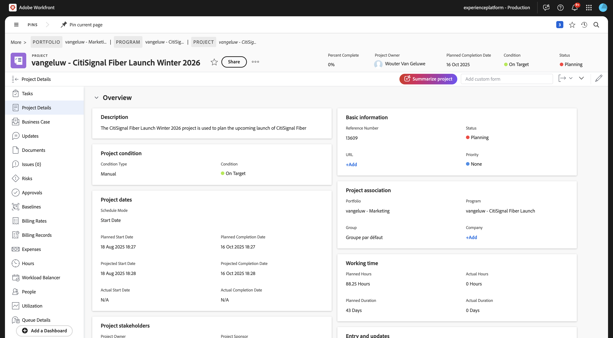
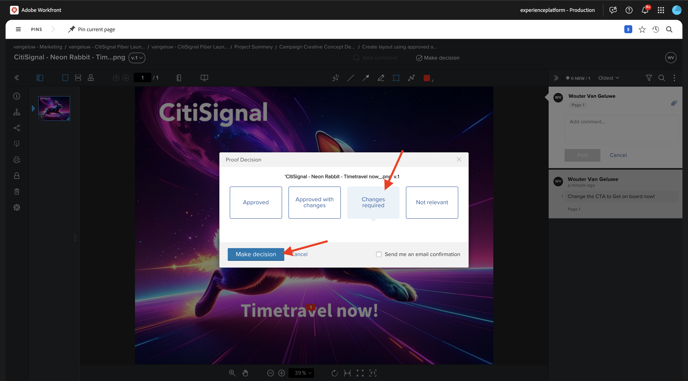
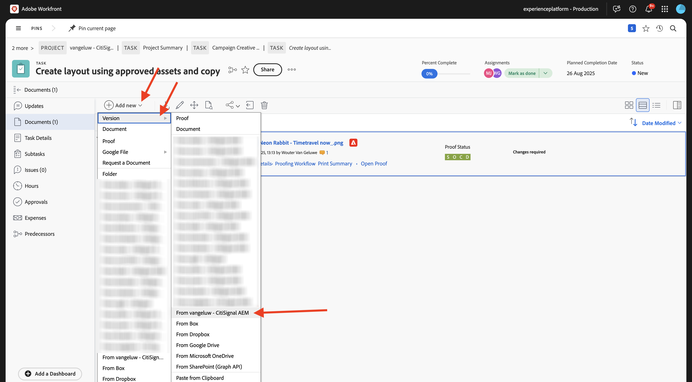
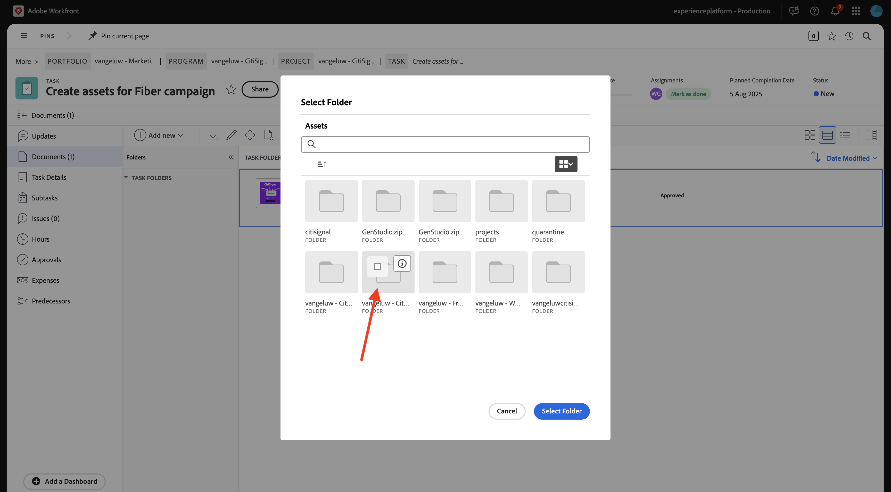

# 1.2.2 Korrektur med Workfront

>[!IMPORTANT]
>
>Om du tidigare har konfigurerat ett AEM CS-program med en AEM Assets CS-miljö kan det bero på att din AEM CS-sandlåda är i viloläge. Eftersom det tar 10-15 minuter att dölja en sådan sandlåda, är det en bra idé att starta separationsprocessen nu så att du inte behöver vänta på den vid ett senare tillfälle.

## 1.2.2.1 Skapa ett nytt godkännandeflöde

Gå tillbaka till **Adobe Workfront**. Klicka på ikonen **menu** och välj **Korrektur**.

Gå till **Arbetsflöden**, klicka på **+ Ny** och välj sedan **Ny mall**.

Ange **mallnamnet** till `--aepUserLdap-- - Approval Workflow` och ställ in **mallägaren** till dig själv.

Bläddra nedåt och under **Steg** > **Steg 1** lägger du till dig själv med **rollen** i **Granskare och godkännare**.

Klicka på **Skapa**.

Ditt grundläggande arbetsflöde för godkännande är nu klart att användas.

## 1.2.2.2 Skapa ett nytt projekt

Öppna **menyn** och gå till **Program**.

Klicka på det program du skapade tidigare, med namnet `--aepUserLdap-- CitiSignal Fiber Launch`.

>[!NOTE]
>
>Du skapade ett program som en del av övningen på [Workfront Planning](./../module1.1/ex1.md) med den automatisering du skapade och körde. Om du inte har gjort det än kan du hitta instruktionerna där.

Gå till **Projekt** i ditt program. Klicka på **+ Nytt projekt** och välj sedan **Nytt projekt**.

Du borde se det här då. Ändra namnet till `--aepUserLdap-- - CitiSignal Fiber Launch`.

Gå till **Projektinformation**. Klicka på **+Lägg till** under **Beskrivning**.

Ange beskrivningen till `The CitiSignal Fiber Launch project is used to plan the upcoming launch of CitiSignal Fiber.`

Klicka på **Spara ändringar**.

Ditt projekt har skapats.

## 1.2.2.3 Skapa en ny aktivitet

Gå till **Åtgärder** och klicka på **+ Ny aktivitet**.

Ange det här namnet för din uppgift: `Create assets for Fiber campaign`.

Ställ in fältet **Beskrivning** till: `This task is used to track the progress of the creation of the assets for the CitiSignal Fiber Launch Campaign.`

Klicka på **Skapa uppgift**.

Du borde se det här då.

Lägg till ditt namn i kolumnen **Tilldelning**.

Uppgiften tilldelas sedan till dig.

## 1.2.2.4 Lägg till ett nytt dokument i din uppgift via godkännandeflödet

Klicka på **Workfront**-logotypen för att gå tillbaka till översiktssidan. Du bör då se projektet som du just skapade visas i översikten. Klicka på projektet för att öppna det.

Öppna uppgiften genom att klicka i **Aktiviteter**.

Gå till **Dokument**. Klicka på **+ Lägg till ny** och välj sedan **Dokument**.

Hämta [den här filen](./images/2048x2048.png) till skrivbordet.

{width="50px" align="left"}

Markera filen **2048x2048.png** och klicka på **Öppna**.

Du borde ha den här då. Håll muspekaren över det överförda dokumentet. Klicka på **Skapa korrektur** och välj sedan **Avancerat korrektur**.

Välj **Automatiserad** i fönstret **Nytt korrektur** och välj sedan den arbetsflödesmall som du skapade tidigare, som ska ha namnet `--aepUserLdap-- - Approval Workflow`. Klicka på **Skapa bevis**.

Klicka på **Arbeta med den**.

Klicka på **Öppna korrektur**

Nu kan du granska korrekturet. Välj **Lägg till kommentar** om du vill lägga till en kommentar som kräver att dokumentet ändras.

Ange din kommentar och klicka på **Publicera**. Klicka på **Stäng**.

Därefter måste du ändra din roll från **Granskare** till **Granskare och godkännare**. Om du vill göra det går du tillbaka till din uppgift och klickar på **Korrektur**.

Ändra din roll från **Granskare** till **Granskare och godkännare**.

Gå tillbaka till Uppgiften och öppna korrekturet igen. Nu visas en ny knapp, **Fatta beslut**. Klicka på den.

Välj **Ändringar krävs** och klicka på **Fatta beslut**.

Gå tillbaka till din **aktivitet** och **dokumentet**. Nu måste du ladda upp en andra bild som tar hänsyn till de kommentarer som lämnats.

Hämta [den här filen](./images/2048x2048_buynow.png) till skrivbordet.

{width="50px" align="left"}

Välj den gamla bildfilen som inte godkänts i aktivitetsvyn. Klicka sedan på **+ Lägg till ny**, markera **Version** och välj sedan **Dokument**.

Markera filen **2048x2048_buynow.png** och klicka på **Öppna**.

Du borde ha den här då. Klicka på **Skapa korrektur** och välj sedan **Avancerat korrektur** igen.

Då ser du det här. **Arbetsflödesmallen** är nu förvald eftersom Workfront antar att det tidigare arbetsflödet för godkännande fortfarande är giltigt. Klicka på **Skapa bevis**.

Välj **Öppna korrektur**.

Nu kan du se två versioner av filen bredvid varandra.

Klicka på **Fatta beslut**, välj **Godkänd** och klicka på **Fatta beslut** igen.

Klicka på **Aktivitetsnamnet** för att gå tillbaka till aktivitetsöversikten.

Du kommer sedan tillbaka i aktivitetsvyn med en godkänd resurs. Materialet måste nu delas med AEM Assets.

Välj det godkända dokumentet. Klicka på ikonen **Dela-pil** och välj den AEM Assets-integrering som ska ha namnet `--aepUserLdap-- - CitiSignal AEM`.

Dubbelklicka på mappen som du skapade tidigare, som bör ha namnet `--aepUserLdap-- - CitiSignal Fiber Launch Assets`.

Klicka på **Välj mapp**.

Efter 1-2 minuter publiceras dokumentet nu i AEM Assets. En AEM-ikon visas bredvid dokumentnamnet.

## 1.2.2.5 Visa filen i AEM Assets

Gå till din mapp i AEM Assets CS med namnet `--aepUserLdap-- - CitiSignal Fiber Launch Assets`.

Markera bilden och välj sedan **Detaljer**.

Du kommer då att se metadataformuläret som du skapade tidigare, med värden som fyllts i automatiskt genom integrationen mellan Workfront och AEM Assets.

Gå tillbaka till [Arbetsflödeshantering med Adobe Workfront](./workfront.md){target="_blank"}

[Gå tillbaka till alla moduler](./../../../overview.md){target="_blank"}
