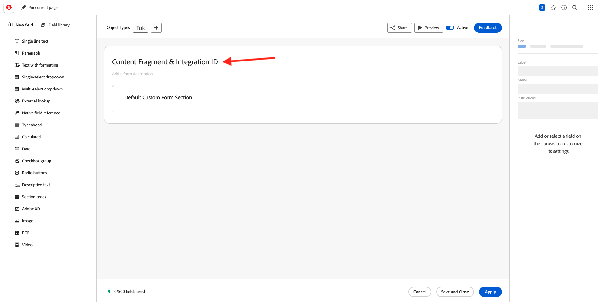

# 1.2.4 Workfront + AEM Sites

Logga in på Adobe Workfront på [https://experienceplatform.my.workfront.com/](https://experienceplatform.my.workfront.com/){target="_blank"}.

Då ser du det här.

## 1.2.4.1 Konfigurera din AEM Sites-integrering

>[!NOTE]
>
>Det här plugin-programmet är för närvarande i läget **Tidig åtkomst** och är inte allmänt tillgängligt än.
>
>Detta plugin-program kan redan vara installerat i den Workfront-instans som du använder. Om den redan är installerad kan du läsa instruktionerna nedan, men du behöver inte ändra något i konfigurationen då.

Gå till [https://experience.adobe.com/#/@experienceplatform/aem/extension-manager/universal-editor](https://experience.adobe.com/#/@experienceplatform/aem/extension-manager/universal-editor){target="_blank"}.

Kontrollera att **toggle** för det här plugin-programmet är inställt på **Enabled**. Klicka sedan på ikonen **kugghjulet** .

En popup-meny för **tilläggskonfiguration** visas. Konfigurera följande fält för att använda det här plugin-programmet.

| Nyckel | Värde |
| --------------- | ------------------------------ | 
| **`IMS_ENV`** | **PROD** |
| **`WORKFRONT_INSTANCE_URL`** | **https://experienceplatform.my.workfront.com** |
| **`SHOW_CUSTOM_FORMS`** | **&#39;{&quot;previewUrl&quot;: true, &quot;publishUrl&quot;: true}&#39;** |

Klicka på **Spara**.

Gå tillbaka till ditt Workfront-gränssnitt och klicka på ikonen **hamburger** med nio punkter. Välj **Konfigurera**.

Gå till **Anpassad Forms** på den vänstra menyn och välj **Formulär**. Klicka på **+ Nytt anpassat formulär**.

Välj **Aktivitet** och klicka på **Fortsätt**.

Då visas ett tomt anpassat formulär. Ange formulärnamnet `Content Fragment & Integration ID`.

Dra och släpp ett nytt **enkelradigt textfält** på arbetsytan.

Konfigurera det nya fältet så här:

- **Etikett**: **Innehållsfragment**
- **Namn**: **`aem_workfront_integration_content_fragment`**

Lägg till ett nytt **enradigt textfält** på arbetsytan och konfigurera det nya fältet så här:

- **Etikett**: **Integrerings-ID**
- **Namn**: **`aem_workfront_integration_id`**

Klicka på **Använd**.

Nu måste du konfigurera ett andra anpassat formulär. Klicka på **+ Nytt anpassat formulär**.

Välj **Aktivitet** och klicka på **Fortsätt**.

Då visas ett tomt anpassat formulär. Ange formulärnamnet `Preview & Publish URL`.

Dra och släpp ett nytt **enkelradigt textfält** på arbetsytan.

Konfigurera det nya fältet så här:

- **Etikett**: **URL för förhandsgranskning**
- **Namn**: **`aem_workfront_integration_preview_url`**

Lägg till ett nytt **enradigt textfält** på arbetsytan och konfigurera det nya fältet så här:

- **Etikett**: **Publicera URL**
- **Namn**: **`aem_workfront_integration_publish_url`**

Klicka på **Använd**.

Du bör sedan ha 2 anpassade formulär tillgängliga.

Nästa steg: [1.2.2 Korrektur med Workfront](./ex2.md){target="_blank"}

Gå tillbaka till [Arbetsflödeshantering med Adobe Workfront](./workfront.md){target="_blank"}

[Gå tillbaka till alla moduler](./../../../overview.md){target="_blank"}
