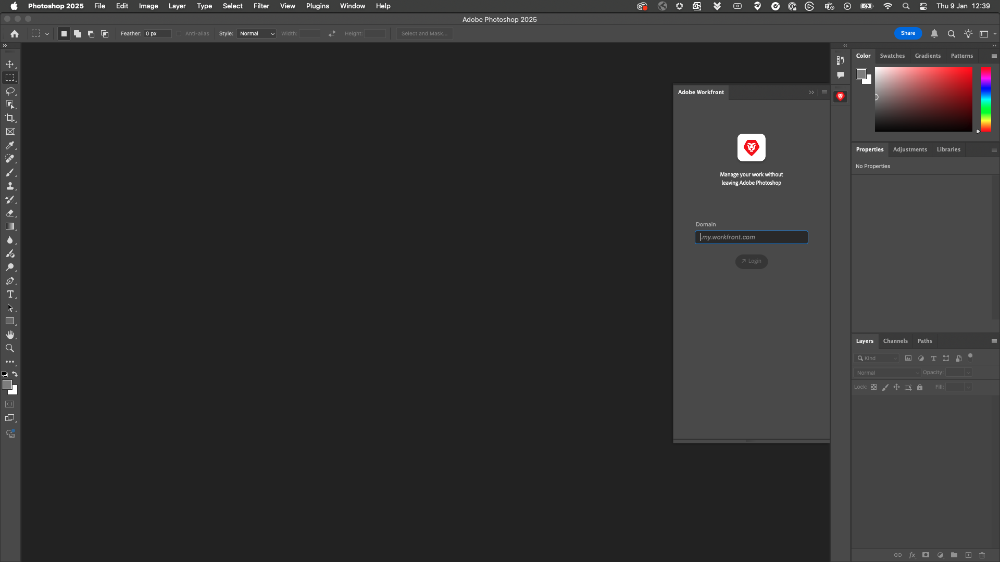

# 1.2.5 Konfigurera Photoshop + Workfront plugin

## 1.2.5.1 Installera Workfront för Photoshop-plugin

Installera Creative Cloud-programmet på datorn om du vill konfigurera integreringen mellan Workfront och Photoshop. Logga in med din Adobe ID.

Välj **Företag eller Skolkonto** och autentisera.

Välj en profil att logga in med.

Du kommer då att vara här. Gå till **Stock &amp; Marketplace**.

Klicka på **Plugins** och sedan på **Hantera plugin-program**. Klicka på **Installera** på kortet **Adobe Workfront för Photoshop**.

Klicka på **OK**.

Då ser du det här.

## 1.2.5.2 Konfigurera plugin-programmet i Photoshop

Öppna Photoshop. Gå till **Plugin-program** > **Workfront för Adobe Photoshop** > klicka på **Adobe Workfront** i aktivitetsfältet.

Då ser du det här.

Ange domänen för din Adobe Workfront-instans. Klicka på **Logga in**.

Klicka på **Tillåt**.

Logga in med din **Adobe ID**.

Välj **Företag eller Skolkonto**.

Klicka på **Tillåt åtkomst**.

Du ser då den här bekräftelsen.

Gå tillbaka till Photoshop så ser du att plugin-programmet nu är klart att användas och visar dina aktiva uppgifter.

Gå tillbaka till [Arbetsflödeshantering med Adobe Workfront](./workfront.md){target="_blank"}

[Gå tillbaka till alla moduler](./../../../overview.md){target="_blank"}
