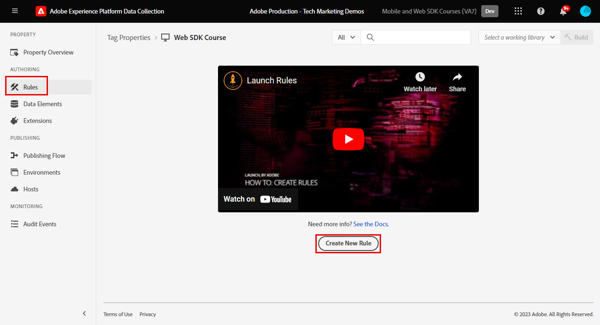
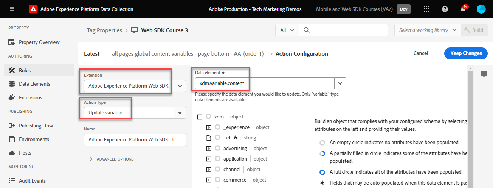
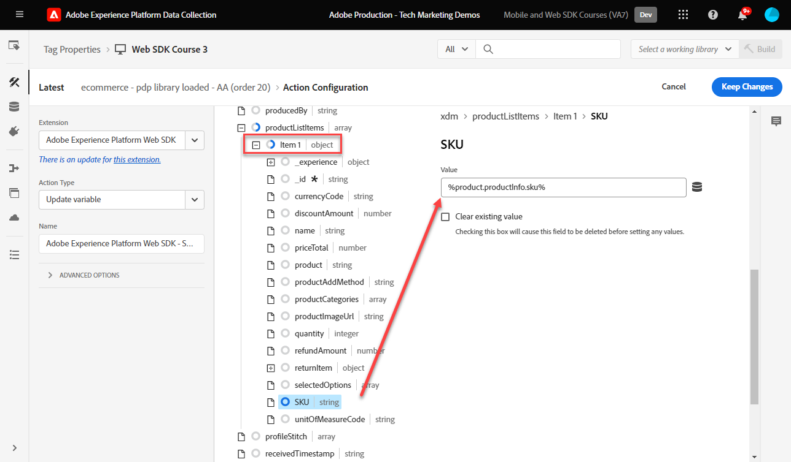
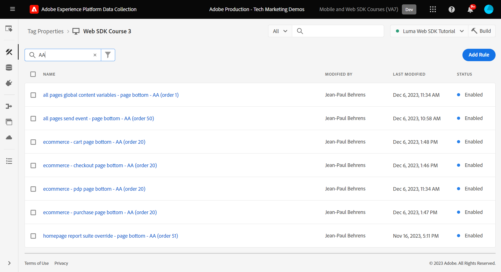

# Skapa taggregler

Lär dig hur du skickar händelser till Platform Edge Network med ditt XDM-objekt med hjälp av taggregler. En taggregel är en kombination av händelser, villkor och åtgärder som instruerar taggegenskapen att göra något. Med Platform Web SDK används regler för att skicka händelser till Platform Edge Network med rätt XDM-fält.

>[!NOTE]
>
> I demonstrationssyfte bygger övningarna i den här lektionen på de tidigare lektionerna för att skicka händelser från användare på [Luma demo site](https://luma.enablementadobe.com/content/luma/us/en.html){target="_blank"}.

## Utbildningsmål

När lektionen är slut kan du:

* Använd en namnkonvention för att hantera regler i taggar
* Skicka en XDM-händelse genom att använda åtgärdstyperna Uppdatera variabel och Skicka händelse i en taggregel
* Publicera en taggregel i ett utvecklingsbibliotek

## Förutsättningar

Du känner till datainsamlingstaggar och [Luma demo site](https://luma.enablementadobe.com/content/luma/us/en.html) och har avslutat tidigare lektioner i självstudiekursen:

* [Konfigurera ett XDM-schema](configure-schemas.md)
* [Konfigurera ett identitetsnamnutrymme](configure-identities.md)
* [Konfigurera ett datastream](configure-datastream.md)
* [Installera SDK-tillägg för webben](install-web-sdk.md)
* [Skapa dataelement](create-data-elements.md)
* [Skapa identiteter](create-identities.md)

## Namnkonventioner

Om du vill hantera regler i taggar bättre bör du följa en standardnamnkonvention. I den här självstudiekursen används en namnkonvention med tre delar:

* [**plats**] - [**event**] - [**verktyg**] (**sekvens**)

där

1. **plats** är den eller de sidor på webbplatsen där regeln utlöses
1. **event** är utlösaren för regeln
1. **verktyg** är det eller de program som används i åtgärdssteget för den regeln
1. **sekvens** är den ordning i vilken regeln ska utlösas i förhållande till andra regler
<!-- minor update -->

## Skapa taggregler

I taggar används regler för att utföra åtgärder (brandanrop) under olika förhållanden. Tillägget Platform Web SDK-taggar innehåller två åtgärder som kommer att användas i den här lektionen:

* **[!UICONTROL Uppdatera variabel]** mappar dataelement till XDM-fält
* **[!UICONTROL Skicka händelse]** skickar XDM-objektet till Experience Platform Edge Network

Först definierar vi en&quot;global konfiguration&quot; av XDM-fält som vi vill skicka på varje sida på webbplatsen (till exempel sidans namn) med hjälp av **[!UICONTROL Uppdatera variabel]** åtgärd.

Sedan definierar vi ytterligare regler som innehåller **[!UICONTROL Uppdatera variabel]** att komplettera den&quot;globala konfigurationen&quot; med ytterligare XDM-fält som bara är tillgängliga under vissa förhållanden (till exempel genom att lägga till produktinformation på produktsidor).

Slutligen ska vi använda en annan regel med **[!UICONTROL Skicka händelse]** som skickar hela XDM-objektet till Adobe Experience Platform Edge Network.

Alla dessa regler kommer att ordnas korrekt med hjälp av[!UICONTROL beställa]&quot;.

### Uppdatera variabelregler

#### Global konfiguration

Så här skapar du en taggregel för de globala XDM-fälten:

1. Öppna taggegenskapen som du använder för den här självstudien

1. Gå till **[!UICONTROL Regler]** till vänster navigering

1. Välj **[!UICONTROL Skapa ny regel]** knapp

   

1. Namnge regeln `all pages global content variables - library loaded - AA (order 1)`

1. I **[!UICONTROL Händelser]** avsnitt, markera **[!UICONTROL Lägg till]**

   

1. Använd **[!UICONTROL Kärntillägg]** och markera `Page Bottom` som **[!UICONTROL Händelsetyp]**

1. Under **[!UICONTROL Namn]** field, name it `Core - Page Bottom - order 1`. Detta hjälper dig att beskriva utlösaren med ett beskrivande namn.

1. Välj **[!UICONTROL Avancerat]** listruta och ange `1` in **[!UICONTROL Beställning]**

   >[!NOTE]
   >
   > Ju lägre ordernummer, desto tidigare körs det. Därför ger vi vår&quot;globala konfiguration&quot; ett lågt ordernummer.

1. Välj **[!UICONTROL Behåll ändringar]** för att återgå till huvudlinjeraster
   

1. I **[!UICONTROL Åtgärder]** avsnitt, markera **[!UICONTROL Lägg till]**

1. Som **[!UICONTROL Tillägg]**, markera **[!UICONTROL Adobe Experience Platform Web SDK]**

1. Som **[!UICONTROL Åtgärdstyp]**, markera **[!UICONTROL Uppdatera variabel]**

1. Som **[!UICONTROL Dataelement]** väljer du `xdm.variable.content` du skapade i [Skapa dataelement](create-data-elements.md) lektion

   

Kartlägg dina [!UICONTROL dataelement] till [!UICONTROL schema] används av ditt XDM-objekt.

>[!NOTE]
> 
> Du kan mappa till enskilda egenskaper eller hela objekt. I det här exemplet mappar du till enskilda egenskaper.

1. Sök efter fältet eventType och markera det

1. Ange värdet `web.webpagedetails.pageViews`

   >[!TIP]
   >
   > Så här förstår du vilka värden som ska fyllas i `eventType` måste du gå till schemasidan och välja `eventType` om du vill visa de föreslagna värdena på den högra listen.
   > 

1. Gå till `identityMap` objekt i schemat och markera det

1. Mappa till `identityMap.loginID` dataelement

   

   >[!TIP]
   >
   > XDM-fält inkluderas inte i nätverksbegäran om dataelementet är null. Därför gäller att när användaren inte är autentiserad och `identityMap.loginID` dataelementet är null, `identityMap` kommer inte att skickas. Därför kan vi definiera den i vår&quot;globala konfiguration&quot;.

1. Bläddra nedåt tills du når **`web`** object

1. Markera för att öppna den

1. Mappa följande dataelement till motsvarande `web` XDM-variabler

   * **`web.webPageDetials.name`** till `%page.pageInfo.pageName%`
   * **`web.webPageDetials.server`** till `%page.pageInfo.server%`
   * **`web.webPageDetials.siteSection`** till `%page.pageInfo.hierarchie1%`

1. Ange `web.webPageDetials.pageViews.value` till `1`

   

   >[!TIP]
   >
   > Medan ingen `eventType` ange till `web.webpagedetails.pageViews` eller `web.webPageDetials.pageViews.value` krävs för att Adobe Analytics ska kunna bearbeta en fyr som en sidvy är det praktiskt att ha ett standardsätt att indikera en sidvy för andra program i senare led.

1. Välj **[!UICONTROL Behåll ändringar]** och sedan **[!UICONTROL Spara]** regeln på nästa skärm för att slutföra skapandet av regeln

#### Produktsidesfält

Börja använda nu **[!UICONTROL Uppdatera variabel]** i flera sekvensregler för att berika XDM-objektet innan det skickas till [!UICONTROL Platform Edge Network].

>[!TIP]
>
>Regelordningen bestämmer vilken regel som körs först när en händelse utlöses. Om två regler har samma händelsetyp körs den med det lägsta talet först.
> 
>

Börja med att spåra produktvyer på Lumas produktinformationssida:

1. Välj **[!UICONTROL Lägg till regel]**
1. Ge den ett namn  [!UICONTROL `ecommerce - pdp library loaded - AA (order 20)`]
1. Välj  under Händelse för att lägga till en ny utlösare
1. Under **[!UICONTROL Tillägg]**, markera **[!UICONTROL Core]**
1. Under **[!UICONTROL Händelsetyp]**, markera **[!UICONTROL Sidan nederst]**
1. Ge den ett namn `Core - Page Bottom - order 20`
1. Markera för att öppna **[!UICONTROL Avancerade alternativ]**, skriva in `20`. Detta garanterar att regeln körs efter `all pages global content variables - library loaded - AA (order 1)` som anger globala innehållsvariabler.

   

1. Under **[!UICONTROL Villkor]**, välj **[!UICONTROL Lägg till]**
1. Lämna **[!UICONTROL Typ av logik]** as **[!UICONTROL Normal]**
1. Lämna **[!UICONTROL Tillägg]** as **[!UICONTROL Core]**
1. Välj **[!UICONTROL Villkorstyp]** as **[!UICONTROL Sökväg utan frågesträng]**
1. Till höger aktiverar du **[!UICONTROL Regex]** växla
1. Under **[!UICONTROL bana är lika med]** set `/products/`. För demonstrationswebbplatsen Luma säkerställer den att regeln endast aktiveras på produktsidor
1. Välj **[!UICONTROL Behåll ändringar]**

   

1. Under **[!UICONTROL Åtgärder]** välj **[!UICONTROL Lägg till]**
1. Välj **[!UICONTROL Adobe Experience Platform Web SDK]** extension
1. Välj **[!UICONTROL Åtgärdstyp]** as **[!UICONTROL Uppdatera variabel]**
1. Bläddra nedåt till `commerce` object
1. Öppna **[!UICONTROL productViews]** objekt och ange **[!UICONTROL value]** till `1`

   

   >[!TIP]
   >
   >Setting commerce.productViews.value=1 in XDM mappar automatiskt till `prodView` händelse i Analytics

1. Bläddra nedåt till `eventType` och ange `commerce.productViews`

   >[!NOTE]
   >
   >Eftersom den här regeln har en högre ordning skrivs den över `eventType` anges i regeln &quot;global konfiguration&quot;. `eventType` kan bara innehålla ett värde, och vi rekommenderar att du ställer in det med händelsen för det högsta värdet.

1. Bläddra nedåt till och markera `productListItems` array
1. Välj **[!UICONTROL Ange enskilda objekt]**
1. Välj **[!UICONTROL Lägg till objekt]**

   

   >[!CAUTION]
   >
   >The **`productListItems`** är en `array` datatyp så att data förväntas komma in som en samling element. På grund av Luma-demonstrationswebbplatsens datalagerstruktur och eftersom det bara är möjligt att visa en produkt i taget på Luma-webbplatsen, lägger du till objekt individuellt. När du implementerar på din egen webbplats, beroende på din datalagerstruktur, kanske du kan tillhandahålla en hel array.

1. Markera för att öppna **[!UICONTROL Objekt 1]**
1. Karta **`productListItems.item1.SKU`** till `%product.productInfo.sku%`

   

1. Välj **[!UICONTROL Behåll ändringar]**

1. Välj **[!UICONTROL Spara]** för att spara regeln

#### Kundvagnsfält

Du kan mappa hela arrayen till ett XDM-objekt, förutsatt att arrayen matchar formatet för XDM-schemat. Elementet med anpassade koddata `cart.productInfo` du skapade tidigare slingor genom `digitalData.cart.cartEntries` datalagerobjekt på Luma och översätter det till det format som krävs för `productListItems` XDM-schemats objekt.

Se jämförelsen nedan av Luma-webbplatsens datalager (vänster) till det översatta dataelementet (höger) för att illustrera:

Jämför dataelementet med `productListItems` struktur (tips, det ska matcha).

>[!IMPORTANT]
>
>Observera hur numeriska variabler översätts, med strängvärden i datalagret som `price` och `qty` formateras om till tal i dataelementet. Dessa formatkrav är viktiga för dataintegriteten i plattformar och fastställs under [konfigurera scheman](configure-schemas.md) steg. I exemplet **[!UICONTROL kvantitet]** använder **[!UICONTROL Heltal]** datatyp.
> 

Låt oss mappa vår array till XDM-objektet:

1. Skapa en ny regel med namnet `ecommerce - cart library loaded - AA (order 20)`
1. Välj  under Händelse för att lägga till en ny utlösare
1. Under **[!UICONTROL Tillägg]**, markera **[!UICONTROL Core]**
1. Under **[!UICONTROL Händelsetyp]**, markera **[!UICONTROL Sidan nederst]**
1. Ge den ett namn `Core - Page Bottom - order 20`
1. Markera för att öppna **[!UICONTROL Avancerade alternativ]**, skriva in `20`
1. Välj **[!UICONTROL Behåll ändringar]**

   

1. Under **[!UICONTROL Villkor]**, välj **[!UICONTROL Lägg till]**
1. Lämna **[!UICONTROL Typ av logik]** as **[!UICONTROL Normal]**
1. Lämna **[!UICONTROL Tillägg]** as **[!UICONTROL Core]**
1. Välj **[!UICONTROL Villkorstyp]** as **[!UICONTROL Sökväg utan frågesträng]**
1. Till höger, **inte** aktivera **[!UICONTROL Regex]** växla
1. Under **[!UICONTROL bana är lika med]** set `/content/luma/us/en/user/cart.html`. För Luma demo-webbplatsen säkerställer det att regeln endast aktiveras på kundvagnssidan
1. Välj **[!UICONTROL Behåll ändringar]**

   

1. Under **[!UICONTROL Åtgärder]** välj **[!UICONTROL Lägg till]**
1. Välj **[!UICONTROL Adobe Experience Platform Web SDK]** extension
1. Välj **[!UICONTROL Åtgärdstyp]** as **[!UICONTROL Uppdatera variabel]**
1. Bläddra nedåt till `commerce` och väljer att öppna det.
1. Öppna **[!UICONTROL productListViews]** objekt och ange **[!UICONTROL value]** till `1`

   

   >[!TIP]
   >
   >Setting commerce.productListViews.value=1 in XDM mappar automatiskt till `scView` händelse i Analytics

1. Välj `eventType` och ange till `commerce.productListViews`

1. Bläddra nedåt till och markera **[!UICONTROL productListItems]** array

1. Välj **[!UICONTROL Ange hela matrisen]**

1. Mappa till **`cart.productInfo`** dataelement

1. Välj **[!UICONTROL Behåll ändringar]**

1. Välj **[!UICONTROL Spara]** för att spara regeln

Skapa ytterligare två regler för utcheckning och köp enligt samma mönster med skillnaderna nedan:

**Regelnamn**: `ecommerce - checkout library loaded - AA (order 20)`

1. **[!UICONTROL Villkor]**: /content/luma/us/en/user/checkout.html
1. Ange `eventType` till `commerce.checkouts`
1. Ange `commerce.checkout.value` till `1`

   >[!TIP]
   >
   >Det här motsvarar inställningen `scCheckout` händelse i Analytics

**Regelnamn**: `ecommerce - purchase library loaded - AA (order 20)`

1. **[!UICONTROL Villkor]**: /content/luma/us/en/user/checkout/order/thank-you.html
1. Ange `eventType` till `commerce.purchases`
1. Ange `commerce.purchases.value` till `1`

   >[!TIP]
   >
   >Det här motsvarar inställningen `purchase` händelse i Analytics

1. Ange `commerce.order.purchaseID` till `cart.orderId` dataelement
1. Ange `commerce.order.currencyCode` till hårdkodat värde `USD`

   

   >[!TIP]
   >
   >Det här motsvarar inställningen `s.purchaseID` och `s.currencyCode` variabler i Analytics

1. Bläddra nedåt till och markera **[!UICONTROL productListItems]** array
1. Välj **[!UICONTROL Ange hela matrisen]**
1. Mappa till **`cart.productInfo.purchase`** dataelement
1. Välj **[!UICONTROL Spara]**

När du är klar bör du se följande regler som skapats.

### Skicka händelseregel

Nu när du har angett variablerna kan du skapa regeln för att skicka hela XDM-objektet till Platform Edge Network med **[!UICONTROL Skicka händelse]** åtgärd.

1. Välj till höger **[!UICONTROL Lägg till regel]** för att skapa en annan regel

1. Namnge regeln `all pages send event - library loaded - AA (order 50)`

1. I **[!UICONTROL Händelser]** avsnitt, markera **[!UICONTROL Lägg till]**

1. Använd **[!UICONTROL Kärntillägg]** och markera `Page Bottom` som **[!UICONTROL Händelsetyp]**

1. Under **[!UICONTROL Namn]** field, name it `Core - Page Bottom - order 50`. Detta hjälper dig att beskriva utlösaren med ett beskrivande namn.

1. Välj **[!UICONTROL Avancerat]** listruta och ange `50` in **[!UICONTROL Beställning]**. Detta garanterar att den andra regeln aktiveras efter den första regeln som du anger som utlösare `1`.

1. Välj **[!UICONTROL Behåll ändringar]** för att återgå till huvudlinjeraster
   

1. I **[!UICONTROL Åtgärder]** avsnitt, markera **[!UICONTROL Lägg till]**

1. Som **[!UICONTROL Tillägg]**, markera  **[!UICONTROL Adobe Experience Platform Web SDK]**

1. Som  **[!UICONTROL Åtgärdstyp]**, markera  **[!UICONTROL Skicka händelse]**

1. Som **[!UICONTROL XML]** väljer du `xdm.variable.content` dataelement som skapades i föregående lektion

1. Välj **[!UICONTROL Behåll ändringar]** för att återgå till huvudlinjeraster

   
1. Välj **[!UICONTROL Spara]** för att spara regeln

   

## Publicera regeln i ett bibliotek

Publicera sedan regeln i utvecklingsmiljön så att du kan verifiera att den fungerar.

Så här skapar du ett bibliotek:

1. Gå till **[!UICONTROL Publiceringsflöde]** till vänster navigering

1. Välj **[!UICONTROL Lägg till bibliotek]**

   
1. För **[!UICONTROL Namn]**, ange `Luma Web SDK Tutorial`
1. För **[!UICONTROL Miljö]**, markera `Development`
1. Välj  **[!UICONTROL Lägg till alla ändrade resurser]**

   >[!NOTE]
   >
   >    Förutom Adobe Experience Platform Web SDK och `all pages global content variables - library loaded - AA (order 50)` -regeln, du ser taggkomponenterna som skapades i tidigare lektioner. Tillägget Core innehåller det grundläggande JavaScript som krävs för alla egenskaper för webbtaggar.

1. Välj **[!UICONTROL Spara och bygg för utveckling]**

   

Det kan ta några minuter att skapa biblioteket och när det är klart visas en grön punkt till vänster om biblioteksnamnet:

Som du kan se på [!UICONTROL Publiceringsflöde] på skärmen finns det mycket mer i publiceringsprocessen som ligger utanför kursen. I den här självstudiekursen används bara ett bibliotek i din utvecklingsmiljö.

Nu kan du validera data i begäran med Adobe Experience Platform Debugger.

[Nästa ](validate-with-debugger.md)

>[!NOTE]
>
>Tack för att du lade ned din tid på att lära dig om Adobe Experience Platform Web SDK. Om du har frågor, vill dela allmän feedback eller har förslag på framtida innehåll kan du dela med dig av dem om detta [Experience League diskussionsinlägg](https://experienceleaguecommunities.adobe.com/t5/adobe-experience-platform-launch/tutorial-discussion-implement-adobe-experience-cloud-with-web/td-p/444996)
