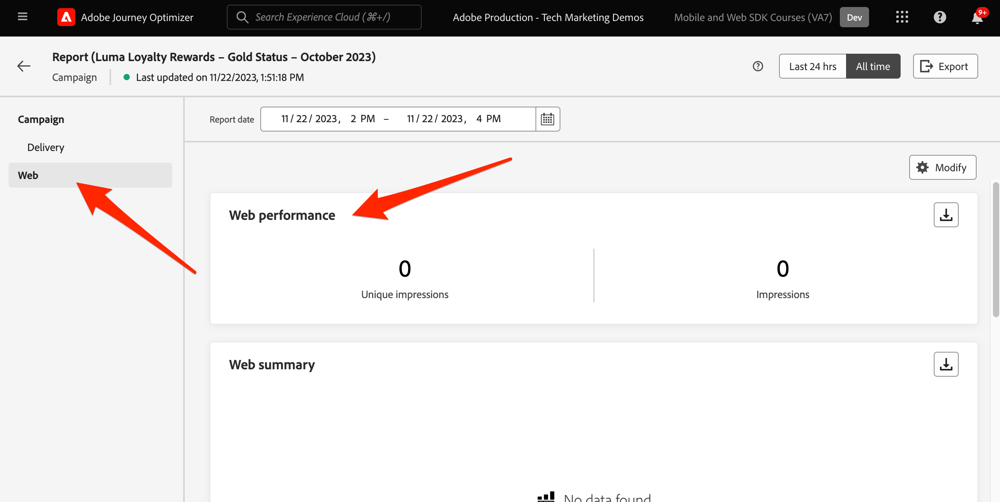

# Konfigurera Journey Optimizer webbkanal

Lär dig hur du implementerar Journey Optimizer webbkanal med Platform Web SDK. Den här guiden innehåller grundläggande krav för webbkanalen, detaljerade konfigurationssteg och en djupdykning i ett användningsexempel som fokuserar på lojalitetsstatus.

Genom att följa den här guiden kan Journey Optimizer-användare effektivt använda webbkanalen för avancerad onlineanpassning med Journey Optimizer Web Designer.

## Utbildningsmål

När lektionen är slut kan du:

* Förstå funktionen och betydelsen av Web SDK när det gäller att leverera webbkanalsupplevelsen.
* Förstå processen med att skapa en webbkanalskampanj från början till slut med exempelexemplet Luma Loyalty Rewards.
* Konfigurera kampanjegenskaper, åtgärder och scheman i gränssnittet.
* Förstå funktionaliteten och fördelarna med tillägget Adobe Experience Cloud Visual Editing Helper.
* Lär dig redigera webbsidesinnehåll, inklusive bilder, sidhuvuden och andra element, med Web Designer.
* Lär dig hur du infogar erbjudanden på en webbsida med beslutsdelen för erbjudandet.
* Bekanta dig med bästa praxis för att säkerställa kvaliteten och framgången för en webbkanalskampanj.

## Förutsättningar

För att slutföra lektionerna i det här avsnittet måste du först:

* Kontrollera att Adobe Experience Platform Web SDK-taggtilläggets version är 2.16 eller senare.
* Om du använder Journey Optimizer webbdesigner för att skapa din webbkanalsupplevelse måste du kontrollera att du använder webbläsarna Google Chrome eller Microsoft® Edge.
* Kontrollera också att du har laddat ned webbläsartillägget Adobe Experience Cloud Visual Editing Helper. Aktivera tillägget för hjälpwebbläsaren för visuell redigering i webbläsarens verktygsfält innan du skapar webbkanalsupplevelsen.
   * I Journey Optimizer webbdesigner är det inte säkert att vissa webbplatser öppnas på grund av någon av följande orsaker:
      1. Webbplatsen har strikta säkerhetsregler.
      1. Webbplatsen är inbäddad i en iframe.
      1. Kundens QA- eller stage-sajt är inte externt tillgänglig (det är en intern sajt).
* Kontrollera att cookies från tredje part tillåts i webbläsaren. Det kan vara nödvändigt att inaktivera alla annonsblockerare i webbläsaren.
* När du skapar webbupplevelser och inkluderar innehåll från Adobe Experience Manager Assets Essentials-biblioteket måste du konfigurera underdomänen för publicering av det här innehållet. [Läs mer](https://experienceleague.adobe.com/docs/journey-optimizer/using/web/web-delegated-subdomains.html?lang=en).
* Om du använder funktionen för innehållsexperimenterande ska du se till att din webbdatauppsättning också ingår i rapportkonfigurationen.
* För närvarande finns det två typer av implementeringar som gör det möjligt att skapa och leverera webbkanalskampanjer på dina webbegenskaper:
   * Endast på klientsidan: Om du vill ändra webbplatsen måste du implementera Adobe Experience Platform Web SDK.
   * Hybrid-läge: Du kan använda API:t för Platform Edge Network Server för att begära anpassning på serversidan. Svaret från API:t skickas sedan till Adobe Experience Platform Web SDK för återgivningsändringar på klientsidan. Mer information finns i API-dokumentationen för Adobe Experience Platform Edge Network Server. Ytterligare information och implementeringsexempel för hybridläget finns i det här blogginlägget.

>[!NOTE]
>
>Implementering på serversidan stöds för närvarande inte.

## Terminologi

Först och främst bör ni förstå den terminologi som används i webbkanalskampanjer.

* **Webbkanal**: Ett medium för kommunikation eller leverans av innehåll via webben. I den här guiden hänvisar den till den mekanism genom vilken personaliserat innehåll levereras till webbplatsbesökare som använder Platform Web SDK, inom Adobe Journey Optimizer.
* **Webbyta**: Avser en webbegenskap som identifieras av en URL där innehållet levereras. Det kan omfatta en eller flera webbsidor.
* **Journey Optimizer Web Designer**: Ett specifikt verktyg eller gränssnitt i Journey Optimizer där användare kan designa sina webbkanalsupplevelser.
* **Adobe Experience Cloud Visual Editing Helper**: Ett webbläsartillägg som gör det lättare att redigera och utforma webbkanalsupplevelser visuellt.
* **Datastream**: En konfiguration i Adobe Experience Platform-tjänsten som säkerställer att webbkanalsupplevelserna kan levereras.
* **Kopplingsprincip**: En konfiguration som säkerställer korrekt aktivering och publicering av inkommande kampanjer.
* **Målgrupp**: Ett specifikt segment med användare eller besökare som uppfyller vissa kriterier.
* **Webbdesigner**: Ett gränssnitt eller verktyg som gör det enklare att redigera och designa webbupplevelser visuellt utan att djupdyka i koden.
* **Uttrycksredigeraren**: Ett verktyg i Web Designer som gör att användare kan lägga till personalisering i webbinnehåll, eventuellt baserat på dataattribut eller andra kriterier.
* **Beslutskomponent för erbjudande**: En komponent i Web Designer som hjälper till att avgöra vilket erbjudande som är bäst lämpat att visas för en viss besökare baserat på beslutshantering.
* **Content Experiment**: En metod för att testa olika innehållsvariationer för att ta reda på vilken som fungerar bäst när det gäller det önskade måttet, till exempel inkommande klick.
* **Behandling**: I samband med innehållsexperiment avser en behandling en specifik variation av innehåll som testas mot en annan.
* **Simulering**: En förhandsvisningsmekanism som visualiserar webbkanalsupplevelsen innan den aktiveras för aktiva målgrupper.

## Konfigurera datastream

Kontrollera att ett datastream har definierats i Adobe Experience Platform och att alternativet Adobe Journey Optimizer är aktiverat. Detta måste konfigureras innan webbkanalsupplevelsen kan levereras av Platform Web SDK.

Så här konfigurerar du Adobe Journey Optimizer i datastream:

1. Gå till [Datainsamling](https://experience.adobe.com/#/data-collection){target="blank"} gränssnitt.
1. Välj **[!UICONTROL Datastreams]**.
1. Markera tidigare skapade Luma Web SDK-dataström.

   

1. Välj **[!UICONTROL Edit]** i Adobe Experience Platform Service.

   

1. Kontrollera **[!UICONTROL Adobe Journey Optimizer]** box.

   

1. Välj **[!UICONTROL Save]**.

Detta säkerställer att inkommande händelser för Journey Optimizer hanteras korrekt av Adobe Experience Platform Edge.

## Konfigurera sammanfogningsprincipen

Kontrollera att en sammanfogningsprincip har definierats med **[!UICONTROL Active-On-Edge Merge Policy]** aktiverat alternativ. Det här alternativet används av Journey Optimizer inkommande kanaler för att säkerställa korrekt aktivering och publicering av inkommande kampanjer.

Så här konfigurerar du alternativet i sammanfogningsprincipen:

1. Gå till **[!UICONTROL Customer]** > **[!UICONTROL Profiles]** i Experience Platform eller Journey Optimizer gränssnitt.
1. Klicka på fliken **[!UICONTROL Merge Policies]**.  
1. Välj din profil och växla **[!UICONTROL Active-On-Edge Merge Policy]** i **[!UICONTROL Configure]** steg.

   

## Konfigurera webbdatauppsättningen för innehållsexperiment

Om du vill använda innehållsexperiment i webbkanalskampanjer måste du se till att den webbdatauppsättning som används också ingår i rapportkonfigurationen. Journey Optimizer rapporteringssystem använder datauppsättningen i skrivskyddat läge för att fylla i användningsklara innehållsexperimenteringsrapporter.

[I det här avsnittet beskrivs hur du lägger till datauppsättningar för rapportering av innehållsexperiment](https://experienceleague.adobe.com/docs/journey-optimizer/using/campaigns/content-experiment/reporting-configuration.html?lang=en#add-datasets).

## Use Case Overview - Loyalty Rewards

I den här lektionen används ett exempel på Loyalty Rewards-användningsexempel för att beskriva implementeringen av en webbkanalsupplevelse med hjälp av Web SDK.

Med detta exempel får ni en bättre förståelse för hur Journey Optimizer kan hjälpa er att leverera de bästa inkommande upplevelserna till era kunder med hjälp av Journey Optimizer kampanjer och Web Designer.

>[!NOTE]
>
>Eftersom den här självstudiekursen riktar sig till implementerare är det värt att notera att den här lektionen handlar om omfattande gränssnittsarbete i Journey Optimizer. Sådana gränssnittsuppgifter hanteras vanligtvis av marknadsförare, men det kan vara bra för implementerare att få insikt i processen, även om de inte i slutänden ansvarar för att skapa webbkanalskampanjer.

### Skapa ett bonusschema och importera exempeldata

När Web SDK-data hämtas till Adobe Experience Platform kan de berikas av andra datakällor som du har kapslat in i Platform. När en användare till exempel loggar in på Luma-webbplatsen `lumaCrmId` skickas till Platform som representerar en identitet i Lumas CRM-system. Ett identitetsdiagram skapas i Experience Platform och alla andra profilaktiverade datauppsättningar kan sammanfogas för att skapa kundprofiler i realtid. Vi kommer snabbt att skapa ytterligare en datauppsättning i Adobe Experience Platform med några exempel på lojalitetsdata så att vi kan visa hur kundprofiler i realtid kan användas i Journey Optimizer webbkampanjer. Eftersom du redan har övat på liknande sätt kommer instruktionerna att vara kortfattade.

Så här skapar du schemat:

1. Skapa ett nytt schema
1. Välj **[!UICONTROL Individual Profile]** som [!UICONTROL base class]
1. Namnge schemat `Luma Loyalty Schema`
1. Välj `personID` field and mark is as an [!UICONTROL Identity] och [!UICONTROL Primary identity] med `Luma CRM Id` [!UICONTROL Identity namespace].
1. Lägg till [!UICONTROL Loyalty Details] fältgrupp
1. Aktivera schemat för [!UICONTROL Profile]

SCHEMASKÄRM

Så här skapar du datauppsättningen och importerar exempeldata:

1. Skapa en ny datauppsättning från `Luma Loyalty Schema`
1. Namnge datauppsättningen `Luma Loyalty Dataset`
1. Aktivera datauppsättningen för [!UICONTROL Profile]
1. Ladda ned exempelfilen LoyaltyWebSDK.json
1. Dra och släpp filen i datauppsättningen
1. Bekräfta att data har importerats

SKÄRMBILD AV DATAUPPSÄTTNING OCH BEKRÄFTELSE

### Skapa lojalitetskampanj

Nu när vi har inhämtat våra exempel på lojalitetsdata kan vi skapa webbkampanjen Loyalty Rewards i Adobe Journey Optimizer.

Så här skapar du exempelkampanjen:

1. Navigera till **[!UICONTROL Journey Management]** > **[!UICONTROL Campaigns]** till vänster navigering
1. Klicka **[!UICONTROL Create campaign]** i det övre högra hörnet.
1. I **[!UICONTROL Properties]** anger du hur kampanjen ska köras. För användningsfallet Loyalty Rewards väljer du **Schemalagd**.

   

1. I **[!UICONTROL Actions]** väljer du **[!UICONTROL Web channel]**. Som  **[!UICONTROL Web surface]**, markera **[!UICONTROL Page URL]**.

>[!NOTE]
>
>En webbyta refererar till en webbegenskap som identifieras av en URL där innehållet levereras. Den kan motsvara en enda sidas URL eller innehålla flera sidor, vilket gör att du kan använda ändringarna på en eller flera webbsidor.

Välj **[!UICONTROL Page URL]** webbsidesalternativ för att distribuera upplevelsen på en sida för kampanjen. Ange Luma-sidans URL.

1. När webbytan är definierad väljer du **[!UICONTROL Create]**.

   

1. Nu kan du lägga till ytterligare information i den nya webbkanalskampanjen. Ge först namnet på kampanjen. Ring `Luma Loyalty Rewards – Gold Status – October 2023`. Du kan också lägga till en beskrivning till kampanjen. Lägg även till **[!UICONTROL Tags]** för att förbättra den övergripande kampanjtaxonomin.

   

1. Som standard är kampanjen aktiv för alla webbplatsbesökare. I det här fallet bör endast guldstatuspoängare se upplevelsen. Aktivera detta genom att klicka på **[!UICONTROL Select audience]** och väljer `Luma Loyalty Rewards – Gold Status` målgrupp.

1. I **[!UICONTROL Identity namespace]** markerar du namnutrymmet för att identifiera individer inom det valda segmentet. Eftersom du distribuerar kampanjen på Luma-webbplatsen kan du välja ECID-namnutrymmet. Profiler i `Luma Loyalty Rewards – Gold Status` målgrupper som saknar ECID-namnutrymmet bland sina olika identiteter omfattas inte av webbkanalskampanjen.

   

1. Schemalägg kampanjen till början den 1 december med **[!UICONTROL Campaign start]** och upphör den 31 december med **[!UICONTROL Campaign end]** alternativ.

   

>[!NOTE]
>
>Tänk på att webbupplevelsen visas när besökaren öppnar sidan för webbkanalskampanjer. Till skillnad från andra typer av kampanjer i Adobe Journey Optimizer **[!UICONTROL Action triggers]** -avsnittet kan inte konfigureras.

### Experimentera med lojalitetsmaterial

I **[!UICONTROL Action]** kan du skapa ett experiment för att testa vilket innehåll som fungerar bäst för `Luma Loyalty Rewards – Gold Status` målgrupp. Låt oss skapa och testa två behandlingar som en del av kampanjkonfigurationen.

Så här skapar du innehållsexperimentet:

1. Klicka på **[!UICONTROL Create experiment]**.

   

1. Välj först **[!UICONTROL Success metric]**. Detta är måttet för att avgöra innehållets effektivitet. Välj **[!UICONTROL Unique Inbound Clicks]**, för att se vilken innehållsbehandling som genererar fler klick på webbupplevelsen CTA.

   

1. När du skapar ett experiment med webbkanalen och väljer **[!UICONTROL Inbound Clicks]**, **[!UICONTROL Unique Inbound Clicks]**, **[!UICONTROL Page Views]**, eller **[!UICONTROL Unique Page Views]** mätvärden, **[!UICONTROL Click Action]** I den här listrutan kan du hålla reda på och övervaka klick och vyer på specifika sidor.

1. Du kan också ange en **[!UICONTROL Holdout]** som inte får någon av de två behandlingarna. Låt det vara omarkerat för tillfället.

1. Du kan också välja att **[!UICONTROL Distribute evenly]**. Markera det här alternativet för att se till att uppdelningarna alltid är jämnt fördelade.

[Läs mer om experiment med innehåll i Adobe Journey Optimizer Web Channel](https://experienceleague.adobe.com/docs/journey-optimizer/using/campaigns/content-experiment/get-started-experiment.html?lang=en).

### Redigera innehåll med hjälp av den visuella hjälpen

Låt oss nu skapa webbkanalsupplevelsen. Använd Adobe Experience Cloud **[!UICONTROL Visual Helper]**. Det här verktyget är ett webbläsartillägg som är kompatibelt med Google Chrome och Microsoft® Edge. Kontrollera att du har hämtat tillägget innan du försöker skapa dina upplevelser. Se även till att webbsidan innehåller Web SDK.

1. I **[!UICONTROL Action]** fliken för kampanjen, klicka på **[!UICONTROL Edit content]**. Eftersom du angav en enda sidadress som yta bör du vara redo att börja arbeta i dispositionen.

   

1. Klicka nu **[!UICONTROL Edit web page]** för att börja skapa.

   

1. Börja med att redigera vissa element med hjälp av webbdispositionen. Använd snabbmenyn för att redigera Luma-hjältebildhuvudet. Justera formatet för den sammanhangsberoende rutan till höger.

   

1. Lägg även till personalisering i behållaren med **[!UICONTROL Expression editor]**.

   

1. Se till att materialet spåras korrekt för klickningar. Välj **[!UICONTROL Click track element]** på snabbmenyn.

   

1. Använd **[!UICONTROL Offer decision component]** för att infoga erbjudanden på webbsidan. Den här komponenten använder **[!UICONTROL Decision Management]** för att välja det bästa erbjudandet att leverera till Luma-besökare.

### Designändringar för HTML

Det finns några tillgängliga metoder om du vill göra mer avancerade eller anpassade ändringar av webbplatsen som en del av kampanjen Loyalty Rewards.

Använd **[!UICONTROL Components]** för att lägga till HTML eller annat innehåll direkt på Luma-webbplatsen.

Lägg till en ny HTML-komponent högst upp på sidan. Redigera HTML i komponenten från designgränssnittet eller **[!UICONTROL Contextual]** fönster.

Du kan också lägga till HTML-redigeringar från **[!UICONTROL Modifications]** fönster. I den här rutan kan du markera en komponent på sidan och redigera den i designergränssnittet.

Lägg till HTML för `Luma Loyalty Rewards – Gold Status` målgrupp. Välj **[!UICONTROL Validate]**.

Granska nu den nya anpassade HTML-komponenten så att den passar och känns.

Redigera en viss komponent med **[!UICONTROL CSS selector type]** modifiering.

Lägg till anpassad kod med **Sida `<head>` type** modifiering.

Möjligheterna är oändliga med **[!UICONTROL Visual Helper]**.

### Simulera innehåll för Loyalty Rewards

Titta på en förhandsgranskning av den ändrade webbsidan innan du aktiverar kampanjen. Tänk på att du måste ha testprofiler konfigurerade för att simulera webbkanalsupplevelser.

Så här simulerar du upplevelsen:

1. Välj **[!UICONTROL Simulate content]** inom kampanjen.

   

1. Välj en testprofil för att ta emot simuleringen. Tänk på att testprofilen ska finnas i `Luma Loyalty Rewards – Gold Status` för att få rätt behandling.

1. Förhandsgranskningen visas för testprofilen.

### Aktivera kampanjen Loyalty Rewards

Aktivera slutligen webbkanalskampanjen.

1. Välj **Granska för aktivering**.

1. Du uppmanas att bekräfta kampanjinformationen en sista gång. Välj **[!UICONTROL Activate]**. Det kan ta upp till 15 minuter innan kampanjen publiceras på webbplatsen.

### Lojalitetsprogram - QA

Det bästa är att följa **[!UICONTROL Web]** i kampanjens livs- och globala rapporter för kampanjspecifika nyckeltal. För den här kampanjen ska du övervaka upplevelseintrycken och klicka på en frekvens.

### Validering av webbkanal med Adobe Experience Platform Debugger

Tillägget Adobe Experience Platform Debugger, som finns för både Chrome och Firefox, analyserar dina webbsidor för att identifiera problem med implementeringen av Adobe Experience Cloud lösningar.

Du kan använda felsökaren på Luma-webbplatsen för att validera webbkanalsupplevelsen i produktionen. Detta är en bra metod när Loyalty Rewards-användningsexemplet är öppet och körs för att säkerställa att allt är korrekt konfigurerat.

[Lär dig hur du konfigurerar felsökaren i webbläsaren med hjälp av guiden här](https://experienceleague.adobe.com/docs/platform-learn/data-collection/debugger/overview.html?lang=en).

Så här börjar du valideringen med felsökaren:

1. Navigera till webbsidan Luma med webbkanalsupplevelsen.
   <!--
    
    -->
1. Öppna **[!UICONTROL Adobe Experience Platform Debugger]**.
   <!--
    
    -->
1. Navigera till **Sammanfattning**. Verifiera att **[!UICONTROL Datastream ID]** matchar **[!UICONTROL datastream]** in **[!UICONTROL Adobe Data Collection]** som du har aktiverat Adobe Journey Optimizer för.
   <!--
    
    -->
1. Du kan sedan logga in på webbplatsen med olika Luma-förmånskonton och använda felsökaren för att validera begäranden som skickas till Adobe Experience Platform Edge Network.
   <!--
    
    -->
1. Under **[!UICONTROL Solutions]** navigera till **[!UICONTROL Experience Platform Web SDK]**.
   <!--
    
    -->
1. I **Konfiguration** flik, växla på **[!UICONTROL Enable Debugging]**. Detta aktiverar loggning för sessionen i en **[!UICONTROL Adobe Experience Platform Assurance]** session.
   <!--
    
    -->
1. Logga in på webbplatsen med olika Luma-förmånskonton och använd felsökaren för att validera förfrågningar som skickas till **[!UICONTROL Adobe Experience Platform Edge network]**. Alla dessa förfrågningar ska registreras i **[!UICONTROL Assurance]** för loggspårning.
<!--
   
-->
