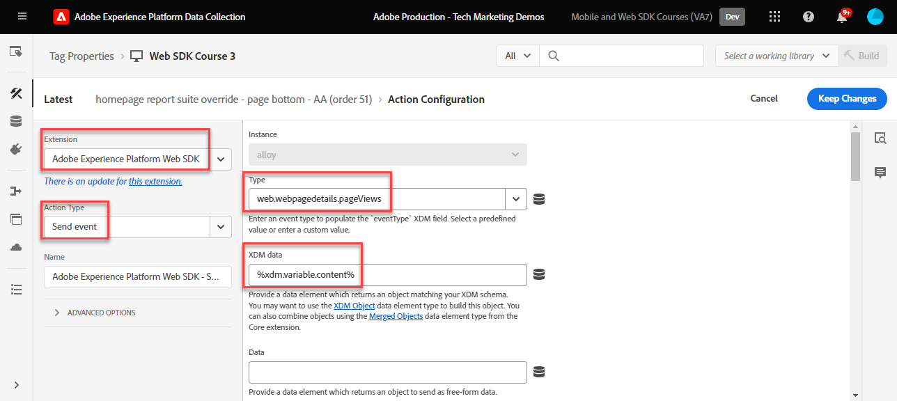
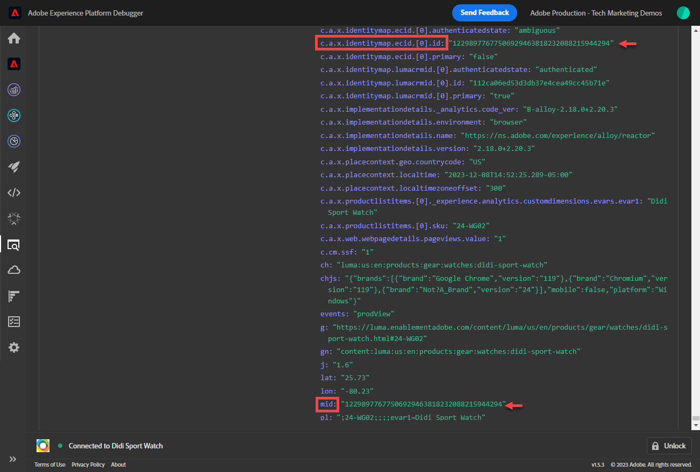
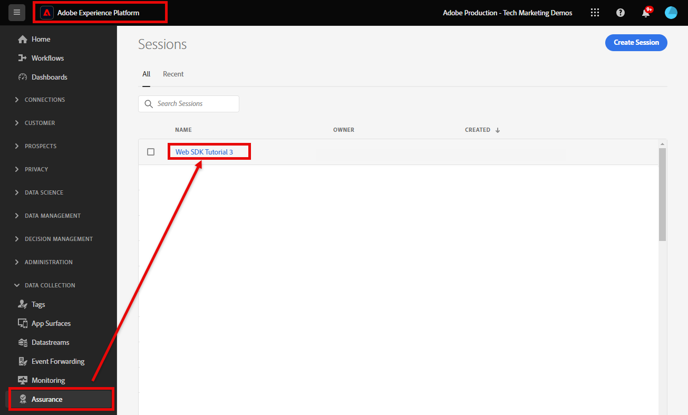
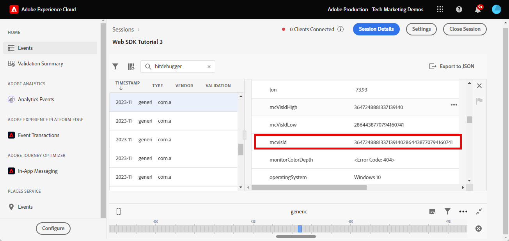

# Konfigurera Adobe Analytics med Platform Web SDK

Lär dig konfigurera Adobe Analytics med [Experience Platform Web SDK](https://experienceleague.adobe.com/docs/platform-learn/data-collection/web-sdk/overview.html), skapa taggregler för att skicka data till Adobe Analytics och validera att Analytics hämtar in data som förväntat.

[Adobe Analytics](https://experienceleague.adobe.com/docs/analytics.html) är en branschledande applikation som ger er möjlighet att förstå era kunder som människor och styra verksamheten med kundanalys.


## Utbildningsmål

När lektionen är klar kan du:

* Konfigurera ett XDM-schema för Adobe Analytics
* Förstå skillnaden mellan automatiskt mappade och manuellt mappade XDM-variabler för Analytics
* Konfigurera ett datastream för att aktivera Adobe Analytics
* Åsidosätt ett datastream för att skicka data till ett annat Adobe Analytics-rapportpaket
* Mappa enskilda eller hela arraydataelement till XDM-objektet
* Använd åtgärdstypen Uppdatera variabelregel för att stapla flera regler i en XDM-händelse
* Hämta sidvyer i Adobe Analytics med XDM-objektet
* Samla in e-handelsdata med XDM-objektet för Adobe Analytics produktsträng
* Ange eVar för produktsyntaxmarknadsföring med hjälp av XDM
* Validera Adobe Analytics-variabler anges med XDM-objektet med Experience Platform Debugger
* Använd Adobe Analytics bearbetningsregler för att ange anpassade variabler
* Validera data som har fångats in av Adobe Analytics med Adobe Experience Platform Assurance
* Validera data hämtas av Adobe Analytics med Real-Time Reports

## Förutsättningar

Du känner till taggar, Adobe Analytics och [Luma demo site](https://luma.enablementadobe.com/content/luma/us/en.html){target="_blank"} inloggnings- och shoppingfunktioner.

Du behöver minst ett test-/dev-rapportpaket-ID. Om du inte har någon test-/dev-rapportsserie som du kan använda för den här självstudiekursen, [skapa en](https://experienceleague.adobe.com/docs/analytics/admin/manage-report-suites/new-report-suite/t-create-a-report-suite.html).

Du måste ha slutfört alla steg från de föregående avsnitten i självstudien:

* Inledande konfiguration
   * [Konfigurera ett XDM-schema](configure-schemas.md)
   * [Konfigurera ett identitetsnamnutrymme](configure-identities.md)
   * [Konfigurera ett datastream](configure-datastream.md)
* Märkordskonfiguration
   * [Installera SDK-tillägg för webben](install-web-sdk.md)
   * [Skapa dataelement](create-data-elements.md)
   * [Skapa identiteter](create-identities.md)
   * [Skapa en taggregel](create-tag-rule.md)
   * [Validera med Adobe Experience Platform debugger](validate-with-debugger.md)

Du måste också [Aktivera användaråtkomst till Adobe Experience Platform Assurance](https://experienceleague.adobe.com/docs/experience-platform/assurance/user-access.html) så att du kan validera dina Adobe Analytics-data med Adobe Experience Platform Assurance. (Om du har åtkomstscheman, ID-namnutrymmen och datastreams har du redan åtkomst till Assurance)

## XDM-scheman och analysvariabler

Grattis! Du har redan konfigurerat ett schema som är kompatibelt med Adobe Analytics i [Konfigurera ett schema](configure-schemas.md) lektion! För Adobe Analytics finns det dock två allmänna metoder för att definiera XDM för Adobe Analytics.

<!-- Implementing Platform Web SDK should be as product-agnostic as possible. For Adobe Analytics, mapping eVars, props, and events doesn't occur during schema creation, nor during the tag rules configuration as it has been done traditionally. Instead, every XDM key-value pair becomes a Context Data Variable that maps to an Analytics variable in one of two ways: 

1. Automatically mapped variables using reserved XDM fields
1. Manually mapped variables using Analytics Processing Rules

To understand what XDM variables are auto-mapped to Adobe Analytics, please see [Variables automatically mapped in Analytics](https://experienceleague.adobe.com/docs/experience-platform/edge/data-collection/adobe-analytics/automatically-mapped-vars.html?lang=en). Any variable that is not auto-mapped must be manually mapped. -->

1. **Produktmedveten XDM**: upprätthålla ett semantiskt XDM-schema för nyckelvärdepar och använda [Adobe Analytics bearbetningsregler](https://experienceleague.adobe.com/docs/analytics/admin/admin-tools/manage-report-suites/edit-report-suite/report-suite-general/c-processing-rules/processing-rules.html) för att mappa XDM-fälten till eVars, props och så vidare. Med ett semantiskt XDM-schema menar vi att fältnamnen själva har betydelse. Fältnamnet `web.webPageDetails.pageName` har mer betydelse än att säga `prop1` eller `evar3`.

   >[!IMPORTANT]
   >
   > Alla fält i XDM-schemat blir tillgängliga för Adobe Analytics som Context Data Variables med följande prefix `a.x.`. Exempel: `a.x.web.webinteraction.region`

1. **Analysspecifik XDM**: Använd en specialbyggd Adobe Analytics-fältgrupp i XDM-schemat som kallas `Adobe Analytics ExperienceEvent Template`

Adobe har sett att kunderna föredrar **Analysspecifik XDM** eftersom mappningssteget hoppas över i Adobe Analytics bearbetningsregler. Stegen i den här lektionen använder **Analysspecifik XDM** -strategi.

## Mappa XDM till Adobe Analytics

Många XDM-fält mappas automatiskt till analysvariabler.

Schemat som skapats i [Konfigurera ett schema](configure-schemas.md) lektionen innehåller några automatiskt mappade till analysvariabler, som beskrivs i följande tabell:

| XDM till Analytics - automappade variabler | Adobe Analytics-variabel |
|-------|---------|
| `identitymap.ecid.[0].id` | mitten |
| `web.webPageDetails.name` | s.pageName |
| `web.webPageDetails.server` | s.server |
| `web.webPageDetails.siteSection` | s.channel |
| `commerce.productViews.value` | prodView |
| `commerce.productListViews.value` | scView |
| `commerce.checkouts.value` | scCheckout |
| `commerce.purchases.value` | köp |
| `commerce.order.currencyCode` | s.currencyCode |
| `commerce.order.purchaseID` | s.purchaseID |
| `productListItems[].SKU` | s.products=;product name;;;; (primär - se anmärkning nedan) |
| `productListItems[].name` | s.products=;product name;;;; (fallback - se anm. nedan) |
| `productListItems[].quantity` | s.products=;;produktkvantitet; |
| `productListItems[].priceTotal` | s.product=;;;produktpris; |

>[!NOTE]
>
>De enskilda avsnitten i Analytics-produktsträngen anges via olika XDM-variabler under `productListItems` -objekt.
>18 augusti 2022 `productListItems[].SKU` prioriterar mappning till produktnamnet i variabeln s.products.
>Värdet som anges till `productListItems[].name` mappas endast till produktnamnet om `productListItems[].SKU` finns inte. Annars är den omappad och tillgänglig i kontextdata.
>Ange inte en tom sträng eller null till  `productListItems[].SKU`. Detta har den oönskade effekten av att mappa till produktnamnet i variabeln s.products.

Den senaste listan över mappningar finns på [Variabelmappning för analyser i Adobe Experience Edge](https://experienceleague.adobe.com/docs/experience-platform/edge/data-collection/adobe-analytics/automatically-mapped-vars.html).

För XDM-variabler som inte mappas automatiskt använder du `Adobe Analytics ExperienceEvent Template` fältgrupp enligt anvisningarna i det kommande avsnittet nedan.


## Konfigurera datastream

Platform Web SDK skickar data från din webbplats till Platform Edge Network. Din datastream talar sedan om för Platform Edge Network till vilken av dina Adobe Analytics rapporteringsprogram som informationen ska vidarebefordras till.

1. Gå till [Datainsamling](https://experience.adobe.com/#/data-collection){target="blank"} gränssnitt
1. Välj **[!UICONTROL Datastreams]**
1. Markera tidigare skapade `Luma Web SDK: Development Environment` datastream

   

1. Välj **[!UICONTROL Lägg till tjänst]**
   
1. Välj **[!UICONTROL Adobe Analytics]** som **[!UICONTROL Tjänst]**
1. Ange  **[!UICONTROL Report Suite-ID]** av din utvecklingsrapportsserie
1. Välj **[!UICONTROL Spara]**

   

   >[!TIP]
   >
   >Lägg till fler rapportsviter genom att välja **[!UICONTROL Lägg till rapportsvit]** motsvarar taggning i flera programsviter.

>[!WARNING]
>
>I den här självstudiekursen konfigurerar du bara Adobe Analytics rapportsvit för din utvecklingsmiljö. När du skapar datastreams för din egen webbplats skapar du ytterligare datastreams och rapportsviter för dina staging- och produktionsmiljöer.

### Konfigurera en åsidosättning av ett datastream-rapportpaket

Du kanske vill ändra vilka data i Adobe Analytics rapportserie som skickas till när besökarna finns på vissa sidor. Så här konfigurerar du en åsidosättningsinställning för datastream för Adobe Analytics:

1. Redigera **[!UICONTROL Adobe Analytics]** genom att öppna  och sedan välja **[!UICONTROL Redigera]**

   

1. Välj **[!UICONTROL Avancerade alternativ]** att öppna **[!UICONTROL Åsidosättningar av rapportsviter]**

1. Markera de rapportsviter som du vill åsidosätta. I detta fall `Web SDK Course Dev` och `Web SDK Course Stg`

1. Välj Spara

   

Senare i den här lektionen [skapa en regel för att skicka en sidvy till en annan rapportserie med åsidosättning av datastream](setup-analytics.md###send-a-page-view-to-a-different-report-suite-with-datastream-override).

## Skapa ytterligare dataelement för e-handel

Hämta sedan in ytterligare data från Luma-datalagret och skicka dem till Platform Edge Network. Även om lektionen fokuserar på vanliga Adobe Analytics-krav kan alla insamlade data enkelt skickas till andra destinationer baserat på din datastream-konfiguration. Om du t.ex. har avslutat Adobe Experience Platform-lektionen skickas även de ytterligare data du får i lektionen till Platform.

Under lektionen Skapa dataelement kan du [skapade JavaScript-dataelement](create-data-elements.md#create-data-elements-to-capture-the-data-layer) som fångade innehåll och identitetsinformation. Nu kan du skapa ytterligare dataelement för att hämta in e-handelsdata. På grund av [Luma demo site](https://luma.enablementadobe.com/content/luma/us/en.html){target="_blank"} använder olika datalagerstrukturer för produktinformationssidor och produkter i kundvagnen, måste du skapa separata dataelement för varje scenario. Använd anpassade kodelement för att få tag i det du behöver från Luma-datalagret, vilket kan vara nödvändigt eller inte är nödvändigt vid implementering på din egen webbplats. I så fall måste du gå igenom en mängd olika varukorgsartiklar för att få information om varje produkt. Använd följande kodfragment:

1. Öppna taggegenskapen som du använder för självstudiekursen

1. Gå till **[!UICONTROL Dataelement]**

1. Välj **[!UICONTROL Lägg till dataelement]**

1. Ge den ett namn **`product.productInfo.sku`**

1. Använd **[!UICONTROL Egen kod]** **[!UICONTROL Dataelementtyp]**

1. Lämna kryssrutor för **[!UICONTROL Använd gemener]** och **[!UICONTROL Rensa text]** avmarkerad

1. Lämna `None` som **[!UICONTROL Lagringstid]** inställning eftersom det här värdet är olika på alla sidor

1. Välj **[!UICONTROL Öppna redigeraren]**

   

1. Kopiera och klistra in följande kod


   ```javascript
   var cart = digitalData.product;
   var cartItem;
   cart.forEach(function(item){
   cartItem = item.productInfo.sku;
   });
   return cartItem;
   ```

1. Välj **[!UICONTROL Spara]** för att spara den anpassade koden

1. Välj **[!UICONTROL Spara]** spara dataelementet

Följ de här stegen för att skapa ytterligare dataelement:

* **`product.productInfo.title`**

  ```javascript
  var cart = digitalData.product;
  var cartItem;
  cart.forEach(function(item){
  cartItem = item.productInfo.title;
  });
  return cartItem;
  ```

<!--* **`product.productInfo.name`**

    ```javascript
    var cart = digitalData.product;
    var cartItem;
    cart.forEach(function(item){
    cartItem = item.productInfo.name;
    });
    return cartItem;
    ```-->

<!--* **`cart.productInfo`**

    ```javascript
    var cart = digitalData.cart.cartEntries; 
    var cartItem = [];
    cart.forEach(function(item, index, array){
    var qty;
    if(window.location.pathname.includes("thank-you.html")){
    qty = parseInt(item.qty);
    }else{
    qty = "";
    }
    var price = parseInt(item.price);
    cartItem.push({
    "SKU": item.sku,
    "quantity": qty,
    "priceTotal": price
    });
    });
    return cartItem; 
    ```-->

* **`cart.productInfo`**

  ```javascript
  var cart = digitalData.cart.cartEntries; 
  var cartItem = [];
  cart.forEach(function(item, index, array){
  cartItem.push({
  "SKU": item.sku
  });
  });
  return cartItem; 
  ```

* **`cart.productInfo.purchase`**

  ```javascript
  var cart = digitalData.cart.cartEntries; 
  var cartItem = [];
  cart.forEach(function(item, index, array){
  var qty = parseInt(item.qty);
  var price = parseInt(item.price);
  cartItem.push({
  "SKU": item.sku,
  "quantity": qty,
  "priceTotal": price
  });
  });
  return cartItem; 
  ```

  >[!TIP]
  >
  > Det här kodfragmentet innehåller en anpassad eVar1-inställning som används under produktmarknadsföringslektionen eVars

När du har lagt till dessa dataelement och skapat de tidigare elementen i [Skapa dataelement](create-data-elements.md) lektion bör du ha följande dataelement:

| Dataelement |
-----------------------------|
| `cart.orderId` |
| `cart.productInfo` |
| `cart.productInfo.purchase` |
| `identityMap.loginID` |
| `page.pageInfo.hierarchie1` |
| `page.pageInfo.pageName` |
| `page.pageInfo.server` |
| `product.productInfo.sku` |
| `product.productInfo.title` |
| `user.profile.attributes.loggedIn` |
| `user.profile.attributes.username` |
| `xdm.variable.content` |

<!-- 
>[!IMPORTANT]
>
>In this tutorial, you will create a different XDM object for each event. That means you must remap variables that would be considered to be "globally" available on every hit, such as page name and identityMap. However, you may [Merge Objects](https://experienceleague.adobe.com/docs/experience-platform/tags/extensions/adobe/core/overview.html#merged-objects) or use [Mapping Tables](https://exchange.adobe.com/experiencecloud.details.103136.mapping-table.html) to manage your XDM objects more efficiently in a real-life situation. For this lesson, the global variables are considered as:
>
>* **[!UICONTROL identityMap]** to capture the authenticated ID as per the [Create Identity Map Data Element](create-data-elements.md#create-identity-map-data-element) exercise in the [Create Data Elements](create-data-elements.md) lesson.
>* **[!UICONTROL web]** object to capture content as per the [content XDM object](create-data-elements.md#map-content-data-elements-to-XDM-Schema-individually) exercise in the [Create Data Elements](create-data-elements.md) lesson on every data element above. 
-->

## Skapa ytterligare regler

I [Skapa en taggregel](create-tag-rule.md) lektion, du skapar en `all pages global content variables - library loaded - AA (order 1)` regel som [skapade ett baslinje-XDM-objekt med **[!UICONTROL Uppdatera variabel]** **[!UICONTROL åtgärdstyper]**](create-tag-rule.md#create-tag-rule). I följande övningar berikas XDM-objektet så att ytterligare data som är specifika för vissa sidor samlas in.

### Öka sidvyer

Eftersom du nu skickar data till Adobe Analytics rekommenderar vi att du mappar ett extra XDM-fält för att ange en sidvy. Det krävs inte för Analytics för att bearbeta en fyr som en sidvy, men det är bra att ha ett standardsätt att indikera en sidvy för andra program i senare led.

1. Öppna `all pages global content variables - library loaded - AA (order 1)` regel
1. Öppna **[!UICONTROL Uppdatera variabel]** åtgärd
1. Bläddra nedåt och välj att öppna tills `web.webPageDetails`
1. Välj för att öppna **[!UICONTROL pageViews]** object
1. Ange **[!UICONTROL value]** till `1`
1. Välj **[!UICONTROL Behåll ändringar]**

   


### Skicka en sidvy till en annan rapportserie med åsidosättning av datastream

Skapa en regel för att skicka ytterligare ett sidvyanrop till en annan rapportsvit. Använd åsidosättningsfunktionen för datastream för att ändra rapportsviten för en sida med hjälp av **[!UICONTROL Skicka händelse]** Åtgärd.

1. Skapa en ny regel, kalla den `homepage report suite override - library loaded - AA (order 51)`

1. Markera plustecknet under **[!UICONTROL Händelse]** lägga till en ny utlösare

1. Under **[!UICONTROL Tillägg]**, markera **[!UICONTROL Core]**

1. Under **[!UICONTROL Händelsetyp]**, markera **[!UICONTROL biblioteket har lästs in]**

1. Ge den ett namn `Core - library loaded - order 51`

1. Markera för att öppna **[!UICONTROL Avancerade alternativ]**, skriva in `51`. Detta garanterar att regeln körs efter `all pages global content variables - library loaded - AA (order 50)` som ställer in baslinje-XDM med **[!UICONTROL Uppdatera variabel]** åtgärdstyp.

   

1. Under **[!UICONTROL Villkor]**, välj **[!UICONTROL Lägg till]**

1. Lämna **[!UICONTROL Typ av logik]** as **[!UICONTROL Normal]**

1. Lämna **[!UICONTROL Tillägg]** as **[!UICONTROL Core]**

1. Välj **[!UICONTROL Villkorstyp]** as **[!UICONTROL Sökväg utan frågesträng]**

1. Till höger, lämna **[!UICONTROL Regex]** växla inaktiverad

1. Under **[!UICONTROL bana är lika med]** set `/content/luma/us/en.html`. För demonstrationswebbplatsen Luma säkerställer den att regeln endast aktiveras på startsidan

1. Välj **[!UICONTROL Behåll ändringar]**

   

1. Under **[!UICONTROL Åtgärder]** välj **[!UICONTROL Lägg till]**

1. Som **[!UICONTROL Tillägg]**, markera **[!UICONTROL Adobe Experience Platform Web SDK]**

1. Som **[!UICONTROL Åtgärdstyp]**, markera **[!UICONTROL Skicka händelse]**

1. Som **[!UICONTROL Typ]**, markera `web.webpagedetails.pageViews`

1. Som **[!UICONTROL XDM-data]** väljer du `xdm.variable.content` du skapade i [Skapa dataelement](create-data-elements.md) lektion

   

1. Bläddra nedåt till **[!UICONTROL Åsidosättningar av dataströmskonfigurationer]** section

1. Lämna **[!UICONTROL Utveckling]** har valts.

   >[!TIP]
   >
   >    Den här fliken avgör i vilken taggmiljö åsidosättningen sker. I det här exemplet anger du bara utvecklingsmiljön, men när du distribuerar den till produktionen måste du också göra det i **[!UICONTROL Produktion]** miljö.


1. Välj **[!UICONTROL Datastream]**, i detta fall `Luma Web SDK: Development Environment`

1. Under **[!UICONTROL Rapportsviter]** väljer du den rapportwebbplats som du vill åsidosätta. I detta fall `tmd-websdk-course-stg`.


   >[!TIP]
   >
   >Listan över rapportsviter som visas här avgörs av [konfigurera åsidosättning av en datastream-rapportsprogramsvit](configure-datastream.md###configure-a-datastream-report-suite-override) steg. Att lägga till rapportsvit motsvarar taggning av flera programsviter.

1. Välj **[!UICONTROL Behåll ändringar]**

1. Och **[!UICONTROL Spara]** din regel

   

### Förbättra XDM-objektet med hjälp av variabeln Update

Använda **[!UICONTROL Uppdatera variabel]** åtgärdstyp kan du skapa ytterligare regler för att berika &quot;global content XDM&quot; innan det skickas till [!UICONTROL Platform Edge Network]. Uppfyll detta genom att sekvensera de nya reglerna före `all pages send event - library loaded - AA (order 50)` som skickar händelsen [!UICONTROL Platform Edge Network].

>[!TIP]
>
>Regelordningen bestämmer vilken regel som körs först när en händelse utlöses. Om två regler har samma händelsetyp körs den med det lägsta talet först.
> 
>

## Ange produktsträngen

Innan du mappar till produktsträngen är det viktigt att förstå att det finns två huvudobjekt i XDM-schemat som används för att hämta e-handelsdata som har särskilda relationer med Adobe Analytics:

1. The `commerce` objekt ställer in Analytics-händelser som `prodView`, `scView`och `purchase`
1. The `productListItems` objekt ställer in Analytics-dimensioner som `productID`.

Se [Samla in data om handel och produkter](https://experienceleague.adobe.com/docs/experience-platform/edge/data-collection/collect-commerce-data.html?lang=en) för mer information.


Börja med att spåra produktvyer på Lumas produktinformationssida.

1. Välj **[!UICONTROL Regler]** och sedan **[!UICONTROL Lägg till regel]**
1. Ge den ett namn  [!UICONTROL `ecommerce - pdp library loaded - AA (order 20)`]
1. Välj  under Händelse för att lägga till en ny utlösare
1. Under **[!UICONTROL Tillägg]**, markera **[!UICONTROL Core]**
1. Under **[!UICONTROL Händelsetyp]**, markera **[!UICONTROL biblioteket har lästs in]**
1. Ge den ett namn `Core - library loaded - order 20`
1. Markera för att öppna **[!UICONTROL Avancerade alternativ]**, skriva in `20`. Detta garanterar att regeln körs efter `all pages global content variables - library loaded - AA (order 1)` som ställer in globala innehållsvariabler, men före `all pages send event - library loaded - AA (order 50)` som skickar XDM-händelsen.

   

1. Under **[!UICONTROL Villkor]**, välj **[!UICONTROL Lägg till]**
1. Lämna **[!UICONTROL Typ av logik]** as **[!UICONTROL Normal]**
1. Lämna **[!UICONTROL Tillägg]** as **[!UICONTROL Core]**
1. Välj **[!UICONTROL Villkorstyp]** as **[!UICONTROL Sökväg utan frågesträng]**
1. Till höger aktiverar du **[!UICONTROL Regex]** växla
1. Under **[!UICONTROL bana är lika med]** set `/products/`. För demonstrationswebbplatsen Luma säkerställer den att regeln endast aktiveras på produktsidor
1. Välj **[!UICONTROL Behåll ändringar]**

   

1. Under **[!UICONTROL Åtgärder]** välj **[!UICONTROL Lägg till]**
1. Välj **[!UICONTROL Adobe Experience Platform Web SDK]** extension
1. Välj **[!UICONTROL Åtgärdstyp]** as **[!UICONTROL Uppdatera variabel]**
1. Bläddra nedåt till `commerce` och väljer att öppna det.
1. Öppna **[!UICONTROL productViews]** objekt och ange **[!UICONTROL value]** till `1`

   

   >[!TIP]
   >
   >Setting commerce.productViews.value=1 in XDM mappar automatiskt till `prodView` händelse i Analytics

Det är också viktigt att du förstår att du kan **[!UICONTROL ange enskilda attribut]** till enskilda XDM-fält eller **[!UICONTROL tillhandahåller en hel array]** till ett XDM-objekt.


### Mappa enskilda attribut till ett XDM-objekt

På grund av datalagerstrukturen på Luma kan du mappa till enskilda variabler för att samla in data på produktinformationssidan på Luma Demo-webbplatsen.

1. Bläddra nedåt till och markera `productListItems` array
1. Välj **[!UICONTROL Ange enskilda objekt]**
1. Välj **[!UICONTROL Lägg till objekt]**

   

   >[!CAUTION]
   >
   >The **`productListItems`** är en `array` datatyp så att data förväntas komma in som en samling element. På grund av Luma-demonstrationswebbplatsens datalagerstruktur och eftersom det bara är möjligt att visa en produkt i taget på Luma-webbplatsen, lägger du till objekt individuellt. När du implementerar på din egen webbplats, beroende på din datalagerstruktur, kanske du kan tillhandahålla en hel array.

1. Markera för att öppna **[!UICONTROL Objekt 1]**
1. Karta **`productListItems.item1.SKU`** till `%product.productInfo.sku%`

   

1. Sök `eventType` och ange `commerce.productViews`

1. Markera inte Behåll ändringar än

### Ange en eVar för varuexponering i produktsträngen

Genom att använda `Adobe Analytics ExperienceEvent Template` fältgrupp för att definiera XDM-schemat kan du mappa variabler till att marknadsföra eVars eller händelser i produktsträngen. Detta kallas även inställning **Produktsyntaxmarknadsföring**. Lägg märke till `_experience` objekt under `productListItems` > `Item 1`. Ange alla variabler under den här [!UICONTROL object] anger produktsyntaxen eVars eller Events.

1. Markera för att öppna `_experience > analytics > customDimensions > eVars > eVar1`

1. Ange **[!UICONTROL Värde]** till `%product.productInfo.title%`

1. Välj **[!UICONTROL Behåll ändringar]**

   

1. Välj **[!UICONTROL Spara]** för att spara regeln

<!--
1. The **[!UICONTROL Type]** field has a drop-down list of values to choose from. Select `[!UICONTROL commerce.productViews]`

    [!TIP]
    >
    >The value selected here has no effect on how data is mapped to Analytics, however it is recommended to thoughtfully apply this variable, as it is used in Adobe Experience Platform's segment builder interface. The value selected is available to use in the `[!UICONTROL c.a.x.eventtype]` context data variable downstream.

1. Under **[!UICONTROL XDM Data]**, select the `[!UICONTROL xdm.commerce.prodView]` XDM object data element
1. Select **[!UICONTROL Keep Changes]**

    

1. Your rule should look similar to the below. Select **[!UICONTROL Save]**

     -->


### Mappa en hel array till ett XDM-objekt

Som tidigare nämnts använder Luma Demo-webbplatsen en annan datalagerstruktur för produkter i kundvagnen. Elementet med anpassade koddata `cart.productInfo` du skapade tidigare slingor genom `digitalData.cart.cartEntries` datalagerobjekt och översätter det till det obligatoriska XDM-objektschemat. Det nya formatet **måste matcha exakt** schemat som definieras av `productListItems` XDM-schemats objekt.

Se jämförelsen nedan av Luma-webbplatsens datalager (vänster) till det översatta dataelementet (höger) för att illustrera:


Jämför dataelementet med `productListItems` struktur (tips, det ska matcha).

>[!IMPORTANT]
>
>Observera hur numeriska variabler översätts, med strängvärden i datalagret som `price` och `qty` formateras om till tal i dataelementet. Dessa formatkrav är viktiga för dataintegriteten i plattformar och fastställs under [konfigurera scheman](configure-schemas.md) steg. I exemplet **[!UICONTROL kvantitet]** använder **[!UICONTROL Heltal]** datatyp.
> 

Nu tillbaka till mappningen av XDM-objektet till en hel array. Upprepa samma steg som när du skapar `ecommerce - pdp library loaded - AA (order 20)` regel:

1. Ge den ett namn  [!UICONTROL `ecommerce - cart library loaded - AA (order 20)`]
1. Välj  under Händelse för att lägga till en ny utlösare
1. Under **[!UICONTROL Tillägg]**, markera **[!UICONTROL Core]**
1. Under **[!UICONTROL Händelsetyp]**, markera **[!UICONTROL biblioteket har lästs in]**
1. Ge den ett namn `Core - library loaded - order 20`
1. Markera för att öppna **[!UICONTROL Avancerade alternativ]**, skriva in `20`
1. Välj **[!UICONTROL Behåll ändringar]**

   

1. Under **[!UICONTROL Villkor]**, välj **[!UICONTROL Lägg till]**
1. Lämna **[!UICONTROL Typ av logik]** as **[!UICONTROL Normal]**
1. Lämna **[!UICONTROL Tillägg]** as **[!UICONTROL Core]**
1. Välj **[!UICONTROL Villkorstyp]** as **[!UICONTROL Sökväg utan frågesträng]**
1. Till höger, **inte** aktivera **[!UICONTROL Regex]** växla
1. Under **[!UICONTROL bana är lika med]** set `/content/luma/us/en/user/cart.html`. För Luma demo-webbplatsen säkerställer det att regeln endast aktiveras på kundvagnssidan
1. Välj **[!UICONTROL Behåll ändringar]**

   

1. Under **[!UICONTROL Åtgärder]** välj **[!UICONTROL Lägg till]**
1. Välj **[!UICONTROL Adobe Experience Platform Web SDK]** extension
1. Välj **[!UICONTROL Åtgärdstyp]** as **[!UICONTROL Uppdatera variabel]**
1. Bläddra nedåt till `commerce` och väljer att öppna det.
1. Öppna **[!UICONTROL productListViews]** objekt och ange **[!UICONTROL value]** till `1`

   

   >[!TIP]
   >
   >Setting commerce.productListViews.value=1 in XDM mappar automatiskt till `scView` händelse i Analytics

<!--1. Create an **[!UICONTROL XDM object]** **[!UICONTROL Data Element Type]** named **`xdm.commerce.cartView`**
1. Select the same Platform sandbox and XDM schema you are using for this tutorial
1. Open the **[!UICONTROL commerce]** object
1. Open the **[!UICONTROL productListViews]** object and set `value` to `1`

    >[!TIP]
    >
    >This step is equivalent to setting `scView` event in Analytics -->

1. Bläddra nedåt till och markera **[!UICONTROL productListItems]** array

1. Välj **[!UICONTROL Ange hela matrisen]**

1. Mappa till **`cart.productInfo`** dataelement

1. Välj `eventType` och ange till `commerce.productListViews`

1. Välj **[!UICONTROL Behåll ändringar]**

1. Välj **[!UICONTROL Spara]** för att spara regeln

Skapa ytterligare två regler för utcheckning och köp enligt samma mönster med skillnaderna nedan:

**Regelnamn**: `ecommerce - checkout library loaded - AA (order 20)`

* **[!UICONTROL Villkor]**: /content/luma/us/en/user/checkout.html
* Ange `eventType` till `commerce.checkouts`
* Ange **XDM Commerce-händelse**: commerce.checkout.value to `1`

  >[!TIP]
  >
  >Det här motsvarar inställningen `scCheckout` händelse i Analytics

**Regelnamn**: `ecommerce - purchase library loaded - AA (order 20)`

* **[!UICONTROL Villkor]**: /content/luma/us/en/user/checkout/order/thank-you.html
* Ange `eventType` till `commerce.purchases`
* Ange **XDM Commerce-händelse**: commerce.purchase.value to `1`

  >[!TIP]
  >
  >Det här motsvarar inställningen `purchase` händelse i Analytics

Det finns ytterligare steg för att hämta alla nödvändiga `purchase` händelsevariabler:

1. Öppna **[!UICONTROL handel]** object
1. Öppna **[!UICONTROL beställa]** object
1. Karta **[!UICONTROL purchaseID]** till `cart.orderId` dataelement
1. Ange **[!UICONTROL currencyCode]** till hårdkodat värde `USD`

   

   >[!TIP]
   >
   >Det här motsvarar inställningen `s.purchaseID` och `s.currencyCode` variabler i Analytics


1. Bläddra nedåt till och markera **[!UICONTROL productListItems]** array
1. Välj **[!UICONTROL Ange hela matrisen]**
1. Mappa till **`cart.productInfo.purchase`** dataelement
1. Välj **[!UICONTROL Spara]**

När du är klar bör du se följande regler som skapats.


<!--
## Create additional rules for Platform Web SDK

With the **[!UICONTROL Update variabl]**e and **[!UICONTROL Send Event]** Action Types of Platform Web SDK, its possible to sequence the **[!UICONTROL Send Event]** action to trigger after all **[!UICONTROL Update variable]** action types run. This is called Rule Stacking, and you use it to customize the baseline XDM created depending on the type of page you are on.  

In this exercise, you create individual rules per e-commerce event and use conditions so the rules fire on the right pages. 

Repeat the same for all other e-commerce events using the following parameters:

**Rule name**: cart view - library load - AA

* **[!UICONTROL Event Type]**: Library Loaded (Page Top)
* **[!UICONTROL Condition]**: /content/luma/us/en/user/cart.html
* **Type value under Web SDK - Send Action**: commerce.productListViews
* **XDM data for Web SDK - Send Action:** `%xdm.commerce.cartView%`

**Rule name**: checkout - library load - AA

* **[!UICONTROL Event Type]**: Library Loaded (Page Top)
* **[!UICONTROL Condition]** /content/luma/us/en/user/checkout.html
* **Type for Web SDK - Send Action**: commerce.checkouts
* **XDM data for Web SDK - Send Action:** `%xdm.commerce.checkout%`

**Rule name**: purchase - library load - AA

* **[!UICONTROL Event Type]**: Library Loaded (Page Top)
* **[!UICONTROL Condition]** /content/luma/us/en/user/checkout/order/thank-you.html
* **Type for Web SDK - Send Action**: commerce.purchases
* **XDM data for Web SDK - Send Action:** `%xdm.commerce.purchase%`
-->


## Bygg en utvecklingsmiljö

Lägg till nya dataelement och regler i `Luma Web SDK Tutorial` och bygga om utvecklingsmiljön.

Grattis! Nästa steg är att validera din Adobe Analytics-implementering via Experience Platform Web SDK.

## Validera Adobe Analytics for Platform Web SDK

I [Felsökning](validate-with-debugger.md) i lektionen lärde du dig att inspektera XDM-begäran på klientsidan med plattformsfelsökaren och webbläsarutvecklarkonsolen, som liknar hur du felsöker en `AppMeasurement.js` Implementering av analyser. Du har också lärt dig att validera begäranden på serversidan för Platform Edge Network som skickas till Adobe-program och hur du visar en fullt bearbetad nyttolast med hjälp av Assurance.

För att validera att Analytics hämtar in data korrekt via Experience Platform Web SDK måste du gå två steg längre:

1. Validera hur data bearbetas av XDM-objektet på Platform Edge Network med hjälp av funktionen Edge Trace i Experience Platform-felsökaren
1. Validera hur data behandlas av Analytics med bearbetningsregler och realtidsrapporter
1. Validera hur data bearbetas fullt ut av Analytics med Adobe Experience Platform Assurance

### Använd kantkalkering

Lär dig hur du validerar att Adobe Analytics spelar in ECID, sidvisningar, produktsträngen och e-handelshändelser med Edge Trace-funktionen i felsökaren för Experience Platform.

### Experience Cloud ID-validering

1. Gå till [Luma demo site](https://luma.enablementadobe.com/content/luma/us/en.html){target="_blank"}
1. Välj inloggningsknappen högst upp till höger och använd inloggningsuppgifterna u: test@adobe.com p: test to authenticate
1. Öppna felsökaren för Experience Platform och [växla taggegenskapen på webbplatsen till din egen utvecklingsegenskap](validate-with-debugger.md#use-the-experience-platform-debugger-to-map-to-your-tags-property)


1. Om du vill aktivera Edge Trace går du till Felsökning för Experience Platform, i den vänstra navigeringen väljer du **[!UICONTROL Loggar]** väljer du **[!UICONTROL Kant]** och markera **[!UICONTROL Anslut]**

   

1. Den kommer att vara tom tills vidare

   

1. Uppdatera Luma-sidan och kontrollera felsökaren i Experience Platform igen. Du bör se data som skickats. Raden börjar med **[!UICONTROL Automatisk mappning av analyser]** är Adobe Analytics fyr
1. Markera för att öppna båda `[!UICONTROL mappedQueryParams]` listruta och den andra listrutan för att visa Analytics-variabler

   

   >[!TIP]
   >
   >Den andra listrutan motsvarar det ID för analysrapportsserie som du skickar data till. Det ska matcha din egen rapportsserie, inte den i skärmbilden.

1. Bläddra nedåt för att hitta `[!UICONTROL c.a.x.identitymap.ecid.[0].id]`. Det är en kontextdatavariabel som hämtar ECID
1. Fortsätt rulla nedåt tills du ser Analytics `[!UICONTROL mid]` variabel. Båda ID:n överensstämmer med enhetens Experience Cloud ID.
1. På Lumas webbplats

   

   >[!NOTE]
   >
   >Eftersom du är inloggad bör du ägna en stund åt att validera det autentiserade ID:t `112ca06ed53d3db37e4cea49cc45b71e` för användaren **`test@adobe.com`** tas också med i `[!UICONTROL c.a.x.identitymap.lumacrmid.[0].id]`

### Åsidosättningar av rapporteringsprogramsvit

Ovanför du konfigurerade en åsidosättning av datastream för [Lumas hemsida](https://luma.enablementadobe.com/content/luma/us/en.html).  Validera konfigurationen

1. Leta efter en rad med **[!UICONTROL Datastream-konfiguration efter åsidosättning användes]**. Här hittar du den primära rapportsviten och de extra rapportsviterna som har konfigurerats för åsidosättningar av rapportsviten.

   

1. Bläddra nedåt till raden som börjar med **[!UICONTROL Automatisk mappning av analyser]**  och verifiera att `[!UICONTROL reportSuiteIds]` visar rapportsviten som du angav i dina åsidosättningskonfigurationer

   

### Vyer av innehållssidor

Gå till en produktsida som [Didi Sport Watch produktsida](https://luma.enablementadobe.com/content/luma/us/en/products/gear/watches/didi-sport-watch.html#24-WG02).  Verifiera att innehållssidvisningar hämtas av Analytics.

1. Leta efter `[!UICONTROL c.a.x.web.webpagedetails.pageviews.value]=1`.
1. Bläddra nedåt för att se `[!UICONTROL gn]` variabel. Det är den dynamiska syntaxen i Analytics för `[!UICONTROL s.pageName]` variabel. Det hämtar sidnamnet från datalagret.

   

### Produktsträng och e-handelshändelser

Eftersom du redan är på en produktsida fortsätter den här övningen att använda samma Edge Trace för att validera att produktdata hämtas av Analytics. Både produktsträngen och e-handelshändelserna mappas automatiskt XDM-variabler till Analytics. Så länge du har mappat till rätt `productListItem` XDM-variabeln while [konfigurera ett XDM-schema för Adobe Analytics](setup-analytics.md#configure-an-xdm-schema-for-adobe-analytics)tar Platform Edge Network hand om att mappa data till rätt analysvariabler.

**Verifiera först att `Product String` är inställt**

1. Leta efter `[!UICONTROL c.a.x.productlistitems.][0].[!UICONTROL sku]`. Variabeln hämtar det dataelementvärde som du har mappat till `productListItems.item1.sku` tidigare i den här lektionen
1. Sök även efter `[!UICONTROL c.a.x.productlistitems.][0].[!UICONTROL _experience.analytics.customdimensions.evars.evar1]`. Variabeln hämtar det dataelementvärde som du har mappat till `productListItems.item1._experience.analytics.customdimensions.evars.evar1`
1. Bläddra nedåt för att se `[!UICONTROL pl]` variabel. Det är den dynamiska syntaxen för produktsträngvariabeln Analytics
1. Observera att produktnamnet från datalagret mappas både till `[!UICONTROL c.a.x.productlistitems.][0].[!UICONTROL sku]` och `[!UICONTROL product]` -parametern i produktsträngen.  Dessutom mappas produkttiteln från datalagret till merchandising evar1 i produktsträngen.

   

   Edge Trace behandlar `commerce` händelser något annorlunda än `productList` dimensioner. Du ser inte att en kontextdatavariabel är mappad på samma sätt som du ser produktnamnet mappat till `[!UICONTROL c.a.x.productlistitem.[0].name]` ovan. I stället visar Edge Trace den slutliga automatiska händelsemappningen i Analytics `event` variabel. Platform Edge Network mappar det så länge du mappar till rätt XDM `commerce` variabel while [konfigurera schema för Adobe Analytics](setup-analytics.md#configure-an-xdm-schema-for-adobe-analytics); i detta fall `commerce.productViews.value=1`.

1. Gå tillbaka till Experience Platform Debugger-fönstret och rulla nedåt till `[!UICONTROL events]` variabel, är inställd på `[!UICONTROL prodView]`

1. Obs! `[!UICONTROL c.a.x.eventType]` är inställd på `commerce.productViews` eftersom du är på en produktsida.

   >[!TIP]
   >
   > The `ecommerce - pdp library loaded - AA (order 20)` regeln skriver över värdet för `eventType` anges av `all pages global content variables - library loaded - AA (order 1)` styckelinje efter att den har ställts in att utlösas senare i sekvensen


   

**Validera resten av e-handelshändelser och produktsträngar för Analytics**

1. Lägg till [Didi Sport Watch](https://luma.enablementadobe.com/content/luma/us/en/products/gear/watches/didi-sport-watch.html#24-WG02) till kundvagn
1. Gå till [Kundsida](https://luma.enablementadobe.com/content/luma/us/en/user/cart.html), kontrollera Edge Trace för

   * `eventType` ange till `commerce.productListViews`
   * `[!UICONTROL events: "scView"]`och
   * produktsträngen är inställd

   

1. Fortsätt till kassan, kontrollera Edge Trace för

   * `eventType` ange till `commerce.checkouts`
   * `[!UICONTROL events: "scCheckout"]`och
   * produktsträngen är inställd

   

1. Fyll ut bara **Förnamn** och **Efternamn** fält i leveransformuläret och välj **Fortsätt**. På nästa sida väljer du **Montera beställning**
1. På bekräftelsesidan kan du kontrollera Edge Trace för

   * `eventType` ange till `commerce.purchases`
   * Inköpshändelse som ställs in `[!UICONTROL events: "purchase"]`
   * Valutakodvariabeln anges `[!UICONTROL cc: "USD"]`
   * Inköps-ID anges `[!UICONTROL pi]`
   * Produktsträng `[!UICONTROL pl]` ange produktnamn, kvantitet och pris

   

## Bearbetningsregler och realtidsrapporter

Nu när du har validerat Analytics-fyrar med Edge Trace kan du även validera data som bearbetas av Analytics med hjälp av Real-Time-rapporterna. Innan du kontrollerar realtidsrapporterna måste du konfigurera bearbetningsregler för Analytics `props` efter behov.

### Bearbetningsregler för anpassade analysmappningar

I den här övningen mappar du en XDM-variabel till ett utkast så att du kan visa den i realtidsrapporter. Följ de här stegen för alla anpassade mappningar du måste göra för alla `eVar`, `prop`, `event`, eller variabel som är tillgänglig via bearbetningsregler.

1. Gå till Analytics-gränssnittet [!UICONTROL Administratör] > [!UICONTROL Administratörsverktyg] > [!UICONTROL Rapportsviter]
1. Välj den rapport för utveckling/test som du använder för självstudiekursen > [!UICONTROL Redigera inställningar] > [!UICONTROL Allmänt] > [!UICONTROL Bearbetar regler]

   

1. Skapa en regel till **[!UICONTROL Skriv över värde för]** `[!UICONTROL Product SKU (prop1)]` till `a.x.productlistitems.0.sku`. Kom ihåg att lägga till anteckningen till varför du skapar regeln och ge den ett namn. Välj **[!UICONTROL Spara]**

   

   >[!IMPORTANT]
   >
   >Första gången du mappar till en bearbetningsregel visas inte kontextdatavariablerna från XDM-objektet. Om du vill åtgärda det väljer du ett värde, Spara och återgå till att redigera. Alla XDM-variabler ska nu visas.

1. Gå till [!UICONTROL Redigera inställningar] >  [!UICONTROL Realtid]. Konfigurera alla tre med följande parametrar som visas nedan så att du kan validera visningar av innehållssidor, produktvyer och köp

   

1. Upprepa valideringsstegen och du bör se att realtidsrapporter fyller i data i enlighet med detta.

   **Sidvisningar**
   

   **Produktvisningar**
   

   **Inköp**
   

1. I arbetsytans användargränssnitt skapar du en tabell som visar hela e-handelsflödet för den produkt du har köpt

   

Mer information om hur du mappar XDM-fält till analysvariabler finns i videon [Mappa Web SDK-variabler till Adobe Analytics](https://experienceleague.adobe.com/docs/analytics-learn/tutorials/analysis-use-cases/internal-site-search/map-web-sdk-variables-into-adobe-analytics.html).

## Validera Adobe Analytics med Adobe Experience Platform Assurance

Adobe Experience Platform Assurance är en produkt från Adobe Experience Cloud som hjälper er att inspektera, bevisa, simulera och validera hur ni samlar in data eller levererar upplevelser via er webbplats och mobilapplikation.

Ovanför du har verifierat att Adobe Analytics spelar in ECID, sidvisningar, produktsträngen och e-handelshändelser med Edge Trace-funktionen i felsökaren för Experience Platform.  Du validerade också den mappningen av prop1 med bearbetningsregler och realtidsrapporter.  Sedan validerar du dessa händelser med Adobe Experience Platform Assurance.

>[!NOTE]
>
>För att validera dina Adobe Analytics-data med Adobe Experience Platform Assurance måste du [Aktivera användaråtkomst till Adobe Experience Platform Assurance](https://experienceleague.adobe.com/docs/experience-platform/assurance/user-access.html)

### Öppna Adobe Experience Platform Assurance

Det finns flera sätt att få åtkomst till Assurance:

1. Via Adobe Experience Platform
1. Via Adobe Experience Platform Data Collection
1. Via loggar i Adobe Experience Platform Debugger (rekommenderas)

Bläddra nedåt och välj för att få åtkomst till försäkringen via Adobe Experience Platform **[!UICONTROL Säkerhet]** till vänster på den räls som finns under **[!UICONTROL DATAINSAMLING]**.  Välj **[!UICONTROL &quot;Web SDK Tutorial 3&quot;]** -session för att komma åt händelser som genererats i föregående avsnitt.


Om du vill få åtkomst till försäkringen via Adobe Experience Platform Data Collection väljer du **[!UICONTROL Säkerhet]** till vänster på den räls som finns under **[!UICONTROL DATAINSAMLING]**.  Välj **[!UICONTROL &quot;Web SDK Tutorial 3&quot;]** -session för att komma åt händelser som genererats i föregående avsnitt.\


Gå till Felsökning för Experience Platform i det vänstra navigeringsfältet för att få åtkomst till försäkringen via Adobe Experience Platform Debugger **[!UICONTROL Loggar]** väljer du **[!UICONTROL Kant]** och markera **[!UICONTROL Anslut]**.  När anslutningen till Edge Network är upprättad väljer du den externa länkikonen. Vi rekommenderar att du får åtkomst till Assurance via Felsökning eftersom webbsessioner för närvarande måste startas från Felsökning.


I **[!UICONTROL &quot;Web SDK Tutorial 3&quot;]** Anmäl session **[!UICONTROL &quot;hitdebugger&quot;]** i sökfältet Händelser för att filtrera resultaten till data som skickats efter bearbetning i Adobe Analytics.


### Experience Cloud ID-validering med Assurance

Om du vill validera att Adobe Analytics hämtar ECID-numret markerar du en fyr och öppnar nyttolasten.  Leverantören för denna fyr ska vara **[!UICONTROL com.adobe.analytics.hitdebugger]**


Bläddra sedan nedåt till **[!UICONTROL mcvisId]** för att validera att ECID-numret är korrekt inhämtat


### Validering av vyerna på innehållssidan med Assurance

Använd samma fyr för att kontrollera att vyerna för innehållssidor är mappade till rätt Adobe Analytics-variabel.
Bläddra nedåt till **[!UICONTROL pageName]** för att validera att `Page Name` är korrekt infångad


### Produktsträng och validering av e-handelshändelser med Assurance

Om du följer samma valideringsexempel som används vid validering med Experience Platform Debugger ovan, fortsätter du att använda samma fyr för att validera `Ecommerce Events` och `Product String`.

1. Sök efter nyttolast där **[!UICONTROL händelser]** innehåller `prodView`
   
1. Bläddra nedåt till **[!UICONTROL product-string]** för att validera `Product String`.
   * Anteckna `Product SKU` och `Merchandizing eVar1`.
1. Bläddra nedåt och validera att `prop1`som du konfigurerade med bearbetningsreglerna i föregående avsnitt innehåller `Product SKU`\
   

Fortsätt att validera implementeringen genom att granska kundvagnen, kassan och köphändelserna.

1. Sök efter nyttolast där **[!UICONTROL händelser]** innehåller `scView` och validera produktsträngen.
   
1. Sök efter nyttolast där **[!UICONTROL händelser]** innehåller `scCheckout` och validera produktsträngen.
   
1. Sök efter nyttolast där **[!UICONTROL händelser]** innehåller `purchase`
   
1. Vid validering av `purchase` händelsen observera att `Product String` ska innehålla `Product SKU`, `Product Quantity` och `Product Total Price`.
1. Dessutom `purchase` validera att `purchase-id` och/eller `purchaseId` är inställda


Grattis! Du lyckades! Det här är slutet av lektionen och nu är du redo att implementera Adobe Analytics med Platform Web SDK för din egen webbplats.

[Nästa: ](setup-audience-manager.md)

>[!NOTE]
>
>Tack för att du lade ned din tid på att lära dig om Adobe Experience Platform Web SDK. Om du har frågor, vill dela allmän feedback eller har förslag på framtida innehåll kan du dela med dig av dem om detta [Experience League diskussionsinlägg](https://experienceleaguecommunities.adobe.com/t5/adobe-experience-platform-launch/tutorial-discussion-implement-adobe-experience-cloud-with-web/td-p/444996)
