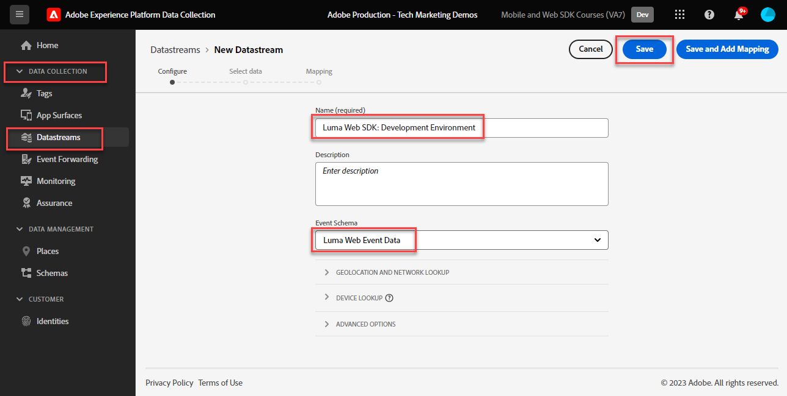

# Konfigurera ett datastream

Lär dig hur du konfigurerar ett datastream för Adobe Experience Platform Web SDK.

[Datastreams](https://experienceleague.adobe.com/en/docs/experience-platform/datastreams/overview) anger för Adobe Experience Platform Edge Network var data som samlats in av Platform Web SDK ska skickas. I datastreams-konfigurationen aktiverar du dina Experience Cloud-program, ditt Experience Platform-konto och händelsevidarebefordran.

## Utbildningsmål

När lektionen är klar kan du:

* Skapa ett datastream
* Kom igång med åsidosättningar av datastream

## Förhandskrav

Innan du konfigurerar din datastream måste du ha slutfört följande lektioner:

* [Konfigurera ett schema](configure-schemas.md)
* [Konfigurera ett identitetsnamnutrymme](configure-identities.md)

## Skapa ett datastream

Nu kan du skapa en datastream som anger för Platform Edge Network var data som samlas in av Web SDK ska skickas.

**Så här skapar du ett datastream:**

1. Öppna [gränssnittet för datainsamling](https://launch.adobe.com/){target="_blank"}
1. Kontrollera att du är i rätt sandlåda

   >[!NOTE]
   >
   >Om du använder ett plattformsbaserat program som Real-Time CDP eller Journey Optimizer rekommenderar vi att du använder en utvecklingssandlåda för den här kursen. Om du inte gör det använder du sandlådan **[!UICONTROL Prod]**.

1. Gå till **[!UICONTROL Datastreams]** i den vänstra navigeringen
1. Välj **[!UICONTROL New Datastream]**
1. Ange `Luma Web SDK: Development Environment` som **[!UICONTROL Name]**. Namnet refereras senare när du konfigurerar Web SDK-tillägget i taggegenskapen.
1. Välj **[!UICONTROL Save]**

   

   >[!NOTE]
   >
   >Du behöver inte välja ett schema. Du behöver bara välja ett schema om du använder funktionen [Dataprep för datainsamling](/help/data-collection/edge/data-prep.md).

På nästa skärm kan du lägga till tjänster som Adobe i dataströmmen, men du kommer inte att lägga till några tjänster just nu. Det gör du senare i lektionerna [Konfigurera Experience Platform](setup-experience-platform.md), [Konfigurera analys](setup-analytics.md), [Konfigurera Audience Manager](setup-audience-manager.md), [Konfigurera mål](setup-target.md) eller [Händelsevidarebefordran](setup-event-forwarding.md).

>[!NOTE]
>
>När du implementerar Platform Web SDK på din egen webbplats bör du skapa tre datastreams som kan kopplas till dina tre taggmiljöer (utveckling, scen och produktion). Om du använder Platform Web SDK med plattformsbaserade program som Adobe Real-time Customer Data Platform eller Adobe Journey Optimizer måste du se till att skapa dessa dataströmmar i rätt plattformssandlåda.

## Åsidosätta ett datastream

Med [Datastream overrides](https://experienceleague.adobe.com/en/docs/experience-platform/datastreams/overrides) kan du definiera ytterligare konfigurationer för din datastream och sedan åsidosätta din standardkonfiguration under vissa villkor.

Åsidosättning av dataströmskonfiguration är en tvåstegsprocess:

1. Först definierar du datastream-åsidosättningar i datastream-tjänstkonfigurationen. Du kan till exempel definiera alternativa rapportsviter för analyser, målarbetsytor eller plattformsdatamängder som ska användas som åsidosättningar.
1. Sedan skickar du åsidosättningarna till Edge Network antingen med en SDK-sändningshändelseåtgärd från Web SDK eller med en konfiguration i tillägget för Web SDK-taggen.

I [Konfigurera Adobe Analytics](setup-analytics.md)-lektionen åsidosätter du rapportsviten för en sida med hjälp av Platform Web SDK Send Event Action.

Du kan nu installera tillägget Platform Web SDK i taggegenskapen!

[Nästa: ](install-web-sdk.md)

>[!NOTE]
>
>Tack för att du lade ned din tid på att lära dig om Adobe Experience Platform Web SDK. Om du har frågor, vill dela allmän feedback eller har förslag på framtida innehåll kan du dela dem i det här [Experience League-diskussionsinlägget](https://experienceleaguecommunities.adobe.com/t5/adobe-experience-platform-data/tutorial-discussion-implement-adobe-experience-cloud-with-web/td-p/444996)
